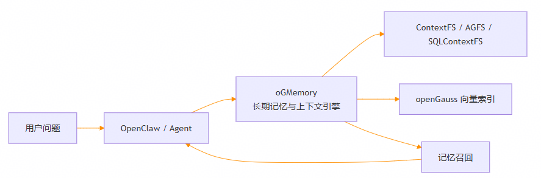
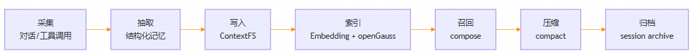
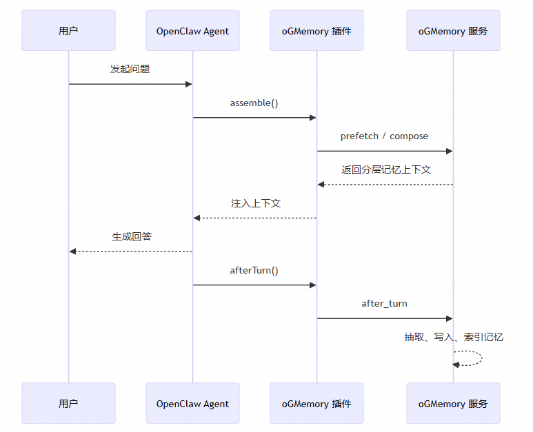
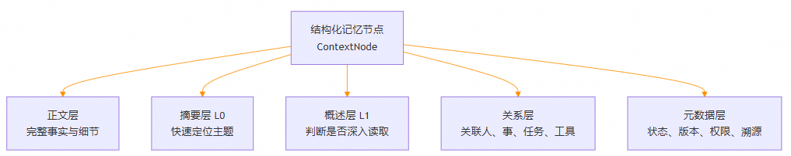
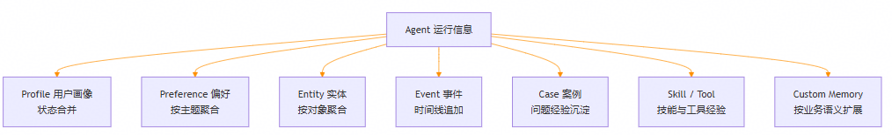
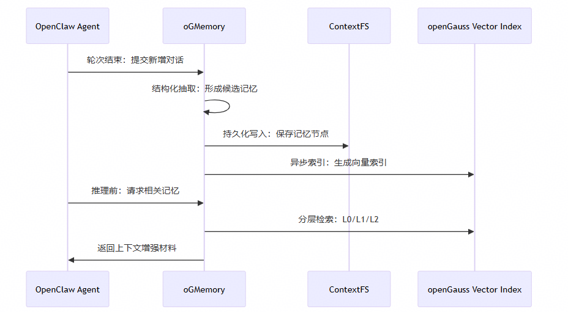
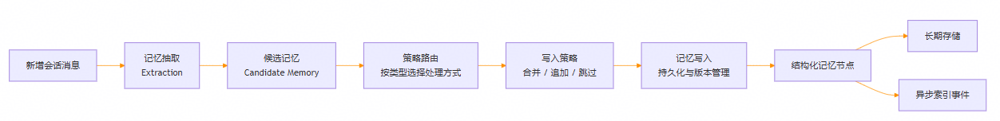
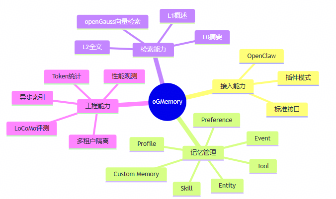

随着 Agentic AI 从单轮问答走向复杂任务执行，Agent 不再只是“回答一个问题”，而是需要持续理解用户目标、记住历史偏好、复用工具经验，并在长会话、多轮协作、跨会话任务中保持稳定表现。传统 Agent 主要依赖上下文窗口维持状态，一旦窗口接近上限，就容易出现早期信息遗忘、重复犯错、Token 成本上升、历史经验无法复用等问题。

这不是单纯扩大模型上下文窗口就能解决的问题，而是 Agent 应用缺少一套面向运行过程的长期记忆基础设施。oGMemory 正是面向这一场景构建的 Agent 长期记忆与上下文生命周期管理系统。它把 Agent 运行过程中的对话、工具调用、任务状态和经验沉淀为可持久化、可索引、可召回、可压缩、可观测的记忆资产，**帮助 Agent 从“临时对话”走向“持续认知”。**

图1：oGMemory 在 Agent 中的位置

从整体链路看，oGMemory 位于 Agent 和记忆数据之间。用户提问时，Agent 可以先从 oGMemory 中找回相关历史信息，再结合当前问题进行回答；一轮对话结束后，oGMemory 又会把值得保留的信息沉淀下来。这样一来，Agent 不再只依赖当前窗口里的内容，而是具备了跨会话延续上下文的能力。

## oGMemory：让上下文具备完整生命周期

oGMemory 的核心思路很简单：不改变大模型本身，而是在 Agent 工作过程的关键节点上管理上下文。

在回答前，它会根据当前问题找出相关记忆，帮助 Agent 带着背景进行推理；在回答后，它会从本轮对话中提取用户偏好、关键事实、任务进展和工具经验；当会话变长时，它还可以把冗长上下文压缩归档，保留有价值的信息，减少无效内容继续占用窗口。

图2：上下文生命周期

这套机制让上下文不再只是窗口里的临时文本，而是拥有“采集、抽取、写入、索引、召回、压缩、归档”的完整生命周期。对于企业级 Agent 应用而言，这意味着历史信息可以持续沉淀，关键经验可以反复复用，长会话也能在压缩后保留有效信号。

## 从 OpenClaw 到 oGMemory：把 Agent 每一轮对话变成可沉淀资产

oGMemory 已经可以与 OpenClaw 这类 Agent 框架集成。对使用者来说，体验上仍然是正常和 Agent 对话；在背后，oGMemory 会自动参与上下文准备、记忆写入和长会话压缩。

当用户发起新问题时，Agent 可以先向 oGMemory 查询相关背景，例如用户偏好、历史任务、近期安排或曾经沉淀的工具经验。模型完成一轮回复后，oGMemory 再分析这轮对话，把值得保留的信息保存下来。对于长会话场景，oGMemory 还可以在压缩前先提取关键内容，避免重要信息随着上下文裁剪而丢失。

图3：OpenClaw 与 oGMemory 集成链路

这样，Agent 每一次交互都不是“用完即丢”，而是可以成为后续任务继续使用的记忆材料。用户不必反复解释同一件事，Agent 也能在持续协作中越来越了解任务背景。

## ContextFS：用文件系统思想管理 Agent 记忆

为了让记忆更容易管理，oGMemory 借鉴了文件系统的思想。可以把每条记忆理解成一个“资料夹”：里面既有完整内容，也有摘要、概述、关系和元信息。这样做的好处是，记忆不再是一堆难以维护的聊天记录，而是被整理成结构清晰、可以检索、可以更新、可以追溯的数据。

例如，一条记忆会被拆成正文层、摘要层、概述层、关系层和元数据层。正文层保留完整细节，摘要层用于快速定位，概述层帮助 Agent 判断是否需要深入读取，关系层记录记忆之间的关联，元数据层则负责状态、版本、权限和来源管理。

图4：ContextFS 记忆节点结构

这背后体现的是一个重要思路：Agent 记忆不是普通聊天日志，而是可治理的数据对象。只有把记忆管理好，Agent 才能在长期运行中稳定地“记得住、找得到、用得上”。

## YAML Schema 驱动：让记忆类型可扩展

不同信息不应该用同一种方式处理。比如，用户的常住城市可能会变化，需要更新；一次会议记录属于历史事件，应该保留下来；某个工具的使用经验会不断积累，适合持续沉淀。oGMemory 会根据记忆类型选择不同的处理方式，让记忆更符合真实业务语义。

当前系统支持用户画像、偏好、实体、事件、案例、模式、技能、工具经验等多类记忆，也支持按业务需要扩展自定义记忆类型。例如，企业可以把项目规则、行业术语、业务流程、客户标签等内容沉淀为专属记忆，让 Agent 更贴近实际工作场景。

图5：记忆类型与写入策略

这种按类型管理记忆的方式，让 oGMemory 既能处理通用用户偏好，也能承载企业自己的业务知识。随着业务发展，新的记忆类型可以继续扩展，系统也能不断适配新的 Agent 应用场景。

## openGauss 向量索引：让记忆真正可召回

记忆写入只是第一步，关键是后续能不能在合适的时候准确找回来。oGMemory 结合 openGauss 的向量检索能力，把已经沉淀的记忆建立成可搜索的索引。当用户再次提问时，系统可以根据问题语义找到相关历史信息，再提供给 Agent 使用。

同时，oGMemory 会把记忆保存和索引更新分开处理。这样既能保证记忆先稳定落地，又能在后台持续完成索引构建，减少对用户交互体验的影响。在企业场景中，系统还会区分不同用户、不同 Agent 和不同空间的记忆，避免信息串扰。

图6：写入与召回闭环

另外，oGMemory 采用分层索引思路：先用短摘要快速判断“这条记忆是否相关”，再用结构化概述理解大致内容，最后在需要时读取完整细节。这样既能提高召回效率，也能避免把大量无关内容塞回上下文窗口。

这避免了传统检索“只找相似文本”的局限，让召回过程更接近人的工作方式：先定位主题，再深入细节。

## ReAct 抽取：先看已有记忆，再决定写什么

oGMemory 的记忆抽取并不是简单把每轮对话做一次总结。总结只能说明“刚才聊了什么”，但长期记忆更关心“哪些信息值得保留、应该放在哪里、以后能不能用得上”。

因此，oGMemory 会先理解已有记忆，再判断当前对话中哪些是新增信息、哪些和已有内容重复、哪些需要合并或更新。例如，用户偏好应该聚合，历史事件应该追加，个人状态变化可能需要更新旧信息，工具经验则应该逐步积累。通过这种方式，oGMemory 可以减少重复、降低噪声，让长期记忆更稳定、更可信。

图7：从候选记忆到 ContextNode 的写入流程

## 可观测与评测：让记忆系统可验证、可优化

长期记忆系统不能只看最终回答是否“像是记住了”，还需要能够观察每一步是否真实生效。面向企业落地，oGMemory 提供了健康检查、用量统计、工具调用统计、性能监控和评测能力，帮助用户了解记忆是否写入、是否被召回、消耗了多少 Token、整体效果是否提升。

这类能力对于企业非常重要。因为长期记忆不是一次性功能，而是需要持续运行、持续优化的基础设施。只有能观测、能评估、能追踪，才能放心把它接入真实业务流程。

图8：oGMemory 企业级能力全景

## 让 Agent 记忆真正可用

面向企业级 Agent 应用，长期记忆的价值并不只是“记住用户说过什么”，而是让 Agent 能够持续理解任务背景、复用历史经验、减少重复输入、降低上下文膨胀，并在复杂任务中保持连续性和稳定性。

oGMemory 通过 Agent 生命周期接入、结构化记忆管理、可扩展记忆类型、openGauss 向量检索、分层召回、长会话压缩和可观测评测能力，形成了一条完整的 Agent 记忆工程链路。

未来，随着 Agent 从个人助手走向企业流程、研发协同、运维诊断和知识工作场景，记忆系统将成为智能体基础设施的重要组成部分。**oGMemory 希望做的，正是把 Agent 的每一次交互、每一次工具调用、每一次任务经验，转化为可沉淀、可治理、可复用的长期能力。** 让 Agent 不只会回答当下的问题，也能带着经验走向下一次任务。