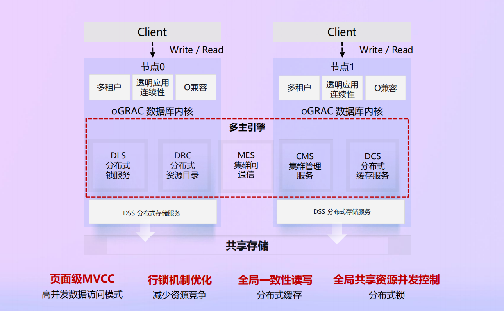
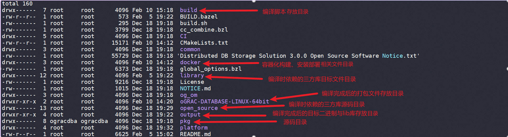
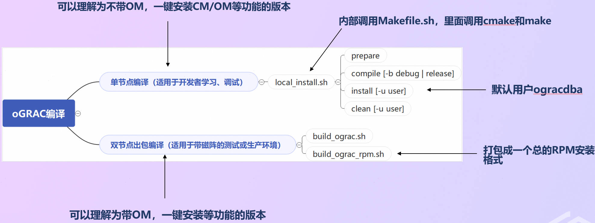
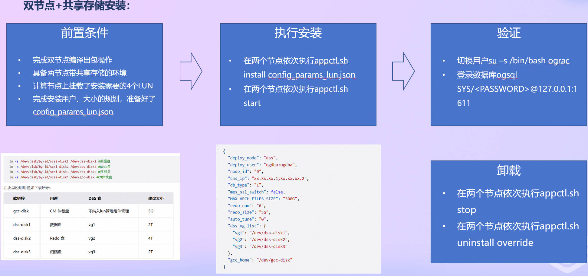
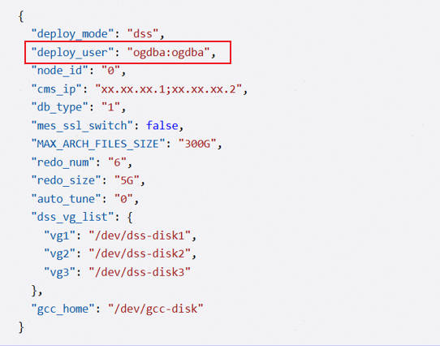
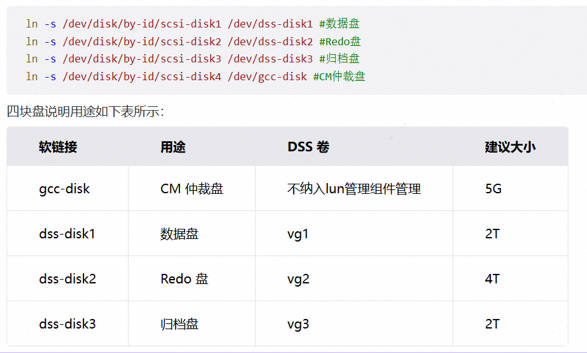
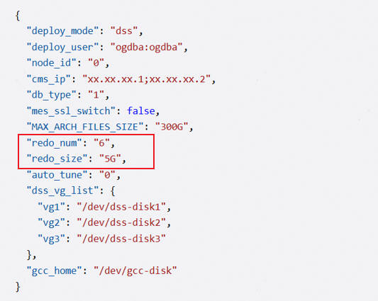
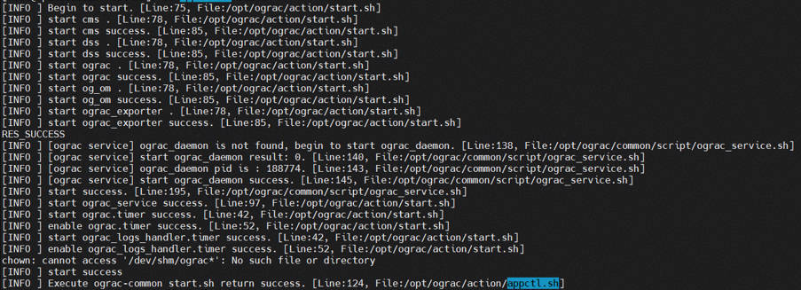

oGRAC(openGauss Real Application Cluster)是openGauss社区推出的业界首个开源多主数据库。它将集群中的各数据库实例统一管理起来，并支持全局实时一致的读写操作，以此提升集群整体的读写吞吐能力、扩展能力和高可用能力。其核心思想是：数据库提供便于扩展成多主架构的内核，数据库实例间通过共享内存服务实现跨节点的事务、页面缓存一致性，各数据库实例共享一份数据存储，以实现各节点同时执行读写操作、各节点共享底层存储数据。它结合了openGauss资源池化的分布式内存、分布式存储服务，和内核的SQL引擎中的CBO能力，同时在存储引擎侧针对多写进行了底层的重构和设计。

本文将主要介绍oGRAC的安装与部署，使读者对oGRAC有一个初步的认识，以及能够快手上手源码的编译和安装。

### 一、源码仓目录组织

使用git clone <https://gitcode.com/opengauss/oGRAC.git> 下载oGRAC的源码
源码目录如下图所示：

各个主要的目录说明如下：

### 二、oGRAC源码编译

#### oGRAC当前提供两种编译方式：

**1.单节点+本地盘的编译方式**  

 
**2.构建双节点+DSS的安装包的编译方式**

单节点+本地盘的编译方式主要适用于开发者进行研究学习调试，双节点+DSS的编译方式主要适用于构建可以安装在带有共享存储的两节点的测试或生产环境的安装包。

**单节点+本地盘的编译方式的主要操作步骤如下：**

1.sh local_install.sh prepare （调用yum install安装一些必要的依赖）

2.sh local_install.sh compile [-b debug | release ] （编译源码，内部调用build下面的Makefile.sh，Makefile.sh中再调用了cmake和make）

3.sh local_install.sh install [-u user] （在当前环境本地盘安装单节点，默认用户为ogracdba，默认安装目录/home/ogracdba/install和/home/ogracdba/data，需要大概16G左右空间，建议/home剩余空间大于20G。同时由于安装过程中会启动cms服务和ogracd实例，会分别使用到14587和1611端口，所以需要确保当前环境1611和14587端口未被占用）

4.sh local_install.sh clean [-u user] （卸载单节点+本地盘安装的数据库实例）

**双节点+DSS的编译方式的主要操作步骤如下：**

sh build_ograc.sh [ release | debug] --with-dss 当编译成功完成后，生成的安装包将位于package目录下，该目录中包含oGRAC 安装包（tar.gz 格式）,开发者可将该安装包分发至目标节点，按照对应的安装文档进行部署。

同时，oGRAC还提供了一个可以构建出RPM格式的安装包的脚本build_ograc_rpm.sh，执行该脚本后可以构建RPM格式的oGRAC安装包，支持快速的分发和免交互式安装。

### 三、oGRAC双节点+DSS安装

#### 在进行oGRAC双节点+DSS安装前需要完成下面的准备工作：

**➤准备一：**

准备oGRAC的双节点+DSS安装需要的硬件，要求如下：

- 主机数量：2 台 ARM 架构物理机或虚拟机

- 单台主机最低推荐配置：内存：8 GB ；CPU：4 核 ；磁盘可用空间：不少于 100 GB

- 共享存储要求：支持iSCSI3协议的共享存储，支持CAW以及PR预留的操作。需要提供4块LUN挂载到计算节点

*说明：资源不足可能导致安装阶段失败，尤其是在共享存储和 CM 组件初始化时。

**➤准备二：**

两节点均需创建安装管理用户（即在config_params_lun.json文件中的deploy_user中配置的用户名，如下图例是ogdba），该用户仅用于安装和调度流程，不作为数据库实际使用用户。数据库运行用户 ograc 会在安装过程中自动创建。

**➤准备三：**

计算节点上挂载了安装需要的4个LUN，且按下图所示创建了软链接，每个LUN的大小和使用如下图说明：

**➤准备四：**

准备好安装需要的config_params_lun.json文件，其中redo_num表示初始化时每个节点上创建的redo文件个数，redo_size表示初始化时每个节点上创建的单个redo文件的大小，如图所示，如果redo_num是6，redo_size是5G，那么至少需要60G的redo LUN，也就是dss-disk2对应的LUN的大小至少是60G以上。

**安装步骤：**

- 在节点0执行sh appctl.sh install config_params_lun.json

- 在节点1执行sh appctl.sh install config_params_lun.json（节点1与节点0的config_params_lun.json有区别，需要将node_id修改成1）

- 在两个节点依次执行sh appctl.sh start （显示如下表示启动成功）

**卸载步骤：**

- 在节点0执行sh appctl.sh stop

- 在节点1执行sh appctl.sh stop

- 在两个节点依次执行sh appctl.sh uninstall override

### 四、oGRAC常用命令

oGRAC在安装和使用过程一些常用的运维日志及其对应位置如下：

双节点+DSS环境的oGRAC在使用过程中主要用cms管理集群的信息，一些cms相关的常用命令如下，更多内容可以参考文档或输入cms -help查看。

- 查询集群中当前资源的参数和配置信息（与cms相关的配置）：cms res -list

- 启动集群内的资源：cms res -start RESOURCE NAME -node NODE_ID

- 停止集群内的资源：cms res -stop RESOURCE NAME -node NODE_ID

- 修改集群中当前资源的参数和配置信息：cms res -edit RESOURCE NAME -attr ATTRIBUTE PAIRS

- 启动CMS服务：cms server -start

- 停止CMS服务：cms server -stop