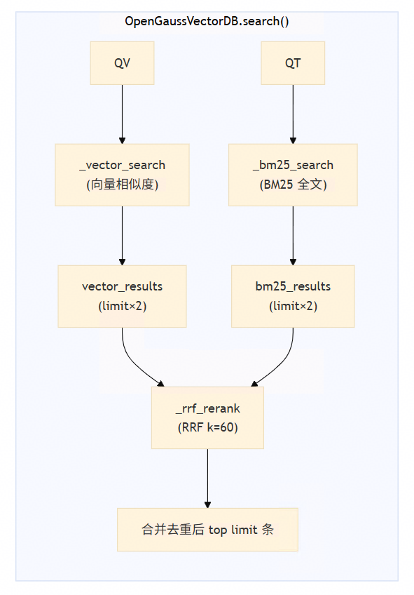
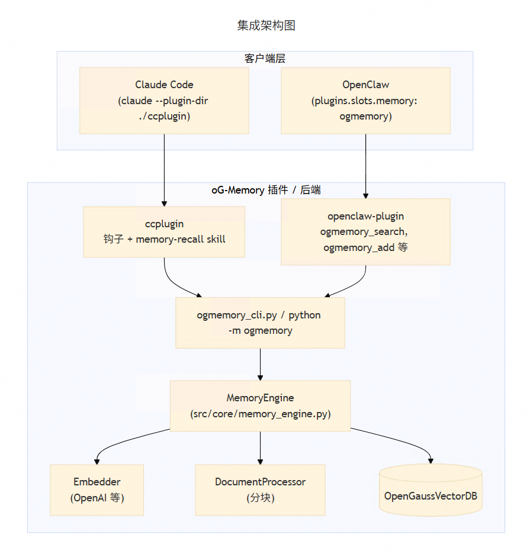

# 告别“健忘”AI！oG-Memory 为 OpenClaw 与 Claude Code 打造“第二大脑”

2026年，AI智能体正从“单任务响应”迈向“认知持续进化”。然而，原生记忆系统在语义连贯性、资源效率、跨会话衔接等方面仍存在明显短板。
 
oG-Memory，作为基于 openGauss 构建的原生向量记忆引擎，已成功适配 OpenClaw 与 Claude Code 框架，为智能体提供稳定、高效、低延迟的记忆存储与检索能力，助力复杂任务自动化落地。

---

## AI Agent 的“记忆困境”

当前主流 AI Agent 框架（如 OpenClaw）虽具备强大执行能力，但其原生记忆系统存在三大核心痛点：

| 痛点 | 表现 |
|------|------|
| **记忆连贯性差** | 多轮交互、跨日会话后，无法自动衔接历史记忆，需重复输入上下文。 |
| **资源消耗不可控** | 重复存储相同或相似上下文，导致 Token 消耗激增，成本上升。 |
| **检索效率低下** | 缺乏语义级检索能力，难以从海量信息中精准召回相关记忆。 |

> **结论：没有“持久化”与“可检索”的记忆能力，Agentic AI 就无法实现“认知持续进化”。**

---

## oG-Memory 是什么？——基于 openGauss 的原生向量记忆引擎

> **oG-Memory 是一个基于 openGauss 向量数据库与全文索引能力的外部独立组件**，通过接入 openGauss 实现向量索引与 BM25 全文索引能力，对外提供以下核心能力：

| 功能 | 说明 |
|------|------|
| **文件索引** | 支持 Markdown 格式文档的语义分块与索引。 |
| **记忆查询** | 支持向量相似度 + BM25 全文混合检索，结合重排算法，提升召回准确率。 |
| **记忆扩展** | 支持动态添加新记忆内容，并自动更新索引，保持记忆库实时性。 |

> **核心定位**：  
> **为AI Agent 框架，提供“长周期、高连贯性、低资源消耗、易扩展”的语义记忆能力底座。**

---

## oG-Memory 的核心技术能力

### 1. 内置向量类型与混合索引，无需额外扩展

- 内置 **IVFFlat** 与 **HNSW** 向量索引，支持高并发、低延迟向量检索；
- 无需安装额外扩展模块，开箱即用。

### 2. 向量 + 全文混合检索，重排提升召回质量

- 支持 **向量相似度搜索**（语义理解）与 **BM25 全文检索**（关键词匹配）的联合检索；
- 采用 **RRF（Reciprocal Rank Fusion）** 算法对结果进行重排序，避免单一检索模式的偏见，显著提升召回准确率。

### 3. Markdown 文档按标题结构分块，保留层级语义

- 支持将 Markdown 文档按标题层级（如 `#`, `##`, `###`）进行自动分块；
- 每个语义块独立建立向量索引，支持“精准定位 + 上下文补全”的双重检索模式；
- 保留原始文档结构信息，避免语义断裂。

### 4. 基于嵌入模型的语义搜索，实现“理解上下文”的记忆调用

- 支持接入主流嵌入模型（如 text2vec、bge、m3e 等），将用户输入与记忆内容统一映射到语义空间；
- 实现“语义级匹配”而非“关键词匹配”，真正理解用户意图，提升记忆调用准确性。

---

## 与 OpenClaw & Claude Code 的深度集成

oG-Memory 已成功适配 OpenClaw 与 Claude Code 框架，作为其可插拔的记忆后端，无缝集成于智能体工作流中。

### **与 OpenClaw 集成：补齐框架记忆短板**

- 作为 OpenClaw 的 **“记忆插件”**，可增强其原生记忆系统；
- 支持在多轮任务中自动保留与调用历史记忆，实现“跨会话记忆连贯性”；
- 通过向量+全文混合检索，显著提升记忆调用准确率。

### **与 Claude Code 集成：构建 AI 工程师的记忆中枢**

- 在多轮编程对话中，自动对代码注释、项目文档、接口说明等内容进行语义分块与索引；
- 支持“跨日项目重构”：开发者隔日继续开发，系统可自动调取历史记忆，确保代码风格与架构一致性。

---

## 部署方式与开源社区

### **部署方式**

- **方式一：开源安装（推荐）**
  - 支持基于 openGauss 的标准安装流程；
  - 适用于 Docker、本地服务器等多种部署环境。
  - 完整安装指引：
    > [https://gitcode.com/opengauss/oG-Memory/tree/prototype-poc](https://gitcode.com/opengauss/oG-Memory/tree/prototype-poc)

> **立即加入社区**：
> - 项目开源仓库：[https://gitcode.com/opengauss/oG-Memory/tree/prototype-poc](https://gitcode.com/opengauss/oG-Memory/tree/prototype-poc)

---

## 结语：让记忆，成为智能体的“第二大脑”

oG-Memory，是 openGauss 向量数据库能力的“语义记忆延伸层”，它不追求“万能”，而是专注于“持久、连贯、高效”的记忆能力构建。

它正以“国产化、自主可控、高性能、低成本”为核心优势，为 OpenClaw 、Claude Code等主流 Agentic AI 框架，提供稳定、可靠、可扩展的记忆底座。
