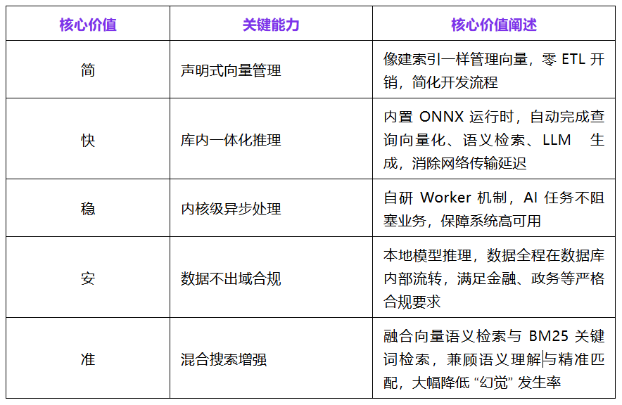
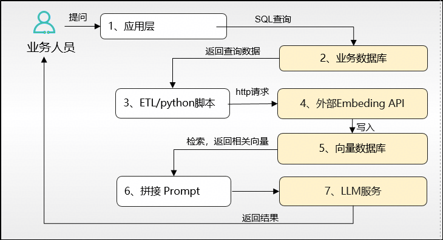
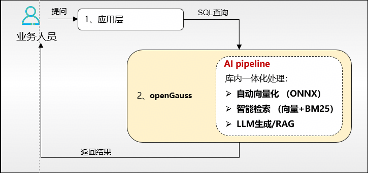

当大模型从实验室走向生产，RAG（检索增强生成） 已成为企业落地AI应用、打通“技术-业务”壁垒的核心路径。然而，传统 RAG 架构中 “业务库 + 向量库 + ETL + 外部模型” 的割裂式复杂链路，让看似简单的问答应用沦为“冰山一角”——水面之上是简洁的交互界面，水面之下则潜藏着架构臃肿、数据不一致、隐私合规隐患与运维高成本等多重痛点，严重制约企业 AI 应用的落地效率与规模化复制。

openGauss 7.0-RC3 版本将于2026年3月底正式发布 AI pipeline 特性。它以“AI 原生数据库”为核心理念，实现“库内向量化，数据免导出”的核心能力，将 AI 计算深度嵌入数据库内核，让数据在存储源头直接释放智能价值，打破传统 RAG 的“复杂性深谷”，为企业智能应用构建更高效、更安全、更易用的全新架构范式。

## 行业趋势：数据库正式迈入 AI 原生时代

全球数据库厂商已形成共识：数据在哪里，AI 就应该在哪里。Oracle 23ai 以 “AI” 为核心标签，内置向量推理；PostgreSQL 生态持续发力，加速 AI 全流程内核化。

openGauss 深耕 AI 与数据库的深度融合，强化 DataVec 向量数据引擎，构建 AI 原生多模态数据库底座，将向量化、检索、推理等 AI 能力无缝嵌入内核，成为“AI原生数据库”趋势的坚定践行者。

## 传统 RAG 的 “复杂性深谷”：四大核心痛点

构建生产级 RAG 应用，远比原型验证更具挑战，四大核心痛点成为企业 AI 落地的“拦路虎”，难以突破从“实验室”到“生产线”的壁垒：

- **架构臃肿：** 需同时维护业务数据库、向量数据库、ETL 管道、外部模型 API，任一组件故障即导致服务中断。

- **数据不一致：** 业务数据更新后，向量索引同步存在秒级至分钟级延迟，检索结果过时，成为大模型 “幻觉” 的重要根源。

- **隐私合规风险：** 私有数据需发送至外部 API 进行向量化，在金融、政务等敏感场景下，面临严峻的数据安全与合规挑战。

- **运维高成本：** Embedding 端点间歇性故障、限流、延迟抖动，迫使开发者额外搭建消息队列与重试机制，运维复杂度与成本远超应用本身。

## openGauss AI Pipeline：库内构建AI能力，数据免出库，AI库内生的核心范式

openGauss AI Pipeline 打破 “多系统割裂” 壁垒，以一体化内核能力，实现 AI Pipeline 全链路闭环，核心价值体现在五大维度：



### 核心技术亮点： 
SQL 即 AI，一行代码搞定 RAG传统RAG开发门槛极高，需开发者同时掌握 Python、LangChain、向量数据库 SDK 等多种技术栈，流程繁琐且易出错；而 openGauss AI Pipeline颠覆这一现状，让 AI 应用开发回归数据库本质，以 SQL 极简范式，降低开发与运维成本。

### 传统方案（Python + LangChain）

```
# 1. 连接数据库取数据
docs = db.execute("SELECT ‘openGauss支持哪些向量索引类型’FROM knowledge_base")
# 2. 文本分块
chunks = text_splitter.split_documents(docs)
# 3. 调用外部 API 生成向量
embeddings = openai.Embedding.create(input=chunks)
# 4. 写入向量数据库
vector_store.add(chunks, embeddings)
# 5. 语义检索
results = vector_store.similarity_search(query, k=5)
# 6. 拼接 Prompt 并调用 LLM 生成回答
answer = llm.invoke(prompt_template.format(context=results))

```

### openGauss AI pipeline 方案（纯 SQL）

```
SELECT * FROM ogai.rag('openGauss支持哪些向量索引类型？',
    'knowledge_base_task',
    'rerank_model',
    'chat_model');
```

ogai.rag() 函数在数据库内部自动完成查询向量化 -> 混合检索 -> 上下文拼接 -> LLM 生成全流程，一次 SQL 调用即可闭环，无需任何外部依赖，大幅降低开发与运维门槛。

## 架构对比：从 “多系统流浪” 到 “一库一体化”

### 传统 RAG 架构：数据在多系统间辗转流离



7步冗长流程，涉及4个系统边界、多次数据搬运，不仅链路断点多、故障风险高，数据同步延迟更是难以规避，严重影响AI应用的响应速度与准确性。

### openGauss AI pipeline 架构：数据不出库，智能库内生成



仅2步极简流程，1个系统。数据全程在 openGauss 数据库内部流转，无需任何外部组件与数据导出操作，实现高性能、高安全、低延迟的 AI 应用闭环，解决传统架构的核心痛点。

## 总结：拥抱 openGauss AI pipeline，构建下一代智能应用底座

openGauss AI Pipeline 以“数据不出库”为核心理念，重构RAG应用架构，打破传统多系统割裂的壁垒，将数据库从“单纯的数据存储容器”升级为“智能计算引擎”。
无论是简化开发流程、提升应用性能，还是保障数据安全、降低运维成本，openGauss  AI Pipeline 都给出了更优解。

openGauss AI Pipeline 以简约架构、高效性能、数据安全，加速企业 AI 应用从原型到生产的落地进程，抢占 AI 时代的数字化转型先机，构建下一代智能应用的坚实底座。

该能力将于openGauss 7.0-RC3版本正式发布，欢迎访问 openGauss 社区官网下载体验，敬请期待。

- 社区官网：<https://opengauss.org/zh/>

