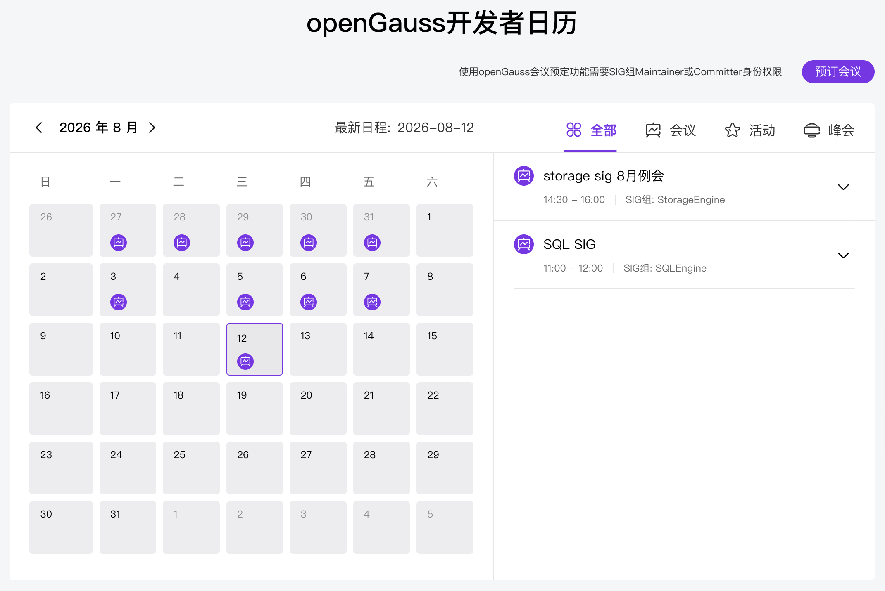
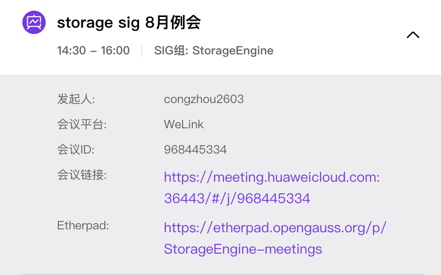
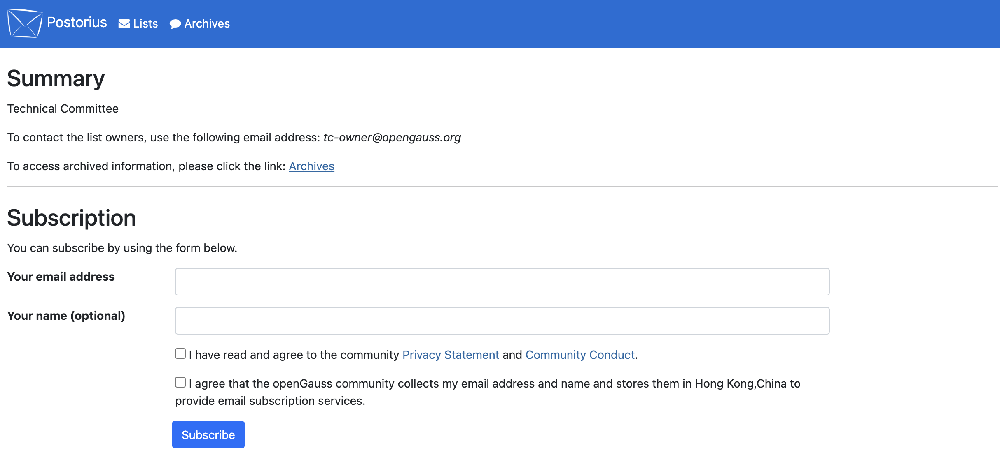

# SIG组会议指南

openGauss 开源社区按照不同的 SIG（Special Interest Group，特别兴趣小组）来组织开发及版本相关工作。SIG 组通常会有固定例会时间，用于管理 SIG 组开发任务、技术方案评审、技术方案讨论等工作事务，重大跨领域议题还会提交社区技术委员会（TC）例会评审。本篇文档用于指导开发者如何参与 SIG 组会议，以及 SIG 组关键成员如何组织会议。

## 会议召开形式

openGauss 社区例会通常以线上会议方式承载。SIG 组例会与 TC 例会均在固定周期、固定时间召开，方便社区成员提前规划参会时间。

开发者可以在社区门户网站（[opengauss.org](https://opengauss.org/zh/)）的活动/日历页面，以及各 SIG 邮件列表的会议通知中，查看所有会议的时间与入会方式。加入会议后，建议将昵称修改为自己的 Gitee ID，方便主持人识别与纪要登记。

在开发者日历中点击某场会议，即可展开查看发起人、会议平台、会议 ID、入会链接与本次会议的 Etherpad 链接。

会议平台通常使用 WeLink、腾讯会议或 Zoom，请提前下载安装对应的会议软件。部分会议开启自动录制，便于未能参会的开发者事后回看。

## Etherpad

openGauss 社区使用 Etherpad 进行会议议题登记、内容记录与纪要记录。每个 SIG 组都有自己的永久 Etherpad 链接，可通过 SIG 中心或会议通知邮件内获取。通过社区帐号登录后即可开始编辑、添加议题。

SIG 组的 Maintainer、Committer 有义务维护本 SIG 组 Etherpad 的内容与格式，确保议题、讨论过程与决策结论清晰可追溯。建议每次例会遵循统一的纪要格式：日期、参会人、议题清单、讨论要点、决策结论、遗留事项（Owner + 截止时间）。

## 会议订阅

当会议创建或更新时，会通过对应 SIG 的邮件列表进行通知。如需及时收到会议通知，请订阅对应 SIG 组的邮件列表。

1. 进入社区[线上交流](https://opengauss.org/zh/online-communication/)页面，或直接访问邮件列表归档站点 [mailweb.opengauss.org](https://mailweb.opengauss.org/)。
2. 找到目标 SIG 对应的邮件列表，点击订阅（Subscribe）。
3. 输入自己的邮箱并提交，然后在邮箱中点击确认链接完成订阅。

在订阅页面填写邮箱与名称，勾选同意隐私声明与社区行为守则后点击 **Subscribe** 即可，随后到邮箱点击确认链接完成订阅。

订阅成功后，该 SIG 的会议通知、议题征集与会议纪要都会推送到你的邮箱。

## 会议管理

SIG 组 Maintainer、Committer 均有权限利用社区基础设施预订社区会议。组织一次例会通常包含以下步骤：

1. **预订会议**：通过社区会议管理入口，选择对应的 SIG 组，填入会议主题、时间、会议平台等信息，创建会议。
2. **发布通知**：会议创建后，通知会通过对应 SIG 邮件列表发出。请确保会议时间、入会链接、Etherpad 链接完整。
3. **登记议题**：在该 SIG 的 Etherpad 中开放议题登记，供成员提前申报议题。
4. **会后归档**：会议结束后，将纪要整理进 Etherpad，并通过邮件列表发送【会议纪要】，便于未参会成员了解进展。

创建成功后，即可在社区上查看会议信息，成员也能在日历与邮件通知中看到本次会议。

## 高效会议

为了高效地组织 SIG 例会，本文列举一些常见的举措，供社区开发者参考。

### 会前准备：明确目标与议程

**议题分类**

- 议题申报者需明确议题的类别。不同类别的议题开展方式不同，正确的分类可以有效帮助会议组织者合理规划时间。
- 如果是**决策类议题**，建议在会前提前通过 Issue、社区论坛、邮件列表等方式收集 SIG 组关键角色反馈，同时明确决策内容，避免会上漫议。
- 如果是**讨论类议题**，提前分享背景资料（如设计文档、Issue 链接），并明确需要讨论的目标，充分收集 SIG 关键角色的意见。

**提前发布议程**

- SIG 组例会固定周期、固定时间，方便 SIG 组成员提前规划时间。
- 选择合适的会议时间，兼顾主要贡献者所在时区。
- 会议通知提前一周发出，给与会人充分的时间进行安排。
- 提前一天确认会议议题，避免会上开展无效议题讨论。
- 鼓励社区成员**提前在 Issue/PR/社区论坛中讨论**，避免会议变成"读文档大会"。

### 会议执行：高效协作与记录

**严格遵循议程 & 控制时间**

- 指定主持人控制节奏，避免跑题。
- 采用"时间盒"方法，每项议题限时讨论。

**鼓励异步沟通，减少同步会议依赖**

- 能通过 **Issues/PRs、邮件列表、社区论坛**解决的问题，不占用会议时间。
- 确保会议核心时间用于**关键决策**或**复杂问题的实时讨论**。

**确保透明 & 包容性**

- SIG 组所有讨论均对外公开，允许任何开发者发表意见。
- 复杂问题的讨论过程记录在 Etherpad 中，让未与会开发者也能大致理解讨论过程。

**决策机制清晰**

- 采用 **Lazy Consensus（懒惰共识）**：如果没有强烈反对，提案默认通过。
- 重大决策采用**投票机制**（如社区论坛、邮件投票等），并在会议纪要中记录。

### 关键原则

✅ **开放透明** —— 所有讨论和决策公开可查，避免私下决策。

✅ **包容协作** —— 鼓励新人参与，避免核心成员垄断话语权。

✅ **结果导向** —— 每次会议必须有明确产出（决策、任务、文档）。

✅ **尊重时间** —— 准时开始/结束，避免无效讨论。
