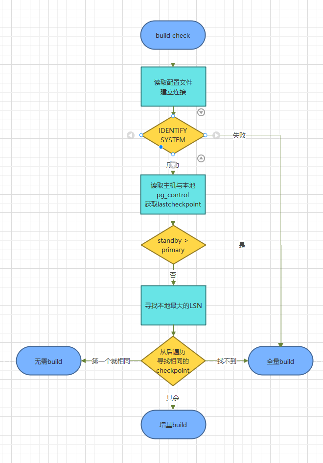

# 判断备机是否需要重建

-   前置条件
    -   传统主备1主n备集群

#  gs_ctl build -b check介绍

    build -b check 是openGauss提供的检查备机是否需要重建的命令，当备机发生故障恢复后，我们可以通过该命令检查备机是否需要重建。
    build check的返回接口有三种：增量，全量，不需要重建。
    auto build检验逻辑与build check一致，只不过auto build会自动执行build命令。

#  流程
    1.读取主机和备机的pg_control的ckpt
    2.通过ckpt 开始去寻找最大的共同分叉点
    3.如果找不到公共分叉点，证明主机日志已经被回收，需要做全量build
    4.如果能找到最大公共分叉点，且这一点与备机ckptrec相等，则证明日志无分叉，只是落后，无需build
    5.能找到日志分叉点，且这一点不是备机最大ckpt，需要做增量build 



# 使用效果
    1. 全量build 这里手动删除部分xlog，模拟日志被回收的情况

```
[czk@openGauss82 ~]$ gs_ctl build -b check
[2024-10-11 09:15:54.559][1678748][][gs_ctl]: gs_ctl build check ,datadir is /opt/czk/install/data/dn
[2024-10-11 09:15:54.559][1678748][][gs_ctl]: fopen build pid file "/opt/czk/install/data/dn/gs_build.pid" success
[2024-10-11 09:15:54.559][1678748][][gs_ctl]: fprintf build pid file "/opt/czk/install/data/dn/gs_build.pid" success
[2024-10-11 09:15:54.587][1678748][][gs_ctl]: fsync build pid file "/opt/czk/install/data/dn/gs_build.pid" success
[2024-10-11 09:15:54.587][1678748][][gs_ctl]: stop failed, killing gaussdb by force ...
[2024-10-11 09:15:54.587][1678748][][gs_ctl]: command [ps c -eo pid,euid,cmd | grep gaussdb | grep -v grep | awk '{if($2 == curuid && $1!="-n") print "/proc/"$1"/cwd"}' curuid=`id -u`| xargs ls -l | awk '{if ($NF=="/opt/czk/install/data/dn")  print $(NF-2)}' | awk -F/ '{print $3 }' | xargs kill -9 >/dev/null 2>&1 ] path: [/opt/czk/install/data/dn] 
[2024-10-11 09:15:54.637][1678748][][gs_ctl]: server stopped
[2024-10-11 09:15:54.638][1678748][][gs_ctl]: current workdir is (/home/czk).
[2024-10-11 09:15:54.640][1678748][dn_6001_6002][gs_ctl]: Get repl_auth_mode is  and repl_uuid is 
[2024-10-11 09:15:54.680][1678748][dn_6001_6002][gs_ctl]: build try host(20.20.20.79) port(19219) success
[2024-10-11 09:15:54.750][1678748][dn_6001_6002][gs_rewind]: connected to server: host=20.20.20.79 port=19219 dbname=postgres application_name=gs_rewind connect_timeout=5 rw_timeout=600
[2024-10-11 09:15:54.754][1678748][dn_6001_6002][gs_rewind]: connect to primary success
[2024-10-11 09:15:54.754][1678748][dn_6001_6002][gs_rewind]: find last checkpoint at 0/18003860 and checkpoint redo at 0/18003860 from target control file
[2024-10-11 09:15:54.755][1678748][dn_6001_6002][gs_rewind]: get primary pg_control success
[2024-10-11 09:15:54.755][1678748][dn_6001_6002][gs_rewind]: target server was interrupted in mode 1.
[2024-10-11 09:15:54.755][1678748][dn_6001_6002][gs_rewind]: sanityChecks success
[2024-10-11 09:15:54.755][1678748][dn_6001_6002][gs_rewind]: find last checkpoint at 0/180036A0 and checkpoint redo at 0/18003620 from source control file
[2024-10-11 09:15:54.755][1678748][dn_6001_6002][gs_rewind]: find max lsn success, find max lsn rec (0/18003860) success.
[2024-10-11 09:15:54.756][1678748][dn_6001_6002][gs_rewind]: Get repl_auth_mode is  and repl_uuid is 
[2024-10-11 09:15:54.795][1678748][dn_6001_6002][gs_rewind]: build try host(20.20.20.79) port(19219) success
[2024-10-11 09:15:54.795][1678748][dn_6001_6002][gs_rewind]: request lsn is 0/180036A0 and its crc(source, target):[1158223492, 3927131982]
[2024-10-11 09:15:54.840][1678748][dn_6001_6002][gs_rewind]: build try host(20.20.20.79) port(19219) success
[2024-10-11 09:15:54.840][1678748][dn_6001_6002][gs_rewind]: request lsn is 0/18003580 and its crc(source, target):[3680505096, 799574682]
[2024-10-11 09:15:54.869][1678748][dn_6001_6002][gs_rewind]: build try host(20.20.20.79) port(19219) success
[2024-10-11 09:15:54.869][1678748][dn_6001_6002][gs_rewind]: request lsn is 0/18003460 and its crc(source, target):[545018517, 545018517]
[2024-10-11 09:18:51.453][1755902][dn_6001_6002][gs_rewind]: build try host(20.20.20.79) port(19219) success
[2024-10-11 09:18:51.453][1755902][dn_6001_6002][gs_rewind]: request lsn is 0/160002E8 and its crc(source, target):[0, 1075449653]
[2024-10-11 09:18:51.492][1755902][dn_6001_6002][gs_rewind]: build try host(20.20.20.79) port(19219) success
[2024-10-11 09:18:51.492][1755902][dn_6001_6002][gs_rewind]: request lsn is 0/160001C8 and its crc(source, target):[0, 649075532]
[2024-10-11 09:18:51.518][1755902][dn_6001_6002][gs_rewind]: build try host(20.20.20.79) port(19219) success
[2024-10-11 09:18:51.518][1755902][dn_6001_6002][gs_rewind]: request lsn is 0/160000A8 and its crc(source, target):[0, 1029292914]
……
[2024-10-11 09:18:51.519][1755902][dn_6001_6002][gs_rewind]: could not find previous WAL record at 0/15000058: read xlog page failed at 0/15000058

gs_rewind receive FATAL, it will exit
[2024-10-11 09:18:51.519][1755902][dn_6001_6002][gs_rewind]: Build check result : full build
[2024-10-11 09:18:51.519][1755902][dn_6001_6002][gs_rewind]: build check failed(/opt/czk/install/data/dn).
```

    2. 增量build

```
[czk@openGauss82 ~]$ gs_ctl build -b check
[2024-10-11 09:15:54.559][1678748][][gs_ctl]: gs_ctl build check ,datadir is /opt/czk/install/data/dn
[2024-10-11 09:15:54.559][1678748][][gs_ctl]: fopen build pid file "/opt/czk/install/data/dn/gs_build.pid" success
[2024-10-11 09:15:54.559][1678748][][gs_ctl]: fprintf build pid file "/opt/czk/install/data/dn/gs_build.pid" success
[2024-10-11 09:15:54.587][1678748][][gs_ctl]: fsync build pid file "/opt/czk/install/data/dn/gs_build.pid" success
[2024-10-11 09:15:54.587][1678748][][gs_ctl]: stop failed, killing gaussdb by force ...
[2024-10-11 09:15:54.587][1678748][][gs_ctl]: command [ps c -eo pid,euid,cmd | grep gaussdb | grep -v grep | awk '{if($2 == curuid && $1!="-n") print "/proc/"$1"/cwd"}' curuid=`id -u`| xargs ls -l | awk '{if ($NF=="/opt/czk/install/data/dn")  print $(NF-2)}' | awk -F/ '{print $3 }' | xargs kill -9 >/dev/null 2>&1 ] path: [/opt/czk/install/data/dn] 
[2024-10-11 09:15:54.637][1678748][][gs_ctl]: server stopped
[2024-10-11 09:15:54.638][1678748][][gs_ctl]: current workdir is (/home/czk).
[2024-10-11 09:15:54.640][1678748][dn_6001_6002][gs_ctl]: Get repl_auth_mode is  and repl_uuid is 
[2024-10-11 09:15:54.680][1678748][dn_6001_6002][gs_ctl]: build try host(20.20.20.79) port(19219) success
[2024-10-11 09:15:54.750][1678748][dn_6001_6002][gs_rewind]: connected to server: host=20.20.20.79 port=19219 dbname=postgres application_name=gs_rewind connect_timeout=5 rw_timeout=600
[2024-10-11 09:15:54.754][1678748][dn_6001_6002][gs_rewind]: connect to primary success
[2024-10-11 09:15:54.754][1678748][dn_6001_6002][gs_rewind]: find last checkpoint at 0/18003860 and checkpoint redo at 0/18003860 from target control file
[2024-10-11 09:15:54.755][1678748][dn_6001_6002][gs_rewind]: get primary pg_control success
[2024-10-11 09:15:54.755][1678748][dn_6001_6002][gs_rewind]: target server was interrupted in mode 1.
[2024-10-11 09:15:54.755][1678748][dn_6001_6002][gs_rewind]: sanityChecks success
[2024-10-11 09:15:54.755][1678748][dn_6001_6002][gs_rewind]: find last checkpoint at 0/180036A0 and checkpoint redo at 0/18003620 from source control file
[2024-10-11 09:15:54.755][1678748][dn_6001_6002][gs_rewind]: find max lsn success, find max lsn rec (0/18003860) success.
[2024-10-11 09:15:54.756][1678748][dn_6001_6002][gs_rewind]: Get repl_auth_mode is  and repl_uuid is 
[2024-10-11 09:15:54.795][1678748][dn_6001_6002][gs_rewind]: build try host(20.20.20.79) port(19219) success
[2024-10-11 09:15:54.795][1678748][dn_6001_6002][gs_rewind]: request lsn is 0/180036A0 and its crc(source, target):[1158223492, 3927131982]
[2024-10-11 09:15:54.840][1678748][dn_6001_6002][gs_rewind]: build try host(20.20.20.79) port(19219) success
[2024-10-11 09:15:54.840][1678748][dn_6001_6002][gs_rewind]: request lsn is 0/18003580 and its crc(source, target):[3680505096, 799574682]
[2024-10-11 09:15:54.869][1678748][dn_6001_6002][gs_rewind]: build try host(20.20.20.79) port(19219) success
[2024-10-11 09:15:54.869][1678748][dn_6001_6002][gs_rewind]: request lsn is 0/18003460 and its crc(source, target):[545018517, 545018517]
[2024-10-11 09:15:54.869][1678748][dn_6001_6002][gs_rewind]: find common checkpoint 0/18003460
[2024-10-11 09:15:54.869][1678748][dn_6001_6002][gs_rewind]: find diverge point success
[2024-10-11 09:15:54.869][1678748][dn_6001_6002][gs_rewind]: Build check result : incremental build
[2024-10-11 09:15:54.869][1678748][dn_6001_6002][gs_rewind]: build check completed(/opt/czk/install/data/dn).
```

    3. 不需要build

```
[czk@openGauss82 ~]$ gs_ctl build -b check
[2024-10-14 14:05:31.218][2966707][][gs_ctl]: gs_ctl build check ,datadir is /opt/czk/install/data/dn
[2024-10-14 14:05:31.218][2966707][][gs_ctl]: fopen build pid file "/opt/czk/install/data/dn/gs_build.pid" success
[2024-10-14 14:05:31.218][2966707][][gs_ctl]: fprintf build pid file "/opt/czk/install/data/dn/gs_build.pid" success
[2024-10-14 14:05:31.239][2966707][][gs_ctl]: fsync build pid file "/opt/czk/install/data/dn/gs_build.pid" success
[2024-10-14 14:05:31.239][2966707][][gs_ctl]: stop failed, killing gaussdb by force ...
[2024-10-14 14:05:31.239][2966707][][gs_ctl]: command [ps c -eo pid,euid,cmd | grep gaussdb | grep -v grep | awk '{if($2 == curuid && $1!="-n") print "/proc/"$1"/cwd"}' curuid=`id -u`| xargs ls -l | awk '{if ($NF=="/opt/czk/install/data/dn")  print $(NF-2)}' | awk -F/ '{print $3 }' | xargs kill -9 >/dev/null 2>&1 ] path: [/opt/czk/install/data/dn] 
[2024-10-14 14:05:31.290][2966707][][gs_ctl]: server stopped
[2024-10-14 14:05:31.290][2966707][][gs_ctl]: current workdir is (/home/czk).
[2024-10-14 14:05:31.292][2966707][dn_6001_6002][gs_ctl]: Get repl_auth_mode is  and repl_uuid is 
[2024-10-14 14:05:31.322][2966707][dn_6001_6002][gs_ctl]: build try host(20.20.20.79) port(19219) success
[2024-10-14 14:05:31.391][2966707][dn_6001_6002][gs_rewind]: connected to server: host=20.20.20.79 port=19219 dbname=postgres application_name=gs_rewind connect_timeout=5 rw_timeout=600
[2024-10-14 14:05:31.398][2966707][dn_6001_6002][gs_rewind]: connect to primary success
[2024-10-14 14:05:31.398][2966707][dn_6001_6002][gs_rewind]: find last checkpoint at 0/2F4C6AE0 and checkpoint redo at 0/2F4C6A60 from target control file
[2024-10-14 14:05:31.399][2966707][dn_6001_6002][gs_rewind]: get primary pg_control success
[2024-10-14 14:05:31.399][2966707][dn_6001_6002][gs_rewind]: target server was interrupted in mode 2.
[2024-10-14 14:05:31.399][2966707][dn_6001_6002][gs_rewind]: sanityChecks success
[2024-10-14 14:05:31.399][2966707][dn_6001_6002][gs_rewind]: find last checkpoint at 0/2F4C6AE0 and checkpoint redo at 0/2F4C6A60 from source control file
[2024-10-14 14:05:31.411][2966707][dn_6001_6002][gs_rewind]: find max lsn success, find max lsn rec (0/2F4C6AE0) success.
[2024-10-14 14:05:31.411][2966707][dn_6001_6002][gs_rewind]: Get repl_auth_mode is  and repl_uuid is 
[2024-10-14 14:05:31.437][2966707][dn_6001_6002][gs_rewind]: build try host(20.20.20.79) port(19219) success
[2024-10-14 14:05:31.437][2966707][dn_6001_6002][gs_rewind]: request lsn is 0/2F4C6AE0 and its crc(source, target):[757210003, 757210003]
[2024-10-14 14:05:31.437][2966707][dn_6001_6002][gs_rewind]: find common checkpoint 0/2F4C6AE0
[2024-10-14 14:05:31.437][2966707][dn_6001_6002][gs_rewind]: find diverge point success
[2024-10-14 14:05:31.437][2966707][dn_6001_6002][gs_rewind]: Build check result : needless build
[2024-10-14 14:05:31.438][2966707][dn_6001_6002][gs_rewind]: build check completed(/opt/czk/install/data/dn).
```


***作者：Carl***
