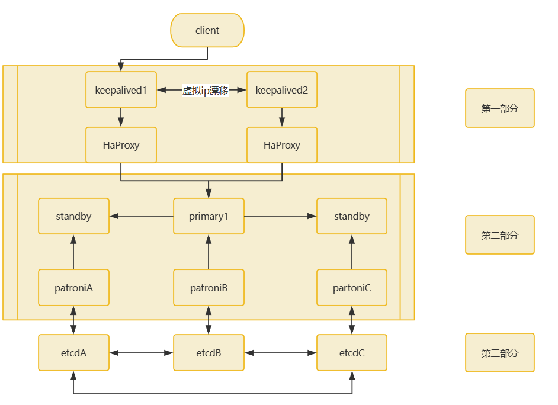
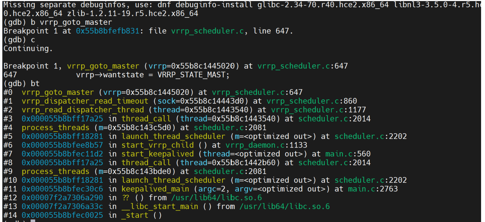
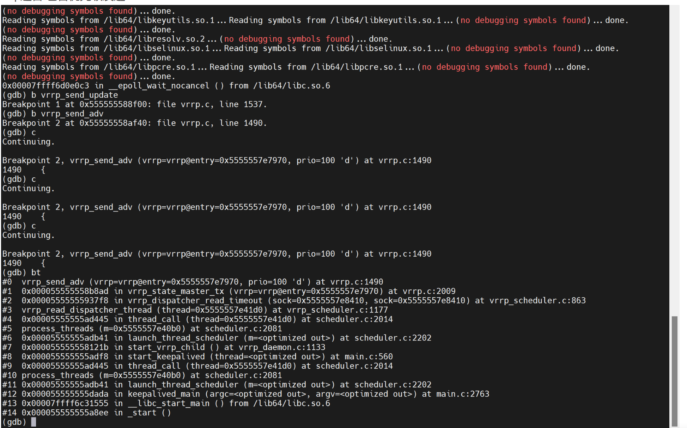
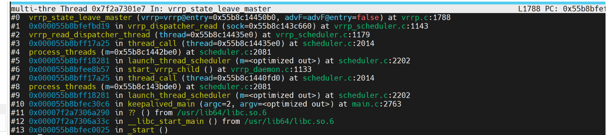
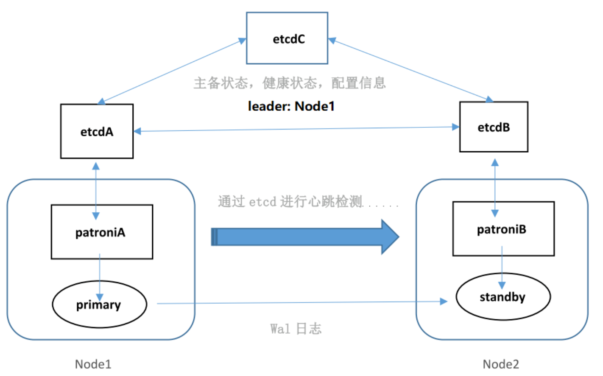

##  高可用方案
对于openguass的高可用集群进行研究得出如上图所示的高可用方案：
采用keepalived + HaProxy + partoni + DCS(etcd)组成 数据库采用OpenGauss。
可划分为三个部分：
###  第一部分是keepalived+HaProxy
keepalived为客户端提供虚拟IP，HaProxy提供负载均衡，一般是两个工具部署在一起。如果keepalived1 + HaProxy不可用，则会keepalived服务自动进行故障转移到keepalived2 + HaProxy的服务器上，keepalived也负责提供虚拟IP，对用户显示的是一致的虚拟IP。HaProxy与各个集群的主节点相连，进行读写分离、负载均衡处理。
> 虚拟ip：虚拟IP技术，就是一个未分配给客户端真实主机的IP，也就是说对外提供数据库服务器除了有一个真实IP外还有一个虚IP，使用任意一个IP都可以连接到这台主机。当服务器发生故障无法对外提供服务时，动态将这个虚IP切换到备用主机。
> 连接保持：开启连接保持功能后，当服务与旧主节点（即高可用切换前的主节点）连接断开时，当前服务与前端应用的连接保持不断（即应用程序看到的Session），同时服务会与新主节点（即高可用切换后的主节点）重新建立连接并且恢复之前的会话状态，以实现对应用程序端无感知的高可用切换。
> 负载均衡：含义就是指通过调度算法将负载（工作任务）进行平衡、分摊到多个操作单元上进行运行，从而协同完成工作任务。负载均衡构建在原有网络结构之上，它提供了一种透明且廉价有效的方法扩展服务器和网络设备的带宽、加强网络数据处理能力、增加吞吐量、提高网络的可用性和灵活性。

具体的原理可以查看：我之前一篇文章介绍：[Keepalived与HaProxy的协调合作原理分析](https://www.modb.pro/db/625178)
通过具体使用，体会了openguass配合keepalived的高可用性。
产生vip漂移过程两种情况
整个过程中，对于客户端来说，不知道对于两台调度服务器发生了切换，客户端保持连接同一个vip，完成自身请求。

在这里面涉及两次切换，

①对于备节点收不到主节点的心跳消息时，触发定时器超时（vrrp_dispatcher_read_timeout)，判断当前节点状态为备节点，执行升主操作（vrrp_gotomaster)。


```bash
service keepalived stop
ip addr  //查看vip在哪台服务器上
systemctl start keepalived
systemctl status keepalived
systemctl stop keepalived
```

执行备升主操作时，使用gdb跟踪keepalived的调用栈。


可以看到调用了vrrp_go_master函数，可以实现备节点升主，实现了从接替主。
vrrp通告 包含优先级发送


②此时备节点已经变为主节点，当设置为抢占模式时，原来的主节点网络恢复，要与备节点进行连接，主会发送vrrp通告（vrrp_send_adv 包括优先级信息)。通过netlink接口中查到的vrrp包，通过路由过滤和规则过滤，当由备节点升为的主节点（128.20）此时知道自身优先级低，会执行设为备节点（set_backup->leave_master）。

执行禅让给优先级更高的服务器节点操作，使用gdb跟踪keepalived的调用栈。


这里可以体现出openguass方案的高可用性很可靠，同时实现了**连接保持功能**。
**连接保持**：开启连接保持功能后，当服务与旧主节点（即高可用切换前的主节点）连接断开时，当前服务与前端应用的连接保持不断（即应用程序看到的Session），同时服务会与新主节点（即高可用切换后的主节点）重新建立连接并且恢复之前的会话状态，以实现对应用程序端无感知的高可用切换。

###  第二部分是patroni + OpenGauss组成的集群
集群是一主多从，集群中通过patroni对OpenGauss进行自动故障转移，但是该工具并没有选举算法（所以需要用到etcd的信息），只是做故障转移的处理，也是通过etcd进行心跳检测。OpenGauss主从之间wal日志进行异步流复制。
patroni通过一个api接口连接到etcd，向其插入键值对记录patroni参数、数据库参数、主备信息以及连接信息，平常通过etcd对其它节点做心跳检测，通过从etcd获取键值对中存储的主备信息来判断各节点的状态对集群进行自动管理，其基本原理如下图所示。


#####  patroni + OpenGauss集群避免了“脑裂”现象
而对于高可用来说，集群很容易发生**脑裂**现象。下面对于脑裂现象进行一个描述：

即对于当前集群，本来主节点Leader是a，备节点是b，a会持续像b发送“心跳”，（通知：我是主节点！）而当两个机房之间的网络通信出现故障时，b收不到a的心跳，默认a点失效，此时b会执行升主操作，以保证该集群的可用性。此时选举机制就有可能在不同的网络分区中选出两个Leader a和b。当网络恢复时，这两个Leader a和b该如何处理数据同步？又该听谁的？这就是“脑裂”现象。

但是对于该高可用方案：同一时刻最多只能有一个patroni节点成为leader，即最多只能有一个patroni节点能够持有leader锁，因此能够**避免脑裂的发生**。
当前patroni-for-openGauss支持修复的故障场景如下：

1. 主数据库意外停止，但可以通过重启恢复，立即自动启动主数据库；

2. 主数据库意外故障，且无法启动，首先当前主机释放leader锁降备，然后自动选择一个最健康的备机即同步情况与主机最接近的备机，提升为主机；

3. 备库意外挂机，重启后可立即恢复正常并与主机连接，则立即进行重启恢复；

4. 备库意外故障，可正常启动但是启动后落后于主机状态 ，则对其进行重建操作以恢复其状态。

###  第三部分是DSC分布式存储系统
这里采用的是etcd，etcd是分布式键值(key-value)数据库，内部采用raft协议做一致性算法，为patroni提供各个节点的主备状态、健康状态、配置信息，etcd集群是为高可用，持久性数据存储和检索而准备。
深入了解一下raft协议：
#####  领导者选举
在本质上，Raft算法通过一切 以领导者为准的方式，实现一系列共识和各节点日志的一致。
成员身份：领导者、跟随者、候选人。
跟随者等到领导者心跳超时时候推荐自己成为候选者；
候选者向其他节点发送投票消息，如果选票多成为领导者；
领导者负责写请求、管理日志复制和不断发送心跳信息。
##### 选举过程
服务器节点间沟通联络采用远程过程调用（RPC）：请求投票和日志复制。
日志复制只能由领导者发起。
Raft算法中的任期号：
跟随者在等待领导者心跳信息超时后，推荐自己时会增加自己的任期号；或者一个服务器节点，发现自己任期编号比其他节点小，那么会更新自己的编号到较大的编号值。
Raft算法约定，如果一个服务器节点发现自己任期号小于其他节点，那么会恢复成跟随者状态。（在分区错误恢复后，曾经的领导者任期号3，收到了新领导者的心跳消息，任期号为4，此时该节点会立即变为跟随者状态。
一个节点如果接收到任期号小的请求，那么会直接拒绝该请求。
#####  选举规则
 - 领导者周期性的发送心跳消息，阻止不要发起新的选举。
 - 一个周期内，跟随者没有收到领导者的心跳，就会自荐发起领导者选举。
 - 一次选举获得大多数选票，晋升为领导者。
 - 一个任期中，直至领导者自身出现问题或者网络延迟，其他节点发起新选举前，领导者不变。
 - 一次选举中，每一个服务器节点多会对一个任期编号投出一张选票，并且按照“先 来先服务”的原则进行投票。


其他：如果使用vip-manager工具服务，这是一个简单的go应用程序，是根据etcd的信息提供虚拟IP的，仅仅提供虚拟IP，如果使用，是在上图第二部分中的，vip-manager在每个节点部署，例如一个三个数据库服务器组成的集群，集群内部相当于有四个IP，三个节点三个静态IP，分别是三个数据库服务器的IP，另一个是动态IP，动态IP是跟随着主服务器移动的，vip-manager会定时检测当前所在的是否是主服务器，如果是，则获取当前IP并取个IP别名，该别名为虚拟IP对外提供。如果不是主节点，则vip-manager会确保其删除IP。