# 故障描述

2024 年 4 月 2 日上午10点00分到10点20分江苏电力某系统数据库CPU使用出现异常增长，平均达到了90%以上，峰值达到了100%；会话数也从10点20分开始持续升高，持续到10点28分会话数超过数据库最大连接数8000，业务会话受影响；10点50分数据库部分空闲会话kill，数据库可以连接，此时数据库会话数降低到6000左右；最终13点09分左右对数据库进行了重启操作，数据库连接数稳定在2000左右，CPU使用率也维持到50%左右，业务彻底恢复正常。

# 故障分析

## 环境描述

<br/>

openGauss 3.0.3版本主备模式架构。

<br/>

# 故障处理


- 10点00分到10点20分江苏电力某系统数据库CPU使用出现异常增长使用率高达100%。

- 持续到10点28分会话数超过数据库最大连接数8000，此时业务会话受影响，在10点20到10点28分这个时段，UniqueSQLMappingLock等待会话数持续增加，从最开始的199个UniqueSQLMappingLock升高到4259个UniqueSQLMappingLock。

- 10点50左右采取kill部分空闲的会话，数据库连接数降低到6000左右，业务可以正常连接数据库，CPU使用率降低到70%左右，此时UniqueSQLMappingLock等待降低为1500左右。

- 13点09分左右对数据库进行了重启操作，并且扩容了shared buffer大小，之后数据库性能恢复正常，CPU使用率回落至50%左右，UniqueSQLMappingLock等待彻底消失。


# 故障现象


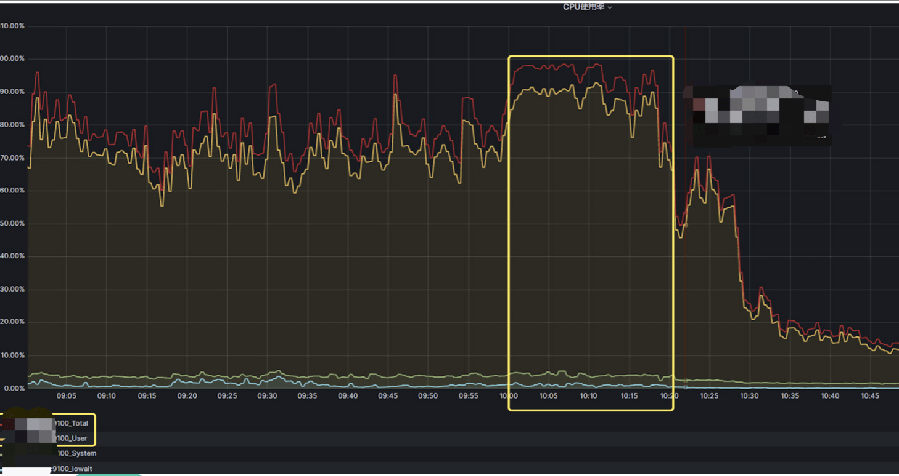

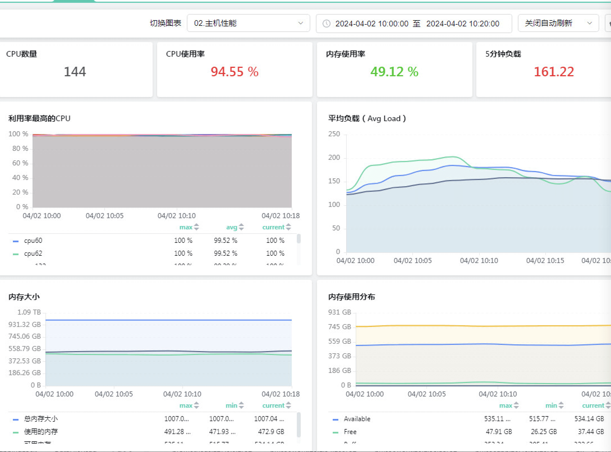


- 数据库主机09:05:00至10:00:00,主机的CPU平均使用率已经达到70%左右,峰值会达到90%。

- 数据库主机10:00:00至10:20:00,主机的CPU平均使用率已经达到90%左右,峰值会达到100%。这一负载与平日系统性能标准有显著偏差，平日系统CPU平均使用率业务繁忙期也就70%左右，峰值90%左右。

- 与此同时，内存、网络、IO等方面数据保持在正常范围内并无异常,系统主要的瓶颈还是CPU使用率较高,甚至峰值达到100%。

关于数据库主机CPU使用率100%的性能隐患：

1、性能下降： 当CPU跑满时，服务器的处理能力已经达到极限，因此处理请求的速度变慢，响应时间延迟增加，这将直接影响应用程序不稳定。

2、其他资源受限： 当CPU负载高时，服务器上的其他资源，如内存、磁盘和网络带宽，可能会受到限制，从而影响整体性能。

该系统在10:00:00到10:20:00时段，该系统的主机CPU使用率接近100%，较高的CPU使用率可能导致主机运行状态不稳定，进而导致数据库的各种内部调度任务响应时长受到影响，各项Latch、Lock、SQL响应时长增加等，数据库可能也因此出现各种异常等待，例如10点20到10点28分时段的uniquesqlMappinglock等待。

**cpu 100%问题分析**

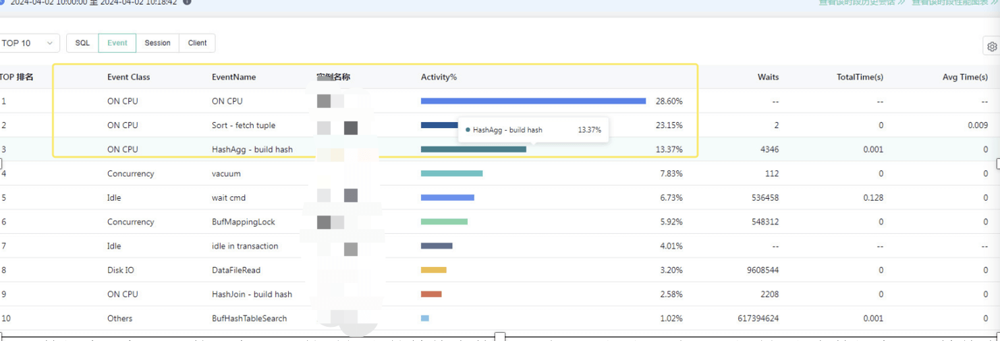

数据库主机CPU使用率100%的时间段的等待事件：10点00分到10点20分时间段内数据库主要等待事件分类是on cpu、sort-fetch tuple和hashAgg-build hash，上述三个等待事件占据了数据库活动时间的63%以上，该等待事件主要由于出现大量top sql，大量的逻辑读 hash join 导致。

- 关于ON CPU等待：ON CPU等待主要是数据库运行相关SQL时候的IO读取写入（主要是逻辑读）、SQL解析、函数运算等消耗为主，我们希望数据库的主要等待事件是ON CPU为主，但是此时必须主机CPU使用率处于较低范围例如50%以下，如果此时主机CPU使用率依然较高，还是需要优化TOPSQL来降低ON CPU等待，进而降低系统主机的CPU使用率。


- 关于sort-fetch tuple等待：表示是Sort算子做排序，fetch tuple表示Sort算子正在获取tuple，主要是SQL语句排序等消耗为主导致。


- 关于hashAgg-build hash等待:build hash表示当前HashAgg算子正在建立哈希表,主要用于SQL语句HASH Join关联产生的等待。


期间的主要TOPSQL优化分析如下：（后续TOPSQL重点优化，降低主机的CPU负载）


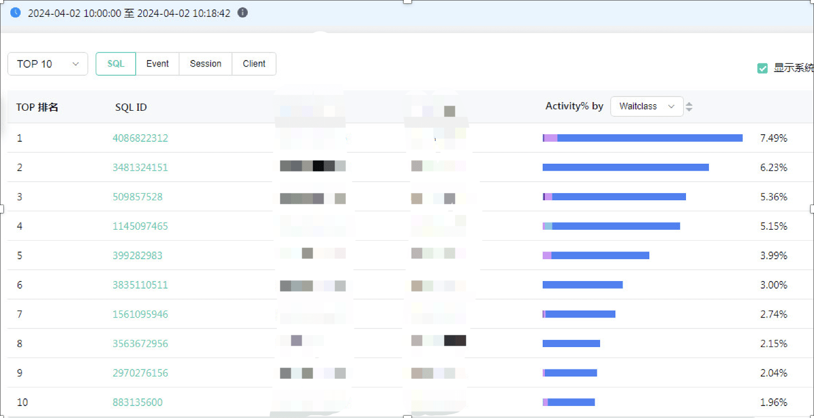

- 截取排名前面的TOPSQL语句全表扫描执行计划：

1、全表扫描业务表：

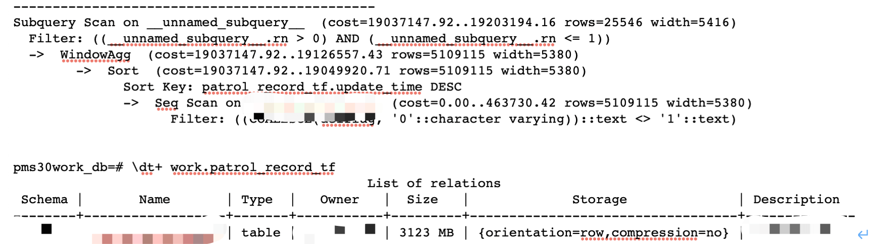

问题：

该SQL语句需要全表扫描，该表达到3GB容量，SQL的语句where语句并无合适的条件，无法使用索引去过滤数据，高并发的SQL全表扫描会消耗的较多的系统资源（CPU、IO等资源）。

2、全表扫描dbe_perf.statement视图

系统内一直有对dbe_perf.statement视图去做周期性的查询，获取相关的SQL语句用于监控，该SQL执行时间较长，单次需要20秒以上：

```
SELECT user_name,

left(query,

100) AS query,

n_calls,

min_elapse_time,

max_elapse_time,

total_elapse_time,

n_returned_rows,

n_tuples_fetched,

n_tuples_returned,

n_tuples_inserted,

n_tuples_updated,

n_tuples_deleted,

n_blocks_fetched,

n_blocks_hit,

n_soft_parse,

n_hard_parse,

db_time,

cpu_time,

execution_time,

parse_time,

plan_time,

rewrite_time,

pl_execution_time,

pl_compilation_time,

data_io_time,

sort_count,

sort_time,

sort_mem_used,

sort_spill_count,

sort_spill_size,

hash_count,

hash_time,

hash_mem_used,

hash_spill_count,

hash_spill_size

FROM dbe_perf.statement

WHERE last_updated > now()-600 limit 100;
```

**数据库会话数、等待事件分析**


10点开始CPU使用率持续较高，并且峰值达到了100%，会话数的进一步增加，进而超过会话数最大值8000，业务受到影响。

10点18分到10点28分的会话数变化趋势：

- 10点18分会话数正常，连接会话数为2122；
- 10点20分会话数升高到2416（此时UniqueSQLMappinglock等待为199个）；
- 10点24分会话数升高为5133（此时UniqueSQLMappingLock等待为2060）；
- 10点28分会话数升高为8020（此时UniqueSQLMappingLock等待为4259）；

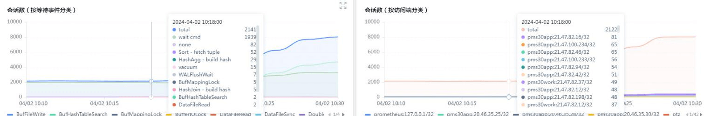
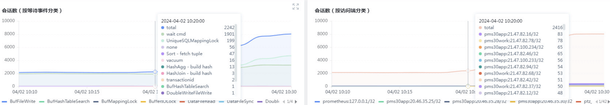
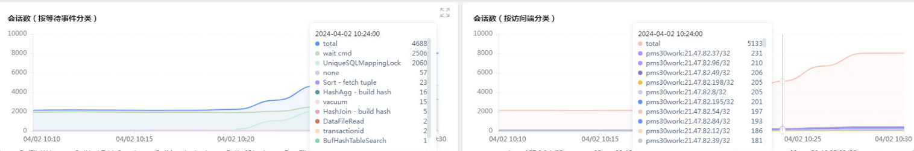
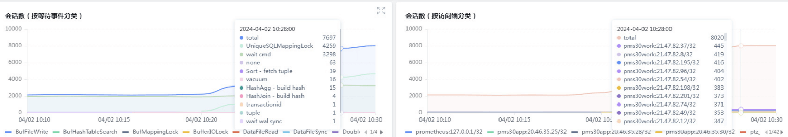

- 关于UniqueSQLMappinglock 数据库等等事件:


UniqueSQLMappingLock在OpenGauss数据库中是用来控制对Unique SQL信息哈希表的并发访问的轻量级锁（LWLock）。Unique SQL是OpenGauss中用来追踪和统计数据库中执行的SQL语句的功能，它可以帮助数据库了解哪些SQL语句被执行，它们的执行频率，平均执行时间等信息。

在OpenGauss数据库中，Unique SQL信息是存储在一个全局哈希表中的。由于多个线程可能会同时尝试读取或更新这个哈希表中的信息，因此需要一个机制来保证对哈希表的访问是线程安全的。它确保在任何时候只有一个线程能够修改哈希表，而其他的线程必须等待直到UniqueSQLMappingLock锁被释放。

**数据库归化unique sql的相关参数介绍**

- 关于instr_unique_sql_count参数：

由于数据库在10点开始CPU持续升高，并且CPU使用率峰值达到了100%，此时数据库的归化SQL数量已经达到了instr_unique_sql_count数量250000，数据库将不会记录新的SQL都dbe_perf.statement视图中。为了收集更多的SQL语句来确认是否还有其他TOPSQL消耗较多的资源，数据库管理员在10点18分对数据库中的instr_unique_sql_count参数进行了调整，通过将该参数的值从250,000增加到300,000，能够扩大统计覆盖范围，可以记录更多的SQL语句。

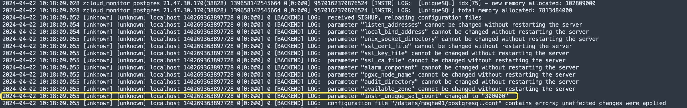

之前也由于该业务系统数据库的业务SQL较多，为了更好的优化TOPSQL，也在线上调整该参数。这一调整基于文档的说明和之前的实践经验，已经证明这种方法能够有效地提高对资源密集型查询的识别能力，而不会牺牲数据库的稳定性或性能。

instr_unique_sql_count参数官方描述：

参数说明： 控制系统中unique sql信息实时收集功能。配置为0表示不启用unique sql信息收集功能。

该值由大变小将会清空系统中原有的数据重新统计（备机不支持此能力）；从小变大不受影响。

当系统中产生的unique sql条目数量（dbe_perf.statement/dbe_perf.summary_statement统计）大于instr_unique_sql_count时，若开启了unique sql自动淘汰（默认不开启，参数enable_auto_clean_unique_sql控制，默认该参数为off），则系统会按unique sql的更新时间由远到近自动淘汰一定比例的条目，使得新产生的unique sql信息可以继续被统计。若没有开启自动淘汰，则系统产生的新的unique sql信息将不再被统计。

默认值：100

取值范围：整型，0~2147483647

注意：

在开启自动淘汰的情况下，如果该值设置的较小，可能会导致系统频繁的进行自动淘汰，有可能会影响数据库系统性能，所以实际场景中建议不要将该值设置的过小，建议值为200000。

在开启自动淘汰的情况下，如果该值设置的较大（例如38347922），清理过程中可能会引发大内存问题而无法清理。

- 关于unique SQL自动淘汰enable_auto_clean_unique_sql参数：

由于开启unique SQL自动淘汰可能会引起wdr无法生成，因此该参数默认值也是off，默认不开启unique SQL自动淘汰任务。

enable_auto_clean_unique_sql参数官方描述：

参数说明：当系统中产生的unique sql条目数量大于等于instr_unique_sql_count时，是否启用unique sql自动淘汰功能。

取值范围：布尔型

默认值：off

注意：

由于快照有部分信息是来源于unique sql，所以开启自动淘汰的情况下，在生成wdr报告时，如果选择的起始快照和终止快照跨过了淘汰发生的时间，会导致无法生成wdr报告。

track_activity_query_size参数官方描述：

参数说明：设置用于跟踪每一个活动会话当前正在执行命令的字节数。

参数类型：POSTMASTER

取值范围：整型，100～102400

该参数控制记录单个uniqueSQL的最大行长，默认值是1024，该设置会直接对每个SQL分配这么大的内存区域，即使SQL文本远远小于该参数，也会分配这么大的内存区域。该参数一般不建议调整的特别大，避免较多的内存消耗，对于大部分系统1024已经足够，如果需要记录更长的SQL语句到相关视图，可以做一些变更调整。

## 实验室模拟场景

**1、观察dbe_perf.statement查询耗时随着内存中unique sql条数增加变化曲线。测试过程中外部压力不变，通过构造空表的不同列的查询组合来模拟unique sql。 CPU使用率为60%左右。**

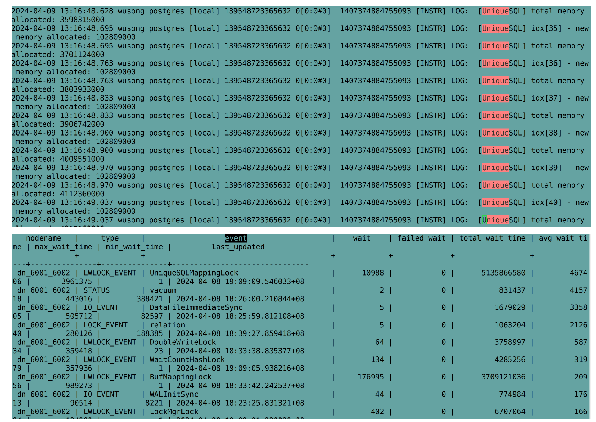

**2. dbe_perf.statement 查询时间随着内存中 unique sql数量越来越大，查询时间出现明显上涨。**

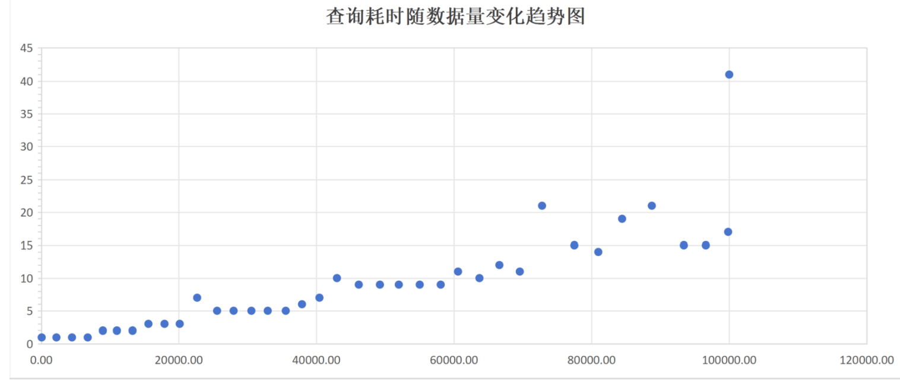


```
20240409-11:05:14 ---> 20240409-11:05:15 Total:1 seconds Count: 60

20240409-11:05:25 ---> 20240409-11:05:26 Total:1 seconds Count: 2211

20240409-11:05:36 ---> 20240409-11:05:37 Total:1 seconds Count: 4483

20240409-11:05:47 ---> 20240409-11:05:48 Total:1 seconds Count: 6779

20240409-11:05:58 ---> 20240409-11:06:00 Total:2 seconds Count: 8983

20240409-11:06:10 ---> 20240409-11:06:12 Total:2 seconds Count: 11032

20240409-11:06:22 ---> 20240409-11:06:24 Total:2 seconds Count: 13319

20240409-11:06:34 ---> 20240409-11:06:37 Total:3 seconds Count: 15558

20240409-11:06:47 ---> 20240409-11:06:50 Total:3 seconds Count: 17905

20240409-11:07:00 ---> 20240409-11:07:03 Total:3 seconds Count: 20125

20240409-11:07:13 ---> 20240409-11:07:20 Total:7 seconds Count: 22668

20240409-11:07:30 ---> 20240409-11:07:35 Total:5 seconds Count: 25578

20240409-11:07:45 ---> 20240409-11:07:50 Total:5 seconds Count: 27989

20240409-11:08:00 ---> 20240409-11:08:05 Total:5 seconds Count: 30584

20240409-11:08:15 ---> 20240409-11:08:20 Total:5 seconds Count: 32969

20240409-11:08:30 ---> 20240409-11:08:35 Total:5 seconds Count: 35520

20240409-11:08:45 ---> 20240409-11:08:51 Total:6 seconds Count: 37889

20240409-11:09:01 ---> 20240409-11:09:08 Total:7 seconds Count: 40435
```

**3. 参数 track_activity_query_size 由 51200 调整到 1024 后， 相同测试条件下，dbe_perf.statement 查询耗时如下。可以看到参数 track_activity_query_size 调小后，查询耗时比较稳定，且数据库中未出现 【UniqueSQL】相关报错。**

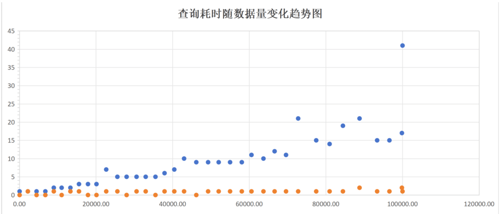

```
20240409-11:09:18 ---> 20240409-11:09:28 Total:10 seconds Count: 42989

20240409-11:09:38 ---> 20240409-11:09:47 Total:9 seconds Count: 46176

20240409-11:09:57 ---> 20240409-11:10:06 Total:9 seconds Count: 49260

20240409-11:10:16 ---> 20240409-11:10:25 Total:9 seconds Count: 52019

20240409-11:10:35 ---> 20240409-11:10:44 Total:9 seconds Count: 54992

20240409-11:10:54 ---> 20240409-11:11:03 Total:9 seconds Count: 58054

20240409-11:11:13 ---> 20240409-11:11:24 Total:11 seconds Count: 60582

20240409-11:11:34 ---> 20240409-11:11:44 Total:10 seconds Count: 63705

20240409-11:11:54 ---> 20240409-11:12:06 Total:12 seconds Count: 66616

20240409-11:12:16 ---> 20240409-11:12:27 Total:11 seconds Count: 69596

20240409-11:12:37 ---> 20240409-11:12:58 Total:21 seconds Count: 72765

20240409-11:13:08 ---> 20240409-11:13:23 Total:15 seconds Count: 77477

20240409-11:13:33 ---> 20240409-11:13:47 Total:14 seconds Count: 80971

20240409-11:13:57 ---> 20240409-11:14:16 Total:19 seconds Count: 84445

20240409-11:14:26 ---> 20240409-11:14:47 Total:21 seconds Count: 88784

20240409-11:14:57 ---> 20240409-11:15:12 Total:15 seconds Count: 93375

20240409-11:15:22 ---> 20240409-11:15:37 Total:15 seconds Count: 96583

20240409-11:15:47 ---> 20240409-11:16:04 Total:17 seconds Count: 99840

20240409-11:16:14 ---> 20240409-11:16:55 Total:41 seconds Count: 100001

20240409-11:39:18 ---> 20240409-11:39:18 Total:0 seconds Count: 262

20240409-11:39:28 ---> 20240409-11:39:29 Total:1 seconds Count: 2304

20240409-11:39:39 ---> 20240409-11:39:39 Total:0 seconds Count: 4404

20240409-11:39:49 ---> 20240409-11:39:49 Total:0 seconds Count: 6479

20240409-11:39:59 ---> 20240409-11:40:00 Total:1 seconds Count: 8597

20240409-11:40:10 ---> 20240409-11:40:10 Total:0 seconds Count: 10722

20240409-11:40:20 ---> 20240409-11:40:21 Total:1 seconds Count: 12875

20240409-11:40:31 ---> 20240409-11:40:32 Total:1 seconds Count: 15052

20240409-11:40:42 ---> 20240409-11:40:42 Total:0 seconds Count: 17215

20240409-11:40:52 ---> 20240409-11:40:52 Total:0 seconds Count: 19341

20240409-11:41:02 ---> 20240409-11:41:03 Total:1 seconds Count: 21491

20240409-11:41:13 ---> 20240409-11:41:14 Total:1 seconds Count: 23664

20240409-11:41:24 ---> 20240409-11:41:24 Total:0 seconds Count: 25813

20240409-11:41:34 ---> 20240409-11:41:35 Total:1 seconds Count: 28042
```


原理解释：

调大 instr_unique_sql_count 后，内存的 hash 表又可以写入，业务 SQL 执行过程中需要向 hashtabl写入数据，需要以 EXCLUSIVE 模式申请 UniqueSQLMappingLock ，会与查询dbe_perf.statement语句产生锁竞争。

下图是调整后业务时延随时间的变化图，可以看到业务有周期性的长时延，这与dbe_perf.statement的周期性查询有关。当查询dbe_perf.statement时，会导致业务SQL 执行时间显著上升。这与之前故障环境修改参数后产生大量超时报错现象上是一致的。


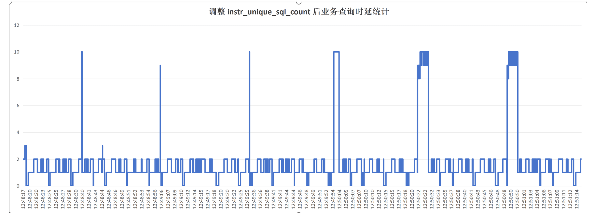

```
20240409-11:41:45 ---> 20240409-11:41:46 Total:1 seconds Count: 30121

20240409-11:41:56 ---> 20240409-11:41:56 Total:0 seconds Count: 32407

20240409-11:42:06 ---> 20240409-11:42:07 Total:1 seconds Count: 34571

20240409-11:42:17 ---> 20240409-11:42:18 Total:1 seconds Count: 36753

20240409-11:42:28 ---> 20240409-11:42:29 Total:1 seconds Count: 38906

20240409-11:42:39 ---> 20240409-11:42:39 Total:0 seconds Count: 41053

20240409-11:42:49 ---> 20240409-11:42:50 Total:1 seconds Count: 43223

20240409-11:43:00 ---> 20240409-11:43:01 Total:1 seconds Count: 45391

20240409-11:43:11 ---> 20240409-11:43:12 Total:1 seconds Count: 47534

20240409-11:43:22 ---> 20240409-11:43:23 Total:1 seconds Count: 49730

20240409-11:43:33 ---> 20240409-11:43:34 Total:1 seconds Count: 52040

20240409-11:43:44 ---> 20240409-11:43:45 Total:1 seconds Count: 54351

20240409-11:43:55 ---> 20240409-11:43:56 Total:1 seconds Count: 56530

20240409-11:44:06 ---> 20240409-11:44:07 Total:1 seconds Count: 58729

20240409-11:44:17 ---> 20240409-11:44:18 Total:1 seconds Count: 61033

20240409-11:44:28 ---> 20240409-11:44:29 Total:1 seconds Count: 63353

20240409-11:44:39 ---> 20240409-11:44:40 Total:1 seconds Count: 65690

20240409-11:44:50 ---> 20240409-11:44:51 Total:1 seconds Count: 67955

20240409-11:45:01 ---> 20240409-11:45:03 Total:2 seconds Count: 70251

20240409-11:45:13 ---> 20240409-11:45:14 Total:1 seconds Count: 72667

20240409-11:45:24 ---> 20240409-11:45:25 Total:1 seconds Count: 74946

20240409-11:45:35 ---> 20240409-11:45:37 Total:2 seconds Count: 77300

20240409-11:45:47 ---> 20240409-11:45:48 Total:1 seconds Count: 79649

20240409-11:45:58 ---> 20240409-11:45:59 Total:1 seconds Count: 81971

20240409-11:46:09 ---> 20240409-11:46:10 Total:1 seconds Count: 84411

20240409-11:46:20 ---> 20240409-11:46:22 Total:2 seconds Count: 86796

20240409-11:46:32 ---> 20240409-11:46:33 Total:1 seconds Count: 89126

20240409-11:46:43 ---> 20240409-11:46:45 Total:2 seconds Count: 91533

20240409-11:46:55 ---> 20240409-11:46:56 Total:2 seconds Count: 93995

20240409-11:47:07 ---> 20240409-11:47:08 Total:1 seconds Count: 96388

20240409-11:47:18 ---> 20240409-11:47:20 Total:2 seconds Count: 98816

20240409-11:47:30 ---> 20240409-11:47:31 Total:1 seconds Count: 100000
```


一旦内存中的 unique sql 重新达到设置的最大值，业务 SQL 就不会再去更新内存中 hash 表，也就与查询 dbe_perf.statement 不会有锁冲突，业务查询时延恢复到正常值。从下图可以看出unique sql达到最大值后，不再受dbe_perf.statement查询的影响。

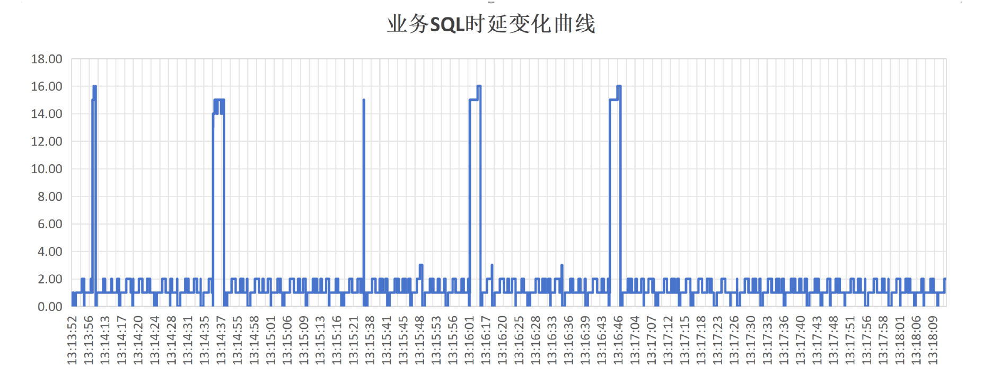

<br/>

# 故障结论

此次问题的根源为大量TOPSQL导致主机CPU使用率偏高，并且最终达到100%（特别大量全表扫描SQL），在CPU不足情况下数据库中SQL在执行过程中持有获取的锁时间将会加剧，业务SQL越跑越慢，连接数也会进一步的增加，系统出现大量的UniqueSQLMappingLock等待，并且最终超过数据库最大连接数8000，从而影响业务正常运行。

由于数据库目前的unique SQL数量已经达到了instr_unique_sql_count参数，不会记录新的SQL语句到数据库中。数据库管理员考虑到CPU使用率100%的风险，在线修改instr_unique_sql_count参数从250000为300000，以便可以收集更多的SQL语句来优化TOPSQL和降低CPU使用率，该参数之前也在线调整过并无异常，故障后也多次模拟在线修改该参数也并未触发异常，并且官方给出的文档中也并没有提及该参数修改可能会遇到相关风险和案例。

后续关于该参数instr_unique_sql_count修改和等待事件UniqueSQLMappingLock的关系模拟之后发现：

如果CPU系统本身负载较高，业务程序并发较大；
instr_unique_sql_count设置的较大，系统捕捉的uniqueSQL也就更多，并且track_activity_query_size设置的也比较大（本系统设置的102400），则instr_unique_sql_count*track_activity_query_size就是uniqueSQL部分的内存消耗为23.8GB（102400*250000/(1024*1024*1024)）。

如果数据库在线调整instr_unique_sql_count参数期间，还有相关的UniqueSQLMappingLock资源请求发生（例如周期性的查询dbe_perf.statement视图获取相关SQL进行监控，该视图查询会请求UniqueSQLMappingLock资源），则可能触发和加剧更严重的等待竞争，例如出现严重的UniqueSQLMappingLock等待、on CPU等待。

**总体分析**： 基于目前的信息判断本次会话数超过最大连接数的主要原因还是主机CPU使用率达到100%诱因，此时导致数据库出现了较多的ON CPU、sort-fetch tuple和hashAgg-build hash等待；系统内的instr_unique_sql_count参数是250000，track_activity_query_size之前被调整为102400，这个设置导致uniqueSQL区域内存非常大，达到了23GB，系统内还有周期性的查询dbe_perf.statement视图（该视图就是uniqueSQL区域对应的视图，由于uniqueSQL达到了23GB，此时查询该视图就导致特别消耗资源，需要时间接近20秒以上还查询不出来）数据获取SQL语句来监控，如果此时调整instr_unique_sql_count参数，则可能进一步加剧系统负载，出现更为严重的UniqueSQLMappingLock和on cpu等待，进而达到数据库最大连接数8000，严重影响业务运行。

<br/>

# 优化建议

- 降低数据库的CPU负载优化业务SQL，确保CPU不会长时间处于高压力状态。当CPU承受过大压力时，数据库的整体性能可能会受到影响，包括但不限于数据块的访问、SQL语句的处理、WAL缓冲区的写入等关键操作的延迟。

- instr_unique_sql_count变更规范：高CPU使用率场景下也不建议在线修改instr_unique_sql_count参数，避免在线修改参数触发openGauss数据库相关版本的未知缺陷或者不足（当前openGauss数据库目前版本是3.0.3版本，目前社区最新LTS版本是5.0.0版本）。

- 停机修改track_activity_query_size参数从102400降低到4096，为原来的4%，此时uniqueSQL区域将大幅度降低，也避免dbe_perf.statement视图查询时候出现的性能瓶颈。

<br/>

**附：数据库相关名词解释**


1、uniqueSQLMappingLock等待：uniqueSQLMapping等待是用户保护数据库的uniquesql hash table，openGauss数据库中每个SQL语句会对应一个uniquesql，关于uniquesql解释如下：

用户执行SQL语句时，每一个SQL语句文本都会进入解析器（Parser），生成“解析树”（parse tree）。遍历解析树中各个结点，忽略其中的常数值，以一定的算法结合树中的各结点，计算出来一个整数值，用来唯一标识这一类SQL，这个整数值被称为Unique SQL ID，Unique SQL ID相同的SQL语句属于同一个“Unique SQL”。

例如，用户先后输入如下两条SQL语句：

select * from t1 where id = 1;

select * from t1 where id = 2;

这两条SQL语句除了过滤条件的常数值不同，其他地方都相同，由此生成的解析树的拓扑结构完全相同，故Unique SQL ID也相同。因此两条语句属于如下同一个Unique SQL：

select * from t1 where id = ?;

GaussDB、Opengauss内核会对所有上面形式的SQL语句汇总统计信息，通过视图呈现给用户。通过这种方式，可以排除一些无关的常量值的干扰，获得某一类SQL语句的统计数据，为性能分析和问题定位提供数值依据。

2、instr_unique_sql_count参数：该参数控制unique SQL数量最大值，如果超过该数值（不开启SQL 自动淘汰），则数据库不再记录新的SQL语句。

3、enable_auto_clean_unique_sql参数：该参数控制unique SQL自动淘汰特性是否开启，由于开启unique SQL自动淘汰可能会引起wdr无法生成，因此该参数默认值也是off，默认不开启unique SQL自动淘汰任务。

4、track_activity_query_size参数：该参数控制记录单个uniqueSQL的最大行长，默认值是1024，该设置会直接对每个SQL分配这么大的内存区域，即使SQL文本远远小于该参数，也会分配这么大的内存区域，该参数一般不建议调整的特别大，避免较多的内存消耗，对于大部分系统1024已经足够，如果需要记录更长的SQL语句到相关视图，可以做一些变更调整。

如果uniqueSQL超过track_activity_query_size该值，会导致数据库很多视图例如pg_stat_activity、db_perf.statement（uniqueSQL对应的视图）记录SQL出现截断，例如如下SQL测试用例

```
修改track_activity_query_size为100（该参数最小只能设置为100）

openGauss=# show track_activity_query_size;

track_activity_query_size

---------------------------

100

(1 row)

构造一个较大长度的uniqueSQL：

openGauss=# CREATE TABLE employee (

openGauss(# emp_id INT PRIMARY KEY,

openGauss(# emp_name VARCHAR(100),

openGauss(# emp_address VARCHAR(255),

openGauss(# emp_phone VARCHAR(20),

openGauss(# emp_email VARCHAR(100),

openGauss(# emp_salary NUMERIC(10,2),

openGauss(# emp_hire_date DATE,

openGauss(# emp_department VARCHAR(50),

openGauss(# emp_manager_id INT,

openGauss(# emp_status VARCHAR(20),

openGauss(# emp_birthday DATE,

openGauss(# emp_gender CHAR(1),

openGauss(# emp_marital_status VARCHAR(20),

openGauss(# emp_position VARCHAR(50),

openGauss(# emp_experience_years INT,

openGauss(# emp_education VARCHAR(100),

openGauss(# emp_skills TEXT,

openGauss(# emp_certifications TEXT,

openGauss(# emp_languages TEXT,

openGauss(# emp_emergency_contact_name VARCHAR(100),

openGauss(# emp_emergency_contact_phone VARCHAR(20),

openGauss(# emp_emergency_contact_relationship VARCHAR(50),

openGauss(# emp_spouse_name VARCHAR(100),

openGauss(# emp_spouse_phone VARCHAR(20),

openGauss(# emp_children_names TEXT,

openGauss(# emp_bank_name VARCHAR(100),

openGauss(# emp_bank_account_number VARCHAR(50),

openGauss(# emp_bank_routing_number VARCHAR(50),

openGauss(# emp_birthplace VARCHAR(100),

openGauss(# emp_nationality VARCHAR(50),

openGauss(# emp_ethnicity VARCHAR(50),

openGauss(# emp_disability_status VARCHAR(50),

openGauss(# emp_start_date DATE,

openGauss(# emp_end_date DATE,

openGauss(# emp_contract_type VARCHAR(50),

openGauss(# emp_work_location VARCHAR(100),

openGauss(# emp_work_schedule VARCHAR(50),

openGauss(# emp_supervisor_id INT,

openGauss(# emp_last_review_date DATE,

openGauss(# emp_next_review_date DATE,

openGauss(# emp_performance_rating NUMERIC(3,2),

openGauss(# emp_comments TEXT,

openGauss(# emp_created_at TIMESTAMP DEFAULT CURRENT_TIMESTAMP,

openGauss(# emp_updated_at TIMESTAMP DEFAULT CURRENT_TIMESTAMP

openGauss(# );

NOTICE: CREATE TABLE / PRIMARY KEY will create implicit index "employee_pkey" for table "employee"

CREATE TABLE

查看uniqueSQL对应的视图：create table对应的语句出现截断

openGauss=# select distinct query from dbe_perf.statement;

query

-----------------------------------------------------------------------------------------------------

show track_activity_query_size;

select name, setting from pg_settings where name in (?)

set max_query_retry_times=0;

SELECT pg_catalog.gs_password_notifytime()

select distinct query from dbe_perf.statement;

select ?, ?, t.* from dbe_perf.global_statio_all_indexes t

create table t01(id int);

select ?, ?, t.* from dbe_perf.summary_stat_user_functions t

select ?, ?, t.* from dbe_perf.summary_stat_all_indexes t

select ?, ?, t.* from dbe_perf.global_statio_all_sequences t

select +

?;

CREATE TABLE employee ( +

emp_id INT PRIMARY KEY, +

emp_name VARCHAR(100), +

emp_address VARC

select ?, ?, t.* from dbe_perf.global_stat_all_indexes t

select +

?,? from pg_class limit ?;

show track_activity_query;

set lockwait_timeout=10000 ;

select ?, ?, t.* from dbe_perf.summary_stat_all_tables t

SELECT DATNAME FROM PG_DATABASE;

set client_encoding to 'SQL_ASCII'

analyze snapshot.tables_snap_timestamp ;

select ?, ?, t.* from dbe_perf.global_statio_all_tables t

SELECT SESSIONID, TEMPID, TIMELINEID FROM PG_DATABASE D, PG_STAT_GET_ACTIVITY_FOR_TEMPTABLE() AS S

select ?, ?, t.* from dbe_perf.class_vital_info t

SELECT pg_catalog.intervaltonum(pg_catalog.gs_password_deadline())

SELECT VERSION()

select ?, ?, t.* from dbe_perf.global_stat_all_tables t

select ?, ?, t.* from dbe_perf.global_stat_user_functions t

set allow_concurrent_tuple_update='off';

select ?, ?, t.* from dbe_perf.summary_statio_all_indexes t

SET connection_info = '{"driver_name":"libpq","driver_version":"(openGauss 3.0.3 build 46134f73) co

select ?, ?, t.* from dbe_perf.summary_statio_all_sequences t

select ?, ?, t.* from dbe_perf.summary_statio_all_tables t

SELECT NSPNAME FROM PG_NAMESPACE WHERE NSPNAME LIKE ?

(33 rows)
```

