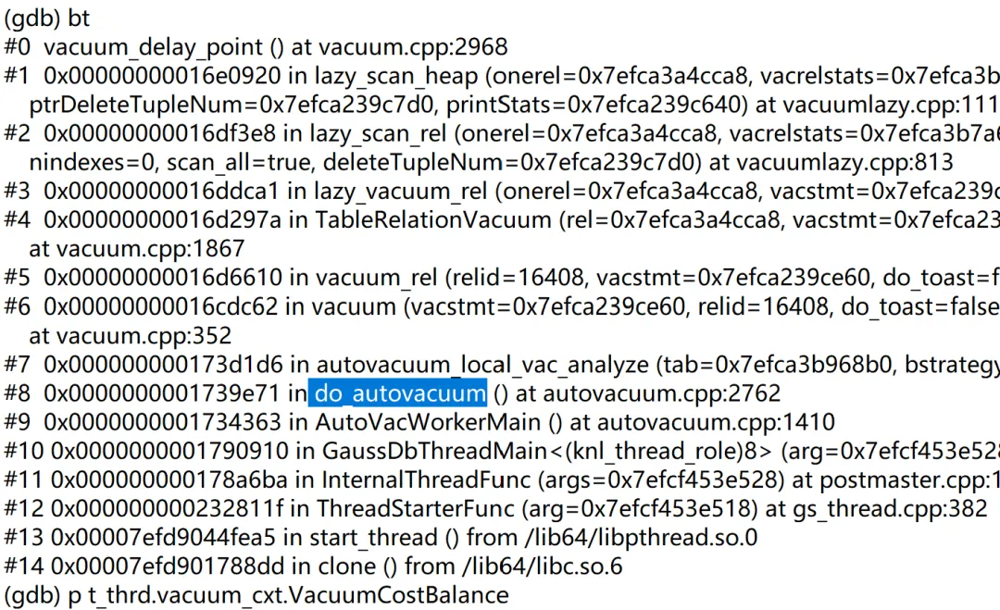

​     这两天想仔细了解一下vacuum机制，因为该机制会影响数据库的性能以及表的占用空间。通过网上了解一些资料，有些是从纯代码角度来解析的，有些是用纯文字来描述的，看了之后，似懂非懂，心中还是没有完全理清楚vacuum的机制。于是，准备按照自己的思路，来撸撸opengauss的代码，以便解答自己的疑惑。下面将描述个人的学习思路以及学习所得。

​    想了解vacuum的机制，打算从参数入手，vacuum相关的参数如下：

```
xcytest=# select name,setting from pg_settings where name like '%vacuum%';
              name               |  setting   
---------------------------------+------------
 autovacuum                      | on
 autovacuum_analyze_scale_factor | 0.1
 autovacuum_analyze_threshold    | 50
 autovacuum_freeze_max_age       | 4000000000
 autovacuum_io_limits            | -1
 autovacuum_max_workers          | 3
 autovacuum_mode                 | mix
 autovacuum_naptime              | 600
 autovacuum_vacuum_cost_delay    | 20
 autovacuum_vacuum_cost_limit    | 20
 autovacuum_vacuum_scale_factor  | 0.001
 autovacuum_vacuum_threshold     | 50
 enable_debug_vacuum             | on
 log_autovacuum_min_duration     | 1
 vacuum_cost_delay               | 0
 vacuum_cost_limit               | 200
 vacuum_cost_page_dirty          | 20
 vacuum_cost_page_hit            | 1
 vacuum_cost_page_miss           | 10
 vacuum_defer_cleanup_age        | 0
 vacuum_freeze_min_age           | 80
 vacuum_freeze_table_age         | 100
 vacuum_gtt_defer_check_age      | 10000
(23 rows)

```

通过参数的名字，在网上搜索一通，对参数有大概的了解。但是还是以下疑惑： 

  1.vacuum_freeze_min_age,vacuum_free_table_age,autovacuum_freeze_max_age 这三个参数，都跟freeze有关，但一个表到底什么时候做freeze/vacuum，最终是由哪个参数决定的？为什么需要这么多类似的参数？（这个问题提出来了，但写完这篇文章后，但还是没有解析到freeze这一步，后续继续解析）。
 
  2. autovacuum_vacuum_threshold ，autovacuum_vacuum_scale_factor这两跟vacuum有关，第一问提到的参数也大概跟vacuum有关，这两个参数的准确含义又是什么？

  3. .autovacuum_vacuum_cost_limit 跟vacuum_cost_limit这两个参数，都跟vacuum cost有关，具体各自限制什么？其他cost相关的参数有类似疑惑。

  4. autovacuum_max_workers 这个参数应该跟vacuum 线程有关系，vacuum线程之间是如何协同工作的？

作者本来的解析路线是，先通过跟踪vacuum 函数，找到哪个表在做vacuum ,然后进一步去找为什么这个表触发了vacuum ,而其他表没有触发vacuum的原因，找到表触发vacuum的原因之后，进一步挖掘vacuum线程是怎么调度这个表来做vacuum的，vacuum线程是如何调度起来的，何时调度起来的。这个解析路径回头看，特别合理跟清晰，但当时处于完全未知的状态时，一顿瞎摸索。

但本次总结vacuum ,不打算按照我摸索的路线来，准备从源头开始，从vacuum线程是如何调度的开始：

opengauss 后台线程中，有个叫AVClauncher常驻线程，该线程负责调度vacuum 线程，在不做autovacuum的时候，是没有vacuum线程在执行的。我们来看看autovacuum线程是如何被调度起来的。线程vacuum调度命令跟堆栈如下：
```
(gdb) bt
#0  do_start_worker () at autovacuum.cpp:880
#1  0x000000000173382e in launch_worker (now=769162991223266) at autovacuum.cpp:1096
#2  0x000000000173273c in AutoVacLauncherMain () at autovacuum.cpp:577
#3  0x0000000001790494 in GaussDbThreadMain<(knl_thread_role)7> (arg=0x7feb2253e170) at postmaster.cpp:12974
#4  0x000000000178a6ba in InternalThreadFunc (args=0x7feb2253e170) at postmaster.cpp:13517
#5  0x000000000232811f in ThreadStarterFunc (arg=0x7feb2253e160) at gs_thread.cpp:382
#6  0x00007febbe357ea5 in start_thread () from /lib64/libpthread.so.0
#7  0x00007febbe0808dd in clone () from /lib64/libc.so.6
```
我们来解析do_start_worker函数，其中有下面一段：
```
  foreach (cell, dblist) {
        avw_dbase* tmp = (avw_dbase*)lfirst(cell);
        Dlelem* elem = NULL;

        /* Check to see if this one is need freeze */
        if (TransactionIdPrecedes(tmp->adw_frozenxid, xidForceLimit)) {
            if (avdb == NULL || TransactionIdPrecedes(tmp->adw_frozenxid, avdb->adw_frozenxid))
                avdb = tmp;
            for_xid_wrap = true;
            continue;
```
上面这段代码的作用为遍历所有的数据库，在frozenxid小于xidForceLimit的情况下，找到frozenxid最小的数据库优先调度，同时，将参数for_xid_wrap设置为true. 单纯从变量名称的字面意思来理解，在这种情况下，做vacuum是为了防止xid回卷。但大部分情况下，这个条件不容易满足，做vacuum还有另外一个目的是为了删除死亡元组，而不仅仅是为了防止xid回卷。 这个xidForceLimit变量的值跟参数autovacuum_freeze_max_age有关系（如下）。当recentXid大于autovacuum_freeze_max_age的时候，取值为t_thrd.autovacuum_cxt.recentXid 减去autovacuum_freeze_max_age;否则就为3.
```
    t_thrd.autovacuum_cxt.recentXid = ReadNewTransactionId();
    if (t_thrd.autovacuum_cxt.recentXid >
        FirstNormalTransactionId + (uint64)g_instance.attr.attr_storage.autovacuum_freeze_max_age)
        xidForceLimit = t_thrd.autovacuum_cxt.recentXid -
            (uint64)g_instance.attr.attr_storage.autovacuum_freeze_max_age;
    else
        xidForceLimit = FirstNormalTransactionId;
```

在没有数据库满足frozenxid小于xidForceLimit的情况下，依然会选择数据库进行调度，原因如下：avdb变量最终总会赋值。 
```
    avw_dbase* tmp = (avw_dbase*)lfirst(cell);
       ...................
        if (avdb == NULL || tmp->adw_entry->last_autovac_time < avdb->adw_entry->last_autovac_time)
            avdb = tmp;
```

给avdb赋值后，下面就是具体的调度vaccuum worker线程的代码，通过共享内存AutoVacuumShmem控制运行中的work线程的数量，该数量的大小由参数autovacuum_max_workers控制。如果没有空闲的worker线程，则停止调度。用变量worker->wi_dboid指定此次被调度执行vacuum的数据库的oid. 然后给postmaster线程发送PMSIGNAL_START_AUTOVAC_WORKER信号，postmaster线程收到信号后，就会调起vacuum worker线程。
```
      worker = t_thrd.autovacuum_cxt.AutoVacuumShmem->av_freeWorkers;
        if (worker == NULL)
            ereport(FATAL, (errmsg("no free worker found")));

        t_thrd.autovacuum_cxt.AutoVacuumShmem->av_freeWorkers = (WorkerInfo)worker->wi_links.next;

        worker->wi_dboid = avdb->adw_datid;
        worker->wi_proc = NULL;
        worker->wi_launchtime = GetCurrentTimestamp();

        t_thrd.autovacuum_cxt.AutoVacuumShmem->av_startingWorker = worker;

        LWLockRelease(AutovacuumLock);

        SendPostmasterSignal(PMSIGNAL_START_AUTOVAC_WORKER);

        retval = avdb->adw_datid
```

 后面就进入autovacuum worker的线程的处理流程。autovacuum worker线程对指定的数据库（由上面的处理流程指定）进行vacuum. 堆栈如下：


下面我们来看看do_autovacuum函数是如何选择需要vacuum的表来进行vacuum的。

```
        t_thrd.autovacuum_cxt.default_freeze_min_age = u_sess->attr.attr_storage.vacuum_freeze_min_age;
        t_thrd.autovacuum_cxt.default_freeze_table_age = u_sess->attr.attr_storage.vacuum_freeze_table_age;
```

首先对上面两个变量赋值，看起来跟参数free_min_age,free_table_age有关。对比上面查询pg_settings表出来的结果，赋值还真的是来源参数vacuum_freeze_min_age与vacuum_freeze_table_age

``` 
(gdb) p u_sess->attr.attr_storage.vacuum_freeze_min_age
$1 = 80
(gdb) p  u_sess->attr.attr_storage.vacuum_freeze_table_age
$2 = 100
```

然后开始扫描表pg_class,代码如下，1259为pg_class表的oid. 然后找出需要vacuum的表。

```
#define RelationRelationId 1259
 classRel = heap_open(RelationRelationId, AccessShareLock);
 relScan = tableam_scan_begin(classRel, SnapshotNow, 0, NULL);
 while ((tuple = (HeapTuple) tableam_scan_getnexttuple(relScan, ForwardScanDirection)) != NULL) {
        /*如果表的类型不是RELKIND_RELATION或者RELKIND_MATVIEW,则
        直接跳过*/
         if (classForm->relkind != RELKIND_RELATION &&
            classForm->relkind != RELKIND_MATVIEW)
            continue;
         Oid relid = HeapTupleGetOid(tuple);
         /* Fetch reloptions for this table */
          relopts = extract_autovac_opts(tuple, pg_class_desc)
        /*检查表类型是否支持vacuum以及analyze*/
        relation_support_autoavac(tuple, &enable_analyze, &enable_vacuum, &is_internal_relation);
         /*检查表是否需要vacuum以及analyze*,这个函数决定表是否需要做vacuum*/
         relation_needs_vacanalyze(relid, relopts, rawRelopts, classForm, tuple, tabentry, enable_analyze, enable_vacuum,
            false, &dovacuum, &doanalyze, &need_freeze)
            
        /* relations that need work are added to table_oids */
        if (dovacuum || doanalyze || isUstorePartitionTable) {
            vacObj = (vacuum_object*)palloc(sizeof(vacuum_object));
            vacObj->tab_oid = relid;
            vacObj->parent_oid = InvalidOid;
            vacObj->dovacuum = isUstorePartitionTable ? true : dovacuum;
            vacObj->dovacuum_toast = false;
            vacObj->doanalyze = doanalyze;
            vacObj->need_freeze = isUstorePartitionTable ? false : need_freeze;
            vacObj->is_internal_relation = isUstorePartitionTable ? false : is_internal_relation;
            vacObj->gpi_vacuumed = false;
            vacObj->flags = (isPartitionedRelation(classForm) ? VACFLG_MAIN_PARTITION : VACFLG_SIMPLE_HEAP);
            table_oids = lappend(table_oids, vacObj);
        }
            
            
        }
```

下面我们来重点看一下relation_needs_vacanalyze 这个函数，这个函数决定了表是否需要vacuum 或者analyze . 

```
 /*获取跟vacuum 相关的参数，这些值来自于数据库参数,具体后面再详细解析*/
        determine_vacuum_params(vac_scale_factor, vac_base_thresh, anl_scale_factor, anl_base_thresh, freeze_max_age,
        av_enabled, xidForceLimit, multiForceLimit, relopts);
    /*获取该表的relforzenxid,用于后面的判断*/
    Datum xid64datum = heap_getattr(tuple, Anum_pg_class_relfrozenxid64, RelationGetDescr(rel), &isNull);

    if (isNull) {
        relfrozenxid = classForm->relfrozenxid;

        if (TransactionIdPrecedes(t_thrd.xact_cxt.ShmemVariableCache->nextXid, relfrozenxid) ||
            !TransactionIdIsNormal(relfrozenxid)) {
            relfrozenxid = FirstNormalTransactionId;
        }
    } else {
        relfrozenxid = DatumGetTransactionId(xid64datum);
    }    
    /* 根据relfrozenxid的值，判断是否需要force_vacuum*/
    force_vacuum = (TransactionIdIsNormal(relfrozenxid) && TransactionIdPrecedes(relfrozenxid, xidForceLimit));
#ifndef ENABLE_MULTIPLE_NODES
    if (!force_vacuum) {
        Datum mxidDatum = heap_getattr(tuple, Anum_pg_class_relminmxid, RelationGetDescr(rel), &isNull);
        MultiXactId relminmxid = isNull ? FirstMultiXactId : DatumGetTransactionId(mxidDatum);
        force_vacuum = (MultiXactIdIsValid(relminmxid) && MultiXactIdPrecedes(relminmxid, multiForceLimit));
    }
 #endif
  *need_freeze = force_vacuum;
   /*判断用户是否对该表禁用了vacuum,貌似可以通过参数设置，
   除了force_vacuum场景需要外，禁止对表进行vacuum ?*/
   
      /* User disabled it in pg_class.reloptions?  (But ignore if at risk) */
    if (!force_vacuum && (!av_enabled || !u_sess->attr.attr_storage.autovacuum_start_daemon)) {
        userEnabled = false;
    }
    
    /*下面是根据死亡元组的数量来判断是否需要做vacuum,
    根据变化的元组的数量来决定是否需要做analyze
    ,有数据库的四个参数在此段代码被使用 */
    reltuples = classForm->reltuples;
    vacthresh = (float4)vac_base_thresh + vac_scale_factor * reltuples;
    anlthresh = (float4)anl_base_thresh + anl_scale_factor * reltuples;
    
        if (tabentry && (tabentry->changes_since_analyze || tabentry->n_dead_tuples)) {
            anltuples = tabentry->changes_since_analyze;
            vactuples = tabentry->n_dead_tuples;
            AUTOVAC_LOG(DEBUG2, "fetch local stat info: vac \"%s\" changes_since_analyze = %ld  n_dead_tuples = %ld ",
                NameStr(classForm->relname), tabentry->changes_since_analyze, tabentry->n_dead_tuples);
        }

        if (avwentry && (avwentry->changes_since_analyze || avwentry->n_dead_tuples)) {
            anltuples = avwentry->changes_since_analyze;
            vactuples = avwentry->n_dead_tuples;
            AUTOVAC_LOG(DEBUG2, "fetch global stat info: vac \"%s\" changes_since_analyze = %ld  n_dead_tuples = %ld ",
                NameStr(classForm->relname), avwentry->changes_since_analyze, avwentry->n_dead_tuples);
        }

        /* Determine if this table needs vacuum. */
        *dovacuum = force_vacuum || delta_vacuum;
        *doanalyze = false;

        if (false == *dovacuum && allowVacuum)
            *dovacuum = ((float4)vactuples > vacthresh);
            /*上面决定是否因为死亡元组数量达到数据库参数设置的阈值
            而需要做vacuum*/

        /* Determine if this table needs analyze. */
        if (allowAnalyze)
            *doanalyze = ((float4)anltuples > anlthresh);
           /*上面决定是否因为变化的元组的数量达到阈值而进行analyze*/
```

 以上逻辑决定了表是否需要做vacuum或者analyze，最后，将需要vacuum的表，放入列表table_oids.然后逐个进行vacuum. 在解析过程中，看到代码中涉及到了相关数据库参数。

  通过上面的解析，我们了解到, auto vacuum 是按照库为单位进行调度的，函数do_autovacuum 是对一个库下面的表逐个进行处理，如果该表不需要vacuum 或者analyze的，则跳过。对表进行vacuum 的原因有两种：1.为了避免事务回卷，而进行force_vacuum ,这个触发条件跟参数autovacuum_freeze_max_age 有关系，具体条件见上面的解析。2.另外，就是表的死亡元组达到一定数量，具体的触发条件跟参数autovacuum_vacuum_scale_factor与autovacuum_vacuum_threshold 参数有关系。 同时，需要提一下，就是参数vacuum_freeze_min_age，vacuum_freeze_table_age虽然在do_autovacuum函数中有利用，但上面解析到的代码中，目前还没发现该参数的作用，这应该跟freeze 有关系，目前还没有解析到该步骤。 

   接着往下看，当对表执行vacuum的时候，当表太大或者需要删除的死元组比较多的时候，可能会消耗的大量数据库资源，为了不影响数据库的稳定性，数据库做了对vacuum 线程消耗资源限制的功能，当vacuum线程消耗资源到一定程度的时候，会进行sleep 操作，sleep的时间由参数autovacuum_vacuum_cost_delay决定，单位是ms. 具体实现资源限制的代码如下：

```
/*
 * vacuum_delay_point --- check for interrupts and cost-based delay.
 *
 * This should be called in each major loop of VACUUM processing,
 * typically once per page processed.
 */
void vacuum_delay_point(void)
{
    /* Always check for interrupts */
    CHECK_FOR_INTERRUPTS();

    /* Nap if appropriate */
    if (t_thrd.vacuum_cxt.VacuumCostActive && !InterruptPending &&
        t_thrd.vacuum_cxt.VacuumCostBalance >= u_sess->attr.attr_storage.VacuumCostLimit) {
        int msec;

        msec = u_sess->attr.attr_storage.VacuumCostDelay * t_thrd.vacuum_cxt.VacuumCostBalance /
               u_sess->attr.attr_storage.VacuumCostLimit;
        if (msec > u_sess->attr.attr_storage.VacuumCostDelay * 4)
            msec = u_sess->attr.attr_storage.VacuumCostDelay * 4;

        pg_usleep(msec * 1000L);

        t_thrd.vacuum_cxt.VacuumCostBalance = 0;

        /* update balance values for workers */
        AutoVacuumUpdateDelay();

        /* Might have gotten an interrupt while sleeping */
        CHECK_FOR_INTERRUPTS();
    }
```

当t_thrd.vacuum_cxt.VacuumCostBalance 大于u_sess->attr.attr_storage.VacuumCostLimit时，会进行sleep 操作。VacuumCostLimit 计算方式跟参数autovacuum_vacuum_cost_limit 有关系，但好像不完全等同于该值，大概是因为可以同时运行多个autovacuum 线程的原因，但参数autovacuum_vacuum_cost_limit 应该是限制了总的消耗量，具体代码尚未解析，后面有时间再分享。