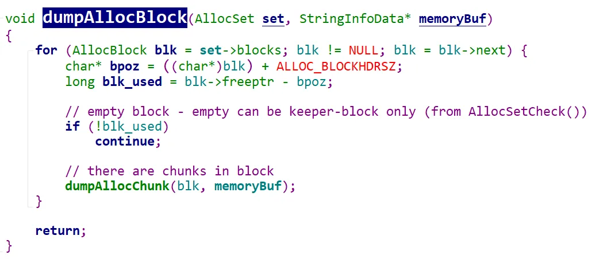
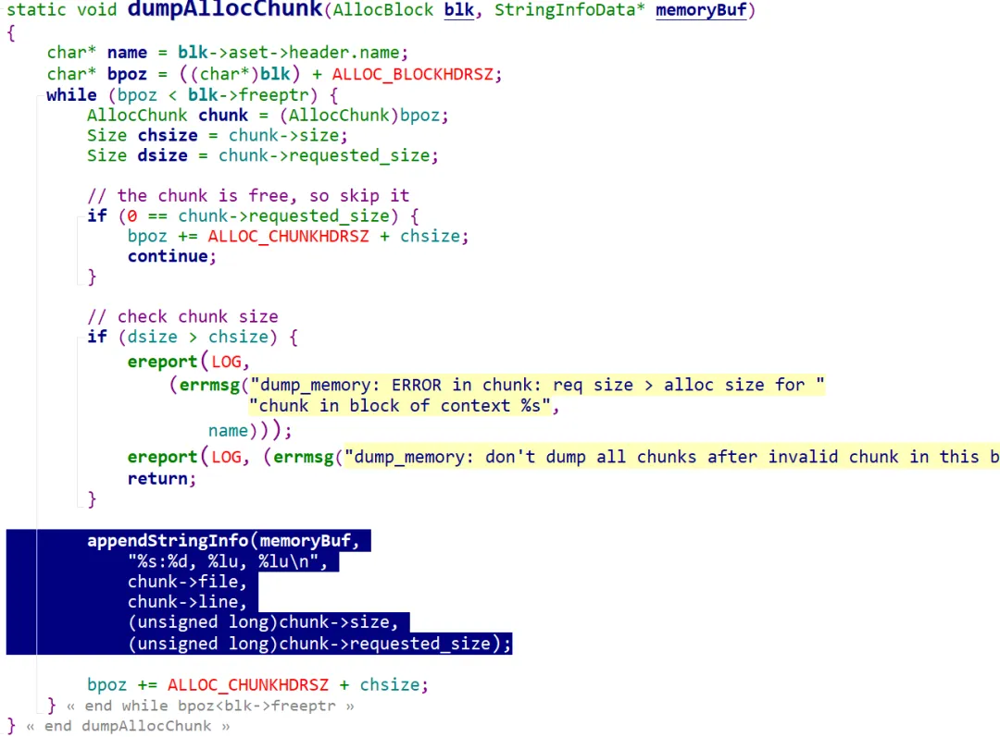

​     近日，我们线上系统遇到动态内存高的报警（通过查询视图gs_total_memory_detail 获取的监控数值），经过定位，发现是绑定变量在不应该使用的场景使用了，导致会话线程在缓存执行计划上消耗了大量的内存，也就是CachedPlan 内存上下文占用内存多（通过查询gs_session_memory_detail可以获得某个会话线程各个上下文占用的内存)。虽然该问题已经定位，但还是想对opengauss的内存知识以及问题定位有更多的了解，然后查找一些资料以及学习了一小段代码，在这里做一下笔记。

  通过查询下面的视图，获取一个会话的内存消耗情况
```
xcytest=# select * from  gs_session_memory_detail where sessid like '%140445449905920%' and contextname like 'CachedPlan';
           sessid           | sesstype | contextname | level |          parent           | totalsize | freesize | usedsize 
----------------------------+----------+-------------+-------+---------------------------+-----------+----------+----------
 1716794872.140445449905920 | postgres | CachedPlan  |     2 | SessionCacheMemoryContext |     15360 |     5760 |     9600
 1716794872.140445449905920 | postgres | CachedPlan  |     2 | SessionCacheMemoryContext |     15360 |     5760 |     9600
 1716794872.140445449905920 | postgres | CachedPlan  |     2 | SessionCacheMemoryContext |      7168 |      888 |     6280
```
​     除上述说到的两个视图外，还可以查询到更详细的内存分配信息，就是利用opengauss提供的context track 函数。 例如，想知道CachedPlan内存上下文在哪里被消耗的，可以使用select * from dbe_perf.track_memory_context('CachedPlan'); 命令进行查看， 执行完命令后，再查询dbe_perf.track_memory_context_detail 视图，就能看到详细信息，样式如下：
```
xcytest=#  select * from  dbe_perf.track_memory_context_detail();
 context_name |     file      | line | size 
--------------+---------------+------+------
 CachedPlan   | copyfuncs.cpp | 2351 |  168
 CachedPlan   | copyfuncs.cpp | 2262 |    6
 CachedPlan   | copyfuncs.cpp | 6382 |    8
 CachedPlan   | list.cpp      |  104 |   16
 CachedPlan   | plancache.cpp | 1301 |   88
 CachedPlan   | bitmapset.cpp |   94 |    8
 CachedPlan   | copyfuncs.cpp | 6371 |   32
```
当不需要track详细信息时，可以使用下面的语句进行关闭，关闭后再查询上述视图，视图将没有数据。
```
select * from  dbe_perf.track_memory_context('');
```
除上述方法可以track内存上下文外，还有pv_session_memctx_detail 函数，它的用法如下：

打印一个会话的内存使用情况
```
xcytest=# select * from pv_session_memctx_detail(140445646583552,'');
-[ RECORD 1 ]------------+--
pv_session_memctx_detail | t
```
打印某个会话的某个内存上下文的使用情况
select pv_session_memctx_detail(140444974577408,'OptimizerTopMemoryContext');

执行上述命令后，会在数据库的pg_log目录下生成一个memdump目录，生成如下文件
```
[omm@nd1 memdump]$ ls -lrt
total 36
-rw-------. 1 omm omm 6625 May 27 16:06 140445449905920_1716797214.log
-rw-------. 1 omm omm 7254 May 27 16:07 140445159192320_1716797266.log
-rw-------. 1 omm omm 6256 May 27 16:18 140445646583552_1716797900.log
-rw-------. 1 omm omm   27 May 27 16:36 SessionSelfMemoryContext_140444974577408_1716798975.log
-rw-------. 1 omm omm  225 May 27 16:37 OptimizerTopMemoryContext_140444974577408_1716799037.log
```
文件内容的样式如下：
```
[omm@nd1 memdump]$ cat  OptimizerTopMemoryContext_140444974577408_1716799191.log
variable.cpp:801, 32, 20
variable.cpp:459, 32, 24
variable.cpp:371, 32, 32
variable.cpp:961, 32, 24
variable.cpp:667, 32, 20
variable.cpp:600, 32, 20
variable.cpp:205, 32, 24
variable.cpp:865, 32, 24
variable.cpp:161, 64, 48
```
对文件里面的内容的含义非常模糊，没有找到对其解析的相关资料，于是自行解析。通过从函数pv_session_memctx_detail入手，找到函数DumpMemoryCtxOnBackend， 该函数会给master线程发送PROCSIG_MEMORYCONTEXT_DUMP 信号，master线程收到信号后，调用DumpMemoryContext函数，然后调用recursiveMemoryContextForDump 函数，最后调用dumpAllocBlock函数，该函数的代码如下：



上述代码，就是通过函数dumpAllocChunk逐个处理该内存上下文的所有的block，如果这个block没有被使用，则跳过。通过上述代码，我们可以更直观地了解到内存上下文的基本结构：它里面可以包含很多block, block里面又包含chunk.我们来看看dumpAllocChunk这个函数。



查看上面代码，可以知道memdump文件中的内容就是上面的代码输出的，可以知道文件中第一列表示chunk是由哪行代码申请的，第二列就是chunk的大小，第三列就是chunk的实际使用大小。通过阅读上述代码，可以更进一步直观地知道，一个block里面，可以包含很多chunk.