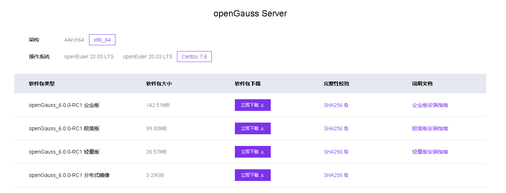

本文档环境：CentOS7.9 x86_64 4G1C40G python2.7.5 交互式初始化环境方式

# **openGauss介绍**

openGauss是一款开源关系型数据库管理系统，采用木兰宽松许可证v2发行。openGauss内核深度融合华为在数据库领域多年的经验，结合企业级场景需求，持续构建竞争力特性。

openGauss社区版本分为长期支持版本和创新版本：

- 长期支持版本 (LTS) ——规模上线使用，发布间隔周期为1年，提供3年社区支持。

- 社区创新版本 (Preview) ——联创测试使用，发布间隔周期为1年，提供6个月社区支持。

openGauss支持单机部署和单机HA部署两种部署方式。单机部署时，可在一个主机部署多个数据库实例，但为了数据安全，不建议用户这样部署。单机HA部署支持一台主机和最少一台备机，备机一共最多8台的配置方式。

**说明**： 通过openGauss提供的脚本安装时，只允许在单台物理机部署一个数据库系统。如果您需要在单台物理机部署多个数据库系统，建议您通过命令行安装，不需要通过openGauss提供的安装脚本执行安装。

# **openGauss 6.0介绍**

**openGauss 6.0.0-RC1 是社区最新发布的创新版本，版本生命周期为 0.5 年。**（创新版本命名：由原方案 XX.1.0 Preview (例：5.1.0 preview），调整为现方案 XX.0.0-RCx），本次发布包含 2 个数据库服务端安装版本：企业版、轻量版，用户可根据使用场景需要下载不同版本，并基于此进行场景化验证，提前发现问题并反馈社区，社区将在下个 LTS 版本发布前进行问题修复，openGauss 6.0.0 LTS 版本将在 2024 年 9 月 30 日进行发布。

openGauss 6.0.0-RC1 自 2023 年 9 月 30 日启动版本开发，历时 6 个月开发周期，凝聚社区 1232 名开发者，累计合入 PR 2794 个，与之前版本特性功能保持兼容，在内核能力、Datapod 三层资源池化架构、DataKit 数据全生命周期管理平台、生态兼容性等方面全面增强。

## **内核能力增强**

<br/>

### **企业级特性**

<br/>

存储过程增强：支持存储过程覆盖率测试并输出 html 报告，同时允许创建 procedure 时忽略依赖关系进行创建。 开箱最优：提供 gs_perfconfig 工具辅助对 openGauss 进行性能调整，基于环境信息与业务信息，自动调整操作系统以及数据库参数，达到开箱性能即最优。 其他能力增强：支持龙芯平台编译，支持中文日志；安装易用性提升，支持一站式交互安装，并解除对 root 用户的依赖。


### **内核四高能力**

<br/>

**高性能**


分区表性能：在多分区表场景（大于 3000 分区）下，TPCC 数据导入耗时下降 13%，TPCC 性能提升 30%；分区表数据操作（查询、插入、更新、删除等）耗时下降 50%。 主备复制性能：支持 UWAL 组件，利用 RDMA 的 CPU 卸载、内核 Bypass、零拷贝优势，由远程内存直接访问网卡，将 WAL 记录由单边操作传输至远端备库的持久化存储设备，加速主备 XLog 复制；基于 SCM 加速日志持久化，提供 append 语义，大 IO 后拆分后多并发写入，加速 IO 落盘。整体性能提升大于 20%。


**高可用**

支持异步备升主数据找回能力， 新增 gs_retrieve 工具实现对旧主未同步到异步备的数据通过逻辑解码的方式找回，满足异步备升主场景 RPO≈0。

**高智能**

新增 dataVec 向量数据库插件，作为为专有大模型的向量数据存储和检索的底座，支持向量数据的存储、 相似度计算，支持针对向量数据建立索引（IVFFLAT），加速查询。

**高安全**

在鲲鹏服务器上，通过 CPU 加解密指令实现对国密 SM4 算法加速，性能提升约 5%。


## **DataPod 三层资源池化架构持续创新**

<br/>

### **支持 SPQ 多机并行查询框架**

基于资源池化架构所有节点都共享集群内的资源，支持生成多机执行计划，并将计划分发到各节点执行，查询节点可汇聚各节点数据实现所有读节点并行查询，充分发挥集群的 OLAP 能力，使资源池化同时具备较强的 TP 和 AP 能力，满足资源池化（一主两备）场景下 TPC-H&TPC-DS 相比单节点 SMP 提升大于 2.6 倍。


### **新增 DMS 资源统计视图**
query_all_drc_info：支持收集 DMS 资源池中所有的页面信息和锁信息；get_instr_wait_event：支持收集 DMS 相关命令字的等待时延等信息；query_node_reform_info_from_dms：支持收集 DMS 中 reform 流程相关的状态信息。

### **DSS 功能增强**
DSS 支持 NoF/NoF+协议，支持该协议的 IOFence、文件读写、查询设备信息、适配 CM 和 OM 等能力，用于对接支持该协议的磁盘阵列，典型业务下相比采用 SCSI3 协议的 TPCC 性能提升 10%。 DSS 服务端支持创建线程池；DSS 支持黑匣子诊断，提高运维能力。

### **容灾能力增强**

集群内高可用：支持 XLog 按需回放，实时解析 XLog 构建页面多版本恢复链，在主机故障时备机快速对外提供服务，实现典型业务负载下 RTO<10s； 集群间高可用：容灾支持两种方式，基于 Dorado 同步复制实现主备双集群方案，适用于百公里级别的同城双中心容灾场景，支持 RPO=0，典型业务负载下 RTO<30s； 基于流复制的主备双集群方案，可灵活部署，适用于同城或异地容灾场景。

<br/>

## **DataKit 数据全生命周期管理平台能力增强**

<br/>


### **迁移能力**


- 兼容性评估：支持从 MySQL 源库、文件、业务进程中解析和采集 SQL 并输出兼容性报告，支持展示不兼容 SQL 的初始位置，便于快速定位业务不兼容点。对 Mybatis/iBatis ORM 框架评估，提取 SQL 正确率高于 99.5%。


- 前置检测：数据迁移增加前置检测机制，包括：三方件 kafka 服务可用性、磁盘空间、源端和目的端数据库可用性、连接用户权限、数据库参数、大小写参数、目的端数据库 B 兼容性模式等检测，支持迁移前调整内核参数。


- 增量迁移：增量迁移支持 JDBC 超时重连、流量控制、新增按表回放方式，可根据不同业务场景选择事务级并行回放和表级并行回放。


- 反向迁移：反向迁移支持 JDBC 超时重连、流量控制、自定义设置迁移结束后是否保留逻辑复制槽。


### **对象管理**

- 数据开发插件：支持查看/修改用户/角色；SQL 语句支持选中导出；新增对触发器、外部表、定时任务的操作；支持数据库断连后自动重连、配置自动断连时间。


### **智能运维**

- 实例监控插件：增加新指标；优化采集架构，支持二级指标采集，可采集多个实例的指标。
- 智能诊断插件：增加诊断经验，包括：索引推荐、SMP 并行查询、作业阻塞分析。
- 日志检索插件：增加 CM 日志采集，支持 lucene 语法搜索。
- 智能参数调优插件：结合机器学习方法，有效利用当前负载信息和数据库历史性能表现，推荐一组性能最优的参数。具体包括：支持负载特征分析，从用户负载中抽取出负载特征，多角度精准刻画负载；支持负载生成，根据配置项，生成指定规则的负载 SQL；支持离线调优、在线调优和在线微调，通过多种模式给出最优参数。

### **安装部署**

优化实例监控代理/服务端安装、日志检索代理/服务端安装，支持 SQL 诊断代理安装路径可选；支持资源池化双集群部署，支持安装、切换和状态查询操作。

<br/>

## **生态兼容性增强**

<br/>

### **MySQL 兼容**


MySQL 语法兼容性增强，完善系统函数、关键字、自定义变量、别名、JDBC 等驱动数据类型表现等兼容；MySQL 协议兼容增强，新增 dolphin_hot_standby GUC 参数，控制是否可以使用 MySQL 协议兼容端口连接备机，实现用户应用近似零修改迁移。


## **安装前准备**

<br/>

### **软硬件要求**

仅作参考，自测环境低一些也可以，本文档是CentOS7.9 x86_64 4G1C40G的配置

**硬件环境**

[表1 硬件环境要求](https://docs-opengauss.osinfra.cn/zh/docs/5.0.0/docs/GettingStarted/%E5%87%86%E5%A4%87%E8%BD%AF%E7%A1%AC%E4%BB%B6%E5%AE%89%E8%A3%85%E7%8E%AF%E5%A2%83.html#zh-cn_topic_0283136474_zh-cn_topic_0241802565_zh-cn_topic_0085434629_zh-cn_topic_0059782022_t62cd0eed17004265b1b8ad98f302a4bc) 列出了openGauss服务器应具备的最低硬件要求。在实际产品中，硬件配置的规划需考虑数据规模及所期望的数据库响应速度。请根据实际情况进行规划。

表 1 硬件环境要求

| 项目    | 配置描述                |
| ----   | ---------------------- |
| 内存                            | 功能调试建议32GB以上。<br/>性能测试和商业部署时，单实例部署建议128GB以上。<br/>复杂的查询对内存的需求量比较高，在高并发场景下，可能出现内存不足。此时建议使用大内存的机器，或使用负载管理限制系统的并发。
|CPU      | 性能测试和商业部署时，建议1×16核 2.0GHz。<br/>CPU超线程和非超线程两种模式都支持。 <br/>说明：<br/>个人开发者最低配置2核4G, 推荐配置4核8G。目前，openGauss仅支持ARM服务器和基于X86_64通用PC服务器的CPU。
|硬盘     | 用于安装openGauss的硬盘需最少满足如下要求：<br/> -至少1GB用于安装openGauss的应用程序。<br/>- 每个主机需大约300MB用于元数据存储。<br/> - 预留70%以上的磁盘剩余空间用于数据存储。<br/>建议系统盘配置为Raid1，数据盘配置为Raid5，且规划4组Raid5数据盘用于安装openGauss。有关Raid的配置方法在本手册中不做介绍。请参考硬件厂家的手册或互联网上的方法进行配置，其中Disk Cache Policy一项需要设置为Disabled，否则机器异常掉电后有数据丢失的风险。<br/>openGauss支持使用SSD盘作为数据库的主存储设备，支持SAS接口和NVME协议的SSD盘，以RAID的方式部署使用。
| 网络要求 | 300兆以上以太网。<br/>建议网卡设置为双网卡冗余bond。有关网卡冗余bond的配置方法在本手册中不做介绍。请参考硬件厂商的手册或互联网上的方法进行配置。<br/>该文档只采用了1块网卡。   
|
           

           
**软件环境**

表 2 软件环境要求

<br/>

| 软件类型 | 配置描述|
| ----    | ------------ |
| Linux操作系统| **ARM**：<br/>openEuler 20.3LTS（推荐采用此操作系统）<br/>麒麟V10<br/>Asianux 7.5<br/>**X86：**<br/>openEuler 20.3LTS<br/>CentOS 7.6<br/>Asianux 7.6说明：当前安装包只能在英文操作系统上安装使用。
|Linux文件系统| 剩余inode个数 > 15亿（推荐）|
|工具|bzip2|
|Python| openEuler：支持Python 3.7.X, Python 3.9.X<br/>CentOS：支持Python 3.6.X<br/>麒麟：支持Python 3.7.X<br/>Asianux：支持Python 3.6.X说明：python需要通过--enable-shared方式编译。

若用户修改过系统python版本，则在安装数据库之前，还需手动安装下列python模块（pip安装即可）。


|psutil|netifaces|cffi|pycparser|cryptography|pynacl|bcrypt|paramiko|
| ---- | ---- |---- |---- |---- |---- |---- |---- |

并且在预安装时，需要加上--unused-third-party选项。


**软件依赖要求**

openGauss的软件依赖要求如[表3 软件依赖要求所示。](https://docs-opengauss.osinfra.cn/zh/docs/5.0.0/docs/GettingStarted/%E5%87%86%E5%A4%87%E8%BD%AF%E7%A1%AC%E4%BB%B6%E5%AE%89%E8%A3%85%E7%8E%AF%E5%A2%83.html#zh-cn_topic_0283136474_table1212531681911)

建议使用上述操作系统安装光盘或者源中，下列依赖软件的默认安装包，若不存在下列软件，可参看软件对应的建议版本。

表 3 软件依赖要求

|所需软件| 建议版本|
| ----  | --------|
|libaio-devel| 建议版本：0.3.109-13|
|flex       |要求版本：2.5.31 以上  |
|bison      |建议版本：2.7-4       |
|ncurses-devel| 建议版本：5.9-13.20130511|
|glibc-devel|建议版本：2.17-111|
|patch|建议版本：2.7.1-10|
|redhat-lsb-core|建议版本：4.1|
|readline-devel|建议版本：7.0-13
|libnsl（openEuler+x86环境中）|建议版本 ：2.28-36
|

**系统参数配置**

**操作系统主机命名(可选)**

如果采用默认主机名，可忽略该步骤，默认的主机名localhost.localdomain，xml文件中的主机名也需要改成localhost.localdomain


```
hostnamectl set-hostname opendb01
```

**/etc/hosts配置(可选)**

如果采用默认主机名，可忽略该步骤，预安装会自动追加127.0.0.1 localhost #Gauss OM IP Hosts Mapping

```
cp /etc/hosts /etc/hosts.bak
cat >>/etc/hosts<<EOF
192.168.40.110      opendb01  
EOF
```

**limits.conf**


不用配置该文件，会自动追加如下内容：

```
cp /etc/security/limits.conf /etc/security/limits.conf_bak_`date +%F`
cat >> /etc/security/limits.conf << "EOF"
#add by openGauss
root       soft    as  unlimited
omm       soft    as  unlimited
root       hard    as  unlimited
omm       hard    as  unlimited
root       soft    nproc  unlimited
omm       soft    nproc  unlimited
root       hard    nproc  unlimited
omm       hard    nproc  unlimited
EOF
```

**关闭透明页**

```
echo never > /sys/kernel/mm/transparent_hugepage/enabled
echo never > /sys/kernel/mm/transparent_hugepage/defrag

--加入开机启动
echo '
echo never > /sys/kernel/mm/transparent_hugepage/enabled
echo never > /sys/kernel/mm/transparent_hugepage/defrag' >>/etc/rc.local
chmod +x /etc/rc.local
```

**防火墙配置**

```
systemctl stop firewalld.service
systemctl disable firewalld.service 
```
如果启用防火墙需进行如下配置：

如果数据库端口和ssh端口不是15400和22，需视情况更改
```
firewall-cmd --zone=public --add-port=15400/tcp --permanent
firewall-cmd --zone=public --add-port=22/tcp --permanent
firewall-cmd --reload
```
 **selinux配置**
 
 ```
 sed -i "s/SELINUX=enforcing/SELINUX=disabled/g" /etc/selinux/config
setenforce 0 
```

**关闭 numa和禁用透明大页**

```
sed -i "s/quiet/quiet numa=off transparent_hugepage=never/g"  /etc/default/grub 
grub2-mkconfig -o /etc/grub2.cfg
```

**设置字符集参数**

```
echo "export LANG=en_US.UTF-8"  >> /etc/profile
source /etc/profile
```

**设置时区和时间**


如果服务器时间和当前时间相差8小时或者12小时，需要查看时区，分析是否决定更改。

**非可视化更改步骤**

```
--查看当前时间
[root@opendb01 ~]# date
Fri Apr 19 14:15:52 CST 2024

--查看当前时区
[root@localhost ~]# timedatectl
      Local time: Fri 2024-04-19 14:16:08 CST
  Universal time: Fri 2024-04-19 06:16:08 UTC
        RTC time: Fri 2024-04-19 06:16:07
       Time zone: Asia/Shanghai (CST, +0800)
     NTP enabled: n/a
NTP synchronized: no
 RTC in local TZ: no
      DST active: n/a

--更改时区  执行tzselect命令

root@HKSZF-ZW-172-19-146-176:/topsoft# tzselect
Please identify a location so that time zone rules can be set correctly.
Please select a continent, ocean, "coord", or "TZ".
 1) Africa
 2) Americas
 3) Antarctica
 4) Asia
 5) Atlantic Ocean
 6) Australia
 7) Europe
 8) Indian Ocean
 9) Pacific Ocean
10) coord - I want to use geographical coordinates.
11) TZ - I want to specify the time zone using the Posix TZ format.

--找到Asia，输入4，回车
Please select a country whose clocks agree with yours.
 1) Afghanistan           18) Israel                35) Palestine
 2) Armenia               19) Japan                 36) Philippines
 3) Azerbaijan            20) Jordan                37) Qatar
 4) Bahrain               21) Kazakhstan            38) Russia
 5) Bangladesh            22) Korea (North)         39) Saudi Arabia
 6) Bhutan                23) Korea (South)         40) Singapore
 7) Brunei                24) Kuwait                41) Sri Lanka
 8) Cambodia              25) Kyrgyzstan            42) Syria
 9) China                 26) Laos                  43) Taiwan
10) Cyprus                27) Lebanon               44) Tajikistan
11) East Timor            28) Macau                 45) Thailand
12) Georgia               29) Malaysia              46) Turkmenistan
13) Hong Kong             30) Mongolia              47) United Arab Emirates
14) India                 31) Myanmar (Burma)       48) Uzbekistan
15) Indonesia             32) Nepal                 49) Vietnam
16) Iran                  33) Oman                  50) Yemen
17) Iraq                  34) Pakistan

--找到china,输入9，回车
Please select one of the following time zone regions.
1) Beijing Time
2) Xinjiang Time

--找到北京时间，输入1，回车
Please select one of the following time zone regions.
1) Beijing Time
2) Xinjiang Time

--选择yes，输入1，回车
The following information has been given:

        China
        Beijing Time

Therefore TZ='Asia/Shanghai' will be used.
Selected time is now:   Wed Jan 24 21:40:32 CST 2024.
Universal Time is now:  Wed Jan 24 13:40:32 UTC 2024.
Is the above information OK?
1) Yes
2) No

--更新设置
ln -sf /usr/share/zoneinfo/Asia/Shanghai /etc/localtime

--查看是否更改成功
root@HKSZF-ZW-172-19-146-176:/topsoft# date
Fri Apr 19 14:15:52 CST 2024

[root@localhost ~]# timedatectl
      Local time: Fri 2024-04-19 14:16:08 CST
  Universal time: Fri 2024-04-19 06:16:08 UTC
        RTC time: Fri 2024-04-19 06:16:07
       Time zone: Asia/Shanghai (CST, +0800)
     NTP enabled: n/a
NTP synchronized: no
 RTC in local TZ: no
      DST active: n/a

```
**可视化更改步骤**

```
--查看当前时间
[root@opendb01 ~]# date
Fri Apr 19 14:43:11 CST 2024

--查看当前时区
[root@localhost ~]# timedatectl
      Local time: Fri 2024-04-19 14:43:31 CST
  Universal time: Fri 2024-04-19 06:43:31 UTC
        RTC time: Fri 2024-04-19 06:43:30
       Time zone: Asia/Shanghai (CST, +0800)
```

在可视化界面中查看

选择进入 Applications -> System Tools -> Settings -> Details -> Date & Time


调整时间

点击“Date & Time”行中任意位置，弹出弹窗，调整时间为当前北京时间，再关闭弹窗，即保存。


再次使用命令查看，本地时间已显示为北京时间


```
[root@localhost ~]# timedatectl
      Local time: Fri 2024-04-19 14:43:31 CST
  Universal time: Fri 2024-04-19 06:43:31 UTC
        RTC time: Fri 2024-04-19 06:43:30
       Time zone: Asia/Shanghai (CST, +0800)
     NTP enabled: n/a
NTP synchronized: no
 RTC in local TZ: no
      DST active: n/a

```

**关闭swap交换内存(可选)**


关闭swap交换内存是为了保障数据库的访问性能，避免把数据库的缓冲区内存淘汰到磁盘上。 如果服务器内存比较小，内存过载时，可打开swap交换内存保障正常运行。

```
swapoff -a
```

**关闭RemoveIPC**

在各数据库节点上，关闭RemoveIPC。CentOS操作系统默认为关闭，可以跳过该步骤。

1. 修改/etc/systemd/logind.conf文件中的“RemoveIPC”值为“no”。a. 使用VIM打开logind.conf文件。

```
--更改后的/etc/systemd/logind.conf
vim  /etc/systemd/logind.conf
RemoveIPC=no

--更改后的
vim /usr/lib/systemd/system/systemd-logind.service
RemoveIPC=no

--重新加载配置参数
systemctl daemon-reload
systemctl restart systemd-logind

--检查修改是否生效
loginctl show-session | grep RemoveIPC
systemctl show systemd-logind | grep RemoveIPC
```

**关闭HISTORY记录(可选)**


为避免指令历史记录安全隐患，需关闭各主机的history指令。

```
更改/etc/profile中HISTSIZE值
vim /etc/profile
HISTSIZE默认值为1000 更改为 HISTSIZE=0

--生效
source /etc/profile
```

**配置yum源**

将操作系统镜像上传至/opt目录下

```
mount /opt/*.iso /mnt/
cat << EOF >> /etc/fstab
/dev/sr0    /mnt        iso9660 loop            0 0
EOF

mkdir -p /etc/yum.repos.d/bak
mv /etc/yum.repos.d/*.repo /etc/yum.repos.d/bak
cat >> /etc/yum.repos.d/os.repo <<"EOF"
[OS1]
name=OS
baseurl=file:///mnt
enabled=1
gpgcheck=0
EOF
```

**安装依赖包**

```
yum install -y bzip2 libaio-devel flex bison ncurses-devel glibc-devel \
patch redhat-lsb-core readline-devel 

注意：openEuler+x86环境中  yum install -y libnsl  kylinV10中无redhat-lsb-core，如果是Centos
操作系统采用如下步骤：


--kylinV10 操作系统下安装依赖包如下：
yum install -y bzip2 libaio-devel flex bison ncurses-devel glibc-devel \
patch  readline-devel 
```

**python版本升级**


python版本如果是3.6.x，可跳过该步骤

python版本2.7.5需升级至3.6.x版本，centos7 用python3.6 ,欧拉20用python3.7，其实不需要去编译安装python，直接用操作系统自带的包管理器yum install python3或dnf install python3,装上去就是对应的版本了。切不要编译安装，不然跳坑，预安装时报错。

```
--查看python版本
[root@opendb01 ~]# python --version
Python 2.7.5

[root@opendb01 ~]# python3 --version
python3命令找不到

--采用yum方式安装操作系统自带的包管理器中的python3
yum install python3

--再次查看python版本
[root@opendb01 ~]# python --version
Python 2.7.5

[root@opendb01 ~]# python3 --version
Python 3.6.8
```

**创建用户及用户组(可选)**


可以创建也可以不创建，自行操作
```
--创建用户组dbgrp
groupadd dbgrp

--创建用户组dbgroup下的普通用户omm，并设置密码为Gauss_234 
useradd -g dbgrp omm
passwd omm
```

为了实现安装过程中安装帐户权限最小化，及安装后openGauss的系统运行安全性，安装脚本在安装过程中会自动按照用户指定内容创建安装用户，并将此用户作为后续运行和维护openGauss的管理员帐户。

|用户/组名|所属类型|规划建议|
|--------|--------|-------|
|dbgrp   |操作系统|建议规划单独的用户组，例如dbgrp。<br/>[初始化安装环境](https://docs-opengauss.osinfra.cn/zh/docs/5.0.0/docs/InstallationGuide/%E5%88%9D%E5%A7%8B%E5%8C%96%E5%AE%89%E8%A3%85%E7%8E%AF%E5%A2%83.html)时，由-G参数所指定的安装用户所属的用户组。该用户组如果不存在，则会自动创建，也可提前创建好用户组。在执行gs_preinstall脚本时会检查权限。gs_preinstall脚本会自动赋予此组中的用户对安装目录、数据目录的访问和执行权限。<br/>创建dbgrp用户组命令：<br/>groupadd dbgrp|
|omm|操作系统|建议规划用户用于运行和维护openGauss，例如omm。<br/>[初始化安装环境](https://docs-opengauss.osinfra.cn/zh/docs/5.0.0/docs/InstallationGuide/%E5%88%9D%E5%A7%8B%E5%8C%96%E5%AE%89%E8%A3%85%E7%8E%AF%E5%A2%83.html)时，由-U参数所指定和自动创建的操作系统用户，如果已经存在该用户，请清理该用户或更换初始化用户。从安全性考虑，对此用户的所属组规划如下：<br/>所属组：dbgrp|
|

在安装openGauss过程中root用户运行 openGauss-6.0.0-RC1-CentOS-64bit-om.tar.gz中scripts目录中的“gs_preinstall”时，会创建与安装用户同名的数据库用户，即数据库用户omm。此用户具备数据库的最高操作权限，此用户初始密码由用户指定。


**目录规划**

```
--创建存放安装包的目录
mkdir -p /topsoft/soft/openGauss
chmod 777 -R /topsoft/soft

--创建目录  目录会自动创建，如果创建安装种会报错
mkdir -p /topsoft/huawei/install/app  #数据库安装目录
mkdir -p /topsoft/huawei/log/omm  #日志目录
mkdir -p /topsoft/huawei/tmp  #临时文件目录
mkdir -p /topsoft/huawei/install/om  #数据库工具目录
mkdir -p /topsoft/huawei/corefile  #数据库core文件目录
```

**下载并上传安装包**

登录openGauss开源社区<https://opengauss.org/zh/download/>，选择对应平台的企业版安装包。




上传至/topsoft/soft/openGauss目录，安装包“openGauss-6.0.0-RC1-CentOS-64bit-all.tar.gz”和配置文件“cluster_config.xml”都上传至上一步所创建的目录中。


**配置单节点XML文件**

安装openGauss前需要创建XML文件。XML文件包含部署openGauss的服务器信息、安装路径、IP地址以及端口号等。用于告知openGauss如何部署。用户需根据不同场景配置对应的XML文件。

<br/>

关于如何配置XML文件，详细请参见创建[XML配置文件](https://docs-opengauss.osinfra.cn/zh/docs/5.0.0/docs/InstallationGuide/%E5%88%9B%E5%BB%BAXML%E9%85%8D%E7%BD%AE%E6%96%87%E4%BB%B6.html)。

<br/>

将cluster_config.xml上传至/topsoft/soft/openGauss目录，安装包“openGauss-6.0.0-RC1-CentOS-64bit-all.tar.gz”和配置文件“cluster_config.xml”都上传至上一步所创建的目录中。

<br/>

为确保成功安装，检查hostname与/etc/hostname是否一致。预安装过程中，会对hostname进行检查。

<br/>

默认端口5432，若待用自定义端口，更改xml文件中的端口号

<br/>

**官方XML文件模板**

<br/>

```
cat cluster_config.xml
<?xml version="1.0" encoding="UTF-8"?>
<ROOT>
    <!-- openGauss整体信息 -->
    <CLUSTER>
        <!-- 数据库名称 -->
        <PARAM name="clusterName" value="dbCluster" />
        <!-- 数据库节点名称(hostname) -->
        <PARAM name="nodeNames" value="node1_hostname" />
        <!-- 数据库安装目录-->
        <PARAM name="gaussdbAppPath" value="/opt/huawei/install/app" />
        <!-- 日志目录-->
        <PARAM name="gaussdbLogPath" value="/var/log/omm" />
        <!-- 临时文件目录-->
        <PARAM name="tmpMppdbPath" value="/opt/huawei/tmp" />
        <!-- 数据库工具目录-->
        <PARAM name="gaussdbToolPath" value="/opt/huawei/install/om" />
        <!-- 数据库core文件目录-->
        <PARAM name="corePath" value="/opt/huawei/corefile" />
        <!-- 节点IP，与数据库节点名称列表一一对应 -->
        <PARAM name="backIp1s" value="192.168.0.1"/> 
    </CLUSTER>
    <!-- 每台服务器上的节点部署信息 -->
    <DEVICELIST>
        <!-- 节点1上的部署信息 -->
        <DEVICE sn="node1_hostname">
            <!-- 节点1的主机名称 -->
            <PARAM name="name" value="node1_hostname"/>
            <!-- 节点1所在的AZ及AZ优先级 -->
            <PARAM name="azName" value="AZ1"/>
            <PARAM name="azPriority" value="1"/>
            <!-- 节点1的IP，如果服务器只有一个网卡可用，将backIP1和sshIP1配置成同一个IP -->
            <PARAM name="backIp1" value="192.168.0.1"/>
            <PARAM name="sshIp1" value="192.168.0.1"/>
               
	    <!--dbnode-->
	    <PARAM name="dataNum" value="1"/>
	    <PARAM name="dataPortBase" value="15400"/>
	    <PARAM name="dataNode1" value="/opt/huawei/install/data/dn"/>
            <PARAM name="dataNode1_syncNum" value="0"/>
        </DEVICE>
    </DEVICELIST>
</ROOT>
```

**根据官方模板更改后的xml文件**

```
cat cluster_config.xml
<?xml version="1.0" encoding="UTF-8"?>
<ROOT>
    <!-- openGauss整体信息 -->
    <CLUSTER>
        <!-- 数据库名称 -->
        <PARAM name="clusterName" value="dbCluster" />
        <!-- 数据库节点名称(hostname) -->
        <PARAM name="nodeNames" value="opendb01" />
        <!-- 数据库安装目录-->
        <PARAM name="gaussdbAppPath" value="/topsoft/huawei/install/app" />
        <!-- 日志目录-->
        <PARAM name="gaussdbLogPath" value="/topsoft/huawei/log/omm" />
        <!-- 临时文件目录-->
        <PARAM name="tmpMppdbPath" value="/topsoft/huawei/tmp" />
        <!-- 数据库工具目录-->
        <PARAM name="gaussdbToolPath" value="/topsoft/huawei/install/om" />
        <!-- 数据库core文件目录-->
        <PARAM name="corePath" value="/topsoft/huawei/corefile" />
        <!-- 节点IP，与数据库节点名称列表一一对应 -->
        <PARAM name="backIp1s" value="192.168.40.110"/> 
    </CLUSTER>
    <!-- 每台服务器上的节点部署信息 -->
    <DEVICELIST>
        <!-- 节点1上的部署信息 -->
        <DEVICE sn="opendb01">
            <!-- 节点1的主机名称 -->
            <PARAM name="name" value="opendb01"/>
            <!-- 节点1所在的AZ及AZ优先级 -->
            <PARAM name="azName" value="AZ1"/>
            <PARAM name="azPriority" value="1"/>
            <!-- 节点1的IP，如果服务器只有一个网卡可用，将backIP1和sshIP1配置成同一个IP -->
            <PARAM name="backIp1" value="192.168.40.110"/>
            <PARAM name="sshIp1" value="192.168.40.110"/>
               
	    <!--dbnode-->
	    <PARAM name="dataNum" value="1"/>
	    <PARAM name="dataPortBase" value="15400"/>
	    <PARAM name="dataNode1" value="/topsoft/huawei/install/data/dn"/>
            <PARAM name="dataNode1_syncNum" value="0"/>
        </DEVICE>
    </DEVICELIST>
</ROOT>
```

**解压安装包**

<br/>


对于个人开发者或非企业级环境，下载极简安装包（不安装OM等组件）即可。本文档采用的是企业版安装，因此安装OM等组件

注意：安装包“openGauss-6.0.0-RC1-CentOS-64bit-all.tar.gz”和配置文件“cluster_config.xml”需在同一目录中，本文档是/topsoft/soft/openGauss目录。

```
--进入安装包所在目录
[root@opendb01 ~]# cd /topsoft/soft/openGauss/
[root@localhost openGauss]# ls -l
total 130712
-rw-r--r--. 1 root root      1905 Jan 27 08:31 cluster_config.xml
-rw-r--r--. 1 root root 133842584 Jan 27 08:30 openGauss-6.0.0-RC1-CentOS-64bit-all.tar.gz

--解压openGauss-6.0.0-RC1-CentOS-64bit-all.tar.gz安装包
tar -xvf openGauss-6.0.0-RC1-CentOS-64bit-all.tar.gz 

--查看解压后的文件
[root@localhost ~]# cd /topsoft/soft/openGauss/
[root@localhost openGauss]# ls -lS
total 293248
-rw-r--r--. 1 root root 149449208 Apr 19 15:02 openGauss-6.0.0-RC1-CentOS-64bit-all.tar.gz
-rw-r--r--. 1 root root 104672194 Mar 31 12:16 openGauss-6.0.0-RC1-CentOS-64bit.tar.bz2
-rw-r--r--. 1 root root  23122340 Mar 31 12:15 openGauss-6.0.0-RC1-CentOS-64bit-om.tar.gz
-rw-r--r--. 1 root root  22466710 Mar 31 12:16 openGauss-6.0.0-RC1-CentOS-64bit-cm.tar.gz
-rw-------. 1 root root    541779 Mar 31 12:14 upgrade_sql.tar.gz
-rw-r--r--. 1 root root      1882 Apr 19 15:01 cluster_config.xml
-rw-r--r--. 1 root root       109 Mar 31 12:16 openGauss-6.0.0-RC1-CentOS-64bit-cm.sha256
-rw-r--r--. 1 root root        65 Mar 31 12:15 openGauss-6.0.0-RC1-CentOS-64bit-om.sha256
-rw-r--r--. 1 root root        65 Mar 31 12:16 openGauss-6.0.0-RC1-CentOS-64bit.sha256
-rw-------. 1 root root        65 Mar 31 12:14 upgrade_sql.sha256


参数说明：
-S ：按文件类型排序

--继续解压openGauss-6.0.0-RC1-CentOS-64bit-om.tar.gz  数据库工具包 企业版安装需要解压该包极简版不需要
tar -xvf openGauss-6.0.0-RC1-CentOS-64bit-om.tar.gz

--查看解压后的文件   script目录中生成gs_preinstall等各种OM工具脚本
-total 293260
-rw-r--r--.  1 root root 149449208 Apr 19 15:02 openGauss-6.0.0-RC1-CentOS-64bit-all.tar.gz
-rw-r--r--.  1 root root 104672194 Mar 31 12:16 openGauss-6.0.0-RC1-CentOS-64bit.tar.bz2
-rw-r--r--.  1 root root  23122340 Mar 31 12:15 openGauss-6.0.0-RC1-CentOS-64bit-om.tar.gz
-rw-r--r--.  1 root root  22466710 Mar 31 12:16 openGauss-6.0.0-RC1-CentOS-64bit-cm.tar.gz
-rw-------.  1 root root    541779 Mar 31 12:14 upgrade_sql.tar.gz
drwxr-xr-x. 19 root root      4096 Mar 31 12:15 lib
drwxr-xr-x. 11 root root      4096 Mar 31 12:15 script
-rw-r--r--.  1 root root      1882 Apr 19 15:01 cluster_config.xml
-rw-r--r--.  1 root root       109 Mar 31 12:16 openGauss-6.0.0-RC1-CentOS-64bit-cm.sha256
-rw-r--r--.  1 root root        65 Mar 31 12:15 openGauss-6.0.0-RC1-CentOS-64bit-om.sha256
-rw-r--r--.  1 root root        65 Mar 31 12:16 openGauss-6.0.0-RC1-CentOS-64bit.sha256
-rw-------.  1 root root        65 Mar 31 12:14 upgrade_sql.sha256
-rw-r--r--.  1 root root        36 Mar 31 12:15 version.cfg

```

- 在执行前置脚本gs_preinstall时，需要规划好openGauss配置文件路径、安装包存放路径、程序安装目录、实例数据目录，后续普通用户使用过程中不能再更改这些路径。

- 运行前置脚本gs_preinstall准备安装环境时，脚本内部会自动将openGauss配置文件、解压后的安装包同步拷贝到其余服务器的相同目录下。

- 在执行前置脚本或者互信前，请检查/etc/profile文件中是否包含错误输出信息，如果存在错误输出，需手动处理。

**使用gs_preinstall初始化安装环境**

安装环境的初始化包含上传安装包和XML文件(二者需在同一目录)、解压安装包、使用gs_preinstall准备好安装环境。

分2种场景初始化，自行选择。


**准备安装用户及环境**

创建完openGauss配置文件后，在执行安装前，为了后续能以最小权限进行安装及openGauss管理操作，保证系统安全性，需要运行安装前置脚本gs_preinstall准备好安装用户及环境。在执行前置脚本gs_preinstall时，需要规划好openGauss配置文件路径、安装包存放路径、程序安装目录、实例数据目录，后续普通用户使用过程中不能再更改这些路径。

安装前置脚本gs_preinstall可以协助用户自动完成如下的安装环境准备工作：

- 自动设置Linux内核参数以达到提高服务器负载能力的目的。这些参数直接影响数据库系统的运行状态，请仅在确认必要时调整。openGauss所设置的Linux内核参数取值请参见配置操作系统参数。

- 脚本内部会自动将openGauss配置文件、安装包拷贝到openGauss主机的相同目录下。

- openGauss安装用户、用户组不存在时，自动创建安装用户以及用户组。

- 读取openGauss配置文件中的目录信息并创建，将目录权限授予安装用户。

- 只能使用root用户执行gs_preinstall命令

- 在执行前置脚本或者互信前，请检查/etc/profile文件中是否包含错误输出信息，如果存在错误输出，需手动处理。

注意：如果是openEuler（openEuler 20.03）的操作系统，执行如下命令打开performance.sh文件，用#注释sysctl -w vm.min_free_kbytes=112640 &> /dev/null，键入“ESC”键进入指令模式，执行**:wq**保存并退出修改。

```
vi /etc/profile.d/performance.sh
```

**场景1：采用交互模式执行前置**

```
场景1：采用交互模式执行前置
```

这里设置：omm用户密码omm

预安装脚本执行的详细过程如下：

```
[root@localhost script]# ./gs_preinstall -U omm -G dbgrp -X /topsoft/soft/openGauss/cluster_config.xml
Parsing the configuration file.
Successfully parsed the configuration file.
Installing the tools on the local node.
Successfully installed the tools on the local node.
Setting host ip env
Successfully set host ip env.
Are you sure you want to create the user[omm] (yes/no)?
Please enter password for cluster user.
Password:
Please enter password for cluster user again.
Password:
Generate cluster user password files successfully.

Successfully created [omm] user on all nodes.
Preparing SSH service.
Successfully prepared SSH service.
Checking OS software.
Successfully check os software.
Checking OS version.
Successfully checked OS version.
Creating cluster's path.
Successfully created cluster's path.
Set and check OS parameter.
Setting OS parameters.
Successfully set OS parameters.
Warning: Installation environment contains some warning messages.
Please get more details by "/topsoft/soft/openGauss/script/gs_checkos -i A -h opendb01 --detail".
Set and check OS parameter completed.
Preparing CRON service.
Successfully prepared CRON service.
Setting user environmental variables.
Successfully set user environmental variables.
Setting the dynamic link library.
Successfully set the dynamic link library.
Setting Core file
Successfully set core path.
Setting pssh path
Successfully set pssh path.
Setting Cgroup.
Successfully set Cgroup.
Set ARM Optimization.
No need to set ARM Optimization.
Fixing server package owner.
Setting finish flag.
Successfully set finish flag.
Preinstallation succeeded.
```

**问题处理**


**python3: No such file or directory**

```
--问题描述
采用交互模式执行前置时报错/usr/bin/env: python3: No such file or directory
[root@opendb01 script]# ./gs_preinstall -U omm -G dbgrp -X /opt/software/openGauss/cluster_config.xml
/usr/bin/env: python3: No such file or directory

--解决办法
采用上面办法进行python版本升级
--查看python版本
[root@opendb01 ~]# python --version
Python 2.7.5

[root@opendb01 ~]# python3 --version
python3命令找不到

--采用yum方式安装操作系统自带的包管理器中的python3
yum install python3

--再次查看python版本
[root@opendb01 ~]# python --version
Python 2.7.5

[root@opendb01 ~]# python3 --version
Python 3.6.8
```

**[GAUSS-52400] : Installation environment does not meet the desired result**


**执行安装**

使用gs_install安装openGauss。安装脚本gs_install必须以前置脚本中指定的omm执行，否则，脚本执行会报错。

/topsoft/soft/openGauss/cluster_config.xml为openGauss配置文件的路径。在执行过程中，用户需根据提示输入数据库的密码，密码具有一定的复杂度，为保证用户正常使用该数据库，请记住输入的数据库密码。这里设置为Topnet@123

设置的密码要符合复杂度要求：

- 最少包含8个字符，最多包含16个字符。

- 不能和用户名、当前密码（ALTER）、或当前密码反序相同。

- 至少包含大写字母（A-Z）、小写字母（a-z）、数字、非字母数字字符（限定为~!@#$%^&*()-_=+\|[{}];:,<.>/?）四类字符中的三类字符。

注意事项：

- openGauss支持字符集的多种写法：gbk/GBK、UTF-8/UTF8/utf8/utf-8和Latine1/latine1。

- 安装时若不指定字符集，默认字符集为SQL_ASCII，为简化和统一区域loacle默认设置为C，若想指定其他字符集和区域，请在安装时使用参数gsinit-parameter="–locale=LOCALE"来指定，LOCALE为新数据库设置缺省的区域。

- 默认端口5432

```
--赋予配置文件777的权限，因为安装脚本gs_install必须以前置脚本中指定的omm执行
chmod 777 /topsoft/soft/openGauss/cluster_config.xml
chmod 777 /topsoft/soft

--切换用户  omm为前置脚本gs_preinstall中-U参数指定的用户
su - omm

--查看配置文件/etc/profile中的语言参数
[omm@opendb01 dn_6001]$ cat /etc/profile | grep LANG
export LANG=en_US.UTF-8

--查看系统支持UTF-8编码的区域
 locale -a|grep utf8

--执行安装脚本
gs_install -X /topsoft/soft/openGauss/cluster_config.xml --gsinit-parameter="--locale=en_US.utf8"

```

安装过程中会生成ssl证书，证书存放路径为{gaussdbAppPath}/share/sslcert/om，其中{gaussdbAppPath}为openGauss配置文件中指定的程序安装目录。

```
[omm@opendb01 om]$ cd /topsoft/huawei/install/app/share/sslcert/om
[omm@opendb01 om]$ ls -l
total 64
-rw-------. 1 omm dbgrp  4399 Apr 19 15:15 cacert.pem
-rw-------. 1 omm dbgrp  4402 Apr 19 15:15 client.crt
-rw-------. 1 omm dbgrp  1766 Apr 19 15:15 client.key
-rw-------. 1 omm dbgrp    56 Apr 19 15:15 client.key.cipher
-rw-------. 1 omm dbgrp  1217 Apr 19 15:15 client.key.pk8
-rw-------. 1 omm dbgrp    24 Apr 19 15:15 client.key.rand
-rw-------. 1 omm dbgrp 10921 Apr 19 15:15 openssl.cnf
-rw-------. 1 omm dbgrp  4402 Apr 19 15:15 server.crt
-rw-------. 1 omm dbgrp  1766 Apr 19 15:15 server.key
-rw-------. 1 omm dbgrp    56 Apr 19 15:15 server.key.cipher
-rw-------. 1 omm dbgrp    24 Apr 19 15:15 server.key.rand

```


日志文件路径下会生成两个日志文件：“gs_install-YYYY-MMDD_HHMMSS.log”和“gs_local-YYYY-MM-DD_HHMMSS.log”。


```
/topsoft/huawei/log/omm/omm/om/gs_install-2024-04-19_151222.log
```

详细过程如下：

```
[omm@opendb01 ~]$ gs_install -X /topsoft/soft/openGauss/cluster_config.xml --gsinit-parameter="--locale=en_US.utf8"
Parsing the configuration file.
Successfully checked gs_uninstall on every node.
Check preinstall on every node.
Successfully checked preinstall on every node.
Creating the backup directory.
Successfully created the backup directory.
begin deploy..
Installing the cluster.
begin prepare Install Cluster..
Checking the installation environment on all nodes.
begin install Cluster..
Installing applications on all nodes.
Successfully installed APP.
begin init Instance..
encrypt cipher and rand files for database.
Please enter password for database:
Please repeat for database:
begin to create CA cert files
The sslcert will be generated in /topsoft/huawei/install/app/share/sslcert/om
NO cm_server instance, no need to create CA for CM.
Non-dss_ssl_enable, no need to create CA for DSS
Cluster installation is completed.
Configuring.
Deleting instances from all nodes.
Successfully deleted instances from all nodes.
Checking node configuration on all nodes.
Initializing instances on all nodes.
Updating instance configuration on all nodes.
Check consistence of memCheck and coresCheck on database nodes.
Configuring pg_hba on all nodes.
Configuration is completed.
The cluster status is Normal.
Successfully started cluster.
Successfully installed application.
end deploy..

```

**问题处理 字符集不是UTF8**


```
--问题描述
安装完成后登录数据库查看数据库时字符集不是UTF8

--原因
执行安装时未指定字符集参数，，未指定字符集参数执行安装时字符集默认是SQL_ASCII

--解决办法
--查看配置文件/etc/profile中的语言参数
[omm@opendb01 dn_6001]$ cat /etc/profile | grep LANG
export LANG=en_US.UTF-8

--
```

**访问数据库**

连接数据库的客户端工具包括gsql、应用程序接口（如JDBC）。


- gsql是openGauss自带的客户端工具。[使用gsql连接](https://docs-opengauss.osinfra.cn/zh/docs/5.0.0/docs/GettingStarted/%E4%BD%BF%E7%94%A8gsql%E8%AE%BF%E9%97%AEopenGauss.html) 数据库，可以交互式地输入、编辑、执行SQL语句。

- 用户可以使用标准的数据库[应用程序接口](https://docs-opengauss.osinfra.cn/zh/docs/5.0.0/docs/GettingStarted/%E4%BD%BF%E7%94%A8%E5%BA%94%E7%94%A8%E7%A8%8B%E5%BA%8F%E6%8E%A5%E5%8F%A3%E8%AE%BF%E9%97%AEopenGauss.html)-（如JDBC），开发基于openGauss的应用程序。

```
--查看进程
[omm@opendb01 ~]$ ps -ef | grep gaussdb
omm        7669      1  8 07:18 ?        00:01:45 /topsoft/huawei/install/app/bin/gaussdb -D /topsoft/huawei/install/data/dn
或
[omm@opendb01 ~]$ gs_ctl query -D /topsoft/huawei/install/data/dn
[2024-01-28 07:40:02.099][9092][][gs_ctl]: gs_ctl query ,datadir is /topsoft/huawei/install/data/dn
 HA state:
	local_role                     : Normal
	static_connections             : 0
	db_state                       : Normal
	detail_information             : Normal

 Senders info:
No information
 Receiver info:
No information

```

**本地连接数据库**

gsql是openGauss提供的在命令行下运行的数据库连接工具。此工具除了具备操作数据库的基本功能，还提供了若干高级特性，便于用户使用。本节只介绍如何使用gsql连接数据库，关于gsql使用方法的更多信息请参考《工具与命令参考》中“客户端工具 > gsql”章节。

缺省情况下，客户端连接数据库后处于空闲状态时会根据参数[session_timeout](https://docs-opengauss.osinfra.cn/zh/docs/5.0.0/docs/DatabaseReference/%E5%AE%89%E5%85%A8%E5%92%8C%E8%AE%A4%E8%AF%81_postgresql-conf.html#zh-cn_topic_0237124696_zh-cn_topic_0059778664_see4820fb6c024e0aa4c56882aeae204a)的默认值自动断开连接。如果要关闭超时设置，设置参数[session_timeout](https://docs-opengauss.osinfra.cn/zh/docs/5.0.0/docs/DatabaseReference/%E5%AE%89%E5%85%A8%E5%92%8C%E8%AE%A4%E8%AF%81_postgresql-conf.html#zh-cn_topic_0237124696_zh-cn_topic_0059778664_see4820fb6c024e0aa4c56882aeae204a)为0即可。默认为0表示关闭超时设置

以操作系统用户omm登录数据库主节点。

```
su - omm
法一：
gsql -d postgres -p 15400

参数说明：
-d 连接的数据库名称，
-p 数据库主节点的端口号

法二：
gsql -d "host=127.0.0.1 port=15400 dbname=postgres user=omm password=Topnet@123"


--登录后如下：
[omm@localhost ~]$ gsql -d postgres -p 15400
gsql ((openGauss 5.0.1 build 33b035fd) compiled at 2023-12-15 20:19:06 commit 0 last mr  )
Non-SSL connection (SSL connection is recommended when requiring high-security)
Type "help" for help.

openGauss=# \l+
                                                              List of databases
   Name    | Owner | Encoding |  Collate   |   Ctype    | Access privileges | Size  | Tablespace |
  Description
-----------+-------+----------+------------+------------+-------------------+-------+------------+--------------
------------------------------
 postgres  | omm   | UTF8     | en_US.utf8 | en_US.utf8 |                   | 13 MB | pg_default | default admin
istrative connection database
 template0 | omm   | UTF8     | en_US.utf8 | en_US.utf8 | =c/omm           +| 13 MB | pg_default | default templ
ate for new databases
           |       |          |            |            | omm=CTc/omm       |       |            |
 template1 | omm   | UTF8     | en_US.utf8 | en_US.utf8 | =c/omm           +| 13 MB | pg_default | unmodifiable
empty database
           |       |          |            |            | omm=CTc/omm       |       |            |
(3 rows)

--查看数据库状态
[omm@localhost ~]$ gs_om -t status
-----------------------------------------------------------------------

cluster_name    : dbCluster
cluster_state   : Normal   #“Normal”表示数据库可正常使用
redistributing  : No

--创建数据库  不能是en_US.utf8不然报错
openGauss=# create database test with encoding 'utf8' template = template0;
CREATE DATABASE
```

**查数据库版本**

```
--法一
安装目录下查看
cat /topsoft/huawei/install/app/version.cfg
```

[参考链接1](https://cloud.tencent.com/developer/article/1822337)

[参考链接2](https://docs-opengauss.osinfra.cn/zh/docs/5.0.0/docs/InstallationGuide/%E5%88%9D%E5%A7%8B%E5%8C%96%E5%AE%89%E8%A3%85%E7%8E%AF%E5%A2%83.html)
