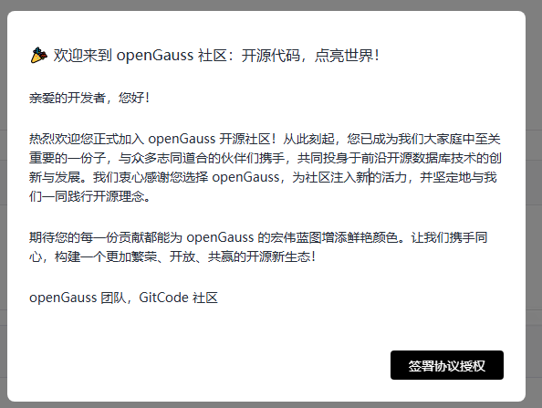

# openGauss社区基础设施升级——代码托管平台切换

## 背景
经openGauss社区理事会决策，社区代码托管平台迁移到GitCode，由社区基础设施团队实施具体社区代码托管平台切换工作。

##  前期准备
针对本次切换，社区基础设施已经完成一些列平台功能的对比验证、社区所有服务的适配对接，并完成了试点仓库的小范围验证，为本次平滑切换做足了准备工作：
 1. 平台功能对比验证：测试web版页面功能和平台API功能等操作超过两百项，保证原平台功能在新平台能支持；
 2. 适配对接：社区机器人、门禁、构建、网站、会议系统等涉及代码托管平台的服务均已完成适配对接，待迁移完成，适配服务即可上线，保证开发者使用无感知；
 3. 试点验证：小范围选择开发者在试点仓库进行代码提交、issue提交等开发工作的初步验证，确保正常生产动作正常；

##  我是开发者，需要我做什么？
您作为开发者，需要完成以下四步操作，即可开启新平台的工作：
 1. 进入社区在gitcode.com平台上的组织: [openGauss组织](https://gitcode.com/opengauss)
 2. 弹窗页面提醒您完成数据迁移授权书签署：

    
 3. 首次进入该平台，将会有一个引导页帮助您完成平台登录（建议可直接使用gitee账号授权方式登录）和手机号绑定。
 4. 参考引导页完成数据迁移授权书签署；

## 我是开发者，平台切换对我有什么影响？
完成上述授权书签署后，您在原代码托管平台上的所有贡献数据（包括代码、PR、ISSUE、评论等）都讲在新平台上展示；

如果您在新老平台保持相同id，社区贡献数据将统一合并计算。具体讲：
#### - 这里是列表文本迁移会影响我的历史贡献记录吗？
您的所有贡献将被完整保留：
1. 自动迁移：您已签署的贡献者协议（CLA）将自动同步至GitCode，在 GitCode 授权后历史PR/Issue数据将无缝转移。
1. 归属透明：代码提交记录、Issue讨论等均保留原始作者信息。

#### - 代码仓的贡献流程会有变化吗？
核心流程完全一致，您仍可沿用熟悉的Git命令与PR提交流程，仅需注意：变更本地仓库地址（https://gitcode.com/opengauss/***）

#### - 这里是列表文本Gitee镜像仓还会保留吗？同步频率如何？
迁移完成后，gitee.com仓库将转为镜像仓，重大版本发布后一个工作日内完成从gitcode.com/opengauss同步到gitee.com/opengauss；

## 迁移时间
预计2025年4月26日基础设施完成迁移，开发者在该时间点以后可以随时进入  [openGauss组织](https://gitcode.com/opengauss)完成数据迁移授权。

## 问题反馈
如果您在该过程中遇到任何问题，都可以发送邮件联系common@public.opengauss.org，或是联系社区小助手，社区将第一时间答复。

扫码添加小助手：

