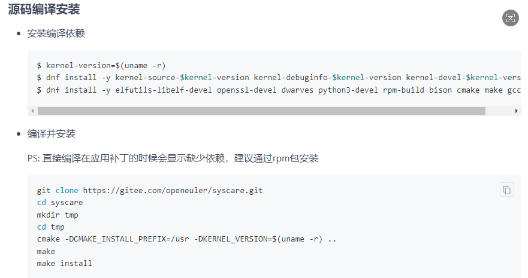
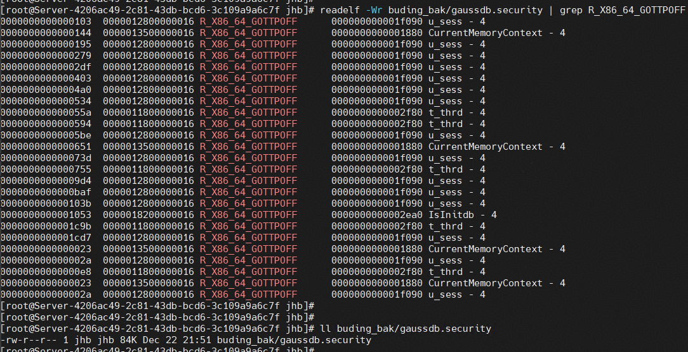
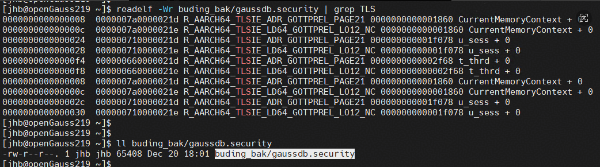
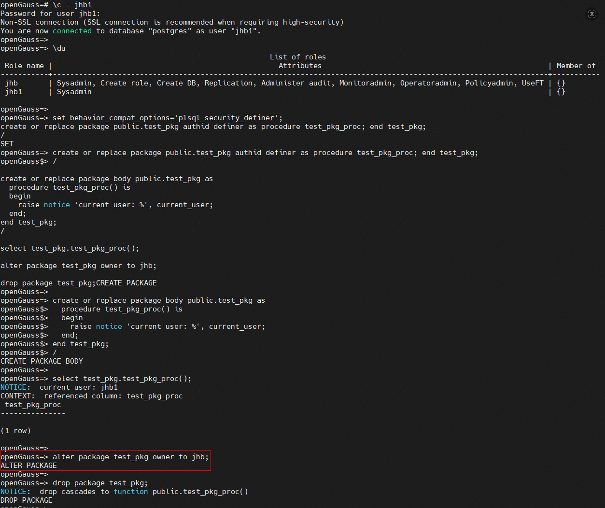
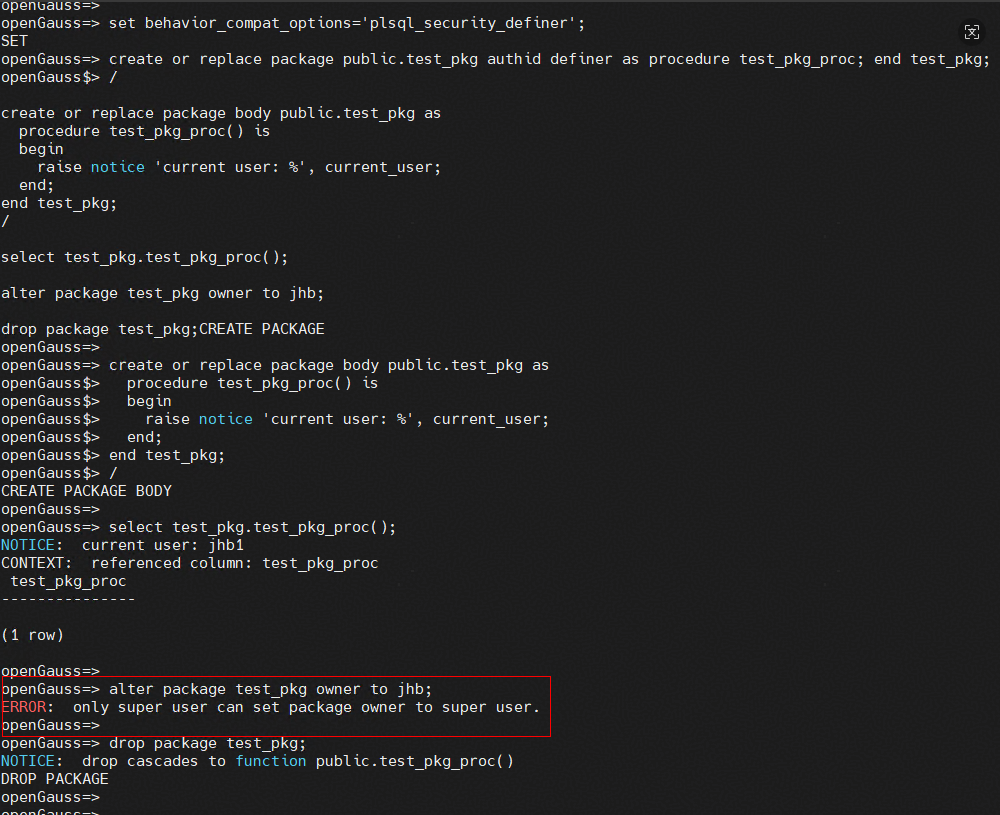
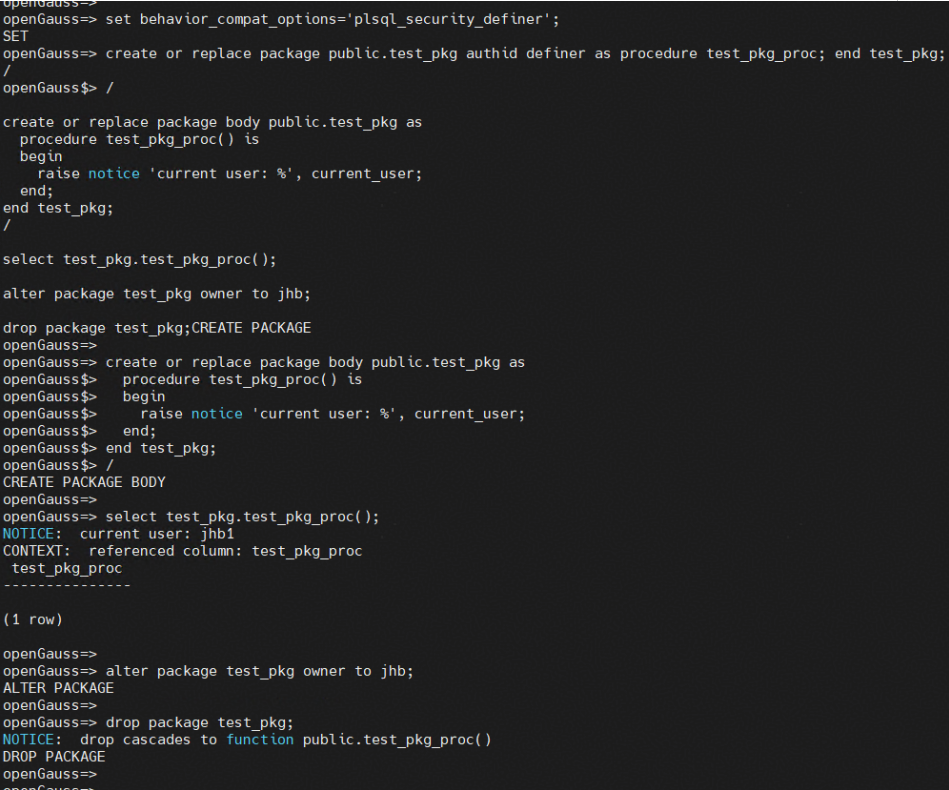
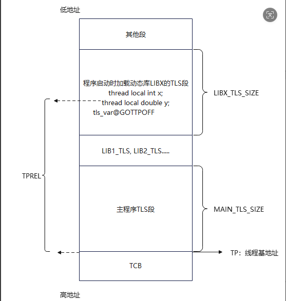
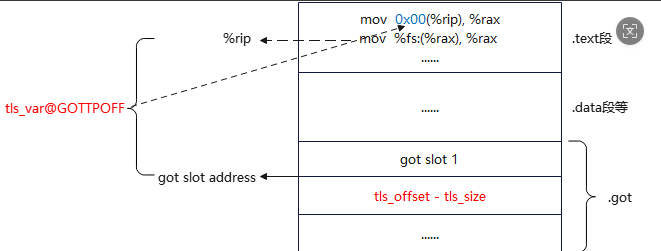
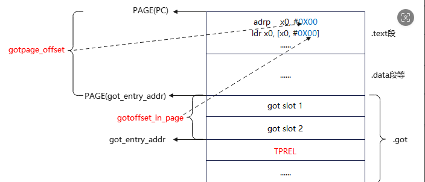

基于openEuler syscare支持对openGauss进行热补丁操作，简单bugfix可通过热补丁修复，无需重启集群。
1. **前置准备**

1.1 syscare编译安装

  环境要求：openEuler 20.03/22.03/24.03且支持syscare工具，syscare当前不支持在centos7.6上使用，需支持syscare工具的更高版本系统。

  架构要求：x86/arm

  代码仓：https://gitee.com/openeuler/syscare

  分支：og_dev

  **注：编译syscare需要安装rust环境，建议安装rust 1.8x.x版本**

 安装依赖：


2. **制作patch文件**

   通过git diff等方式制作patch文件（bugfix代码）

3. **制作补丁**

3.1 配置环境变量（制作补丁的环境变量与编译数据库的环境变量存在部分差异）：

```shell
 #### 选择版本、平台信息
 export DEBUG_TYPE=release
 export BUILD_TUPLE=aarch64
 export GCC_VERSION=10.3.1
 ##### 导入三方库环境变量 
 export THIRD_BIN_PATH=________ 
 export JAVA_HOME=$THIRD_BIN_PATH/kernel/platform/openjdk8/${BUILD_TUPLE}/jdk/
 export PATH=${JAVA_HOME}/bin:$PATH
 export APPEND_FLAGS="-g3 -w -fPIC"
 export GCCFOLDER=$THIRD_BIN_PATH/buildtools/gcc10.3
 #使用upatch-manage制作补丁时，需要配置环境变量CC和CXX为syscare的内部工具，且配置UPATCH_HELPER_CC和UPATCH_HELPER_CXX
 export CC=/usr/libexec/syscare/upatch-cc
 export CXX=/usr/libexec/syscare/upatch-c++
 export UPATCH_HELPER_CC=$THIRD_BIN_PATH/buildtools/gcc10.3/gcc/bin/gcc
 export UPATCH_HELPER_CXX=$THIRD_BIN_PATH/buildtools/gcc10.3/gcc/bin/g++
 export LD_LIBRARY_PATH=$GCCFOLDER/gcc/lib64:$GCCFOLDER/isl/lib:$GCCFOLDER/mpc/lib/:$GCCFOLDER/mpfr/lib/:$GCCFOLDER/gmp/lib/:$LD_LIBRARY_PATH
 export LD_LIBRARY_PATH=$THIRD_BIN_PATH/kernel/dependency/kerberos/comm/lib:$LD_LIBRARY_PATH
 export LD_LIBRARY_PATH=$THIRD_BIN_PATH/kernel/dependency/libcgroup/comm/lib:$LD_LIBRARY_PATH
 export LD_LIBRARY_PATH=$THIRD_BIN_PATH/kernel/dependency/openssl/comm/lib:$LD_LIBRARY_PATH
 export LD_LIBRARY_PATH=$THIRD_BIN_PATH/kernel/dependency/libcurl/comm/lib:$LD_LIBRARY_PATH
 export PATH=$GCCFOLDER/gcc/bin:$PATH
 export PREFIX_HOME=________
 export GAUSSHOME=$PREFIX_HOME
 export LD_LIBRARY_PATH=$GAUSSHOME/lib:$LD_LIBRARY_PATH
 export PATH=$GAUSSHOME/bin:$PATH
```

3.2 制作二进制补丁文件

```shell
/usr/libexec/syscare/upatch-build --source-dir /home/source/compile/openGauss-server/ --build-cmd "cd cmake_build && cmake .. -DENABLE_MULTIPLE_NODES=OFF -DENABLE_THREAD_SAFETY=ON -DENABLE_READLINE=ON -DENABLE_MOT=ON -DENABLE_OPENEULER_MAJOR=ON  && make -sj64 && make install -sj64" --binary /home/source/compile/openGauss-server/mppdb_temp_install/bin/gaussdb  --debuginfo /home/hotpatch/gaussdb0.debug --patch /home/jhb/hotpatch/bugfix.patch --output-dir /home/hotpatch/upatch_cc --skip-compiler-check  --skip-cleanup  --verbose
注意事项：--binary指定的是编译出的二进制的路径，server保存完成后二进制保存在环境变量$PREFIX_HOME指定的路径中。
gaussdb0.debug为目标gaussdb的符号表，需重命名为gaussdb0.debug，且制作补丁的openGauss-server源代码commit需要与目标gaussdb的commit保持一致。
```

| 参数              | 详情                                                         |
| ----------------- | ------------------------------------------------------------ |
| source-dir        | 源码目录                                                     |
| build-cmd         | 编译命令                                                     |
| binary            | 编译后二进制的绝对路径                                       |
| debuginfo         | gaussdb的符号表                                              |
| patch             | 修改文件的patch文件                                          |
| compiler          | 当前运行的gaussdb编译时使用的编译器                          |
| output-dir        | 补丁文件存储路径                                             |
| skip-objects-file | 跳过指定的目标文件，目标文件写在文件中，每个目标文件名占一行 |

制作补丁完成后在output-dir路径下会生成一个二进制补丁文件

4. **应用补丁**

补丁应用和取消的命令如下：

```shell
# patch
/usr/libexec/syscare/upatch-manage --cmd patch -p 1516004 -u /home/hotpatch/upatch_cc/gaussdb --binary /home/patch/openGauss-server/mppdb_temp_install/bin/gaussdb --uuid 1b2c3d4e-5f6a-7b8c-9d0e-1f2a3b4c5d6e
# unpatch
/usr/libexec/syscare/upatch-manage --cmd unpatch -p 1516004 -u /home/hotpatch/upatch_cc/gaussdb --binary /home/patch/openGauss-server/mppdb_temp_install/bin/gaussdb --uuid 1b2c3d4e-5f6a-7b8c-9d0e-1f2a3b4c5d6e
```

| 参数        | 详情             |
| ----------- | ---------------- |
| --cmd       | patch或者unpatch |
| -p/--pid    | 进程pid          |
| -u/--upatch | 热补丁二进制     |
| --binary    | 运行进程的二进制 |
| --uuid      | uuid，自己指定   |

5. **验证补丁**

补丁应用完成后，可以通过修补的bugfix进行验证是否生效。若未生效，可能是由于编译时的符号表等信息存在差异导致，如下通过一个bugfix举例说明应用过程：

（1）、针对需要对进程应用的补丁，生成patch文件，例如针对如下漏洞修复的pr制作patch：

https://gitcode.com/opengauss/openGauss-server/pull/7919/diffs

（2）、基于upatch-build制作二进制补丁文件：

```shell
/usr/libexec/syscare/upatch-build --source-dir /home/jhb/source/compile/openGauss-server/ --build-cmd "cd cmake_build && cmake .. -DENABLE_MULTIPLE_NODES=OFF -DENABLE_THREAD_SAFETY=ON -DENABLE_READLINE=ON -DENABLE_MOT=ON -DENABLE_OPENEULER_MAJOR=ON  && make -sj64 && make install -sj64" --binary /home/jhb/source/compile/openGauss-server/mppdb_temp_install/bin/gaussdb  --debuginfo /home/jhb/hotpatch/gaussdb0.debug --patch /home/jhb/hotpatch/bugfix.patch --output-dir /home/jhb/hotpatch/upatch_cc --skip-compiler-check  --skip-cleanup  --verbose
```

（3）、观测生成的补丁文件包含如下重定位类型：

- x86: R_X86_64_GOTTPOFF


- arm：R_AARCH64_TLSIE_ADR_GOTTPREL_PAGE21、R_AARCH64_TLSIE_LD64_GOTTPREL_LO12_NC


（4）、执行issue相关用例，然后使用upatch-manage应用补丁，再执行用例，观察热补丁是否生效

- 初始用例执行结果：修改package owner成功


- 应用热补丁在进程不重启的情况下进行bugfix，然后进行验证：修改package owner失败


- 在进程不重启的情况下撤销热补丁，然后继续验证撤销是否生效：修改package owner成功



6.  **syscare适配tls变量思路**

6.1 **对openGauss中含thread local变量函数进行打补丁操作。**

(1). 梳理openGauss-server代码中包含的所有重定位类型：

x86_64平台：R_X86_64_GOTTPOFF

aarch平台：R_AARCH64_TLSIE_ADR_GOTTPREL_PAGE21、R_AARCH64_TLSIE_LD64_GOTTPREL_LO12_NC

(2). 针对每个重定位类型，进行地址重定位，并将重定位的信息写入到汇编指令中。TLS主要分为TLSIE、TLELE、TLSLD、TLSGD加载模型，TLSIE和TLSLE模型均通过TP（线程基址）和TPREL（变量地址相对于TP的便宜）来寻址，TLSLD和TLSGD模型通过动态加载器给TLS段分配的module_id和变量在TLS段内的偏移，然后通过调用__tls_get_addr函数来寻址。当前仅支持TLSIE和TLSLE模型，TLSLD和TLSGD模型暂不支持。

TLS静态内存布局示例所示：


TLS内存模型可参考：https://jia.je/software/2025/04/07/tls-internals/#global-dynamic-tls-model

6.2 **新增重定位类型计算原理**

 (1). **x86重定位：**

- R_X86_64_GOTTPOFF：

假设需要访问变量的变量在TLS块内偏移为OFFSET，该重定位类型的计算公式为：

该重定位类型的计算公式为：tls_var_address = tp - tls_size + tls_offset，即：tls_var_address =  tp + (tls_offset - tls_size)。

对应汇编指令：

```
汇编指令示例
指令1：mov  tls_var@GOTTPOFF(%rip), %rax;  (%rax = %rip + tls_var@GOTTPOFF)
指令2：mov  %fs:(%rax), %rax        ; tp + (tls_offset - tls_size)，%fs寄存器存储的值即为tp
```

指令1的含义为：%rax =  *(%rip + tls_var@GOTTPOFF)。%rip为下一条指令的地址，tls_var@GOTTPOFF为%rip到GOT slot address的偏移，GOT slot中存储的是（tls_offset - tls_size）。如下图所示：



针对该重定位类型需要的计算过程为：

1、计算tls_offset - tls_size，并将其写入一个GOT条目中

2、计算GOT条目地址到%rip的地址偏移，并将该偏移编码到mov指令中（0x00表示需要被重写）。

重定位完成后，

指令1的执行结果为：将tls_offset - tls_size写入到%rax寄存器

指令2的执行结果为：将tls_var_address写入%rax寄存器

即完成tls_var变量的寻址，后续指令通过访问%rax寄存器即可访问tls_var。

(2). **arm重定位**

- R_AARCH64_TLSIE_ADR_GOTTPREL_PAGE21：

- R_AARCH64_TLSIE_LD64_GOTTPREL_LO12_NC：

  这两个指令通常配合使用，寻址流程为：（1）用adrp加载GOT表所在页；（2）用ldr从GOT表中加载TLS变量相对于TLS块起始的偏移；（3）将该偏移加到tpidr_el0上，完成tls变量寻址。

  ```
  汇编指令示例
  adrp    x0, #:gottprel:tls_var //R_AARCH64_TLSIE_ADR_GOTTPREL_PAGE21，待写入的信息为gotpage_offset 
  ldr     x0, [x0, #:gottprel_lo12:tls_var] // 另一个重定位（如 R_AARCH64_TLSIE_LD64_GOTTPREL_LO12_NC）
  ```

  1. **`adrp` 指令**:

     - adrp指令计算方式：x0 = PAGE($PC) + gotpage_offset，将当前PC页基址加上页偏移（tls_var在GOT条目的页基址）的结果写入x0寄存器。

     - 计算 `tls_var` 的 GOT 条目所在页面的地址。该 GOT 条目包含 `tls_var` 相对于线程指针 (TP) 的偏移量（即 `TPREL`）。
     - 将PAGE(got_entry_addr) - PAGE($PC)编码到adrp指令中。

  2. **后续 `ldr` 指令**:

     - ldr指令计算方式：x0 = *($x0 +  (#:gottprel_lo12:tls_var))

     - 基于adrp指令计算出的got_entry_address页基地址，再加上页内偏移gotoffset_in_page，获取到TPREL
     - 将TPREL的值写入x0寄存器，后续指令通过TP + TPREL得到tls变量地址

     


7. **约束场景**

   支持的场景：
   1、给gaussdb打补丁，补丁中的符号必须都在gaussdb二进制中有定义（TLS_IE和TLS_LE模型）
   2、给动态库打补丁（例如dolphin.so），补丁中的符号必须都在dolphin.so中有定义（仅支持TLS_LE访问模型）
   3、支持给主机和备机打补丁，但热补丁是进程级别的，主备节点应用补丁后不会互相生效

   不支持的场景：
   1、存在外部符号引用，例如dolphin引用了server中的u_sess，t_thrd变量（非TLS变量也受限制）
   2、针对动态库打补丁且使用的非TLS_LE模型的

   其余约束与syscare原本约束保持一致。