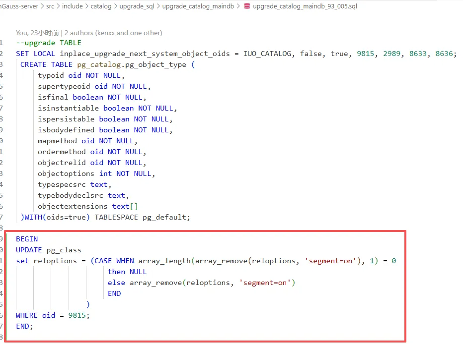
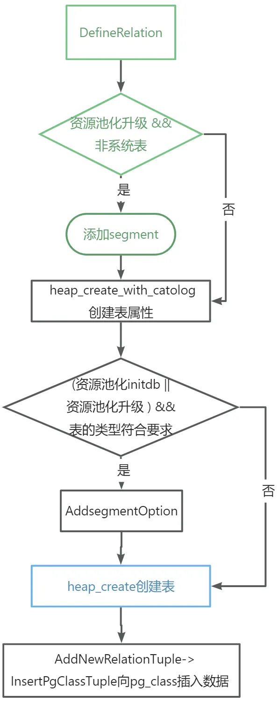
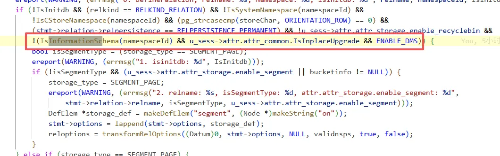
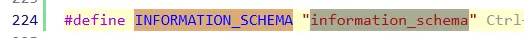
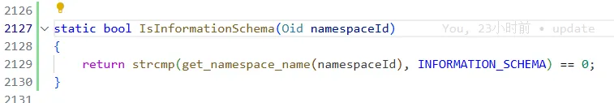
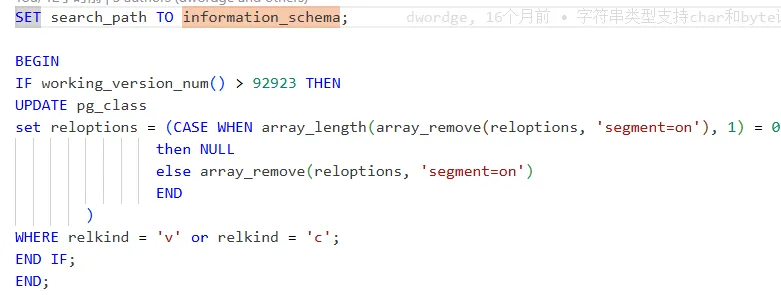
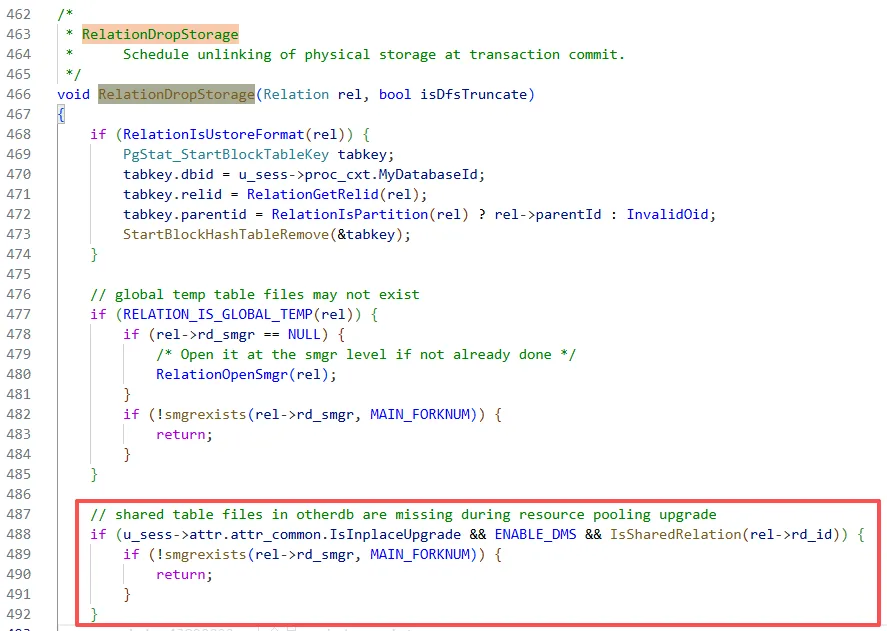

# 1、新增基础系统表

一个升级元数据和直接安装校验不一致问题引出问题：从6.0.0LTS/6.0.2LTS/7.0.0RC1升级到7.0.0RC2，pg_object_type表有一个segment=on的reloption，而直接安装7.0.0RC2没有，

```cpp
openGauss=# select relname,relkind,reloptions from pg_class where relkind='r' AND (reloptions IS NULL OR NOT reloptions @> array['segment=on']);
    relname     | relkind | reloptions 
----------------+---------+------------
 pg_type        | r       | 
 pg_attribute   | r       | 
 pg_proc        | r       | 
 gs_package     | r       | 
 pg_object_type | r       | segment=on
 pg_class       | r       |
```

**之前的基础系统表创建规则：**

+ 最好拷贝已有的头文件进行修改，genbki.pl的正则匹配对空格和大小写敏感，容易引入问题
+ CATALOG_VARLEN宏内部的字段不会声明在FormData_xxx结构体中
+ BKI_BOOTSTRAP 控制几个基础系统表的创)，其他系统表通过heap_create_with_catalog创建(参考bootparse.y中的实现)
+ BKI_SHARED_RELATION 声明则为跨database共享表，如果声明则需要适配 is_shared_relation(catalog.cpp)
+ BKI_WITHOUT_OIDS 默认带有oid字段，声明则不带 

基础系统表定义时在catalog头加了bkibootstrap，升级时走基础系统表的创建流程（只有这六张表是，pg_object_type是一年前加的），走heap_create函数，其他的普通系统表通过heap_create_with_catalog（会调用heap_create）创建。

## 规则：如果要新增基础系统表还需修改升级脚本

在升级脚本添加创建语句后，在随后添加去掉segment的语句


直接安装和升级后的六张基表都该有segment，由于目前不好改代码添加segment，所以暂时放弃直接安装就添加segment的方案。

+ <font style="color:#DF2A3F;">需要确定pg_class表是什么时候创建的</font>，在创建完之后才能updatePgClassTuple，原本在heap_create中添加了调用update代码更新表，但安装报错segmentCheck失败，此时可能并没有在数据库创建表
+ 然后需判断资源池化段页式版本，判断为这个版本且允许段页式，则给几张基表添加segment

代码里找到了两处增加segment的地方：DefineRelation和heap_create_with_catalog。系统表升级时都是走了这两个地方添加segment，基表正常安装时判断代码CATALOG头部有BKI_BOOTSTRAP字段就会走heap_create，基表升级时猜测和普通系统表一样走了heap_create_with_catalog，但看日志输出发现并没有走，同时在isnertPgClassTuple（被heap_create_with_catalog调用）的代码里也添加了代码判断如果是基表就不添加segment，加了日志，发现pg_object_type表没有打印这里的日志，也没有打印DefineRelation和heap_create_with_catalog中添加的日志。<font style="color:#DF2A3F;">猜测可能是update时更新了segment，后续可在update前添加日志判断，update代码比较复杂。</font>

### <font style="color:#000000;">代码流程</font>

<font style="color:#000000;">initdb或升级时和创建系统表相关流程：</font>

1. <font style="color:#000000;">DefineRelation</font>
   - <font style="color:#000000;">判断为资源池化升级，非系统表，以及非资源池化升级的information_schema中的表，添加segment的reloption</font>
2. <font style="color:#000000;">heap_create_with_catolog</font>
   - <font style="color:#000000;">创建普通系统表</font>
     * <font style="color:#000000;">资源池化初始化数据库或升级：AddSegmentOption</font>
   - <font style="color:#000000;">heap_create</font>
     * <font style="color:#000000;">传入参数创建</font>
   - <font style="color:#000000;">AddNewRelationTuple</font>
     * <font style="color:#000000;">InsertPgClassTuple: 更新PgClass表信息，插入数据</font>
3. <font style="color:#000000;">heap_create</font>
   - <font style="color:#000000;">创建系统表（没有更新pg_class表数据）</font>



<font style="color:#000000;">heap中updatePgClass表步骤：</font>

<font style="color:#000000;">1、从SearchSysCache获取旧元祖->segmentcheck</font>

<font style="color:#000000;">2、HeapTupleIsValid 验证元祖有效</font>

<font style="color:#000000;">3、heap_modify_tuple 修改元祖获得新元祖</font>

<font style="color:#000000;">4、simple_heap_modify 更新数据库</font>

# 2、新增非系统schema表规则

如果在information_schema.sql中添加表而不是通过硬编码的方式，需要在tablecmds.cpp的definerelation函数中通过判断排除表，information_schema的表在升级重建表时会添加两次segment=on的reloption，需排除。如果在是其他schema的sql文件添加了表的创建



需要在这添加schema_name的判断，information_schema从不同版本升级到700RC2的namespace oid不一样，所以这里用name判断，





**遗留问题：**

information_schema从不同版本升级到700RC2的namespace oid不一样可能也是个问题，需要和其他namespace一样固定oid。

# 3、新增relkind='c'

有三个type从600升级到700RC2后会多segment,目前没找到添加的地方，当前按照视图升级去掉segment的方式，添加到升级脚本中，



# 4、新增共享表

如果新增共享表，由于共享表maindb和otherdb共享同一份物理文件，之前在回滚删除otherdb物理文件时有问题，会报错bitmap错误，无法删除物理文件，导致回滚失败，因此在删除物理文件逻辑添加代码，判断如果为共享表检测到物理文件不存在时，则不删除：



