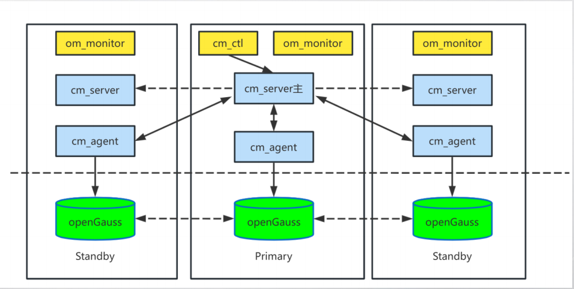
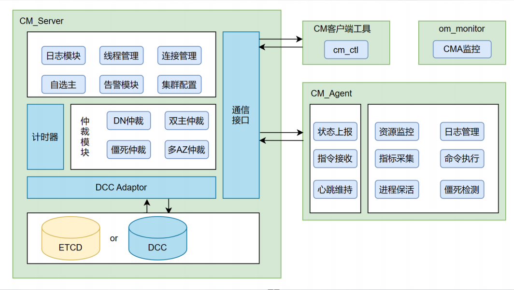
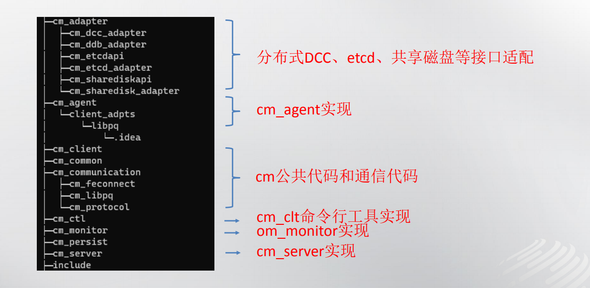
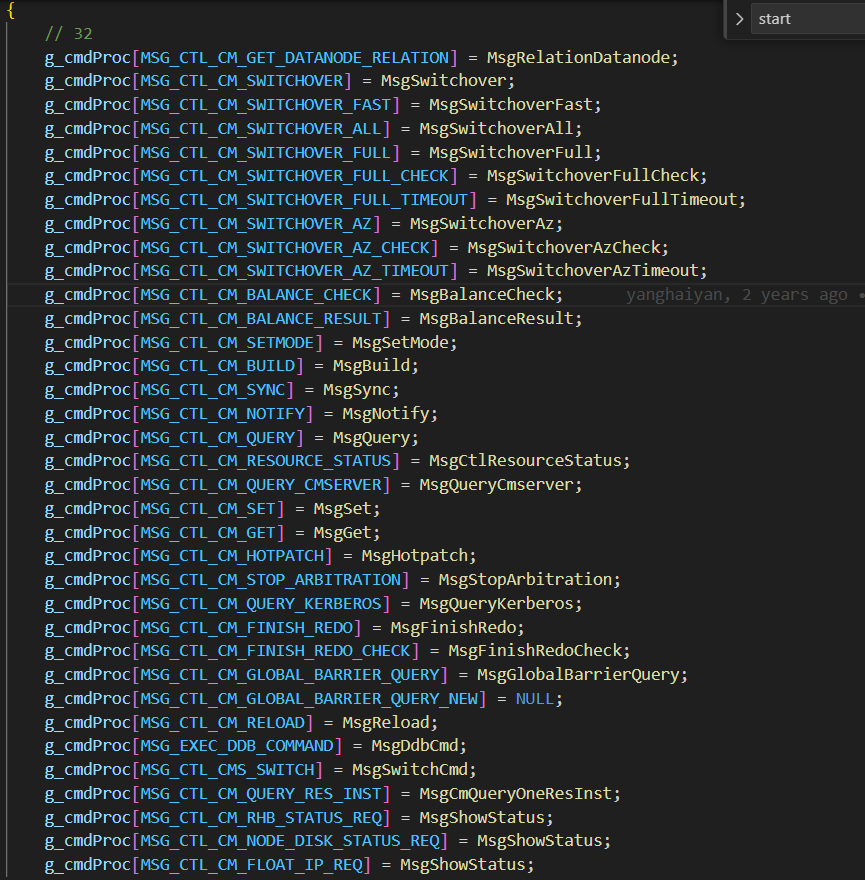
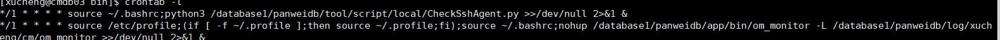
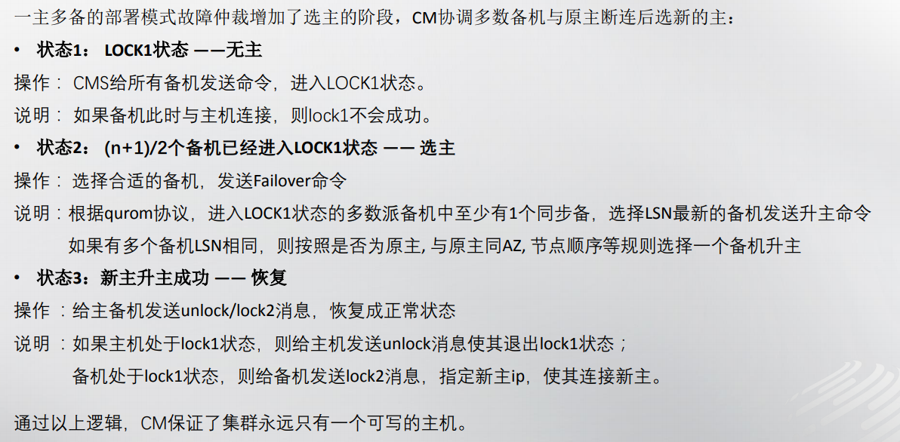
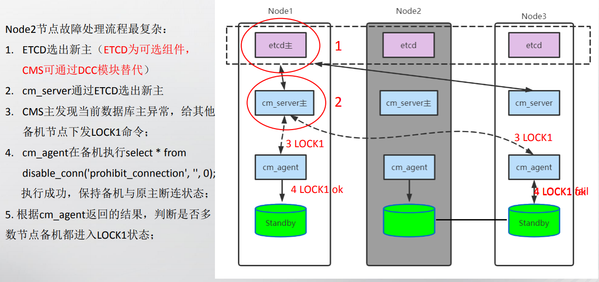
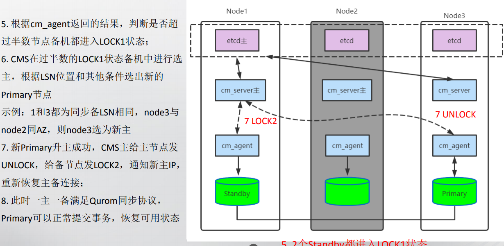
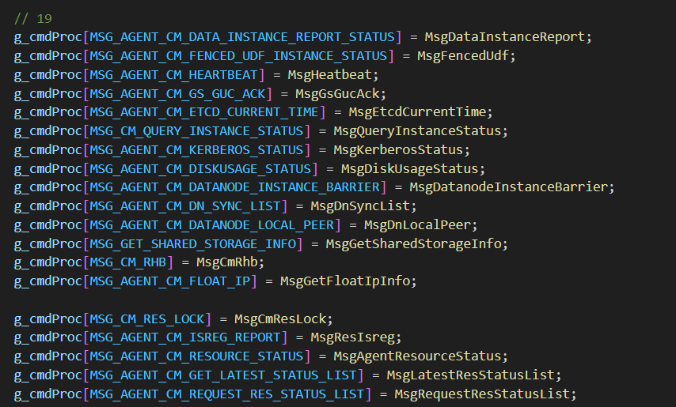

1.概述

CM（Cluster Manager）是openGauss 社区3.0版本开源的高可用集群管理 组件。支持自定义资源监控，提供了数据库主备状态监控、网络通信故障监控、 文件系统故障监控、以及故障后自动切换主备等能力。 配合openGauss社区OM脚本，可以进行自动化高可用集群的部署安装和运 维操作。
管理和监控数据库系统中各个功能单元和物理资源的运行情况，确保整 个数据库系统的稳定运行。 支持自定义资源监控，提供了数据库主备的状态监控、网络通信故障监 控、文件系统故障监控、故障自动主备切换等能力。提供了丰富的数据库管 理能力，如节点、实例级的启停，数据库实例状态查询、主备切换、日志管 理等功能。

- cm_agent: 负责启停和数据库实例进 程监控上报、故障检测、执行下发的 仲裁命令 
- cm_server：接收agent发送的各节点 实例状态，通过心跳超时或异常状态 消息，由cm_server主集中仲裁DN的 主备状态关系，触发故障迁移
- cm_ctl：集群管理命令行 
- om_monitor: cm_agent的守护进程

2.代码结构

3.cm_ctl

主要负责代码启停，状态查询等操作。从实现上来说大体分为两类操作
1）其中集群启停等操作由执行节点调用pssh，将标志文件拷贝到bin目录下。如cm_ctl会创建cluster_manual_start文件，停止重启操作类似。
2）查询等操作需要与cm_server进行交互，cm_server处理指令返回给客户端，由客户端根据参数控制输出。 
3）消息对应处理函数 

4.om_monitor

定制任务，负责监控cm_agent，severloop中不断检查agent,并不断进行。保证cm_agent能一直将状态发送给cm_server,并在用户使用om或者cm工具关闭集群之后，关闭cma。

5.cm_agent

多个线程不断采集DN和系统状态，并根据检查状态，选择杀死节点或者将信息发送给CM-Server

6.cm_server

1)选主逻辑

2）示例

3）消息对应处理函数

