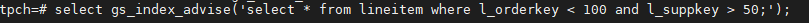
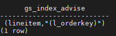
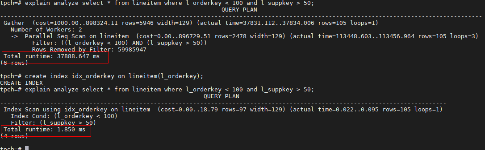
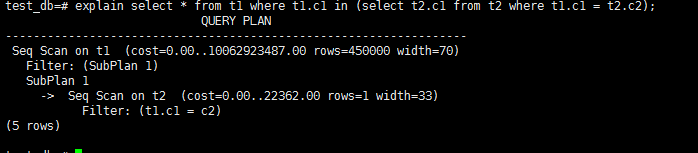
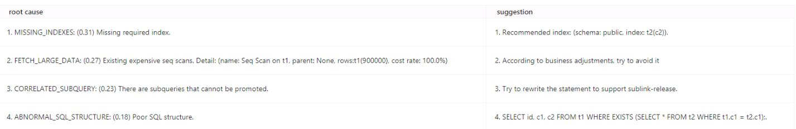
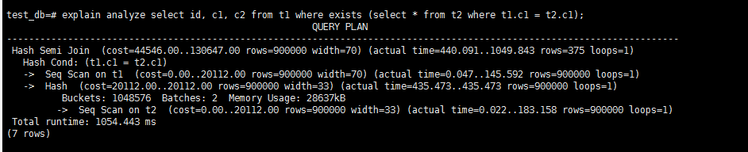
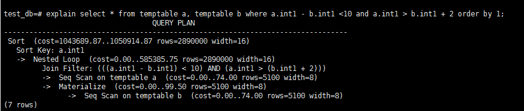
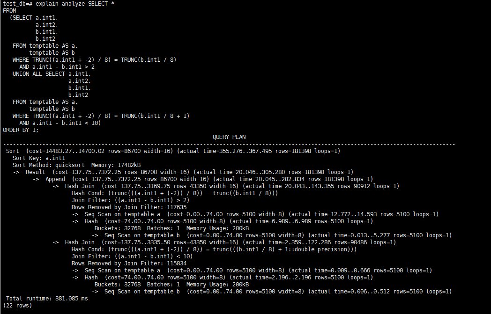
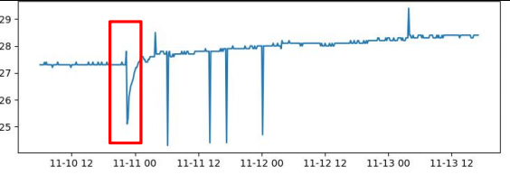
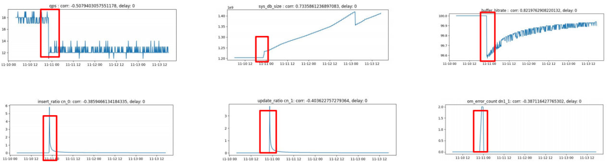

# openGauss AI4DB 探秘

AI4DB 是指用 AI 使能数据库，从而实现数据库系统的自治、免运维等能力。主要包括自调优、自诊断、自安全、自运维、自愈等子领域。openGauss 目前已提供了索引智能推荐、慢 SQL 诊断、SQL 智能重写、异常检测能 AI 能力。

下面我们将对其中的主要功能逐项进行了解和应用。

## 索引智能推荐

### 功能说明

单 query 索引推荐功能支持用户在数据库中直接进行操作，本功能基于查询语句的语义信息和数据库的统计信息，对用户输入的单条查询语句生成推荐的索引。

对于 workload 级别的索引推荐，用户可通过运行数据库外的脚本使用此功能，本功能将包含有多条 DML 语句的 workload 作为输入，最终生成一批可对整体 workload 的执行表现进行优化的索引。同时，本功能提供从日志中或系统表中抽取业务数据 SQL 流水的功能。

### 应用示例

我们以单 query 索引推荐为例，本功能涉及的函数接口如下：

| 函数名          | 参数           | 功能                         |
| --------------- | -------------- | ---------------------------- |
| gs_index_advise | SQL 语句字符串 | 针对单条查询语句生成推荐索引 |

对如下语句进行索引推荐：



推荐结果建议在 lineitem 表的 l_orderkey 列上创建索引：



创建所推荐的索引前后，同一 SQL 语句的执行计划和预计执行时间如下：



可以看出，提升效果比较明显。

## 慢 SQL 诊断

### 功能说明

慢 SQL 诊断功能基于 SQL 执行时的上下文信息分析其可能的根因，并给出对应的概率，当前支持 20+根因分析。

### 应用示例

在数据库中创建表 t1, t2：

```
create table t1(id int, c1 text, c2 text);
create table t2(id int, c1 text, c2 text);
```

向上述两表中插入数据：

```
insert into t1 select generate_series(1,10000000),md5(random()::text), md5(random()::text);
insert into t2 select generate_series(1,10000000),md5(random()::text), md5(random()::text);
```

测试语句：

```
select * from t1 where t1.c1 in (select t2.c1 from t2 where t1.c1 = t2.c2);
```

当前执行性能如下：



执行诊断如下：



诊断结果包含四个：

1. 缺少必要索引，建议在 t2(c2)上创建索引；
2. 涉及大扫描；
3. 存在子计划，导致性能较差；
4. SQL 结构不优，并给出了改写语句；

按照上述建议创建索引并执行改写语句，其性能如下：



可以发现性能提升明显。

## SQL 智能重写

### 功能说明

根据预先设定的规则，将查询语句转换为更为高效或更为规范的形式，使得查询效率得以提升。

### 应用示例

建表：

```
create table temptable (int1 int, int2 int);
insert into temptable select generate_series(1,3000),generate_series(1,3000);
```

原始 SQL 为：

```
select * from temptable a, temptable b where a.int1 - b.int1 <10 and a.int1 > b.int1 + 2 order by 1;
```

执行计划如下，cost 值为 1050914，代价较大：



SQL 智能改写后：

```
SELECT * FROM
  (SELECT a.int1, a.int2, b.int1, b.int2 FROM temptable AS a, temptable as b WHERE TRUNC((a.int1 - 2) /8) = TRUNC(b.int1 / 8) AND a.int1 - b.int1 >2
 UNION ALL
   SELECT a.int1, a.int2, b.int1, b.int2 FROM temptable AS a, temptable as b WHERE TRUNC((a.int1 -2) / 8) = TRUNC(b.int1 / 8 + 1) and a.int1 - b.int1 < 10
   )ORDER by 1;
```

改写后执行计划如下，cost 代价下降为原来的 1%：



## 异常检测

### 功能说明

通过采集并监控数据库指标，基于时序预测和异常检测等算法，预判异常信息。

数据库指标（metric）是数据库与用户行为健康的重要标志，数据库中的异常行为可能导致数据库指标产生异常，因此对指标进行有效的监控显得十分必要。

数据库状态监控（database monitoring），指对数据库运行指标进行全方位实时监控。系统能够发现和识别数据库异常以及潜在的性能问题，并及时将数据库异常报告给用户，通过针对各项运行指标的统计分析报告，帮助管理员、运维人员、决策者多视角了解数据库的运行状态，从而更好的应对数据库的需求及规划。

### 应用示例

**异常检测：**检测到 dn_memory 出现 spike 异常，且之后开始持续增长：



同时，关联其他指标也出现不同形式的异常：



**根因分析：**insert 语句和 update 语句从 0%突增，批量更新和插入操作导致大量的脏页产生，缓冲命中率下降，buffer 命中率下降。

## 总结

以上是对 openGauss 中较常用 AI4DB 能力的简介和应用示例，在实际生产环境中，会有更复杂的应用场景。另外还有参数推荐、慢 SQL 发现、趋势预测等功能，将在未来的测试和应用中，继续深入探索！
