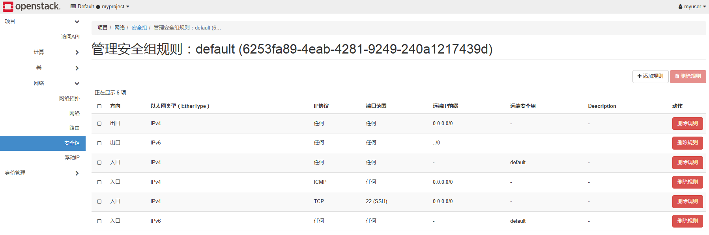
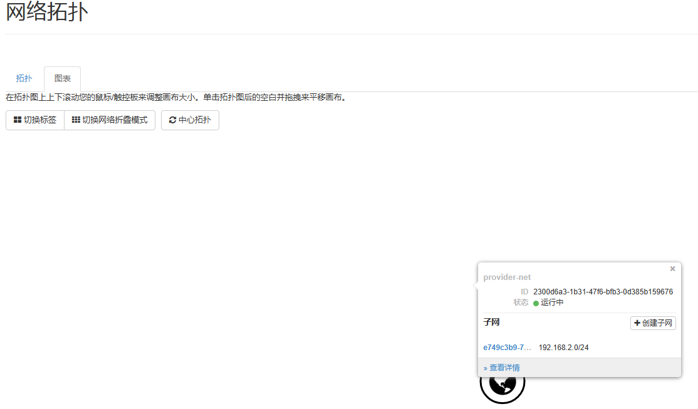
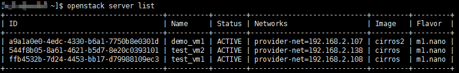

### 概要

本文档给出了使用openGauss安装openStack的实战流程，旨在指导用户如何基于openGauss作为底层数据库安装部署openStack环境。文档中将会基于 openStack Train版本安装 keystone、glance、nova、placement、cinder、neutron 和 horizon这7个核心功能组件，其余组件中tempest、kolla、swift和ceilometer不涉及数据库使用，ironic、trove、cyborg、aodh、gnocchi和heat等非核心组件可按需安装，后续将继续验证。安装流程主要参考了[openStack官方文档](https://openstack-sig.readthedocs.io/zh/latest/install/openEuler-20.03-LTS-SP4/OpenStack-train), 并结合了openGauss的特性进行了适配。相比于原安装流程，适配主要涉及：

- 修改数据库驱动为openGauss-connector-python-psycopg2_6.0.0
- 修改数据库的配置文件
- 修改 oslo_db 配置文件中的数据库连接信息
- 修改创建数据库以及授权命令


### 前置环境

- 操作系统：openEuler 22.03 LTS
- 数据库版本：openGauss 7.0.0 RC1
- openStack版本：Train
- 数据库驱动：openGauss-connector-python-psycopg2_6.0.0


### 安装流程

#### 启用 yum 源
如果使用的操作系统是 openEuler 22.03 LTS以上的版本，可以使用如下命令启用 yum 源：

```
yum update
yum install openstack-release-train
yum clean all && yum makecache
```

其他操作系统，可根据实际情况选择配置合适的 yum 源。

#### 安装及配置数据库
可以按照[版本编译](https://docs.opengauss.org/zh/docs/latest/docs/CompilationGuide/%E7%89%88%E6%9C%AC%E7%BC%96%E8%AF%91.html)的指导编译安装openGausss数据库到本地，之后修改数据库的配置文件postgresql.conf和pg_hba.conf，如下所示

```
-- 修改postgresql.conf
listen_addresses = '*'
session_timeout = 0
password_encryption_type = 1
dolphin.sql_mode ='sql_mode_strict,pipes_as_concat,ansi_quotes,no_zero_date,pad_char_to_full_length,auto_recompile_function,error_for_division_by_zero'
disable_keyword_options = 'excluded'
behavior_compat_options='accept_empty_str'

-- 修改pg_hba.conf
host    all             all             0.0.0.0/0               md5
```
修改后重启数据库使参数生效。

下面将展示安装openStack组件的流程，主要说明和openStack官方文档中不同的数据库操作，其余安装操作和openStack官方文档一致。

以下是安装openStack组件keystone的完整流程，其它组件安装流程和openStack官方文档类似，仅说明数据库相关操作：

#### keystone安装

1.创建 keystone 数据库并授权

```sql
openGauss=# create database keystone dbcompatibility 'B';
CREATE DATABASE
openGauss=# \c keystone 
Non-SSL connection (SSL connection is recommended when requiring high-security)
-- 可根据实际情况设置keystone数据库用户密码，此处仅为示例，下面的安装步骤同理
keystone=# CREATE USER keystone WITH PASSWORD '******';
CREATE ROLE
keystone=# grant all privileges on database keystone to keystone;
GRANT
```

2.安装 keystone 软件包

```shell
yum install openstack-keystone httpd mod_wsgi
```

3.配置 keystone

```shell
# 修改/etc/keystone/keystone.conf，根据实际情况替换数据库用户密码以及{IP}和{PORT}
[database]
connection = postgresql://keystone:******@{IP}:{PORT}/keystone

[token]
provider = fernet
```

由于sqlalchemy解析数据库版本的源码限制，此处需要修改sqlalchemy安装路径下的文件（/usr/lib/python版本/site-packages/sqlalchemy/dialects/postgresql/base.py）文件中的_get_server_version_info函数。
```python
def _get_server_version_info(self, connection):
    # 修改此处版本为固定值使下面的正则匹配通过
    v = "PostgreSQL 16.1, compiled by Visual C++ build 1914, 64-bit"
    m = re.match(
        r".*(?:PostgreSQL|EnterpriseDB) "
        r"(\d+)\.?(\d+)?(?:\.(\d+))?(?:\.\d+)?(?:devel|beta)?",
        v,
    )
```
由于openGauss暂未支持`ALTER TABLE...SERIAL语法`，需要替换keystone安装路径下的如下文件(/usr/lib/python版本/site-packages/keystone/common/sql/expand_repo/versions/047_expand_update_pk_for_unified_limit.py)中的`POSTGRESQL_CREATE_ID_PRIMARY_KEY_COLUMN` 变量为下值：
```
POSTGRESQL_CREATE_ID_PRIMARY_KEY_COLUMN = """
ALTER TABLE `%s` ADD `internal_id` INT NOT NULL AUTO_INCREMENT PRIMARY KEY;
"""
```

4.初始化 keystone 数据库

```shell
su -s /bin/sh -c "keystone-manage db_sync" keystone
```

5.初始化 Fernet 密钥存储库

```shell
keystone-manage fernet_setup --keystone-user keystone --keystone-group keystone
keystone-manage credential_setup --keystone-user keystone --keystone-group keystone
```

6.启动 keystone 服务

根据实际情况替换{ADMIN_PASS}为ADMIN用户设置的密码，和{controller}为控制节点IP地址
```shell
keystone-manage bootstrap --bootstrap-password ADMIN_PASS \
--bootstrap-admin-url http://controller:5000/v3/ \
--bootstrap-internal-url http://controller:5000/v3/ \
--bootstrap-public-url http://controller:5000/v3/ \
--bootstrap-region-id RegionOne
```

7.配置Apache HTTP server

```shell
vim /etc/httpd/conf/httpd.conf
# 修改如下内容,{controller}为本机IP地址
ServerName controller

ln -s /usr/share/keystone/wsgi-keystone.conf /etc/httpd/conf.d/
```
8.启动Apache HTTP服务
```shell
systemctl enable httpd.service
systemctl start httpd.service
```

9.创建环境变量配置

根据实际情况替换{ADMIN_PASS}和{controller}
```shell
cat << EOF >> ~/.admin-openrc
export OS_PROJECT_DOMAIN_NAME=Default
export OS_USER_DOMAIN_NAME=Default
export OS_PROJECT_NAME=admin
export OS_USERNAME=admin
export OS_PASSWORD=ADMIN_PASS
export OS_AUTH_URL=http://controller:5000/v3
export OS_IDENTITY_API_VERSION=3
export OS_IMAGE_API_VERSION=2
EOF
```
10.安装客户端软件包，依次创建domain, projects, users, roles
```shell
yum install python3-openstackclient
```

```shell
source ~/.admin-openrc
openstack domain create --description "An Example Domain" example
openstack project create --domain default --description "Service Project" service
openstack project create --domain default --description "Demo Project" myproject
openstack user create --domain default --password-prompt myuser
openstack role create myrole
openstack role add --project myproject --user myuser myrole
```

至此完成keystone的安装和配置

11.验证安装

取消临时环境变量OS_AUTH_URL和OS_PASSWORD
```shell
source ~/.admin-openrc
unset OS_AUTH_URL OS_PASSWORD
```

为admin用户请求token：
```
openstack --os-auth-url http://controller:5000/v3 \
--os-project-domain-name Default --os-user-domain-name Default \
--os-project-name admin --os-username admin token issue
```
为myuser用户请求token：
```
openstack --os-auth-url http://controller:5000/v3 \
--os-project-domain-name Default --os-user-domain-name Default \
--os-project-name myproject --os-username myuser token issue
```
如果得到类似下面的结果，则验证成功:
```shell
[root@openeuler2203-sp4 keystone]# openstack domain create --description "An Example Domain" example
+-------------+----------------------------------+
| Field       | Value                            |
+-------------+----------------------------------+
| description | An Example Domain                |
| enabled     | True                             |
| id          | 038f7bbff366428e9b53a30d1be4a59e |
| name        | example                          |
| options     | {}                               |
| tags        | []                               |
+-------------+----------------------------------+

[root@openeuler2203-sp4 keystone]# openstack project create --domain default --description "Service Project" service
+-------------+----------------------------------+
| Field       | Value                            |
+-------------+----------------------------------+
| description | Service Project                  |
| domain_id   | default                          |
| enabled     | True                             |
| id          | 22995ebafe664c76842a254575e413a1 |
| is_domain   | False                            |
| name        | service                          |
| options     | {}                               |
| parent_id   | default                          |
| tags        | []                               |
+-------------+----------------------------------+
```

#### Glance安装
数据库操作
```sql
openGauss=# create database glance;
CREATE DATABASE
openGauss=# \c glance 
Non-SSL connection (SSL connection is recommended when requiring high-security)
glance=# create user glance with password '******';
NOTICE:  The encrypted password contains MD5 ciphertext, which is not secure.
CREATE ROLE
glance=# grant ALL privileges on database glance to glance;
GRANT
```
修改配置
```shell
vim /etc/glance/glance-api.conf
#修改glance数据库相关配置，此处仅说明数据库配置，其他配置请参考官方文档
[database]
connection = postgresql://glance:******@{IP}:{PORT}/glance
```

#### Placement安装
数据库操作
```sql
-- 必须创建B兼容性库
openGauss=# create database placement dbcompatibility 'B';
CREATE DATABASE
openGauss=# \c placement 
Non-SSL connection (SSL connection is recommended when requiring high-security)
placement=# create user placement with password '******';
NOTICE:  The encrypted password contains MD5 ciphertext, which is not secure.
CREATE ROLE
placement=# grant ALL privileges on database placement to placement;
GRANT
```
修改配置
```shell
# vim /etc/placement/placement.conf

[placement_database]
# ...
connection = postgresql://placement:******@{IP}:{PORT}/placement
```


#### Nova安装
数据库操作
```sql
openGauss=# CREATE DATABASE nova_api;
CREATE DATABASE
openGauss=# CREATE DATABASE nova;
CREATE DATABASE
openGauss=# CREATE DATABASE nova_cell0;
CREATE DATABASE
openGauss=# \c nova
Non-SSL connection (SSL connection is recommended when requiring high-security)
nova=# create user nova with password '******';
NOTICE:  The encrypted password contains MD5 ciphertext, which is not secure.
CREATE ROLE


nova=# grant ALL privileges on database nova_api to nova;
GRANT
nova=# grant ALL privileges on database nova to nova;
GRANT
nova=# grant ALL privileges on database nova_cell0 to nova;
GRANT


--- 创建Nova用户之后，使用Nova重新连接数据库
gsql -d postgres -p {port} -r -U nova -W ******

--- 在nova_api和nova_cell0中使用Nova用户创建schema
openGauss=> \c nova_api
Password for user nova: 
Non-SSL connection (SSL connection is recommended when requiring high-security)
You are now connected to database "nova_api" as user "nova".
nova_api=> create schema nova;
CREATE SCHEMA
nova_api=> \c nova_cell0
Password for user nova: 
Non-SSL connection (SSL connection is recommended when requiring high-security)
You are now connected to database "nova_cell0" as user "nova".
nova_cell0=> create schema nova;
CREATE SCHEMA
```
修改配置
```shell
vim /etc/nova/nova.conf
 
[api_database]
connection = postgresql://nova:******@{IP}:{PORT}/nova_api
 
[database]
connection = postgresql://nova:******@{IP}:{PORT}/nova
```

#### Neutron安装
数据库操作
```sql
openGauss=# create database neutron;
CREATE DATABASE
openGauss=# \c neutron 
Non-SSL connection (SSL connection is recommended when requiring high-security)
neutron=# create user neutron with password '******';
NOTICE:  The encrypted password contains MD5 ciphertext, which is not secure.
CREATE ROLE
neutron=# grant ALL privileges on database neutron to neutron;
GRANT
```
修改配置
```shell
vim /etc/neutron/neutron.conf
[database]
connection = postgresql://neutron:******@{IP}:{PORT}/neutron
```

#### Cinder安装
数据库操作
```sql
openGauss=# create database cinder;
CREATE DATABASE
openGauss=# \c cinder
Non-SSL connection (SSL connection is recommended when requiring high-security)
neutron=# create user cinder with password '******';
NOTICE:  The encrypted password contains MD5 ciphertext, which is not secure.
CREATE ROLE
neutron=# grant ALL privileges on database cinder to cinder;
GRANT
```
修改配置
```shell
vim /etc/cinder/cinder.conf

[database]
connection = postgresql://cinder:******@{IP}:{PORT}/cinder
```
#### Horizon安装
安装horizon不涉及数据库操作，安装后可通过前端服务访问openStack的dashboard创建安全组规则、虚拟化网络、虚拟机等。

查看安全组规则



查看虚拟网络



在控制台查看虚拟机




至此，已成功基于openGauss数据库部署openStack，更多功能欢迎大家一起体验和验证。