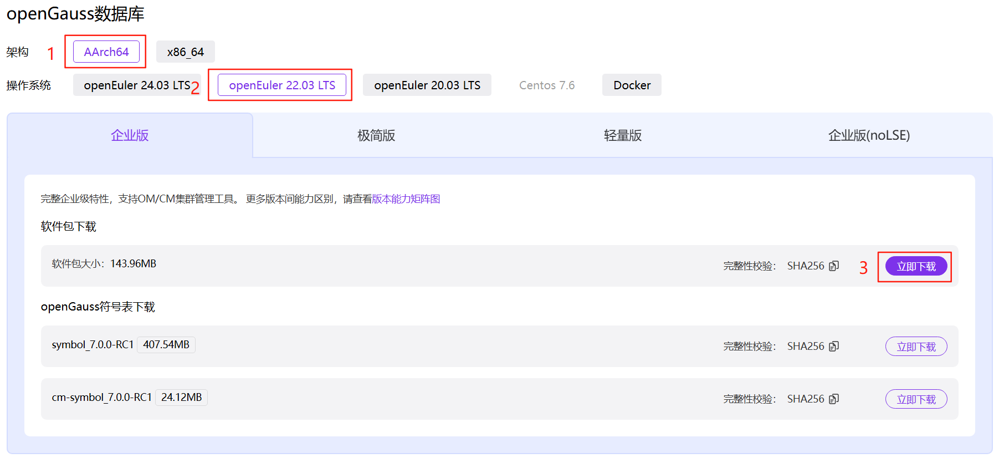

# 安装指南

## 环境准备

### 硬件环境要求

- 一主两备部署需要准备三台服务器，操作系统用openEuler22.03
- 内存：32GB以上
- CPU：1×8核，2.0GHz
- 硬盘：至少1GB
- 网络：300兆以上以太网

### 软件环境要求

- 操作系统：openEuler22.03

### 操作系统准备

#### 关闭防火墙

1. 修改`/etc/selinux/config`文件中的`SELINUX`值为`disabled`
	a. 使用`vim`打开`config`文件
	```shell
	vim /etc/selinux/config
	```
	b. 修改`SELINUX`的值`disabled`，执行`:wq`保存并退出修改
	```shell
	SELINUX=disabled
	```
2. 重新启动操作系统
```shell
reboot
```
3. 检查防火墙是否关闭
```shell
systemctl status firewalld
```
若防火墙状态显示为`active (running)`，则表示防火墙未关闭，请执行步骤4
若防火墙状态显示为`inactive (dead)`，则无需再关闭防火墙

4. 关闭防火墙并禁止开机重启
```shell
systemctl disable firewalld.service
systemctl stop firewalld.service
```
5. 在其他主机上重复步骤1到步骤4

#### 设置字符集

将各数据库节点的字符集设置为相同的字符集，可以在`/etc/profile`文件中添加`export LANG=XXX` (XXX为Unicode编码)
```shell
vim /etc/profile
```

#### 设置时区和时间

将各数据库节点的时区设置为相同时区，可以将`/usr/share/zoneinfo/`目录下的时区文件拷贝为`/etc/localtime`文件
```shell
cp /usr/share/zoneinfo/$地区/$时区 /etc/localtime
```
> `$地区` `$时区`为需要设置时区的信息，例如：`Asia_Shanghai`
使用`date -s`命令将各主机的时间设置为统一时间
```shell
date -s "Sat Sep 27 16:00:07 CST 2020"
```
> 多人共用环境禁止修改系统时间，请使用`ntp`同步时间

#### 设置网卡`MTU`值

将各数据库节点的网卡`MTU`值设置为相同大小

1. 执行如下命令查询服务器的网卡名称

```shell
ifconfig
```

2. 使用如下命令将各数据库节点的网卡`MTU`值设置为相同大小。`MTU`值推荐8192，要求不小于1500

```shell
ifconfig $网卡编号 mtu $值
```
#### 关闭`RemoveIPC`

在各数据库节点上，关闭`RemoveIPC`

1. 修改`/etc/systemd/logind.conf`文件中的`RemoveIPC`值为`no`

	a. 使用`vim`打开`logind.conf`文件
	```shell
	vim /etc/systemd/logind.conf
	```
	b. 修改`RemoveIPC`值为`no`
	```shell
	RemoveIPC=no
	```
2. 修改`/usr/lib/systemd/system/systemd-logind.service`文件中的`RemoveIPC`值为`no`
	a. 使用`vim`打开`systemd-logind.service`文件
	```shell
	vim /usr/lib/systemd/system/systemd-logind.service
	```
	b. 修改`RemoveIPC`值为`no`
	```shell
	RemoveIPC=no
	```
3. 重新加载配置参数
```shell
systemctl daemon-reload
systemctl restart systemd-logind
```
4. 检查修改是否生效
```shell
loginctl show-session | grep RemoveIPC
systemctl show systemd-logind | grep RemoveIPC
```
5. 在其他主机上重复步骤1到步骤4

#### 关闭`history`

为避免指令历史记录安全隐患，需关闭各主机的`history`指令

1. 修改根目录下`/etc/profile`文件
```shell
vim /etc/profile
```
2. 设置`HISTSIZE`值为0。例如，系统中`HISTSIZE`默认值为1000，将其修改为0
```shell
HISTSIZE=0
```
3. 保存`/etc/profile`
```shell
:wq
```
4. 设置`/etc/profile`生效
```shell
source /etc/profile
```

## 创建用户组

为了实现安装过程中安装帐户权限最小化，及安装后openGauss的系统运行安全性，安装脚本在安装过程中会自动按照用户指定内容创建安装用户，并将此用户作为后续运行和维护openGauss的管理员帐户

1. 创建用户组`dbgrp`
```shell
groupadd dbgrp
```
2. 创建用户组`dbgrp`下的普通用户`omm`
```shell
useradd -g dbgrp omm
```

## 配置`XML`文件

```shell
vim cluster.xml
```
以下配置内容为示例，可自行替换。每行信息均有注释进行说明
```xml
<ROOT>
    <!-- 整体信息 -->
    <CLUSTER>
        <!-- 数据库名称 -->
        <PARAM name="clusterName" value="Cluster" />
        <!-- 数据库节点名称(hostname) -->
        <PARAM name="nodeNames" value="openGauss1,openGauss2,openGauss3" />
        <!-- 数据库安装目录-->
        <PARAM name="gaussdbAppPath" value="/opt/openGauss/install/app" />
        <!-- 日志目录-->
        <PARAM name="gaussdbLogPath" value="/opt/openGauss/install/log" />
        <!-- 临时文件目录-->
        <PARAM name="tmpMppdbPath" value="/opt/openGauss/install/tmp" />
        <!--数据库工具目录-->
        <PARAM name="gaussdbToolPath" value="/opt/openGauss/install/tool" />
        <!--数据库core文件目录-->
        <PARAM name="corePath" value="/opt/openGauss/install/corefile" />
        <!-- 节点IP，与nodeNames一一对应，所有节点ip类型要一致（ipv4或ipv6）-->
        <PARAM name="backIp1s" value="192.168.0.1,192.168.0.2,192.168.0.3" />
        <!-- 资源池化模式开关 -->
        <PARAM name="enable_dss" value="on" />
        <!-- dss实例目录 -->
        <PARAM name="dss_home" value="/opt/openGauss/install/dss_home" />
        <!-- dss共享卷名 -->
        <PARAM name="ss_dss_vg_name" value="data" />
        <!-- dss挂载卷组名和卷组信息，包含共享卷 -->
        <PARAM name="dss_vg_info" value="data:/dev/sdb,log0:/dev/sdc" />
        <!-- cm投票卷 -->
        <PARAM name="votingDiskPath" value="/dev/sdd" />
        <!-- cm共享卷 -->
        <PARAM name="shareDiskDir" value="/dev/sde" />
        <!-- dss开启ssl认证开关 -->
        <PARAM name="dss_ssl_enable" value="on" />
    </CLUSTER>
    <!-- 每台服务器上的节点部署信息 -->
    <DEVICELIST>
        <!-- node1上的节点部署信息 -->
        <DEVICE sn="node1">
            <PARAM name="name" value="openGauss1" />
            <PARAM name="azName" value="AZ1" />
            <PARAM name="azPriority" value="1" />
            <!-- 如果服务器只有一个网卡可用，将backIP1和sshIP1配置成同一个IP -->
            <PARAM name="backIp1" value="192.168.0.1" />
            <PARAM name="sshIp1" value="192.168.0.1" />
            <PARAM name="sshPort" value="22" />
            <!--CM节点部署信息-->
            <PARAM name="cmsNum" value="1" />
            <PARAM name="cmServerPortBase" value="15400" />
            <PARAM name="cmServerListenIp1" value="192.168.0.1,192.168.0.2,192.168.0.3" />
            <PARAM name="cmServerHaIp1" value="192.168.0.1,192.168.0.2,192.168.0.3" />
            <PARAM name="cmServerlevel" value="1" />
            <PARAM name="cmServerRelation" value="openGauss1,openGauss2,openGauss3" />
            <PARAM name="cmDir" value="/opt/openGauss/install/data/cmserver" />
            <!--dn-->
            <PARAM name="dataNum" value="1" />
            <PARAM name="dataPortBase" value="15000" />
            <PARAM name="dataNode1" value="/opt/openGauss/install/data/dn1,openGauss2,/opt/openGauss/install/data/dn1,openGauss3,/opt/openGauss/install/data/dn1" />
            <PARAM name="dataNode1_syncNum" value="0" />
        </DEVICE>
        <!-- node2上的节点部署信息，其中“name”的值配置为主机名称 -->
        <DEVICE sn="node2">
            <PARAM name="name" value="openGauss2" />
            <PARAM name="azName" value="AZ1" />
            <PARAM name="azPriority" value="1" />
            <!-- 如果服务器只有一个网卡可用，将backIP1和sshIP1配置成同一个IP -->
            <PARAM name="backIp1" value="192.168.0.2" />
            <PARAM name="sshIp1" value="192.168.0.2" />
            <PARAM name="sshPort" value="22" />
            <!-- cm -->
            <PARAM name="cmServerPortStandby" value="15400" />
            <PARAM name="cmDir" value="/opt/openGauss/install/data/cmserver" />
        </DEVICE>
        <!-- node3上的节点部署信息，其中“name”的值配置为主机名称 -->
        <DEVICE sn="node3">
            <PARAM name="name" value="openGauss3" />
            <PARAM name="azName" value="AZ1" />
            <PARAM name="azPriority" value="1" />
            <!-- 如果服务器只有一个网卡可用，将backIP1和sshIP1配置成同一个IP -->
            <PARAM name="backIp1" value="192.168.0.3" />
            <PARAM name="sshIp1" value="192.168.0.3" />
            <PARAM name="sshPort" value="22" />
            <!-- cm -->
            <PARAM name="cmServerPortStandby" value="15400" />
            <PARAM name="cmDir" value="/opt/openGauss/install/data/cmserver" />
        </DEVICE>
    </DEVICELIST>
</ROOT>
```

## 获取安装包

1. 规划安装目录
```shell
mkdir -p /opt/software/openGauss
cd /opt/software/openGauss
```
2. 配置文件`cluster.xml`上传至上一步所创建的目录中
3. 通过[https://opengauss.org/zh/download/](https://opengauss.org/zh/download/)登录openGauss开源社区，选择对应平台的企业版安装包

```shell
wget https://opengauss.obs.cn-south-1.myhuaweicloud.com/7.0.0-RC1/openEuler22.03/arm/openGauss-All-7.0.0-RC1-openEuler22.03-aarch64.tar.gz
```
4. 解压安装包
	a. 解压安装包，检查安装目录及文件是否齐全。在安装包所在目录执行以下命令
	```shell
	tar -zxvf openGauss-All-7.0.0-RC1-openEuler22.03-aarch64.tar.gz
	ls -lb
	```

	显示类似如下信息

	```shell
	-rwx------  1 omm dbgrp         0 Mar 29 12:26 openGauss-CM-7.0.0-RC1-openEuler22.03-aarch64.sha256
	-rwx------  1 omm dbgrp  22923931 Mar 29 12:26 openGauss-CM-7.0.0-RC1-openEuler22.03-aarch64.tar.gz
	-rwx------  1 omm dbgrp        65 Mar 29 12:24 openGauss-OM-7.0.0-RC1-openEuler22.03-aarch64.sha256
	-rwx------  1 omm dbgrp  23430969 Mar 29 12:24 openGauss-OM-7.0.0-RC1-openEuler22.03-aarch64.tar.gz
	-rwx------  1 omm dbgrp        65 Mar 29 12:26 openGauss-Server-7.0.0-RC1-openEuler22.03-aarch64.sha256
	-rwx------  1 omm dbgrp 114382443 Mar 29 12:26 openGauss-Server-7.0.0-RC1-openEuler22.03-aarch64.tar.bz2
	-rwx------  1 omm dbgrp        65 Mar 29 12:22 upgrade_sql.sha256
	-rwx------  1 omm dbgrp    678469 Mar 29 12:22 upgrade_sql.tar.gz
	```
	b. 解压`OM`包
	```shell
	tar -zxvf openGauss-OM-7.0.0-RC1-openEuler22.03-aarch64.tar.gz
	```
	c. 修改目录权限
	```shell
	chmod 755 -R /opt/software
	```

## 预安装

1. 进入到工具脚本存放目录下
```shell
cd /opt/software/openGauss/script
```
2. 使用`gs_preinstall`准备好安装环境。若为共用环境需加入`--sep-env-file=ENVFILE`参数分离环境变量，避免与其他用户相互影响，ENVFILE为用户自行指定的环境变量分离文件的路径，可以为一个空文件
```shell
./gs_preinstall -U omm -G dbgrp -X /opt/software/openGauss/cluster.xml --sep-env-file=ENVFILE
```

## 执行安装

1. 登录到openGauss的主机，并切换到`omm`用户
```shell
su - omm
```
2. 使用`gs_install`安装openGauss，为环境变量分离的模式安装的数据库需要`source`环境变量分离文件`ENVFILE`
```shell
source ENVFILE
gs_install -X /opt/software/openGauss/cluster.xml
```

# 安装阶段问题

## 因`CheckOs`检测项不通过导致预安装失败问题

### 问题现象

预安装执行报错，报错信息如下
```shell
[GAUSS-52400] : Installation environment does not meet the desired result.
Please get more details by "gs_checkos -i A -h openGaussxxx,openGaussxxx -X /home/dbuser/1s1p.xml --detail".
```

### 定位方法

使用`gs_checkos`命令查看异常（`Abnormal`）的检查项

```shell
gs_checkos -i A -h openGaussxxx,openGaussxxx -X /home/dbuser/1s1p.xml --detail
```

### 问题根因

`gs_checkos`检测出现异常，基本是集群所在操作系统版本、网络、磁盘、内存等异常，或者是各主机时区、时间、字符集等不一致导致的

### 解决方法

按照 **操作系统准备** 章节进行设置

## 因预安装使用默认参数导致安装失败问题

### 问题现象

不设置`dataPortBase`、`cmServerPortBase`，端口被占用时，安装完成后启动数据库失败。以下报错信息为`cm`默认端口被占用的启动失败信息与`cm_agent`日志

启动失败信息
```shell
Failed to start cluster  in (300)s.
It will continue to start in the background.
If you want to see the cluster status, please try command gs_om -t status.
If you want to stop the cluster, please try command gs_om -t stop.
```
`cm_agent`报错信息
```shell
ERROR: 345: connect to cm_server failed, host=20.20.20.135 port=5000 localhost=20.20.20.135 connect_timeout=1 node_id=1 node_name=openGauss135 remote_type=7. could not connect to server:
        TCP/IP connections on port 5000?
```

### 定位方法

预安装阶段根据`XML`文件设置端口、数据库安装目录。如果在安装完成后出现数据库启动失败现象，先查看启动日志`$PGDATA/DBStart.log`和cm日志`$GAUSSLOG/cm/cm_agent`，对于端口被占用情况，使用命令`netstat -nap | grep xxxxx`或`lsof -i:xxxxx`检查`dataPortBase`或`cmServerPortBase`端口号是否被占用

### 问题根因

使用默认端口时，存在默认端口已被占用的情况，当端口占用时安装完成后数据库启动失败

### 解决方法

将`dataPortBase`、`cmServerPortBase`修改为未被占用的端口号，然后重新进行预安装与安装

## 因DSS启动加载共享盘失败导致数据库安装失败的问题

### 问题现象

资源池化环境安装过程中若出现`dss load vg`失败会出现如下报错信息：
```shell
[GAUSS-51252] : Failed to start the DSS server. Please check the dss logs.
```

### 定位方法

使用`cd`命令进入`$DSS_HOME/log/run`目录下，查看对应的`DSS server`日志，有以下日志信息：

```shell
UTC+8 2024-10-24 10:49:49.o24|dssserver|800864|ERROR>Scsi3 caw failed, addr 1032192, dev /dev/disk/by_id/wwn-xxxxxxxxxxxxxxxxxxxxxxxxxxxxxxxxxx, errno 0. [cm_dlock.c:327]
UTC+8 2024-10-24 10:49:49.o24|dssserver|800864|ERROR>Scsi3 caw failed, addr 1032192, dev /dev/disk/by_id/wwn-xxxxxxxxxxxxxxxxxxxxxxxxxxxxxxxxxx, errno 0. [cm_dlock.c:327]
UTC+8 2024-10-24 10:49:49.o24|dssserver|800864|ERROR>Failed to lock vg, entry_path /dev/disk/by_id/wwn-xxxxxxxxxxxxxxxxxxxxxxxxxxxxxxxxxx. [dss_diskgroup.c:938]
UTC+8 2024-10-24 10:49:49.o24|dssserver|800864|ERROR>Failed to lock vg:/dev/disk/by_id/wwn-xxxxxxxxxxxxxxxxxxxxxxxxxxxxxxxxxx. [dss_diskgroup.c:583]
UTC+8 2024-10-24 10:49:49.o24|dssserver|800864|ERROR>DSS instance failed to load vg:data ctrl! [dss_diskgroup.c:356]
UTC+8 2024-10-24 10:49:49.o24|dssserver|800864|ERROR>DSS instance failed to load vg:data! [dss_diskgroup.c:387]
UTC+8 2024-10-24 10:49:49.o24|dssserver|800864|ERROR>[RECOVERY]ABORT INFO: Failed to get vg info when instance start. [dss_instance.c:661]
```
从日志里可以清楚地看到`DSS instance failed to load vg`，`DSS`加载共享盘失败。查看安装时的配置文件，检查其盘符的命名方式

### 问题根因

在Linux系统中，`/dev`是设备文件的存储目录。`/dev/xxx`这种形式的设备文件是传统的设备命名方式，`xxx`通常是设备的基本名称。它的缺点是，设备名称可能会根据系统中设备的添加、移除或者启动顺序等因素而改变。例如，如果你在系统中添加了一个新的磁盘，原来的`sda`设备可能会变成`sdb`，这会导致基于设备名称的配置（如在`/etc/fstab`文件中挂载磁盘分区）出现问题，因为设备名与实际设备的映射关系发生了改变

而`/dev/disk/by-id`是一种更稳定的设备文件目录结构。这个目录下的设备文件是通过设备的唯一标识符来命名的，这些标识符通常是由设备的制造商、型号、序列号等信息生成的。该命名方式提供了更高的设备命名稳定性，并便于设备的识别与管理。无论设备的添加顺序如何改变，或者在系统重启后，只要设备本身的物理特性（如序列号等）不变，设备文件的名称就不会改变。这使得在系统管理和配置文件中使用设备文件路径时更加可靠，减少了因设备名称变化而导致的错误。通过设备的唯一标识符命名，管理员可以很容易地识别设备的具体信息，如制造商、型号等。这对于设备的维护、故障排查以及在多个相似设备中区分不同的设备非常有用

归根到底是在配置文件`cluster.xml`中，各个机器的盘符不一致导致的，即：配置文件中使用的`/dev/xxx`传统设备命名方式

### 解决方法

首先，检查在安装环境时配置的`cluster.xml`文件，该文件中的盘符`/dev/xxx`若不能保证各个机器的盘符一致，建议使用统一的`/dev/disk/by-id`编码

而后，使用`gs_uninstall --delete-data`命令删除安装数据，重新进行预安装和安装过程即可