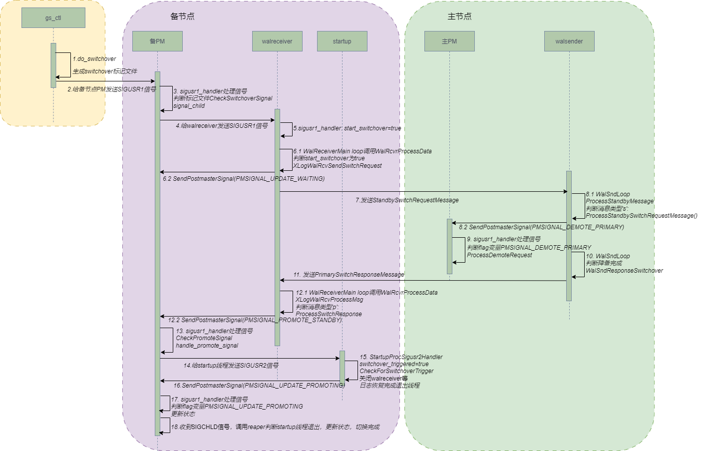

# 初探磐维数据库switchover实现机制

磐维数据库作为一款高可靠的企业级关系型数据库，支持一主多备、级联备等灵活的部署结构，主备之间可以通过switchover进行角色切换，主机故障后也可以通过failover对备机进行升主。

## **switchover执行过程**

在需要升主的备节点执行以下命令，会触发主备切换操作：

```
gs_ctl switchover -D /home/omm/cluster/dn1/
```

**switchover执行涉及到如下线程**：

- postmaster：数据库主线程。主要有两个功能：一是对连接进行监听，接收新的连接；二是监控所有子线程的状态，并且根据子线程退出状态进行处理，如果线程是FATAL退出，则重新拉起子线程。如果线程是PANIC退出，则进行整个数据库重新初始化，保证数据库的正常运行。
- startup: 数据库启动线程。数据库启动时postmaster主线程拉起的第一个子线程，主要完成数据库的日志REDO操作。日志REDO操作结束，如果不是备机，则Startup线程退出。如果是备机，那么Startup线程一直运行，持续REDO备机接收到的新日志。
- walsender：主要用于主节点发送WAL日志记录到备节点。
- walreceiver：主要用于备节点接收主节点的WAL日志记录。

**switchover主备切换执行过程如下图所示：**



**switchover核心步骤如下:**

1. gs_ctl工具执行switchover命令时调用do_switchover，在备节点的数据目录生成switchover文件，同时向备节点的postmaster主线程发送SIGUSR1信号。

```c++
//pg_ctl.cpp
static void do_switchover(uint32 term)
{
    FILE* sofile = NULL;
    pgpid_t pid;
    ServerMode run_mode;
    ServerMode origin_run_mode;
    ……
    if ((sofile = fopen(switchover_file, "w")) == NULL) {
        pg_log(
            PG_WARNING, _(" could not create switchover signal file \"%s\": %s\n"), switchover_file, strerror(errno));
        exit(1);
    }
    ……
    sig = SIGUSR1;
    if (kill((pid_t)pid, sig) != 0) {
        pg_log(PG_WARNING, _(" could not send switchover signal (PID: %ld): %s\n"), pid, strerror(errno));
        if (unlink(switchover_file) != 0)
            pg_log(PG_WARNING, _(" could not send switchover signal (PID: %ld): %s\n"), pid, strerror(errno));
        exit(1);
    }
    ……
} 
```

2. 备节点postmaster收到SIGUSR1信号，会调用sigusr1_handler函数，判断switchover文件是否存在，存在的话则正式开始进入switchover流程，给walreceiver发送SIGUSR1信号。

```c++
//postmaster.cpp
static void sigusr1_handler(SIGNAL_ARGS)
{
    int mode = 0;
    int save_errno = errno;
    volatile HaShmemData* hashmdata = t_thrd.postmaster_cxt.HaShmData;

    gs_signal_setmask(&t_thrd.libpq_cxt.BlockSig, NULL);
    
……

if ((mode = CheckSwitchoverSignal()) != 0 && WalRcvIsOnline() && DataRcvIsOnline() &&
        (pmState == PM_STARTUP || pmState == PM_RECOVERY || pmState == PM_HOT_STANDBY || pmState == PM_WAIT_READONLY)) {
        if (!IS_SHARED_STORAGE_STANDBY_CLUSTER_STANDBY_MODE) {
            ereport(LOG, (errmsg("to do switchover")));
            /* Label the standby to do switchover */
            t_thrd.walreceiverfuncs_cxt.WalRcv->node_state = (ClusterNodeState)mode;
            if (g_instance.attr.attr_storage.dcf_attr.enable_dcf && t_thrd.dcf_cxt.dcfCtxInfo->isDcfStarted) {
                PaxosPromoteLeader();
            } else {
                /* Tell walreceiver process to start switchover */
                signal_child(g_instance.pid_cxt.WalReceiverPID, SIGUSR1);
            }
        } else {
            ereport(LOG, (errmsg("standby cluster could not do switchover")));
        }
    }
……

}
```

3. walreceiver收到SIGUSR1信号，同样调用自己的sigusr1_handler函数，将start_switchover变量修改为true。另外walreceiver线程会循环调用WalRcvrProcessData来处理各类信息，在这个函数里会判断start_switchover的值，当为true时调用XLogWalRcvSendSwitchRequest使用TCP连接给主节点发送StandbySwitchRequestMessage消息，消息类型用字符’s’表示。
4. 主节点的walsender收到消息后给主节点的postmaster发送SIGUSR1信号，同时指定PMSignalFlags[PMSIGNAL_DEMOTE_PRIMARY]为true。PMSignalFlags是一个整型数组，表示所有使用SIGUSR1信号通信的原因标识集合。收到SIGUSR1信号的线程可以通过判断具体某个标识是否为true来执行不同的处理逻辑。

```c++
//pmsignal.cpp
void SendPostmasterSignal(PMSignalReason reason)
{
    /* If called in a standalone backend, do nothing */
    if (!IsUnderPostmaster)
        return;

    /* Atomically set the proper flag , sig_atomic_t PMSignalFlags[NUM_PMSIGNALS] */
    t_thrd.shemem_ptr_cxt.PMSignalState->PMSignalFlags[reason] = true;
    gs_signal_send(PostmasterPid, SIGUSR1);
}

bool CheckPostmasterSignal(PMSignalReason reason)
{
    /* Careful here --- don't clear flag if we haven't seen it set */
    if (t_thrd.shemem_ptr_cxt.PMSignalState->PMSignalFlags[reason]) {
        t_thrd.shemem_ptr_cxt.PMSignalState->PMSignalFlags[reason] = false;
        return true;
    }

    return false;
}
```
5. 主节点postmaster处理收到的SIGUSR1信号，检查PMSignalFlags判断是降备请求则开始降备，walsender判断降备完成后给备节点的walreceiver发送PrimarySwitchResponseMessage消息，消息类型用字符’p’表示。
```c++
//postmaster.cpp
if (CheckPostmasterSignal(PMSIGNAL_DEMOTE_PRIMARY)) {
        gs_lock_test_and_set_64(&g_instance.stat_cxt.NodeStatResetTime, GetCurrentTimestamp());
        ProcessDemoteRequest();
}
```

6. walreceiver收到消息后与备节点的postmaster发送SIGUSR1信号，同时指定PMSignalFlags[PMSIGNAL_PROMOTE_STANDBY]为true，准备开始升主。
7. 备节点postmaster处理收到的SIGUSR1信号，检查PMSignalFlags判断是升主请求，给startup线程发送SIGUSR2信号，同时指定NotifySignalFlags[NOTIFY_SWITCHOVER]为true（与PMSignalFlags类似）。
8. startup线程收到SIGUSR2信号，判断NotifySignalFlags为switchover操作，将switchover_triggered变量修改为true。变量为true会触发关闭walreceiver等线程，结束日志恢复，startup线程退出（startup线程在备节点常驻，主节点完成日志恢复后即退出）。
9. 备节点postmaster收到startup退出时发出的SIGCHLD信号，更新状态，切换完成。

------

上面介绍的switchover执行过程中主要用到了SIGUSR1/SIGUSR2/SIGCHLD信号、全局变量、TCP等线程通信方式。通过梳理switchover的执行过程，可以看到一个请求或任务的实现涉及大量线程间的协调交互，在不同的任务中线程间使用多种通信方式紧密配合，可以更高效稳定的完成数据处理任务。
