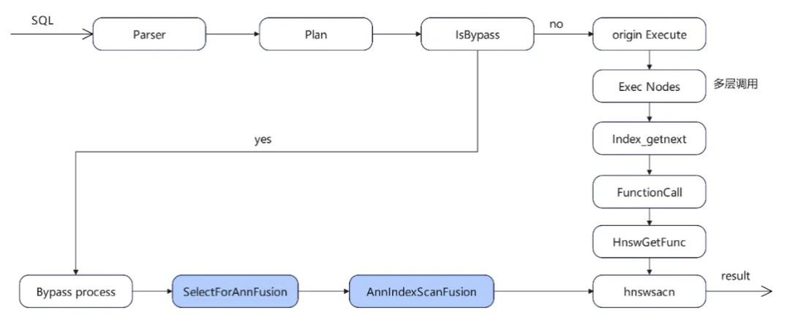
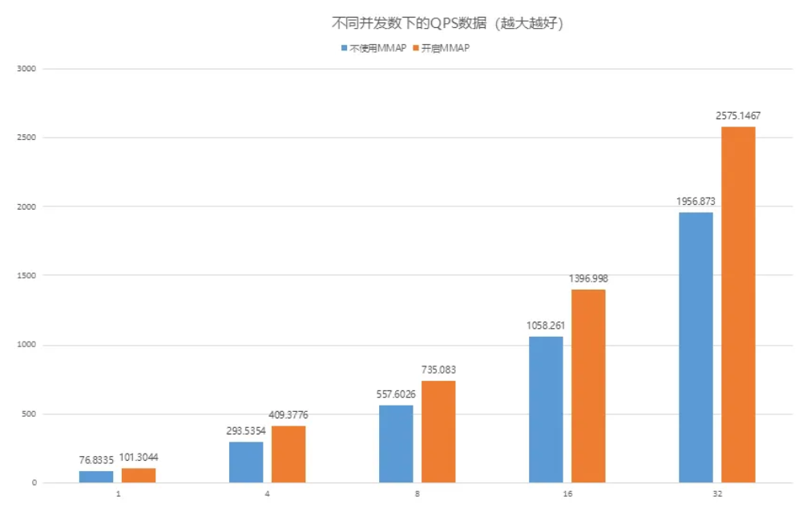
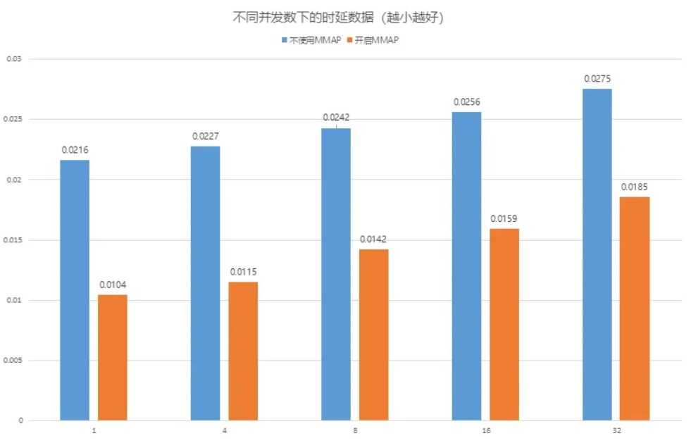

openGauss 7.0.0-RC2 是社区最新发布的创新版本， 版本生命周期为6个月。在该版本中发布了Bypass和 MMAP两个技术特性，提升 AI 核心场景的数据库性能。

### ByPass 机制： 按需简化，效率跃升

openGauss 作为企业级开源数据库，创新性地推出Bypass 机制，通过精准识别可优化场景、选择性简化非核心流程，在确保数据一致性的前提下实现了关键操作的效率跃升。 Bypass 机制的核心思想是 "按需简化"—— 针对数据库中资源消耗大、流程冗余度高的特定操作，在不破坏 ACID 核心特性的前提下，跳过非必要的校验、日志或交互环节，为高频场景开辟优化路径。



openGauss7.0.0版本在引入向量数据库之后，向量数据库已成为支撑语义搜索、推荐系统、计算机视觉等场景的核心基础设施。其中，向量索引检索的效率直接决定了 AI 应用的响应速度与用户体验。

openGauss7.0.0-RC2版本在向量检索增加Bypass机制并非简单 "走捷径"，而是基于向量检索的特性设计的精准优化方案：通过识别可省略的非核心步骤，为高频查询开辟专属通道，同时严格保障向量计算的准确性与结果完整性。

向量索引检索与 Bypass 功能的打通，本质是场景化优化思想在向量数据库领域的延伸。其核心价值不仅在于性能提升，更在于为向量数据库的工程化落地提供了灵活的效率调节手段 —— 既满足核心场景的极致性能需求，又通过安全机制守住准确性底线。

### MMAP：突破向量数据库性能检索边界

openGauss7.0.0-RC2 版本针对向量数据库HNSW索引检索，引入MMAP技术，通过深度整合操作系统级内存管理机制，为向量索引检索的读密集场景带来颠覆性性能突破，重新定义高性能向量数据库的技术标准。

MMAP打破传统I/O流程，将向量索引文件直接挂载到进程虚拟空间，实现“内存般的直接访问”。

- 零拷贝加速： 省去用户态与内核态的数据拷贝，特别针对向量索引这种大文件随机访问，读操作效率提升30%~50%

- 简化 I/O 链路： 摒弃传统read/write系统调用的繁琐流程，系统调用开销降低50%

#### AI场景实测

**向量索引检索：毫秒级响应成为常态**

在亿级向量数据的近似查询中，借助MMAP对索引文件的直接映射，避免了传统 I/O 的多次拷贝，单并发查询QPS从80提升至110，提升了30%+。结合 openGauss数据库独有的 Bypass 算子复用技术，执行链路进一步精简，复杂检索场景下性能较行业平均水平提升30%+。

**读密集型业务：并发承载能力翻倍**

通过MMAP内存映射 + 鲲鹏 NUMA 架构优化 + 线程亲核绑定的三重技术组合，在高并发下，高并发向量数据库索引（HNSW）检索性能比友商提升30%+

openGauss7.0.0-RC2 版本针对向量数据库HNSW索引检索，MMAP功能已经全面开放。

### 使用示例

前置参数设置：

- enable_mmap=on - 需要guc文件配置，重启生效
- hnsw _use_ mmap=on - 会话级别参数
- use_mmap=true -创建索引时属性

使用L2距离创建带MMAP功能的HNSW索引：

```sql
CREATE TABLE items (val vector(3));CREATE INDEX ON items USING hnsw (embedding vectorl2ops) WITH (use_mmap=true);
```

插入数据：

```sql
INSERT INTO items (val) VALUES ('[1,2,3]'), ('[4,5,6]');
```

无需修改业务代码，兼容现有向量索引检索SQL 语法：

```sql
SELECT /+ indexscan(items itemsembeddingidx) / * FROM items ORDER BY embedding <-> '[3,1,2]';
```

以Cohere 1M 768维数据集为例，VectorDBBench测试结果如下：



