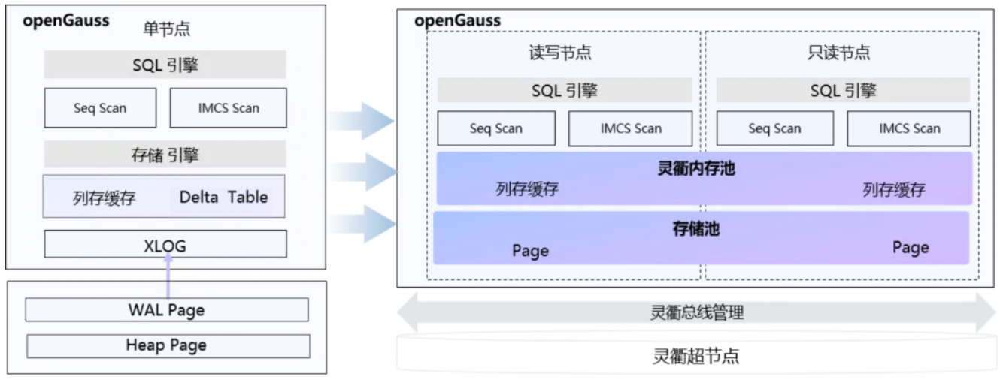
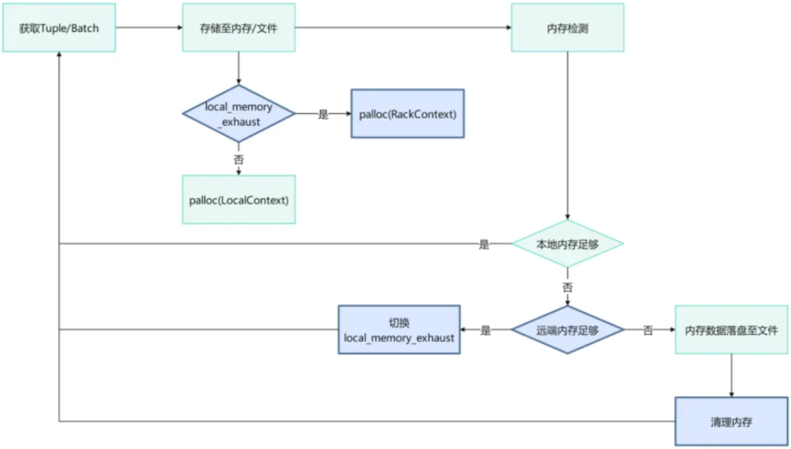

基于“超节点+集群”算力解决方案及面向超节点的互联协议灵衢（UnifiedBus），openGauss 通过适配灵衢集群间内存共享、内存借用能力，提升复杂语句处理能力，提升 AP 检索过程；通过灵衢系统上的共享内存减少数据库恢复时需要回放的日志量，降低 RTO 恢复时间，提升数据库可靠性能力。


### 资源池化 HTAP 行列融合

资源池化存算分离场景下（单机/主备 HTAP 参考行列融合），通过主、从节点的行列双格式内存模式，实现 openGauss 资源池化 HTAP 一体化数据库架构。本地内存模式下，实现列存数据主、从节点分片存储；共享内存（灵衢）模式下，列存数据存储在远端共享内存，实现主、从节点共享一份列存数据。同时支持资源池化多机并行列缓存查询能力，显著增强 openGauss 在大型复杂 OLAP 场景中的数据分析能力。

openGauss 资源池化场景下，支持主、从节点形成行列双格式内存形式。




#### 行列数据转换

用户在主节点发送针对表数据的行列转换请求：

- 本地内存场景 ： 与主备场景类似，主、从节点接收到表的行列转换请求后，通过分片策略完成各自行列数据转换后，形成基础列存储单元（Column Unit），批量插入申请的本地列存内存中。
- 共享内存场景 ： 主节点接受到表的行列转换请求后，将列存数据存储到远端共享内存中，本地存储仅存储列存元数据，并通过网络通道将元数据发送至从节点进行缓存，实现主、从节点共享同一份列存数据。

#### 基于 DMS 的多机行列缓存数据同步

为了保障从节点列缓存数据的实时性，设计基于 DMS 的多机列缓存数据同步能力，主节点增量表存储增量数据，同步后台线程更新列存储单元（Column Unit）并广播至从节点，实现所有节点的列存数据同步更新。

支持多机并行列缓存的扫描查询

新增 SPQ-CStore-Scan （SPQCStore scan）多机并行列缓存查询算子，基于 openGauss 执行优化器及代价估算，生成包含多机并行列缓存查询算子的向量化执行计划。

#### 使用指导

- 共享内存行列转换

在灵衢环境下，启动数据库前，配置列缓存节点、配置灵衢共享内存 so 路径、配置列存可用远端共享内存大小。

```sql
ss_htap_cluster_map = 'node1|x.x.x.x|12300,node2|x.x.x.x|12300'shared_preload_libraries = 'spqplugin'lmemfabric_client_path = 'lmemfabric_client.so'ss_max_imcs_cache = 10GB
```

转换方式 1：全表转换

```sql
ALTER TABLE table_name IMCSTORED WITH SHARE_MEMORY;
```

转换方式 2：表部分列转换

```sql
ALTER TABLE table_name IMCSTORED(column_name_list) WITH SHARE_MEMORY;
```

- 多机并行列存扫描：

使用 gsql 登录数据库

```sql
set spqplugin.enable_spq = on；set enable_imcsscan = on;set spqplugin.cluster_map = 'node1|x.x.x.x|12300,node2|x.x.x.x|12300'
```

查看多机并行查询计划，使用 SPQCstoreScan 算子

```sql
explain select imcstored_columns from table_name;
```

清除已转换的列缓存

```sql
ALTER TABLE table_name UNIMCSTORED;
```

### 内存语义算子

openGauss 的算子内存借用功能是基于灵衢内存借用能力实现的功能，它允许数据库查询执行期间的部分算子动态借用远端节点的空闲内存资源。通过扩展算子可用的 work_mem，有效提升内存密集型操作的执行效率。

#### 环境需求

需要环境支持并且配置灵衢内存借用能力。同时集群中配置的远端节点有空闲内存资源。

#### 适用场景

大型分析型查询：处理大规模数据集时，需要大量的内存空间用于 Sort/HashJoin/Agg，内存不足会触发大量落盘导致性能下降明显

本地内存不足：当本地节点内存资源紧张但集群其他节点有空闲内存

支持动态内存借用算子：

1. HashAgg
2. HashJoin
3. Sort
4. Sonic HashAgg / Vector HashAgg
5. Sonic HashJoin / Vector HashJoin

当配置适当时，算子内存借用可以带来：

- 减少甚至消除内存不足导致的落盘操作
- 提升内存密集型算子 30%的执行效率（典型 TPCH 1T 场景）
- 混合负载集群中，可以提高整体资源利用率



启用算子内存借用功能，需要进行以下配置：

修改配置文件，设置最大内存借用可用大小。（postgresql.conf）该参数需要重启 openGauss 生效。

```
# 该openGauss实例总可用借用内存，算子内存借用和其他功能（HTAP借用等）共用该上限max_rack_memory = 64GB# 配置算子可借用内存set borrow_work_mem = 16GB
```

### 基于内存池共享内存降低 RTO 时间

#### 特性价值

目前 openGauss 已通过并行回放、极致 RTO 等技术降低 RTO，本特性在此基础上通过内存池共享内存进一步降低数据恢复时间，提高可用性。在 70 万 tpmc 下，开启极致 RTO 时备机 failover 升主时间小于 6s。

#### 特性实现

UBS Memory 是在灵衢超节点上基于底层 UB Memory 能力提供的高阶服务能力，实现 UB（Unified Bus，灵衢总线）系统上的内存借用和共享能力，为上层应用提供 UB Memory 的简易使用能力。通过对底层硬件能力和 OS 层接口的封装和集成，提供类 posix 逻辑的操作接口，UBS Memory 特性分为内存借用和内存共享两类，共享内存可供多个节点共同使用，本特性使用 UBS Memory 的内存共享功能。

正常情况下，当数据库对 page 进行修改时，会将对应 page 异步写入共享内存，共享内存与数据库进程相互独立，不受数据库故障影响。当主机故障时，主机重启或备机升主的过程中，会跳过共享内存中 page 对应的部分日志回放，对应 page 在数据库提供服务后会从共享内存中进行拉取，此时如果访问共享内存中未拉取的 page 则会进行按需拉取。本特性通过减少故障恢复过程中所需回放的日志量，从而达到加速故障恢复过程的效果。

guc 参数 max_smb_memory 控制本特性的开关，max_smb_memory 的值为共享内存的大小，为 0 时表示不使用本特性。

- 参数说明： 从内存池中申请的共享内存大小，用于存放数据库修改的 page。该参数属于 POSTMASTER 类型参数，请参考表 1 中对应设置方法进行设置。
- 取值范围： 整型， 0 ~ 13107200, 单位为 8kB。max_smb_memory 需要设置为 BLCKSZ 的整数倍，BLCKSZ 目前设置为 8kB，即 max_smb_memory 需要设置为 8kB 整数倍。
- 默认值：0

#### 设置建议

主备场景在开启极致 RTO 的情况下，一般设置为 10GB 足够。单主机场景下，推荐设置为 50GB。