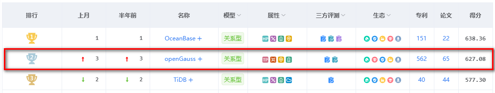
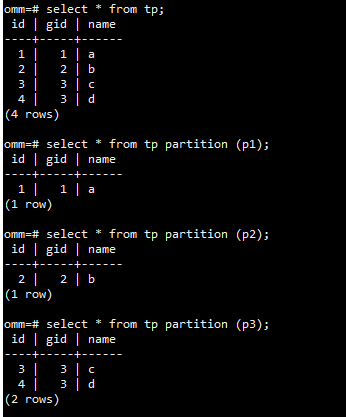
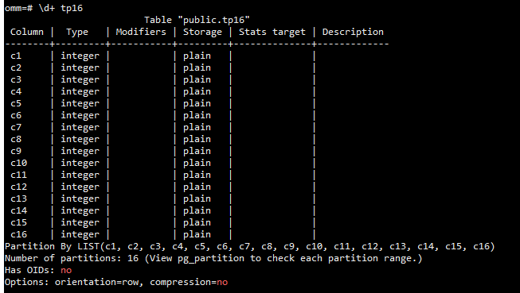
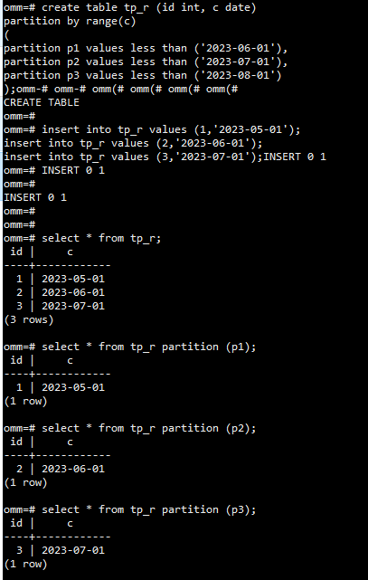
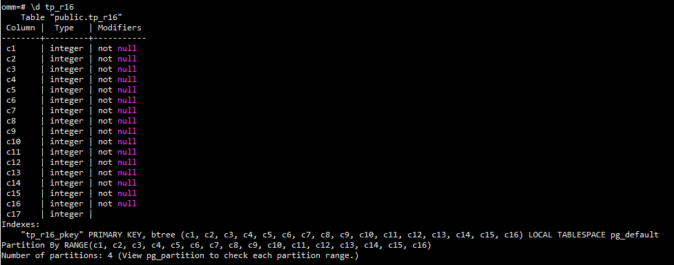
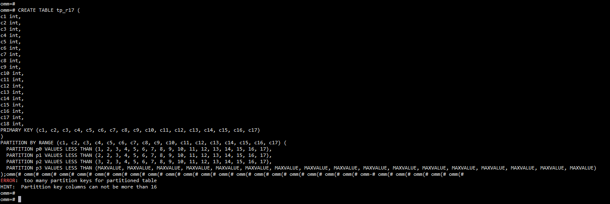
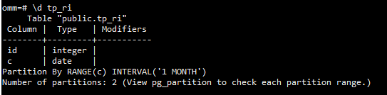

本文出处：[https://www.modb.pro/db/658001](https://www.modb.pro/db/658001)


随着数据库技术的不断发展，分区表已经成为数据库系统中不可或缺的一部分。openGauss 作为国产数据库的佼佼者，值得我们去研究一下。
在此恭喜 openGauss 在 2023年7月中国数据库排行榜中荣升第二。



openGauss 5.0.0是openGauss发布的第三个LTS版本，该版本生命周期为3年。openGauss 5.0.0 作为一款先进的关系型数据库管理系统，在其最新版本中增强了分区表的功能，从而更好地满足用户的需求。

下面我们逐一看下分区表都有哪些新变化。

## List分区键最大数由1扩展为16列

之前的版本中 List分区只支持一个分区键，例如：

```sql
create table tp (id int, gid int, name varchar(10))
partition by list (gid)
(
partition p1 values (1),
partition p2 values (2),
partition p3 values (3)
);

insert into tp values (1,1,'a');
insert into tp values (2,2,'b');
insert into tp values (3,3,'c');
insert into tp values (4,3,'d');

select * from tp;
select * from tp partition (p1);
select * from tp partition (p2);
select * from tp partition (p3);
```



现在在 openGauss 5.0.0 版本中，分区键支持16列:

```sql
create table tp16 (
c1 int,
c2 int,
c3 int,
c4 int,
c5 int,
c6 int,
c7 int,
c8 int,
c9 int,
c10 int,
c11 int,
c12 int,
c13 int,
c14 int,
c15 int,
c16 int
)
partition by list (
c1,
c2,
c3,
c4,
c5,
c6,
c7,
c8,
c9,
c10,
c11,
c12,
c13,
c14,
c15,
c16
)
(
partition p1 values ((1,2,3,4,5,6,7,8,9,10,11,12,13,14,15,16)),
partition p2 values ((2,2,3,4,5,6,7,8,9,10,11,12,13,14,15,16)),
partition p3 values ((3,2,3,4,5,6,7,8,9,10,11,12,13,14,15,16)),
partition p4 values ((4,2,3,4,5,6,7,8,9,10,11,12,13,14,15,16)),
partition p5 values ((5,2,3,4,5,6,7,8,9,10,11,12,13,14,15,16)),
partition p6 values ((6,2,3,4,5,6,7,8,9,10,11,12,13,14,15,16)),
partition p7 values ((7,2,3,4,5,6,7,8,9,10,11,12,13,14,15,16)),
partition p8 values ((8,2,3,4,5,6,7,8,9,10,11,12,13,14,15,16)),
partition p9 values ((9,2,3,4,5,6,7,8,9,10,11,12,13,14,15,16)),
partition p10 values ((10,2,3,4,5,6,7,8,9,10,11,12,13,14,15,16)),
partition p11 values ((11,2,3,4,5,6,7,8,9,10,11,12,13,14,15,16)),
partition p12 values ((12,2,3,4,5,6,7,8,9,10,11,12,13,14,15,16)),
partition p13 values ((13,2,3,4,5,6,7,8,9,10,11,12,13,14,15,16)),
partition p14 values ((14,2,3,4,5,6,7,8,9,10,11,12,13,14,15,16)),
partition p15 values ((15,2,3,4,5,6,7,8,9,10,11,12,13,14,15,16)),
partition p16 values ((16,2,3,4,5,6,7,8,9,10,11,12,13,14,15,16))
);

omm=# \d tp16
     Table "public.tp16"
Column |  Type   | Modifiers
--------+---------+-----------
c1     | integer |
c2     | integer |
c3     | integer |
c4     | integer |
c5     | integer |
c6     | integer |
c7     | integer |
c8     | integer |
c9     | integer |
c10    | integer |
c11    | integer |
c12    | integer |
c13    | integer |
c14    | integer |
c15    | integer |
c16    | integer |
Partition By LIST(c1, c2, c3, c4, c5, c6, c7, c8, c9, c10, c11, c12, c13, c14, c15, c16)
Number of partitions: 16 (View pg_partition to check each partition range.)
```



## RANGE 分区键最大数由4扩展为16列

LIST分区和RANGE分区都是一种将数据根据特定条件进行分区的技术，但是它们之间存在一些关键区别，主要区别在于存储值、分区键和数据分布。在选择使用哪种分区技术时，需要根据具体的需求和场景进行权衡和选择。

间隔分区是在范围分区的基础上，增加了间隔值“PARTITION BY RANGE (partition_key)”的定义。

例如：

```sql
create table tp_r (id int, c date)
partition by range(c)
(
partition p1 values less than ('2023-06-01'),
partition p2 values less than ('2023-07-01'),
partition p3 values less than ('2023-08-01')
);

insert into tp_r values (1,'2023-05-01');
insert into tp_r values (2,'2023-06-01');
insert into tp_r values (3,'2023-07-01');

select * from tp_r;
select * from tp_r partition (p1);
select * from tp_r partition (p2);
select * from tp_r partition (p3);
```



在之前的 openGauss 版本中，分区键支持4列：

```sql
CREATE TABLE tp_r4 (
c1 int,
c2 int,
c3 int,
c4 int,
c5 int,
PRIMARY KEY (c1, c2, c3, c4)
)
PARTITION BY RANGE (c1, c2, c3, c4) (
  PARTITION p0 VALUES LESS THAN (1, 10, 100, 1000),
  PARTITION p1 VALUES LESS THAN (2, 20, 200, 2000),
  PARTITION p2 VALUES LESS THAN (3, 30, 300, 3000),
  PARTITION p3 VALUES LESS THAN (MAXVALUE, MAXVALUE, MAXVALUE, MAXVALUE)
);
```

查看表结构如下：

```sql
omm=# CREATE TABLE tp_r4 (
c1 int,
c2 int,
c3 int,
c4 int,
c5 int,
PRIMARY KEY (c1, c2, c3, c4)
)
PARTITION BY RANGE (c1, c2, c3, c4) (
  PARTITION p0 VALUES LESS THAN (1, 10, 100, 1000),
  PARTITION p1 VALUES LESS THAN (2, 20, 200, 2000),
  PARTITION p2 VALUES LESS THAN (3, 30, 300, 3000),
  PARTITION p3 VALUES LESS THAN (MAXVALUE, MAXVALUE, MAXVALUE, MAXVALUE)
);omm(# omm(# omm(# omm(# omm(# omm(# omm(# omm-# omm(# omm(# omm(# omm(# omm(#
NOTICE:  CREATE TABLE / PRIMARY KEY will create implicit index "tp_r4_pkey" for table "tp_r4"
CREATE TABLE
omm=#
omm=# \d tp_r4
     Table "public.tp_r4"
 Column |  Type   | Modifiers
--------+---------+-----------
 c1     | integer | not null
 c2     | integer | not null
 c3     | integer | not null
 c4     | integer | not null
 c5     | integer |
Indexes:
    "tp_r4_pkey" PRIMARY KEY, btree (c1, c2, c3, c4) LOCAL TABLESPACE pg_default
Partition By RANGE(c1, c2, c3, c4)
Number of partitions: 4 (View pg_partition to check each partition range.)
```

从 openGauss 5.0.0 开始， RANGE 分区键最大数由4扩展为16列，列举如下：

```sql
CREATE TABLE tp_r16 (
c1 int,
c2 int,
c3 int,
c4 int,
c5 int,
c6 int,
c7 int,
c8 int,
c9 int,
c10 int,
c11 int,
c12 int,
c13 int,
c14 int,
c15 int,
c16 int,
c17 int,
PRIMARY KEY (c1, c2, c3, c4, c5, c6, c7, c8, c9, c10, c11, c12, c13, c14, c15, c16)
)
PARTITION BY RANGE (c1, c2, c3, c4, c5, c6, c7, c8, c9, c10, c11, c12, c13, c14, c15, c16) (
  PARTITION p0 VALUES LESS THAN (1, 2, 3, 4, 5, 6, 7, 8, 9, 10, 11, 12, 13, 14, 15, 16),
  PARTITION p1 VALUES LESS THAN (2, 2, 3, 4, 5, 6, 7, 8, 9, 10, 11, 12, 13, 14, 15, 16),
  PARTITION p2 VALUES LESS THAN (3, 2, 3, 4, 5, 6, 7, 8, 9, 10, 11, 12, 13, 14, 15, 16),
  PARTITION p3 VALUES LESS THAN (MAXVALUE, MAXVALUE, MAXVALUE, MAXVALUE, MAXVALUE, MAXVALUE, MAXVALUE, MAXVALUE, MAXVALUE, MAXVALUE, MAXVALUE, MAXVALUE, MAXVALUE, MAXVALUE, MAXVALUE, MAXVALUE)
);
```



如果超过16列，比如17列，则会出现报错：

```sql
CREATE TABLE tp_r17 (
c1 int,
c2 int,
c3 int,
c4 int,
c5 int,
c6 int,
c7 int,
c8 int,
c9 int,
c10 int,
c11 int,
c12 int,
c13 int,
c14 int,
c15 int,
c16 int,
c17 int,
c18 int,
PRIMARY KEY (c1, c2, c3, c4, c5, c6, c7, c8, c9, c10, c11, c12, c13, c14, c15, c16, c17)
)
PARTITION BY RANGE (c1, c2, c3, c4, c5, c6, c7, c8, c9, c10, c11, c12, c13, c14, c15, c16, c17) (
  PARTITION p0 VALUES LESS THAN (1, 2, 3, 4, 5, 6, 7, 8, 9, 10, 11, 12, 13, 14, 15, 16, 17),
  PARTITION p1 VALUES LESS THAN (2, 2, 3, 4, 5, 6, 7, 8, 9, 10, 11, 12, 13, 14, 15, 16, 17),
  PARTITION p2 VALUES LESS THAN (3, 2, 3, 4, 5, 6, 7, 8, 9, 10, 11, 12, 13, 14, 15, 16, 17),
  PARTITION p3 VALUES LESS THAN (MAXVALUE, MAXVALUE, MAXVALUE, MAXVALUE, MAXVALUE, MAXVALUE, MAXVALUE, MAXVALUE, MAXVALUE, MAXVALUE, MAXVALUE, MAXVALUE, MAXVALUE, MAXVALUE, MAXVALUE, MAXVALUE, MAXVALUE)
);
```

报错信息：

```c
ERROR:  too many partition keys for partitioned table
HINT:  Partittion key columns can not be more than 16
```




## 基于范围分区的自动扩展分区

openGauss 中提供了一种自动扩展分区的分区表建表语法，可以自定义按日期进行分区，而无需预定义创建表分区定义，系统可以自行创建系统分区，并命名为 `sys_p1, sys_p2, ...`。

```sql
create table tp_ri (id int, c date)
PARTITION BY RANGE (c)
INTERVAL ('1 MONTH')
(
PARTITION START VALUES LESS THAN('2023-01-01'),
PARTITION LATER VALUES LESS THAN('2024-12-31')
);
```



## 总结

openGauss 5.0.0 的分区表增强功能为用户提供了更加灵活、高效和可靠的数据存储和查询解决方案。这些功能不仅提高了表的性能，而且还有助于简化数据库系统的管理。因此，用户可以更加信任和依赖 openGauss 5.0.0 来处理他们的数据。

