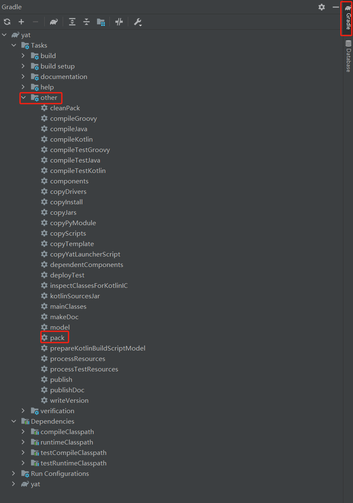
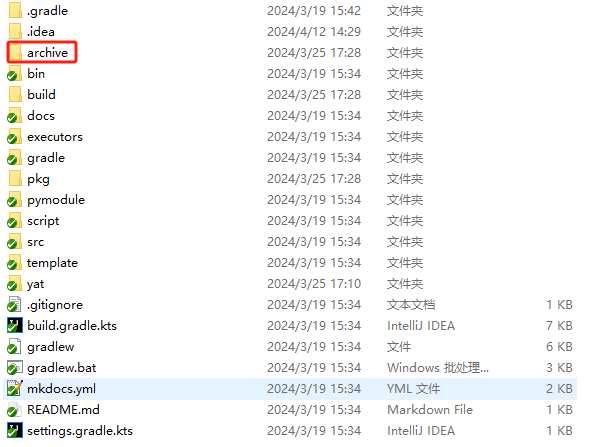
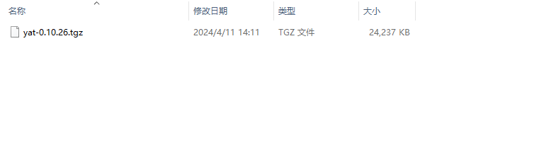
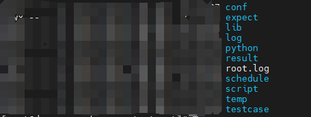
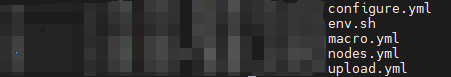
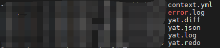

本文主要介绍Yat测试框架的安装和使用，文中介绍了基本的安装方法，用例编写，调度文件编写，配置文件修改和用例执行，用户可根据文中示例进行简单的用例编写和了解Yat框架的使用。

# 1. 安装

## 1.1 基本环境

<br/>

基本环境要求: Java 1.8+,Python 3.6+;

<br/>

## 1.2 下载安装

<br/>

从openGauss社区拉取Yat测试框架<https://gitee.com/opengauss/Yat/tree/master/yat-master>代码

<br/>

### 1.2.1 生成安装包

<br/>

（1）在linux环境里可直接在yat-master目录下执行一下命令生成安装包

```
chmod 755 gradlew
./gradlew pack 
```

（2）也可在windows里用IDEA以Gradle项目打开，右边栏点击Gradle->yat->other->pack生成安装包








上传到服务器指定位置用安装包进行安装


### 1.2.2 安装


install脚本涉及安装python第三方包列表：

```
xlrd，requests，pyyaml，click，openpyxl，paramiko，scp，jinjia2，paramunittest，pytest
```

install脚本使用pip安装上述三方包，需要用户环境pip环境已安装

```
tar zxf yat-***

python3 install -F
```


-F是强制覆盖安装，由于安装三方库较多且运行中使用python系统包，建议以root用户安装，后续在不同的用户路径下初始化测试套，以root运行。

### 1.2.3 安装后检查版本


yat version或者yat info检查是否显示相关信息

# 2. 使用


## 2.1 创建测试套模板

Yat可直接初始化测试套模板，执行如下命令初始化一个新的测试套：

```
yat suite init -d test-suite-name
```

test-suite-name是要创建的测试套名称，一般取要测试特性的名称，执行此命令后创建一个测试套目录，目录下包含若干目录和文件。

## 2.2 测试套目录解释

进入测试套目录，可以看到以下目录



其中conf文件夹下主要包含configure.yml(运行时配置要求,包含用例名要求，用例大小要求，用例总数要求等)，nodes.yml（测试套运行数据库连接信息），macro.yml(python用例中的一些变量配置，例如：用例中需要使用db示例路径，需要在此增加相应的键值对)




lib文件夹初始化后不存在，需要手动mkdir创建lib文件夹，放入驱动文件，在nodes.yml中使用哪种数据库的jdbc驱动就需要加入到此路径下


log文件夹是运行后生成的运行结果日志，其中context.yml包含运行中获取的上下文信息，error.log是运行一个执行器执行测试，yat.diff是结果对比日志，yat.log是运行每条用例的结果，ok表示与预期相符，er表示执行有误或者与预期不符




result文件夹是运行后生成的用例执行结果，可在此目录下查看用例执行步骤和结果

schedule文件夹是统一管理调度文件的目录，执行运行命令指定某一调度文件，可执行串行按调度文件顺序执行用例

except文件夹是统一存放期望的目录，与testcase相同层级的放置except，yat运行后用执行结果和except进行对比来判断用例是否执行成功

testcase文件夹是统一放置用例的目录，可以分功能分模块放置用例，yat运行时根据调度文件执行testcase位置读取用例去数据库执行


## 2.3 编写用例

<br/>

### 2.3.1 现支持的用例类型有：

<br/>

sql用例，以.sql结尾的用例

shell单元测试用例，以.u.sh结尾的用例

python单元测试用例，以.py结尾的用例

go单元测试用例，以test.go结尾的用例

c++单元测试用例，以.cc结尾的用例，用例写法符合gtest框架

groovy用例，以.groovy结尾的用例，用例必须时一个junit用例

spock用例，以.spec.groovy结尾的用例，用例写法符合spock框架

### 2.3.2 用例编写

在上述操作的目录中，做如下操作：

```
cd test-suite-name

touch testcase/datatype.sql
```

文件内容如下：

```
drop table if exists t_longblob_001;
create table t_longblob_001(field_name longblob);
insert into t_longblob_001 values('01010');
set bytea_output=escape;
select * from t_binary_001;
```


## 2.4 调度文件编写

基于上述目录，在schedule目录中新建调度文件：

schedule/datatype.schd

```
test:datatype
```

其中test:后跟的是用例对于testcase层级的相对路径

也支持其他用例，例如：

create_table.sql:


```
create table t_longblob_001(field_name longblob);
```


select.py:

```
def select(node):

    result = node.sh('select * from t_longblob_001').ok()

    Assert.equals(result, '')
    
```

cleanup.sql:


```
drop table t_longblob_001;
```


同时也可指定其他维度的调度例如：


```
setup: create_table

group: select

cleanup: cleanup
```

## 2.5 修改连接节点配置文件

由上文可知，nodes.yml存放的节点信息，配置如下：

```
default:
  host: '192.168.0.118'
  db:
    url: 'jdbc:opengauss://host:port/dbname'
    driver: 'org.opengauss.Driver'
    username: 'username'
    password: 'password'
    port: 1111
    name: 'dbname'
  ssh:
    port: 22
    username: 'username'
    password: 'password'

```

## 2.6 驱动安装


上述建立lib放置驱动文件是局部安装，对于该测试套生效

同样也支持多个测试套共享JDBC驱动的场景

多个测试套同一层级建立common目录，创建lib文件夹，放置驱动对于多个测试套生效

同样支持全局安装，默认yat安装路径/usr/local/yat目录中，执行一下命令即可全局生效：

```
cp ****.jar /usr/local/yat/java
chmod a+r ~/lib/*.jar
echo `export YAT_LIB_PATH=$HOME/LIB` >> ~/.bashrc
source ~/.bashrc
```

## 2.7 执行测试套

进入测试套目录，执行

```
cd test-suite-name 

yat suite run -s schedule/**.schd --color 2>/dev/null
```


其中--color 2>/dev/null指定输出格式不包含连接信息打印，主要输出运行信息，若遇到无结果等情况可去掉该参数检查连接是否正常

同时也支持任意路径执行，但是要指定测试套执行


```
yat suite run -d /***/***/test-suite-name
```


## 2.8 常用操作命令

查看yat帮助说明

```
yat --help
```


其中yat子命令也可查看自己的帮助命令

```
yat suite --help

yat playbook --help
```

# 3 常见问题解决

## 3.1提示core dump不是绝对路径


```
yat suite check error:

                * core dump pattern path |/***** is not a absolute path

Error:yat suite check failed
```

解决办法：

```
echo "* soft core unlimited" >>/etc/security/limits.conf

  echo "* hard core unlimited" >>/etc/security/limits.conf

  mkdir -p /data/core

  chmod 777 /data/core

  echo "/data/core/core-%e-%u-%s-%t-%h" > /proc/sys/kernel/core_pattern

```

提示core文件权限不够，执行修改core文件权限


## 3.2 提示驱动找不到

```
java.lang.ClassNotFoundException:org.postgresql.Driver
```

解决办法参考2.6节

## 3.3 运行时无法连接数据库

修改数据库远程连接信息，对于openGauss数据库，修改数据库实例里的postgresql.conf，修改监听地址为：

```
listen_addresses = 'localhost,{yat所在机器的host}'
```


在实例里的pg_hba.conf加上:


```
host     {yat配置database名}   {yat配置username名}   {yat所在机器host}/32   sha256
```


执行完以上操作需要重启生效，重启后执行sql -d {yat配置database名} -U {yat配置username名} -h {yat所在机器host} -p *** -r检查是否可以远程访问数据库

## 3.4 python用例调试

对于openGauss已开源用例，在此对其中python用例有些用法进行解释：

（1）例如python用例要使用远程连接和一些ssh操作，在用例中使用utils对公共部分进行封装，用户在实际使用中可导入要使用的node信息，即可引用utils相应的node操作，比较常用的例如excute_sql，restart_db等操作，在使用中要保证该utils模块在testcase层级下才可引用，同时要确保node配置信息正确，否则使用该node相应方法时会报错；

（2） 对于python用例，运行步骤打印输出在测试套层级下的root.log，根据步骤打印信息进行排查，同时也可在result里直接定位报错位置进行排查，在编写python用例时要符合pytest测试规范，setup内实现变量声明，testmain实现测试功能，teardown实现后置清理操作；

（3）对于功能复杂的python用例需要在关键步骤输出日志，以便在结果排查。同时在python用例断言判断要使用准确的结果进行判断，尽量使用结果中的关键信息进行判断；

## 3.5 sql用例期望

sql用例的期望要放置expect，对于期望报错的功能点，由于输出了可变的信息如连接信息，需要在期望中对关键信息进行模糊匹配：

（1）例如错误信息使用?.*ERROR: invalid input syntax for integer: "null .*匹配；

（2）存在一些表格样式的差异，可用.*进行匹配；

（3）同时对于一些结果未知的数据类型，也可用正则表达式进行数据类型匹配，比如random_bytes函数测试，对于结果用数字加字母进行正则匹配；


