从事运维管理工作多年，目前就职于某科技有限公司，熟悉运维自动化、OceanBase部署运维、MySQL 运维以及各种云平台技术和产品。并已获得OceanBase认证OBCA、OBCP 证书、openGauss社区认证结业证书、崖山DBCA证书、亚信AntDBCA证书、翰高HDCA认证、GBase 8a|GBase 8c 证书。OceanBase & 墨天轮第二、三、四届技术征文大赛，多次获得 一、二、三 等奖，在openGauss 第五届、第六届技术征文大赛中多次获奖。时常在墨天轮发布原创技术文章，并多次被首页推荐。


# 前言

近日，备受瞩目的openGauss 6.0.0版本正式上线，作为国产数据库的佼佼者，openGauss一直致力于为用户提供高效、稳定的数据库解决方案。恰逢openGauss社区举办的第七届openGauss技术文章征集活动正式开启，我有幸亲身体验了这一新版本，并在此分享我的安装及使用测评。

# 一、安装体验
openGauss 6.0.0版本在安装方面进行了重大改进，推出了全新的一站式交互安装功能。这一功能极大地简化了安装流程，降低了用户的学习成本。在安装过程中，用户只需通过交互界面输入数据库的相关信息，系统便会自动生成xml配置文件，并自动进行数据库的初始化安装。相比之前的版本，这一改变无疑是一大亮点。

在实际安装过程中，我按照提示逐步操作，整个过程流畅无阻。值得一提的是，openGauss 6.0.0版本还解除了对root用户的依赖，进一步提升了安装的安全性。安装完成后，我成功启动了数据库服务，并进行了基本的测试。

# 二、使用体验

性能优化：openGauss 6.0.0版本在性能方面进行了优化，特别是在主备复制方面。通过实际测试，我发现新版本在数据同步和故障恢复方面表现优异，能够满足大多数业务场景的需求。

中文日志支持：新版本还增加了中文日志支持功能，这一功能对于国内用户来说非常实用。通过查看中文日志，用户可以更直观地了解数据库的运行状态和错误信息，从而更快速地定位问题并进行修复。

多版本支持：openGauss 6.0.0版本提供了企业版和轻量版两个安装版本供用户选择。企业版适用于大规模、高性能的业务场景，而轻量版则更加适合小规模、轻量级的应用。这种多版本的支持策略使得openGauss能够满足不同用户的需求。

# 三、安装准备

本章详细介绍openGauss极简安装的环境准备和配置，极简安装包括单节点安装和一主一备节点安装，请在安装之前仔细阅读本章的内容。如果已完成本章节的配置，请忽略。

## 1、获取安装包

openGauss开源社区上提供了安装包的获取方式。

```
https://opengauss.org/zh/download/
```

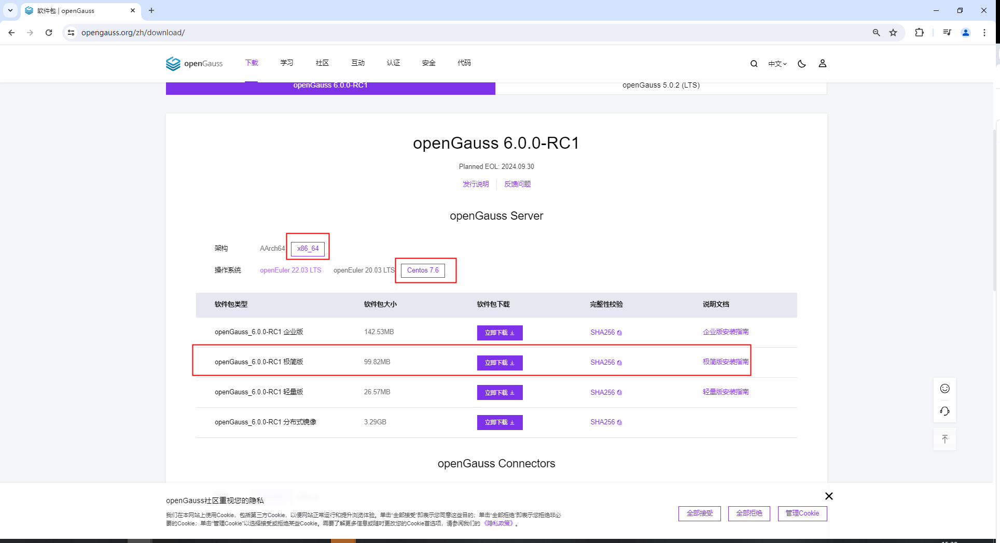


**本次试验环境如下：（根据实际软硬件情况，选择不同的安装包）**

架构 ：x86x_64

操作系统：Centos 7.6

软件包：openGauss_6.0.0-RC1 极简版

## 2、下载到服务器

```
[root@worker1 soft]# ls
openGauss-6.0.0-RC1-CentOS-64bit.tar.bz2
[root@worker1 soft]# 
```

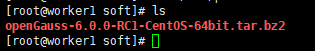


## 3、系统环境配置


### 3.1 目前仅支持在防火墙关闭的状态下进行安装。


```
[root@worker1 soft]# sestatus
SELinux status:                 disabled
[root@worker1 soft]# 
[root@worker1 soft]# systemctl status firewalld
● firewalld.service - firewalld - dynamic firewall daemon
   Loaded: loaded (/usr/lib/systemd/system/firewalld.service; disabled; vendor preset: enabled)
   Active: inactive (dead)
     Docs: man:firewalld(1)
[root@worker1 soft]# 
```


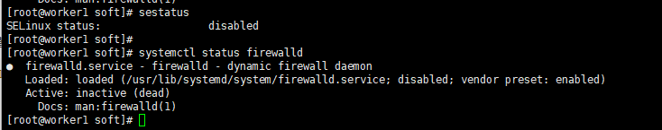


### 3.2 设置字符集参数

将各数据库节点的字符集设置为相同的字符集，可以在/etc/profile文件中添加“export LANG=XXX”（XXX为Unicode编码）。

en_US.UTF-8

```
[root@worker1 soft]# echo 'export LANG=en_US.UTF-8' >>/etc/profile
[root@worker1 soft]# 
```

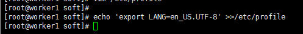


### 3.3 关闭RemoveIPC


在各数据库节点上，关闭RemoveIPC。CentOS操作系统默认为关闭，可以跳过该步骤。
RemoveIPC=no

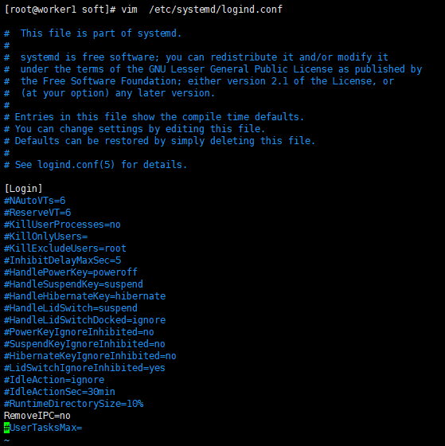


### 3.4 关闭HISTORY记录


HISTSIZE=0


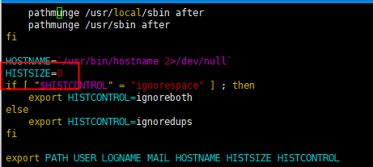


## 4、创建用户和组


### 4.1 创建用户组dbgroup。


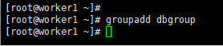


```
[root@worker1 ~]# 
[root@worker1 ~]# groupadd dbgroup
[root@worker1 ~]# 
```

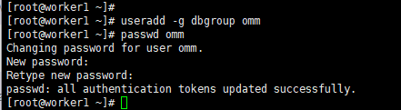


### 4.2 创建用户组dbgroup下的普通用户omm，并设置普通用户omm的密码。


```
[root@worker1 ~]# useradd -g dbgroup omm
[root@worker1 ~]# passwd omm
Changing password for user omm.
New password: 
Retype new password: 
passwd: all authentication tokens updated successfully.
[root@worker1 ~]# 
```

# 四、单节点安装


前提条件

已完成用户组和普通用户的创建。
所有服务器操作系统和网络均正常运行。
普通用户必须有数据库包解压路径、安装路径的读、写和执行操作权限，并且安装路径必须为空。
普通用户对下载的openGauss压缩包有执行权限。
安装前请检查指定的openGauss端口是否被占用，如果被占用请更改端口或者停止当前使用端口进程。


## 1、用户登录

使用普通用户登录到openGauss包安装的主机，解压openGauss压缩包到安装目录（假定安装目录为/opt/software/openGauss，请用实际值替换）。

```
[root@worker1 soft]# ls
openGauss-6.0.0-RC1-CentOS-64bit.tar.bz2
[root@worker1 soft]# tar -jxf openGauss-6.0.0-RC1-CentOS-64bit.tar.bz2 -C /opt/software/openGauss/
[root@worker1 soft]# 
```

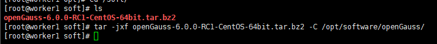


如果报错没有权限

```
[omm@worker1 soft]$ tar -jxf openGauss-6.0.0-RC1-CentOS-64bit.tar.bz2 -C /opt/software/openGauss/
tar: ./bin: Cannot mkdir: Permission denied
tar: ./bin: Cannot mkdir: Permission denied
```

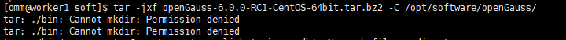


切换为root用户后添加权限就可以了

```
[root@worker1 opt]# chown omm:dbgroup /opt/software/openGauss/
[root@worker1 opt]# chmod 755 /opt/software/openGauss/
```


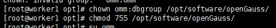


## 2、解压


假定解压包的路径为/opt/software/openGauss，进入解压后目录下的simpleInstall。

```
[root@worker1 soft]# cd /opt/software/openGauss/simpleInstall
[root@worker1 simpleInstall]# ls
finance.sql  install.sh  README.md  school.sql
[root@worker1 simpleInstall]# 
```

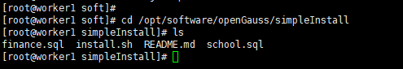


## 3、脚本安装


执行install.sh脚本安装openGauss。

```
[root@worker1 simpleInstall]# sh install.sh  -w "openGauss666" &&source ~/.bashrc
[step 1]: check parameter
Error: can not install openGauss with root
[root@worker1 simpleInstall]# 
```


**安装报错**

```
[omm@worker1 simpleInstall]$ sh install.sh  -w "openGauss666" &&source ~/.bashrc
[step 1]: check parameter
[step 2]: check install env and os setting
On systemwide basis, the maximum number of SEMMNI is not correct. the current SEMMNI value is: 128. Please check it.
The required value should be greater than 321. You can modify it in file '/etc/sysctl.conf'.
[omm@worker1 simpleInstall]$ 
```


**解决办法：**


用root登录修改所需的值应大于321，然后执行sysctl -p

```
[root@worker1 ~]# 
[root@worker1 ~]# sysctl -w kernel.sem="250 85000 250 330" 
kernel.sem = 250 85000 250 330
[root@worker1 ~]# 
```

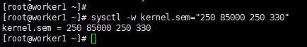


**再次执行install.sh脚本安装openGauss。**

```
[omm@worker1 simpleInstall]$ sh install.sh  -w "openGauss666" &&source ~/.bashrc

[2024-05-17 16:39:10.010][7802][][gs_ctl]:  done
[2024-05-17 16:39:10.010][7802][][gs_ctl]: server started (/opt/software/openGauss/data/single_node)
import sql file
Would you like to create a demo database (yes/no)? 
```

## 4、完成安装

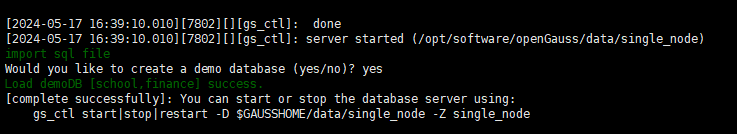


## 5、检查安装进程


安装执行完成后，使用ps和gs_ctl查看进程是否正常。


```
[omm@worker1 simpleInstall]$ 
[omm@worker1 simpleInstall]$ ps ux | grep gaussdb
omm        7805  2.2  2.8 6267816 922936 ?      Ssl  16:39   0:04 /opt/software/openGauss/bin/gaussdb -D /opt/software/openGauss/data/single_node
omm        8180  0.0  0.0 110480   908 pts/0    S+   16:42   0:00 grep --color=auto gaussdb
[omm@worker1 simpleInstall]$ 

```

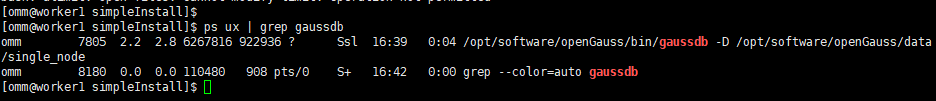


ps ux | grep gaussdb
gs_ctl query -D /opt/software/openGauss/data/single_node

### 5.1 执行ps命令，显示类似如下信息：

omm 24209 11.9 1.0 1852000 355816 pts/0 Sl 01:54 0:33 /opt/software/openGauss/bin/gaussdb -D /opt/software/openGauss/single_node
omm 20377 0.0 0.0 119880 1216 pts/0 S+ 15:37 0:00 grep --color=auto gaussdb

### 5.2 执行gs_ctl命令，显示类似如下信息：


```
[2024-05-17 16:43:24.482][8256][][gs_ctl]: gs_ctl query ,datadir is /opt/software/openGauss/data/single_node 
 HA state:           
	local_role                     : Normal
	static_connections             : 0
	db_state                       : Normal
	detail_information             : Normal

 Senders info:       
No information 
 Receiver info:      
No information 
[omm@worker1 simpleInstall]$ 
```

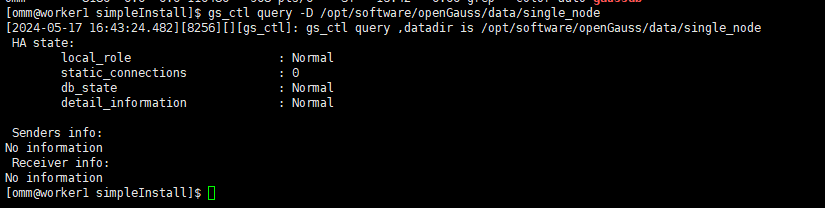


# 五、数据库的增删改查


## 1、连接本地连接数据库

```
[omm@worker1 single_node]$ gsql -d postgres -p 5432 -C
gsql ((openGauss 6.0.0-RC1 build ed7f8e37) compiled at 2024-03-31 11:59:31 commit 0 last mr  )
Non-SSL connection (SSL connection is recommended when requiring high-security)
Type "help" for help.

openGauss=# 
```

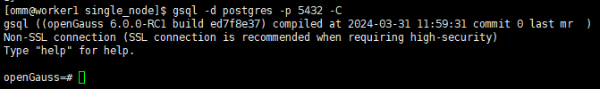

登录端口可以查看 postgresql.conf文件

```
[omm@worker1 single_node]$ cat postgresql.conf |grep port
port = 5432				# (change requires restart)
#ssl_renegotiation_limit = 0		# amount of data between renegotiations, no longer supported
					# supported by the operating system:

```


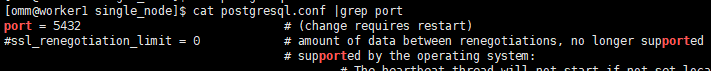


##  2、创建数据库

数据库安装完成后，默认生成名称为postgres的数据库。您需要自己创建一个新的数据库。

```
openGauss=# CREATE DATABASE database_openGauss;
CREATE DATABASE
openGauss=# 
```

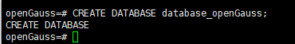


## 3、查看数据库


### 3.1 使用“\l”用于查看已经存在的数据库。


\l

```
openGauss=# \l
                                   List of databases
        Name        | Owner | Encoding |   Collate   |    Ctype    | Access privileges 
--------------------+-------+----------+-------------+-------------+-------------------
 database_opengauss | omm   | UTF8     | en_US.UTF-8 | en_US.UTF-8 | 
 finance            | omm   | UTF8     | en_US.UTF-8 | en_US.UTF-8 | 
 postgres           | omm   | UTF8     | en_US.UTF-8 | en_US.UTF-8 | 
 school             | omm   | UTF8     | en_US.UTF-8 | en_US.UTF-8 | 
 template0          | omm   | UTF8     | en_US.UTF-8 | en_US.UTF-8 | =c/omm           +
                    |       |          |             |             | omm=CTc/omm
 template1          | omm   | UTF8     | en_US.UTF-8 | en_US.UTF-8 | =c/omm           +
                    |       |          |             |             | omm=CTc/omm
(6 rows)

openGauss=# 
```


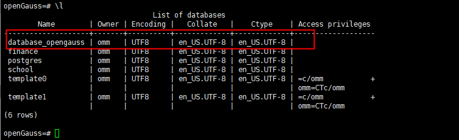


### 3.2 使用 “\c + 数据库名” 进入已存在数据库。

\c dbname

```
openGauss=# 
openGauss=# \c database_opengauss
Non-SSL connection (SSL connection is recommended when requiring high-security)
You are now connected to database "database_opengauss" as user "omm".
database_opengauss=# 
```

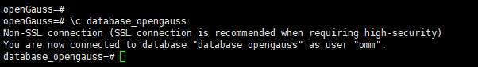

## 4、修改数据库

ALTER DATABASE database_opengauss RENAME TO new_name666;

```
openGauss=# ALTER DATABASE database_opengauss RENAME TO new_name666;
ALTER DATABASE
openGauss=# \l
                               List of databases
    Name     | Owner | Encoding |   Collate   |    Ctype    | Access privileges 
-------------+-------+----------+-------------+-------------+-------------------
 finance     | omm   | UTF8     | en_US.UTF-8 | en_US.UTF-8 | 
 new_name666 | omm   | UTF8     | en_US.UTF-8 | en_US.UTF-8 | 
 postgres    | omm   | UTF8     | en_US.UTF-8 | en_US.UTF-8 | 
 school      | omm   | UTF8     | en_US.UTF-8 | en_US.UTF-8 | 
 template0   | omm   | UTF8     | en_US.UTF-8 | en_US.UTF-8 | =c/omm           +
             |       |          |             |             | omm=CTc/omm
 template1   | omm   | UTF8     | en_US.UTF-8 | en_US.UTF-8 | =c/omm           +
             |       |          |             |             | omm=CTc/omm
(6 rows)

openGauss=# 

```

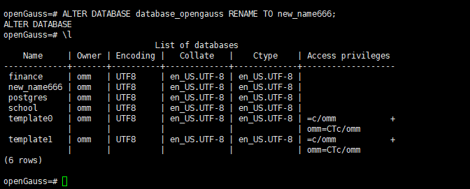


## 5、删除数据库


```
openGauss=# 
openGauss=# DROP DATABASE new_name666 ;
DROP DATABASE
openGauss=# \l  	
                              List of databases
   Name    | Owner | Encoding |   Collate   |    Ctype    | Access privileges 
-----------+-------+----------+-------------+-------------+-------------------
 finance   | omm   | UTF8     | en_US.UTF-8 | en_US.UTF-8 | 
 postgres  | omm   | UTF8     | en_US.UTF-8 | en_US.UTF-8 | 
 school    | omm   | UTF8     | en_US.UTF-8 | en_US.UTF-8 | 
 template0 | omm   | UTF8     | en_US.UTF-8 | en_US.UTF-8 | =c/omm           +
           |       |          |             |             | omm=CTc/omm
 template1 | omm   | UTF8     | en_US.UTF-8 | en_US.UTF-8 | =c/omm           +
           |       |          |             |             | omm=CTc/omm
(5 rows)

openGauss=# 
```


# 总结


openGauss 6.0.0版本在安装和使用方面都带来了很大的改进和优化。一站式交互安装功能极大地简化了安装流程，降低了用户的学习成本；性能优化和中文日志支持功能则进一步提升了数据库的稳定性和易用性。通过实际测试，我认为openGauss 6.0.0版本是一款非常优秀的国产数据库产品，值得广大用户尝试和使用。


最后，我要感谢openGauss社区举办的第七届openGauss技术文章征集活动，让我有机会分享我的使用体验。同时，我也期待openGauss在未来能够继续推出更多优秀的版本和功能，为国产数据库的发展做出更大的贡献。


