从事运维管理工作多年，目前就职于某科技有限公司，熟悉运维自动化、OceanBase部署运维、MySQL 运维以及各种云平台技术和产品。并已获得OceanBase认证OBCA、OBCP 证书、OpenGauss社区认证结业证书、崖山DBCA证书、亚信AntDBCA证书、翰高HDCA认证、GBase 8a|GBase 8c 证书。OceanBase & 墨天轮第二、三、四届技术征文大赛，多次获得 一、二、三 等奖，在openGauss 第五届、第六届技术征文大赛中多次获奖。时常在墨天轮发布原创技术文章，并多次被首页推荐。


# 前言

一站式交互安装功能：openGauss 6.0.0版本在安装方面进行了重大改进，推出了全新的一站式交互安装功能。这一功能极大地简化了安装流程，降低了用户的学习成本。用户只需通过交互界面输入数据库的相关信息，系统便会自动生成xml配置文件，并自动进行数据库的初始化安装。

<br/>

# 一、安装准备

<br/>

本章详细介绍了安装openGauss的环境准备和配置，请在安装之前仔细阅读本章的内容。如果已完成本章节的配置，请进入“安装openGauss”章节。


**企业版安装**

企业版安装的主要使用主体为企业或对数据库性能要求较高的个人，安装流程比较复杂，功能更全。

**安装准备**

本章详细介绍了安装openGauss的环境准备和配置，请在安装之前仔细阅读本章的内容。如果已完成本章节的配置，请进入“安装openGauss”章节。

**了解安装流程**

本章节通过流程图简要介绍openGauss的安装流程。

**获取安装包**

openGauss开源社区上提供了安装包的获取方式。

**准备软硬件安装环境**


本章节描述安装前需要进行的环境准备。

**了解安装用户及用户组**


为了实现安装过程中安装帐户权限最小化，及安装后openGauss的系统运行安全性，安装脚本在安装过程中会自动按照用户指定内容创建安装用户，并将此用户作为后续运行和维护openGauss的管理员帐户。


# 二、获取安装包


openGauss开源社区上提供了安装包的获取方式。


## 1、从openGauss开源社区下载对应平台的安装包。


**a.通过<https://opengauss.org/zh/download/> 登录openGauss开源社区，选择对应平台的企业版安装包。**

```
https://opengauss.org/zh/download/
```

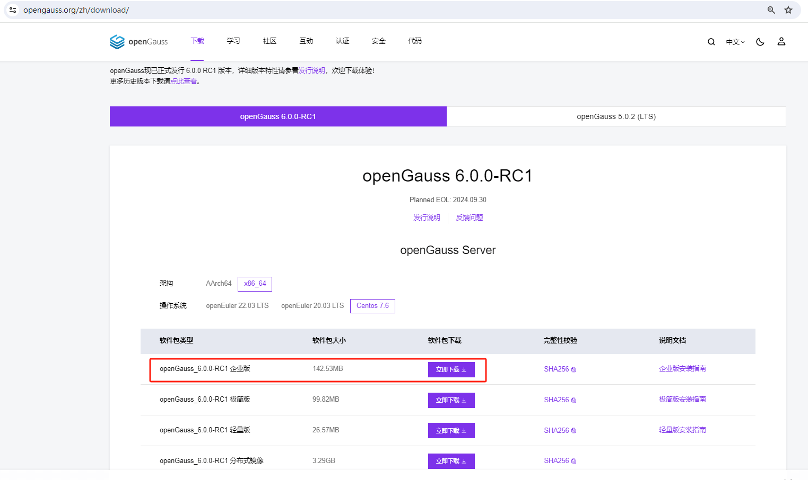


**b.单击“立即下载”。**


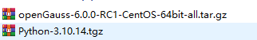


## 2、检查安装包。


```
[root@worker1 soft]# ls
openGauss-6.0.0-RC1-CentOS-64bit-all.tar.gz  openGauss-6.0.0-RC1-CentOS-64bit.tar.bz2
[root@worker1 soft]# 
```


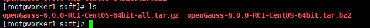


## 3、解压安装包

检查安装目录及文件是否齐全。在安装包所在目录执行以下命令：

tar -zxvf openGauss-x.x.x-openEuler-64bit-all.tar.gz


```
[root@worker1 soft]# tar -zxvf openGauss-6.0.0-RC1-CentOS-64bit-all.tar.gz 
openGauss-6.0.0-RC1-CentOS-64bit-cm.tar.gz
openGauss-6.0.0-RC1-CentOS-64bit-om.tar.gz
openGauss-6.0.0-RC1-CentOS-64bit.tar.bz2
openGauss-6.0.0-RC1-CentOS-64bit-cm.sha256
openGauss-6.0.0-RC1-CentOS-64bit-om.sha256
openGauss-6.0.0-RC1-CentOS-64bit.sha256
upgrade_sql.tar.gz
upgrade_sql.sha256
[root@worker1 soft]# 
```

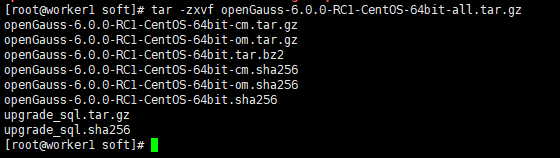


## 4、执行ls命令，显示类似如下信息：


ls -lb


```
[root@worker1 soft]# ls -lb
total 293248
-rw-r--r-- 1 root root 149449208 May 29 13:55 openGauss-6.0.0-RC1-CentOS-64bit-all.tar.gz
-rw-r--r-- 1 root root       109 Mar 31 12:16 openGauss-6.0.0-RC1-CentOS-64bit-cm.sha256
-rw-r--r-- 1 root root  22466710 Mar 31 12:16 openGauss-6.0.0-RC1-CentOS-64bit-cm.tar.gz
-rw-r--r-- 1 root root        65 Mar 31 12:15 openGauss-6.0.0-RC1-CentOS-64bit-om.sha256
-rw-r--r-- 1 root root  23122340 Mar 31 12:15 openGauss-6.0.0-RC1-CentOS-64bit-om.tar.gz
-rw-r--r-- 1 root root        65 Mar 31 12:16 openGauss-6.0.0-RC1-CentOS-64bit.sha256
-rw-r--r-- 1 root root 104672194 Mar 31 12:16 openGauss-6.0.0-RC1-CentOS-64bit.tar.bz2
-rw------- 1 root root        65 Mar 31 12:14 upgrade_sql.sha256
-rw------- 1 root root    541779 Mar 31 12:14 upgrade_sql.tar.gz
[root@worker1 soft]# 
```


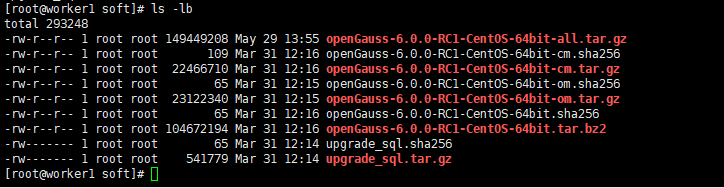


继续解压OM安装包，会在/opt/software/openGauss路径下自动生成script子目录，并且在script目录下生成gs_preinstall等各种OM工具脚本。

tar -zxvf openGauss-x.x.x-openEuler-64bit-om.tar.gz


```
[root@worker1 opt]# tar -zxvf openGauss-6.0.0-RC1-CentOS-64bit-om.tar.gz 
```


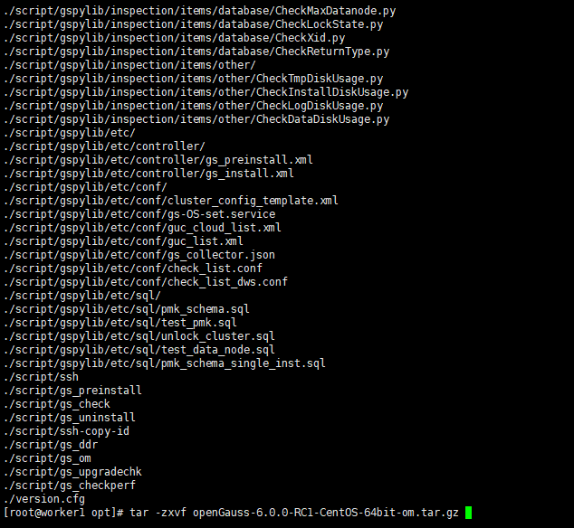


## 5、修改安装包目录权限

```
[root@worker1 ~]# 
[root@worker1 ~]# chmod 755 -R /opt/software
[root@worker1 ~]# 
```


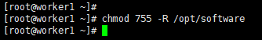


# 三、准备软硬件安装环境

本章节描述安装前需要进行的环境准备。

介绍openGauss的软硬件环境要求。建议部署openGauss的各服务器具有等价的软硬件配置。

**1、内存：功能调试建议32GB以上。**

性能测试和商业部署时，单实例部署建议128GB以上。

复杂的查询对内存的需求量比较高，在高并发场景下，可能出现内存不足。此时建议使用大内存的机器，或使用负载管理限制系统的并发。

**2、CPU：功能调试最小1×8核，2.0GHz。**

性能测试和商业部署时，单实例部署建议1×16核，2.0GHz。

CPU超线程和非超线程两种模式都支持。

目前，openGauss仅支持ARM服务器和基于x86_64通用PC服务器的CPU。

**3、硬盘**

用于安装openGauss的硬盘需最少满足如下要求：

至少1GB用于安装openGauss的应用程序。

每个主机需大约300MB用于元数据存储。

预留70%以上的磁盘剩余空间用于数据存储。

建议系统盘配置为RAID1，数据盘配置为RAID5，且规划4组RAID5数据盘用于安装openGauss。有关RAID的配置方法在本手册中不做介绍。请参考硬件厂家的手册或互联网上的方法进行配置，其中Disk Cache Policy一项需要设置为Disabled，否则机器异常掉电后有数据丢失的风险。

openGauss支持使用SSD盘作为数据库的主存储设备，支持SAS接口和NVME协议的SSD盘，以RAID的方式部署使用。

**4、软件环境要求**

ARM：

openEuler 20.03LTS（推荐采用此操作系统）

openEuler 22.03LTS

麒麟V10

Asianux 7.5

x86：

openEuler 20.03LTS

openEuler 22.03LTS

CentOS 7.6

Asianux 7.6

说明：

1、当前安装包只能在英文操作系统上安装使用；

2、OM工具已经支持对基于openEuler/Centos等商业操作系统的安装使用，具体配置信息可以查看OM中的osid.conf文件。

openEuler：支持>=Python 3.6.X且<=Python 3.10.X

CentOS：支持>=Python 3.6.X且<=Python 3.10.X

麒麟：支持Python 3.7.X

Asianux：支持Python 3.6.X

说明：

python需要通过–enable-shared方式编译。

在CentOS 7上安装Python 3，可以按照以下步骤进行：


**5、安装Python 3.X**


5.1. 检查当前Python版本


首先，检查CentOS 7是否自带Python环境以及版本信息，可以使用以下命令：

```
[root@worker1 soft]# python --version
Python 2.7.5
[root@worker1 soft]# 
```


CentOS 7一般默认安装的是Python 2.x版本。

5.2. 安装Python 3依赖包


在编译安装Python 3之前，需要安装一些依赖包。这些依赖包包括各种开发库和工具，例如zlib、bzip2、openssl等。可以使用yum命令来安装这些依赖包：


```
[root@worker1 soft]# yum -y install zlib-devel bzip2-devel openssl-devel ncurses-devel sqlite-devel readline-devel tk-devel gdbm-devel db4-devel libpcap-devel xz-devel gcc libffi-devel
```

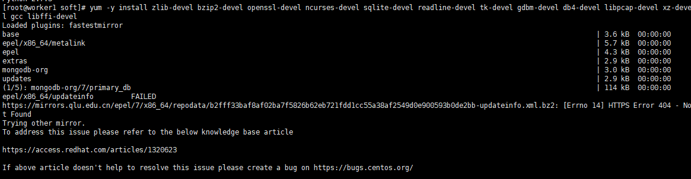

5.3. 下载Python 3源码包

访问Python官方网站（https://www.python.org/downloads/source/）下载所需的Python 3版本的源码包，如Python 3.11.x。


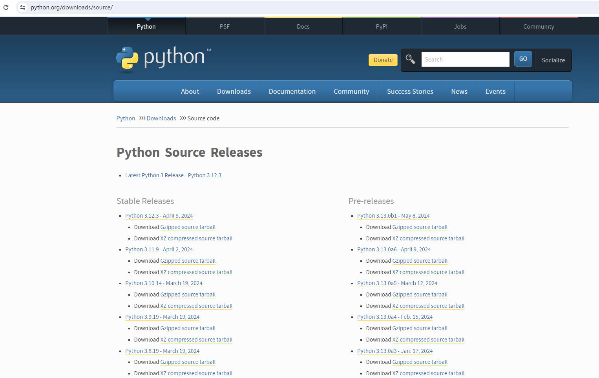


5.4. 上传或下载源码包到CentOS 7

如果已经在本地下载了源码包，可以使用scp命令或WinSCP等工具将源码包上传到CentOS 7服务器上。或者，你也可以直接在CentOS 7上使用wget命令下载源码包。

5.5. 解压源码包

使用tar命令解压下载的源码包：

```
[root@worker1 soft]# tar -zxf Python-3.10.14.tgz 
[root@worker1 soft]# cd Python-3.10.14/
[root@worker1 Python-3.10.14]# 
```


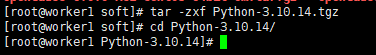


5.6. 编译和安装Python 3

进入解压后的目录，并执行configure脚本进行配置，然后编译和安装Python 3。


```
[root@worker1 soft]# cd Python-3.10.14/
[root@worker1 Python-3.10.14]# ./configure --prefix=/usr/local/python3 --enable-shared --enable-optimizations 
 ```

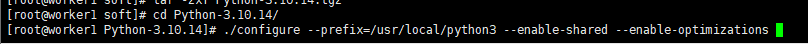

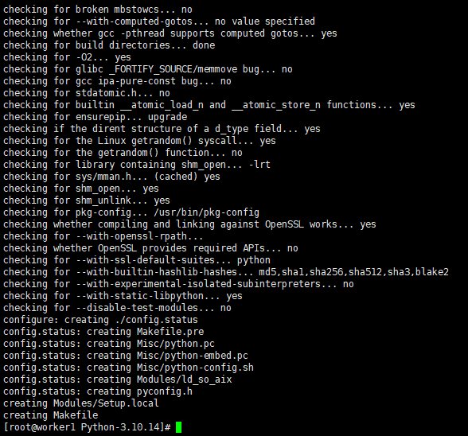


```
[root@worker1 Python-3.10.4]# make
[root@worker1 Python-3.10.4]#make install
```


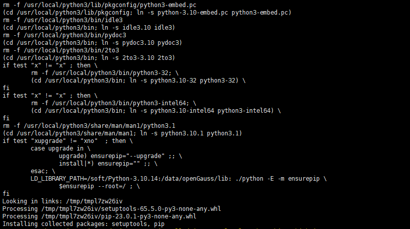


其中，–prefix参数指定了Python 3的安装目录，/usr/local/python3是一个常见的选择。–enable-shared选项确保Python 3以共享库的形式安装。–enable-optimizations是可选的，用于启用编译优化。

5.7. 配置环境变量（可选）


如果安装目录不在系统的默认路径中，需要配置PATH环境变量以包含Python 3的bin目录。

```

[root@worker1 Python-3.10.14]# 
[root@worker1 Python-3.10.14]# echo 'export PATH=/usr/local/python3/bin:$PATH' >> ~/.bash_profile
[root@worker1 Python-3.10.14]# source ~/.bash_profile
[root@worker1 Python-3.10.14]# 
```

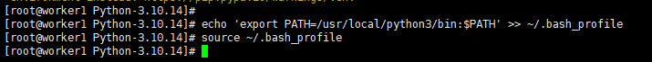

或者，对于bash shell，也可以将上述export语句添加到~/.bashrc文件中。

5.8. 验证安装


安装完成后，使用以下命令验证Python 3是否安装成功：


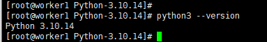

```
[root@worker1 Python-3.10.14]# 
[root@worker1 Python-3.10.14]# python3 --version
Python 3.10.14
[root@worker1 Python-3.10.14]# 
```

如果输出显示了Python 3的版本号，则表示安装成功。

以上步骤涵盖了CentOS 7上安装Python 3的基本流程。需要注意的是，具体的安装步骤和命令可能会因Python版本和系统环境的不同而略有差异。
软件依赖要求
openGauss的软件依赖要求如表3所示。

建议使用上述操作系统安装光盘或者源中，下列依赖软件的默认安装包，若不存在下列软件，可参看软件对应的建议版本。


**6、软件依赖要求**

所需软件、建议版本

libaio-devel

建议版本：0.3.109-13

readline-devel

建议版本：7.0-13

libnsl（openEuler+x86环境中）

建议版本：2.28-36

修改操作系统配置 参考极简版设置
注意：

以下动作需要以root用户进行操作，操作完成后请及时注销root用户，避免误操作。


```
[root@worker1 script]# yum -y install zlib-devel bzip2-devel openssl-devel ncurses-devel sqlite-devel readline-devel tk-devel gdbm-devel db4-devel libpcap-devel xz-devel gcc libffi-devel
```


7、系统初始化设置，参考上一篇文章：

【第七届openGauss技术文章征集】openGauss 6.0.0新版本安装测评:<https://www.modb.pro/db/1791370653756116992>

# 四、配置安装用户及用户组

为了实现安装过程中安装帐户权限最小化，及安装后openGauss的系统运行安全性，安装脚本在安装过程中会自动按照用户指定内容创建安装用户，并将此用户作为后续运行和维护openGauss的管理员帐户。

建议规划单独的用户组，例如dbgrp。

初始化安装环境时，由-G参数所指定的安装用户所属的用户组。该用户组如果不存在，则会自动创建，也可提前创建好用户组。在执行gs_preinstall脚本时会检查权限。gs_preinstall脚本会自动赋予此组中的用户对安装目录、数据目录的访问和执行权限。

## 1、创建dbgrp用户组命令：

```
[root@worker1 soft]# groupadd dbgrp
[root@worker1 soft]# 
```

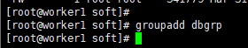


建议规划用户用于运行和维护openGauss，例如omm。

初始化安装环境时，由-U参数所指定和自动创建的操作系统用户，如果已经存在该用户，请清理该用户或更换初始化用户。从安全性考虑，对此用户的所属组规划如下：


## 2、创建用户 omm 所属组：dbgrp

```
[root@worker1 soft]# useradd -g dbgrp omm
[root@worker1 soft]# passwd omm
Changing password for user omm.
New password: 
Retype new password: 
passwd: all authentication tokens updated successfully.
[root@worker1 soft]# 
```

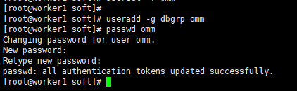


在安装openGauss过程中运行“gs_preinstall”时，会创建与安装用户同名的数据库用户，即数据库用户omm。此用户具备数据库的最高操作权限，此用户初始密码由用户指定。

# 五、一站式安装openGauss


创建XML配置文件

安装openGauss前需要创建cluster_config.xml文件。cluster_config.xml文件包含部署openGauss的服务器信息、安装路径、IP地址以及端口号等。用于告知openGauss如何部署。用户需根据不同场景配置对应的XML文件。

**初始化安装环境**

为了保证openGauss的正确安装，请首先对主机环境进行配置。

**执行安装**

执行前置脚本准备好openGauss安装环境之后，按照启动安装过程部署openGauss。

**安装验证**

**安装openGauss**

1、一站式安装指南

本章详细介绍openGauss的一站式安装，通过交互式方便用户快速配置xml文件，大大减少用户安装数据库的时间。 如果使用一站式安装，那么就可以直接跳过创建xml配置文件和初始化安装。


```
[root@worker1 soft]# ls
lib                                          openGauss-6.0.0-RC1-CentOS-64bit-cm.tar.gz  openGauss-6.0.0-RC1-CentOS-64bit.sha256   upgrade_sql.sha256
openGauss-6.0.0-RC1-CentOS-64bit-all.tar.gz  openGauss-6.0.0-RC1-CentOS-64bit-om.sha256  openGauss-6.0.0-RC1-CentOS-64bit.tar.bz2  upgrade_sql.tar.gz
openGauss-6.0.0-RC1-CentOS-64bit-cm.sha256   openGauss-6.0.0-RC1-CentOS-64bit-om.tar.gz  script                                    version.cfg
[root@worker1 soft]# tar -zxvf openGauss-6.0.0-RC1-CentOS-64bit-om.tar.gz 
```

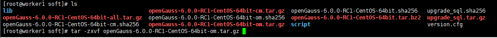

如果使用中文界面来安装，需要检查当前本地字符集是否支持中文(如:zh_CN.UTF-8)

**操作步骤**

使用root或普通用户，下载软件包并解压，到script目录下，执行
./gs_preinstall -U omm -G dbgroup --one-stop-install --sep-env-file=ENVFILE

报错，没有安装Python3
解决办法，安装Python3

**再次执行**

```
[root@worker1 script]# ls
base_diff     gs_backup     gs_collector  gs_install        gs_preinstall  gs_sshexkey    impl         osid.conf     ssh          ssh-keygen
base_utils    gs_check      gs_ddr        gs_om             gspylib        gs_uninstall   __init__.py  os_platform   ssh-add      transfer.py
config        gs_checkos    gs_dropnode   gs_perfconfig     gs_sdr         gs_upgradechk  killall      py_pstree.py  ssh-agent    upgrade_checker
domain_utils  gs_checkperf  gs_expansion  gs_postuninstall  gs_ssh         gs_upgradectl  local        scp           ssh-copy-id
[root@worker1 script]# ./gs_preinstall -U omm -G dbgroup --one-stop-install --sep-env-file=ENVFILE
```

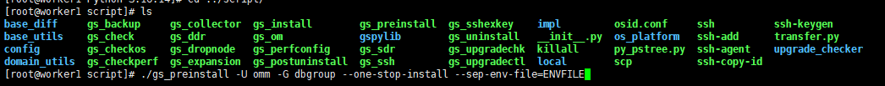


其中–sep-env-file是环境分离时使用，如果不使用环境分离，可以去掉该参数。

执行后，首先程序会根据本地的默认字符集，程序根据配置的语言设置会显示对应语言的导航栏，用户在导航栏选择使用哪种语言来进行下面的安装(支持:中文，英文)
可以通过如下命令来查看本地操作系统的语言设置:

echo $LANG

如果系统显示值包含"en_US"，则导航栏为英文

```
[root@worker1 script]# ./gs_preinstall -U omm -G dbgroup --one-stop-install --sep-env-file=ENVFILE
Please choose whether to generate an XML file with one click navigation in English or Chinese?
>> 1) chinese
   2) english
-------------------------------
Please enter 1/2 for selection, the default option is 1) Chinese:
```


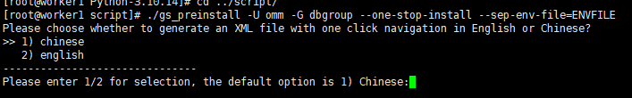


如果系统显示值包含"zh_CN"，则为中文语言，导航栏会显示中文内容。否则，您可以执行如下命令修改语言设置为中文：


```
[root@worker1 script]# echo $LANG
en_US.UTF-8
[root@worker1 script]# export LANG=zh_CN.UTF-8
[root@worker1 script]# echo $LANG
zh_CN.UTF-8
[root@worker1 script]# 
```

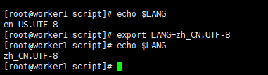


请选择是英文还是中文导航一键式生成xml文件?

```
[root@worker1 script]# ./gs_preinstall -U omm -G dbgrp --one-stop-install --sep-env-file=ENVFILE
请选择是英文还是中文导航一键式生成xml文件?
>> 1) 中文
   2) 英文
-------------------------------
请输入1/2进行选择,默认选项为1)中文:
```

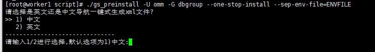


请输入xml的路径和文件名(默认:./cluster.xml)
用户输入的xml文件路径如果存在，会对判断该输入是否有非法字符，是否是文件，当前用户是否有权限；如果输入xml文件路径不存在，那么不会判断；默认生成的cluster.xml文件默认会在解压包路径下script/base_utils/template/cluster.xml。

请输入数据库安装目录(默认:/opt/openGauss/install)
用户输入的数据库安装目录如果存在，会判断该目录是否有非法字符，是否是一个空目录，当前用户是否有权限操作；如果目录不存在，那么不会判断。

请输入数据库端口(默认:15000)
数据库端口在1024-65535之间，并且输入必须是数字。

请选择是否主备部署
用户可以选在主备部署或单机部署，如果单机部署默认会将本地ip和hostname写入xml中，后面的流程跳过；如果主备部署继续后面的流程。

请选择是否部署资源池化
用户选择部署或不部署资源池化，如果部署，默认会部署CM；如果不部署，继续后面的流程

请选择是否部署CM
用户选择部署CM或不部署CM

请输入cmserver端口(默认:15400)
用户输入的端口在1024-65535之间，必须是数字，不能和上面配置的数据库的端口重复，并且cm端口和数据库端口距离至少间隔10。

请输入节点数量,最多支持一主八备,即9个节点(默认是一主两备,3个节点)
用户输入节点数量在1-9之间，必须是数字

请输入主机节点IP和节点名称(如:192.168.0.1 hostname1;192.168.0.2 hostname2)
用户输入的节点ip和名称，首先数量必须一致，ip和hostname之间用空格分隔，每一组ip hostname之间用分号分隔；其次输入的ip不能重复。

生成的xml路径是: /xxx/script/base_utils/template/cluster.xml
默认生成的xml路径在script/base_utils/template/cluster.xml

xml的内容

```
-------------------------------
请输入1/2进行选择,默认选项为1)中文:1
请输入xml的路径和文件名(默认:./cluster.xml):
请输入数据库安装目录(默认:/opt/openGauss/install):
请输入数据库端口(默认:15000):
请选择是否主备部署?
>> 1) 主备部署
   2) 单机部署
-------------------------------
请输入 1/2 进行选择，默认选项是 1)主备部署2
输入完成
生成的xml路径是:   /soft/script/base_utils/template/cluster.xml
xml内容是:
<ROOT>
    <CLUSTER>
        <PARAM name="clusterName" value="Cluster_template" />
        <PARAM name="nodeNames" value="worker1" />
        <PARAM name="gaussdbAppPath" value="/opt/openGauss/install/app" />
        <PARAM name="gaussdbLogPath" value="/opt/openGauss/install/log" />
        <PARAM name="tmpMppdbPath" value="/opt/openGauss/install/tmp" />
        <PARAM name="gaussdbToolPath" value="/opt/openGauss/install/tool" />
        <PARAM name="corePath" value="/opt/openGauss/install/corefile" />
        <PARAM name="backIp1s" value="172.20.2.121" />
        </CLUSTER>

    <DEVICELIST>
        <DEVICE sn="node1_hostname">
            <PARAM name="name" value="worker1" />
            <PARAM name="azName" value="AZ1" />
            <PARAM name="azPriority" value="1" />
            <PARAM name="backIp1" value="172.20.2.121" />
            <PARAM name="sshIp1" value="172.20.2.121" />
            <PARAM name="dataNum" value="1" />
            <PARAM name="dataPortBase" value="15000" />
            <PARAM name="dataNode1" value="/opt/openGauss/install/data/dn1" />
            <PARAM name="dataNode1_syncNum" value="0" />
        </DEVICE>

        </DEVICELIST>
</ROOT>
请确认xml的内容是否正确,正确输入yes;如需修改xml内容请自行修改,然后输入yes确认yes
```


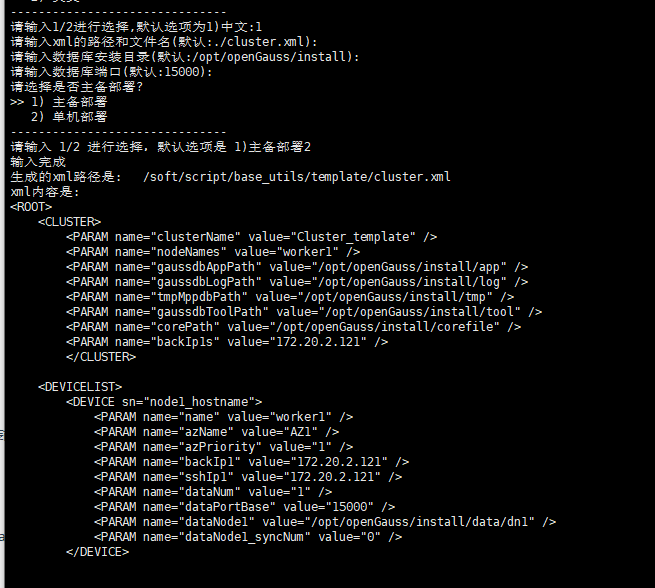

```
请确认xml的内容是否正确,正确输入yes;如需修改xml内容请自行修改,然后输入yes确认yes
Parsing the configuration file.
Successfully parsed the configuration file.
Installing the tools on the local node.
Successfully installed the tools on the local node.
Setting host ip env
Successfully set host ip env.
Are you sure you want to create the user[omm] (yes/no)? yes
[GAUSS-50305] : The user is not matched with the user group.

[root@worker1 script]# 
```


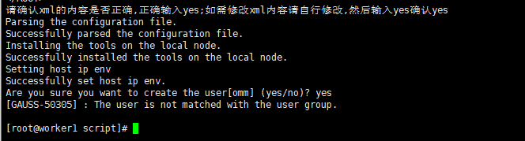


# 六、执行安装

执行前置脚本准备好openGauss安装环境之后，按照启动安装过程部署openGauss。
检查安装包和openGauss配置文件在规划路径下是否已存在，如果没有，重新执行预安装，确保预安装成功，再执行以下步骤。

使用gs_preinstall准备好安装环境。若为共用环境需加入–sep-env-file=ENVFILE参数分离环境变量，避免与其他用户相互影响，ENVFILE为用户自行指定的环境变量分离文件的路径，可以为一个空文件。

## 1、用户互信

采用交互模式执行前置，并在执行过程中自动创建操作系统root用户互信和omm用户互信：
./gs_preinstall -U omm -G dbgrp -X /opt/software/openGauss/cluster_config.xml [–sep-env-file=ENVFILE]

omm为数据库管理员（也是运行openGauss的操作系统用户），dbgrp为运行openGauss的操作系统用户的群组名称，/opt/software/openGauss/cluster_config.xml为openGauss配置文件路径。在执行过程中，用户根据提示选择是否创建互信，并输入操作系统root用户或omm用户的密码。


```
[root@worker1 script]# ./gs_preinstall -U omm -G dbgrp -X /soft/script/base_utils/template/cluster.xml
Parsing the configuration file.
Successfully parsed the configuration file.
Installing the tools on the local node.
Successfully installed the tools on the local node.
Setting host ip env
Successfully set host ip env.
Are you sure you want to create the user[omm] (yes/no)? yes
Preparing SSH service.
Successfully prepared SSH service.
Checking OS software.
Successfully check OS software.
Checking OS version.
Successfully checked OS version.
Checking cpu instructions.
Successfully checked cpu instructions.
```

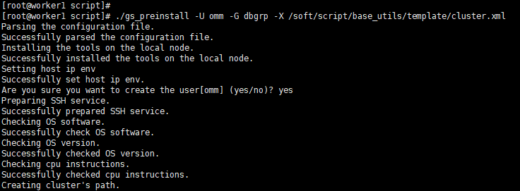


## 2、检查健康状态


检查服务器的OS参数的目的是为了保证数据库正常通过预安装，并且在安装成功后可以安全高效的运行。详细的检查项目请参见《工具与命令参考》中的“服务端工具 > gs_checkos”工具的“表1 操作系统检查项”。

```
[root@worker1 script]# /soft/script/gs_checkos -i A -h worker1 -X /soft/script/base_utils/template/cluster.xml --detail
Checking items:
    A1. [ OS version status ]                                   : Normal     
        [worker1]
        centos_7.4.1708_64bit
           
    A2. [ Kernel version status ]                               : Normal     
        The names about all kernel versions are same. The value is "3.10.0-693.el7.x86_64".
    A3. [ Unicode status ]                                      : Normal     
        The values of all unicode are same. The value is "LANG=en_US.UTF-8".
    A4. [ Time zone status ]                                    : Normal     
        The informations about all timezones are same. The value is "+0800".
    A5. [ Swap memory status ]                                  : Normal     
        The value about swap memory is correct.            
    A6. [ System control parameters status ]                    : Warning    
        [worker1]
        Warning reason: variable 'net.ipv4.tcp_retries1' RealValue '3' ExpectedValue '5'.
        Warning reason: variable 'net.ipv4.tcp_syn_retries' RealValue '6' ExpectedValue '5'.
        Check_SysCtl_Parameter warning.

    A7. [ File system configuration status ]                    : Warning    
        [worker1]
        Warning reason: variable 'max user processes' RealValue '32000' ExpectedValue 'unlimited'

    A8. [ Disk configuration status ]                           : Normal     
        The value about XFS mount parameters is correct.   
    A9. [ Pre-read block size status ]                          : Normal     
        The value about Pre-read block size is correct.    
    A10.[ IO scheduler status ]                                 : Normal     
        The value of IO scheduler is correct.              
    A11.[ Network card configuration status ]                   : Warning    
        [worker1]
BondMode Null
        Warning reason: network 'ens192' 'mtu' RealValue '1500' ExpectedValue '8192'

    A12.[ Time consistency status ]                             : Warning    
        [worker1]
        The NTPD not detected on machine and local time is "2024-05-31 16:07:24".

    A13.[ Firewall service status ]                             : Normal     
        The firewall service is stopped.                   
    A14.[ THP service status ]                                  : Normal     
        The THP service is stopped.                        
Total numbers:14. Abnormal numbers:0. Warning numbers:4.
[root@worker1 script]# 

```


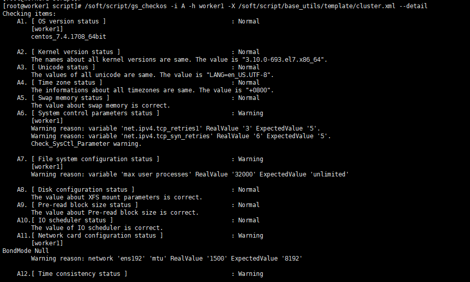

omm用户需要拥有安装包所在目录及子目录的权限。


## 3、登录到openGauss的主机，并切换到omm用户。

```
[root@worker1 script]# su - omm
上一次登录：三 5月 29 23:02:41 CST 2024pts/0 上
[omm@worker1 ~]$ 
```


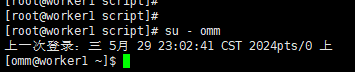


说明：

omm指的是前置脚本gs_preinstall中-U参数指定的用户。

安装脚本gs_install必须以前置脚本中指定的omm执行，否则，脚本执行会报错。

openGauss在海思高版本芯片上编译的不能在海思低版本芯片的服务器上运行，比如Hi620编译的版本不能在Hi1616环境上运行。

使用gs_install安装openGauss。若为环境变量分离的模式安装的数据库需要source环境变量分离文件ENVFILE。

source ENVFILE(若为环境变量分离的模式)
gs_install -X /opt/software/openGauss/cluster_config.xml


```
[omm@worker1 script]$ ls
base_diff     gs_backup     gs_collector  gs_install        gs_preinstall  gs_sshexkey    impl         osid.conf     ssh          ssh-keygen
base_utils    gs_check      gs_ddr        gs_om             gspylib        gs_uninstall   __init__.py  os_platform   ssh-add      transfer.py
config        gs_checkos    gs_dropnode   gs_perfconfig     gs_sdr         gs_upgradechk  killall      py_pstree.py  ssh-agent    upgrade_checker
domain_utils  gs_checkperf  gs_expansion  gs_postuninstall  gs_ssh         gs_upgradectl  local        scp           ssh-copy-id
[omm@worker1 script]$ ./gs_install -X /soft/script/base_utils/template/cluster.xml
```


/opt/software/openGauss/cluster_config.xml为openGauss配置文件的路径。在执行过程中，用户需根据提示输入数据库的密码，密码具有一定的复杂度，为保证用户正常使用该数据库，请记住输入的数据库密码。

安装过程中会生成ssl证书，证书存放路径为{gaussdbAppPath}/share/sslcert/om，其中{gaussdbAppPath}为openGauss配置文件中指定的程序安装目录。

日志文件路径下会生成两个日志文件：“gs_install-YYYY-MMDD_HHMMSS.log”和“gs_local-YYYY-MM-DD_HHMMSS.log”。

说明：
openGauss支持字符集的多种写法：gbk/GBK、UTF-8/UTF8/utf8/utf-8和Latine1/latine1。

安装时若不指定字符集，默认字符集为SQL_ASCII，为简化和统一区域loacle默认设置为C，若想指定其他字符集和区域，请在安装时使用参数–gsinit-parameter="–locale=LOCALE"来指定，LOCALE为新数据库设置缺省的区域。

**4、用户要将数据库编码格式初始化为UTF-8**

用locale -a |grep utf8命令查看系统支持UTF-8编码的区域，如下：

[omm@worker1 script]$ ~>  locale -a|grep utf8
显示类似如下信息，其中en_US.utf8表示区域en_US支持UTF-8编码。

```
en_SG.utf8 
en_US.utf8 
```

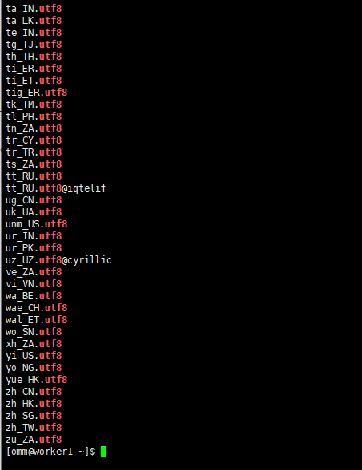

根据需要选择区域，如en_US.utf8，初始化数据库时加入–locale=en_US.utf8选项进行安装，示例如下：

```
[omm@worker1 script]$ ./gs_install -X /soft/script/base_utils/template/cluster.xml --gsinit-parameter="--locale=en_US.utf8"

```

安装执行成功之后，需要手动删除主机root用户的互信，即删除openGauss数据库各节点上的互信文件。

rm –rf ~/.ssh

## 5、执行安装：


```
[omm@worker1 script]$ source ENVFILE
[omm@worker1 script]$ ./gs_install -X /soft/script/base_utils/template/cluster.xml
Parsing the configuration file.
Successfully checked gs_uninstall on every node.
Check preinstall on every node.
Successfully checked preinstall on every node.
Creating the backup directory.
Successfully created the backup directory.
begin deploy..
Installing the cluster.
begin prepare Install Cluster..
Checking the installation environment on all nodes.
begin install Cluster..
Installing applications on all nodes.
Successfully installed APP.
begin init Instance..
encrypt cipher and rand files for database.
Please enter password for database:
Please repeat for database:
begin to create CA cert files
The sslcert will be generated in /opt/openGauss/install/app/share/sslcert/om
NO cm_server instance, no need to create CA for CM.
Non-dss_ssl_enable, no need to create CA for DSS
Cluster installation is completed.
Configuring.
Deleting instances from all nodes.
Successfully deleted instances from all nodes.
Checking node configuration on all nodes.
Initializing instances on all nodes.
Updating instance configuration on all nodes.
Check consistence of memCheck and coresCheck on database nodes.
Configuring pg_hba on all nodes.
Configuration is completed.
The cluster status is Normal.
Successfully started cluster.
Successfully installed application.
end deploy..
[omm@worker1 script]$ 
```

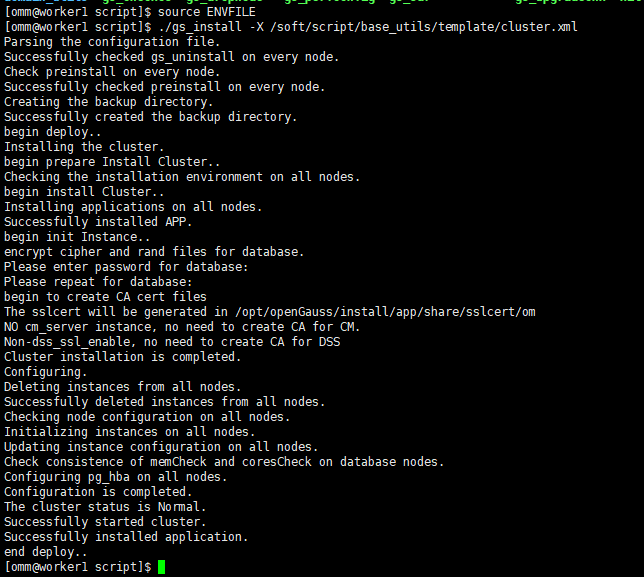

## 6、安装验证

通过openGauss提供的gs_om工具可以完成数据库状态检查。
以omm用户身份登录服务器。

执行如下命令检查数据库状态是否正常，“cluster_state ”显示“Normal”表示数据库可正常使用。

```
[omm@worker1 script]$ 
[omm@worker1 script]$ gs_om -t status
-----------------------------------------------------------------------

cluster_name    : Cluster_template
cluster_state   : Normal
redistributing  : No

-----------------------------------------------------------------------
[omm@worker1 script]$ 
```


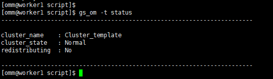


数据库安装完成后，默认生成名称为postgres的数据库。第一次连接数据库时可以连接到此数据库。


其中postgres为需要连接的数据库名称，15400为数据库主节点的端口号，即XML配置文件中的dataPortBase的值。请根据实际情况替换。

```
[omm@worker1 script]$ 
[omm@worker1 script]$ gsql -d postgres -p 15000
gsql ((openGauss 6.0.0-RC1 build ed7f8e37) compiled at 2024-03-31 11:59:31 commit 0 last mr  )
Non-SSL connection (SSL connection is recommended when requiring high-security)
Type "help" for help.

openGauss=# 
```

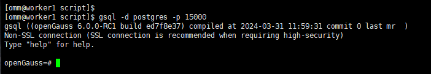


# 总结

openGauss 6.0.0企业版在安装和使用方面都带来了显著的改进。一站式交互安装功能简化了安装流程，解除了对root用户的依赖提高了安全性；在性能方面，特别是主备复制和分区表操作方面有了显著的提升；中文日志支持功能也提高了用户的使用体验。这些改进使得openGauss 6.0.0企业版更加易于使用、安全可靠，并能够满足大多数业务场景的需求。
