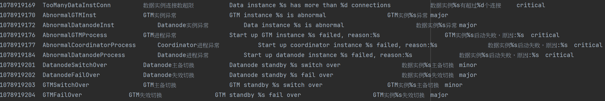
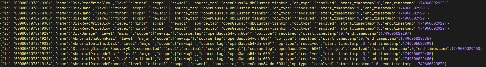
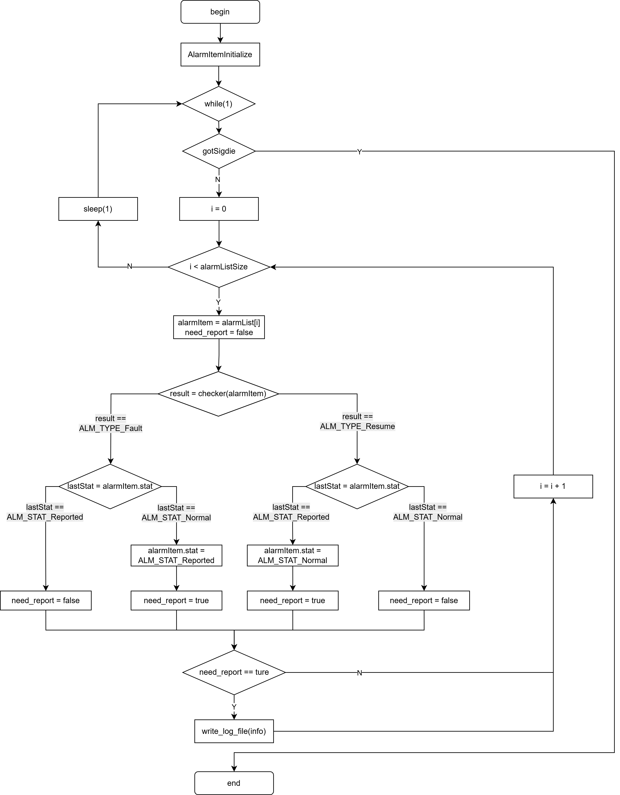
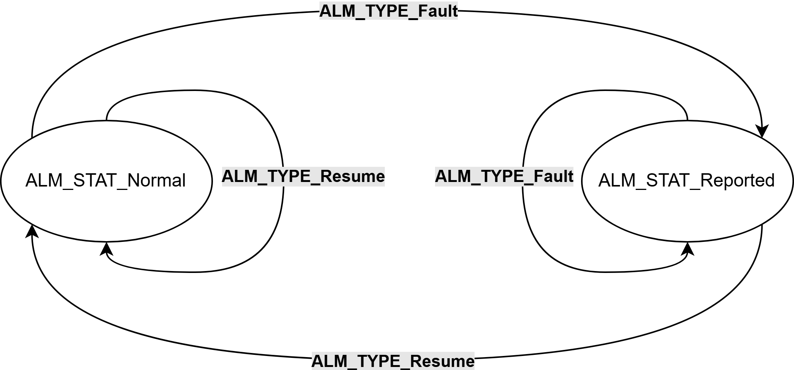
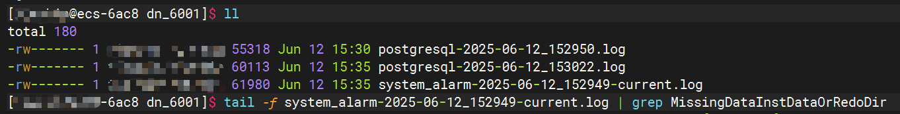
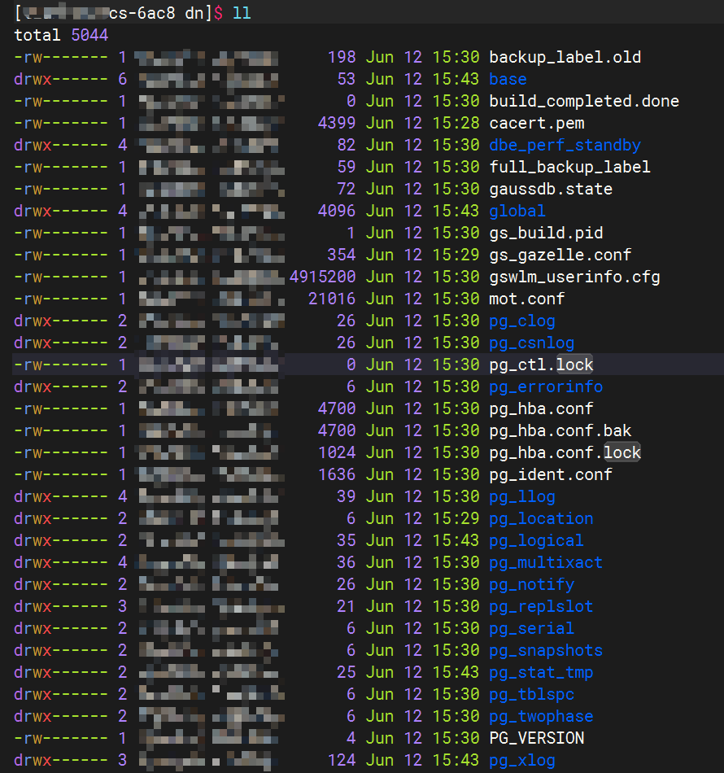
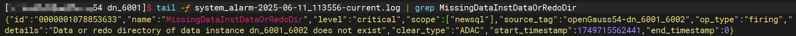
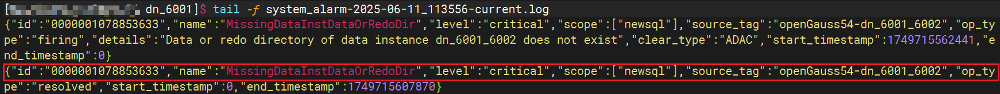

# 简介

openGauss作为一款高性能、高可用、高安全、易运维、全开放的企业级关系型数据库，拥有对数据库多项指标的监控、采集和告警能力。如：data目录丢失、DN实例异常、DN主备切换、磁盘空间不足等告警项。本文将对openGauss数据库的告警机制进行介绍。

---

# 一、初始化环境
## 1.告警项初始化
在Postmaster进程启动的过程中会对告警所需环境进行初始化。包括读取告警类型，告警项和初始化告警日志文件等。在src/lib/alarm目录下alarmItem.conf中定义了openGauss支持的各种告警项，目前已有告警60余项，后续会不断丰富和完善。



每个告警项包含6列，参数及含义如下：

| 参数名称     | 参数含义     |
|------------|-------------|
| id | 告警ID |
| nameEn | 告警项英文名称 |
| nameCh | 告警项中文名称 |
| alarmInfoEn | 告警英文描述信息 |
| alarmInfoCh | 告警中文描述信息 |
| alarmLevel | 告警等级 |

告警环境初始化函数实现如下：

```
void PrepareAlarmEnvironment()
{
    ...
    AlarmEnvInitialize(u_sess->attr.attr_common.log_hostname);
    rc = strncpy_s(sys_log_path, MAXPGPATH, u_sess->attr.attr_common.Log_directory,
        strlen(u_sess->attr.attr_common.Log_directory));
    create_system_alarm_log(sys_log_path);
}
```
其中`AlarmEnvInitialize`函数负责获取主机IP，主机名，集群名和加载告警项，随后通过create_system_alarm_log函数创建告警日志文件。

## 2.告警信息格式
数据库运行过程中产生的告警信息将默认记录在$GAUSSLOG/pg_log/dn_xxxx/system_alarm-xxxxx-current.log文件中。



告警信息以json格式记录，每个字段含义如下：

| 参数名称  | 参数含义 |
|--|--|
| id | 告警ID |
| name| 告警名称 |
| level | 告警级别（critical, major, minor, notice） |
| scope | 主机所属领域列表 |
| source_tag| 告警来源标识 |
| op_type | 告警操作类型（firing，resolved） |
| details| 告警描述信息 |
| clear_type | 清除类型 |
| start_timestamp | 告警开始时间戳 |
| end_timestamp | 告警结束时间戳 |

告警级别根据告警严重程度分为四种：严重（critical）、主要（major）、次要（minor）及通知（notice）。

source_tag由主机名和dn名称拼接而成。

告警操作类型firing表示触发告警，resolved表示告警已解决，对于resolved类型的告警信息只记录end_timestamp，而firing类型的告警信息只记录start_timestamp

告警记录示例：
```
{
  "id": "0000001078853633",
  "name": "MissingDataInstDataOrRedoDir",
  "level": "critical",
  "scope": [
    "newsql"
  ],
  "source_tag": "openGauss54-dn_6001_6002",
  "op_type": "firing",
  "details": "Data or redo directory of data instance dn_6001_6002 does not exist",
  "clear_type": "ADAC",
  "start_timestamp": 1749715562441,
  "end_timestamp": 0
}
```
消除告警示例：
```
{
  "id": "0000001078853633",
  "name": "MissingDataInstDataOrRedoDir",
  "level": "critical",
  "scope": [
    "newsql"
  ],
  "source_tag": "openGauss54-dn_6001_6002",
  "op_type": "resolved",
  "start_timestamp": 0,
  "end_timestamp": 1749715607870
}
```

# 二、告警检测
## 1.告警检测流程
告警检测流程如下所示：

告警检测流程主要分为3个步骤：初始化告警项，告警检测，告警上报。
## 2.初始化告警项
`AlarmCheckerMain`是告警框架的入口，它负责初始化各个告警项并循环进行检测告警项是否触发或者被修复。告警间隔`AlarmCheckInterval`默认为1，即每隔1s检测一次。
```
NON_EXEC_STATIC void AlarmCheckerMain()
{
    ...
    DataInstAlarmItemInitialize();
    for (;;) {
        ...
        AlarmCheckerLoop(DataInstAlarmList, DataInstAlarmListSize);
        ...
    }
    AlarmLog(ALM_LOG, "alarm checker shutting down...");
    proc_exit(0);
}

```
`DataInstAlarmItemInitialize`函数负责初始化告警列表并为各个告警项指定检测函数（如：`DataOrRedoDirNotExistChecker`）

```
void DataInstAlarmItemInitialize(void)
{
    ...
    AlarmItemInitialize(
        &(DataInstAlarmList[0]), ALM_AI_MissingDataInstDataOrRedoDir, ALM_AS_Normal, DataOrRedoDirNotExistChecker);
    ...
 }
```
`AlarmItemInitialize`函数对单个告警项进行初始化，包括设置告警ID，告警初始状态，当前上报时间， 上报次数，告警检测函数等。


## 3.告警检测
`AlarmCheckerLoop`负责调用注册的检测函数对具体的告警项进行检测，如果检测失败则返回`ALM_AT_Fault`，成功返回`ALM_AT_Resume`。checker调用`WriteAlarmAdditionalInfo`函数将instanceName，databaseName，dbUserName，clusterName，hostname和ip等信息写入到tempAdditionalParam中。

```
void AlarmCheckerLoop(Alarm* checkList, int checkListSize)
{
    int i;
    AlarmAdditionalParam tempAdditionalParam;

    for (i = 0; i < checkListSize; ++i) {
        Alarm* alarmItem = &(checkList[i]);
        AlarmCheckResult result = ALM_ACR_UnKnown;
        AlarmType type = ALM_AT_Fault;
        if (alarmItem->checker != NULL) {
            // execute alarm check function and output check result
            result = alarmItem->checker(alarmItem, &tempAdditionalParam);
            if (ALM_ACR_UnKnown == result) {
                continue;
            }
            if (ALM_ACR_Normal == result) {
                type = ALM_AT_Resume;
            }
            (void)AlarmReporter(alarmItem, type, &tempAdditionalParam);
        }
    }
}
```

## 4. 告警上报
> 注意：
> 告警上报依赖于OM工具安装数据库，通过调用前置脚本gs_preinstall中的`--alarm-type`参数来指定上报方式。
> - `alarm-type`参数为1时，需要用户或第三方集成商开发相关的告警上报组件，捕获并处理告警信息。
> - `alarm-type`参数为2时，告警信息会写入到openGauss日志文件中。
> - `alarm-type`参数为5时，告警信息会写入到与openGauss日志同级目录下的告警日志文件中
> 
> alarm-type默认为5，即告警信息将写入到单独告警日志文件中。

告警上报根据当前告警项的状态（Normal或Reported）和检测结果的告警类型（Fault或Resume）判断是否需要上报告警信息，状态流转图如下所示：



告警上报加入了抑制机制，`SuppressAlarmLogReport`函数检测该告警是否已经超过最大重复上报次数或者小于上报的时间间隔，如果满足返回`true`表示此次告警不再上报，否则返回`false`，即需要上报本次告警。

`write_alarm`函数将告警信息追加写入到告警日志文件中。
```
void AlarmReporter(Alarm* alarmItem, AlarmType type, AlarmAdditionalParam* additionalParam)
{
    if (!SuppressAlarmLogReport(alarmItem, type, g_alarmReportInterval, g_alarmReportMaxCount))
        write_alarm(alarmItem, AlarmIdToAlarmNameEn(alarmItem->id), AlarmIdToAlarmLevel(alarmItem->id), type, additionalParam);
}
```

> **g_alarmReportInterval**：每个告警上报的最小时间间隔，默认为1s，如果两次告警的时间间隔小于该值，则忽略本次告警。
> 
> **g_alarmReportMaxCount**：每个告警上报的最大次数，默认为5，即同一类告警上报次数不超过该值。直到告警恢复或者重新触发告警
> 
> **AlarmType**：告警类型分为Fault（故障）和Event（事件），故障类告警可以在系统恢复后自动清除，事件类告警需要用户手动进行删除

# 三、告警场景构造

这里对xlog目录缺失告警进行构造。进入告警日志所在目录，查看文件。



新打开一个会话窗口，进入到dn所在目录。



执行mv命令将pg_xlog目录移动到上一曾目录，模拟xlog目录缺失。

```
[tb@openGauss54 dn]$ mv pg_xlog ../
```
切换会话窗口，查看告警日志，发现告警已经触发



重新执行mv命令，将pg_xlog文件目录位置还原

```
[tb@openGauss54 dn]$ mv ../pg_xlog ./
```
切换会话窗口，查看告警日志，发现告警已经恢复



# 总结

以上就是本次要介绍的内容，本文仅仅简单介绍了openGauss告警机制的原理和使用，它可以为我们在openGauss使用过程中提前发现问题和定位问题提供极大的便利。
