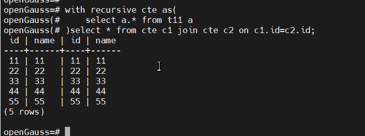
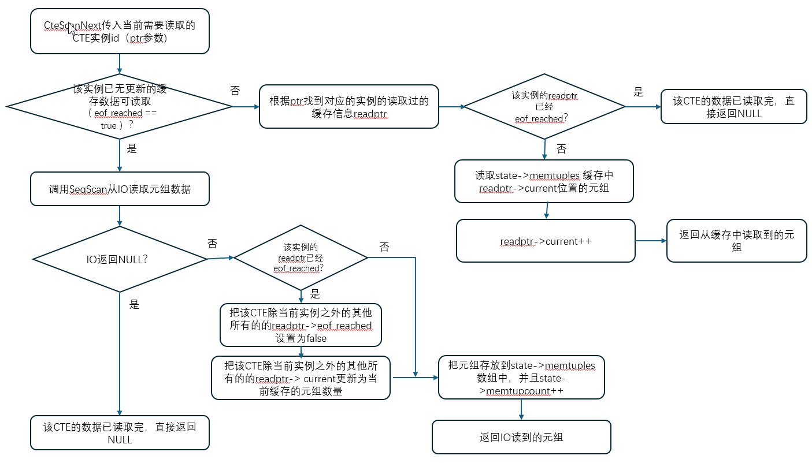

##### 一. 前言

​     CTE 是指with的公共表达式，如下所示是个CTE样例：



​       CTE表达式往往在同一条sql中多次被重复引用，如上图所示的cte被引用了两次（c1 和 c2），我们称为2个CTE实例。

​       本文只要讲述在openGuass中，在sql中同一个CTE被多次引用时，数据是如何进行缓存和Reuse的。如上所示cte的c1和c2两个实例进行数据读取时，只要真正读取一次t11的表即可。


##### 二. CTE REUSE相关数据结构

      1. 相同的CTE用的是同一个Tuplestorestate，Tuplestorestate->memtuples中缓存着改CTE的数据，Tuplestorestate->memtupcount记录着缓存里边元组的个数。
      1. 同一条sql中多次重复使用某CTE时，Tuplestorestate->readptrs记录着该CTE下每个CTE实例已经读取过的数据信息，readptrcount则记录着该CTE有多少个实例。
      1. 每个CTE实例保存有一个readptrs指针记录着访问缓存的信息，其中readptrs->current字段记录着该CTE实例已经读到的缓存数据位置，readptrs->eof_reached记录着该实例是否已经读取到缓存数据的边界。

4. Tuplestorestate->activeptr是临时保存的CteScanState->readptr信息，每次需要操作CTE实例的时候，会把Tuplestorestate->activeptr置为CteScanState->readptr，所以记录的也即使当前操作的CTE实例。


##### 三. CTE Reuse 实现流程和代码走读

​      CTE Reuse的实现整理流程如下所示：




代码走读如下所示：

```
CteScanNext
   tuplestore_select_read_pointer(tuplestorestate, node->readptr); // node->readptr记录着是当前需要读取数据的CTE实例的ID，将此ID暂存在state->activeptr中
   eof_tuplestore = tuplestore_ateof(tuplestorestate);
     state->readptrs[state->activeptr].eof_reached;
   if (!eof_tuplestore) {    // 如果对应的CTE实例还有缓存信息可以读取
       tuplestore_gettupleslot
           tuplestore_gettuple
               TSReadPointer* readptr = &state->readptrs[state->activeptr];  // 根据state->activeptr扎到对应CTE实例的readptr信息
               return state->memtuples[readptr->current++];  // 根据对用实例的readptr的current从缓存读取数据，并且readptr->current++，下次读取可以直接读取缓存中的下一条数据
   }
   if (eof_tuplestore) {  // 无更多的缓存数据
       ExecProcNode(node->cteplanstate);  // 直接通过SeqScan读取元组数据
       tuplestore_puttupleslot(tuplestorestate, cteslot);
           tuplestore_puttuple_common(state, (void*)tuple);
               readptr = state->readptrs;
               for (i = 0; i < state->readptrcount; readptr++, i++) {
                   if (readptr->eof_reached && i != state->activeptr) {
                       readptr->eof_reached = false;  // 将除了当前CTE实例外的其他已经eof的实例的eof_reached设置为false，因为有新的数据进缓存了
                       readptr->current = state->memtupcount;
                   }
               }
               
               state->memtuples[state->memtupcount++] = tuple;  // 将当前seqscan读到的数据保存到缓存中，并且将缓存的数量state->memtupcount++
   }
```

