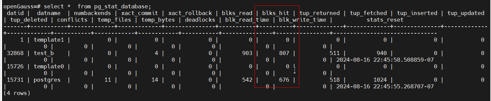
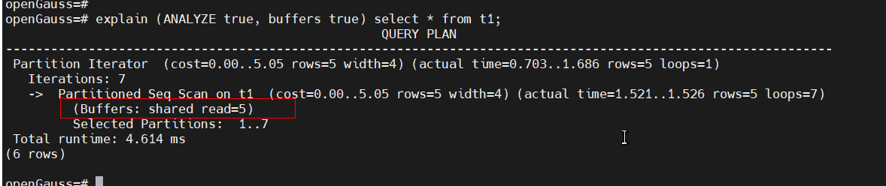

##### 一. 前言

​         在openGauss 中，select *  from pg_stat_database可以看到每个数据库缓存命中率（blks_hit）的统计，如下所示：



​     本文主要走读openGuass的代码来了解openGuass是在怎样进行缓存命中率的统计的。


##### 二.  数据库缓存命中率(blks_hit)统计实现流程

​            在openGauss 中，每一个表（Relation）的结构体有一个字段pgstat_info,pgstat_info->t_counts中会存放着relation的各种统计信息，如元祖的读取数量，缓存的命中数量等，如下是整个代码的实现流程。

​        1. 首先在回话初始化的时候，pgstat_initstats函数会在回话中，创建pgstat_info的内存空间并且赋值给relation->pgstat_info,代码流程如下所示：

```
pgstat_initstats
  rel->pgstat_info = get_tabstat_entry
    hash_entry = (TabStatHashEntry*)hash_search(u_sess->stat_cxt.pgStatTabHash, &rel_key);
       return entry   // entry就是relation的pgstat_info
```

​       2.  在读取数据块的时候，传入realtion，并且根据在buffer_read_extended_internal判断读取的是缓存还是磁盘来对改relation的t_blocks_hit的统计之，代码流程如下所示：

```
buffer_read_extended_internal
    ReadBuffer_common(...&hit...);
        bufHdr = BufferAlloc(&found);    
        if (found) {
            *hit = true;   // 如果需要读取的block在buff中能够找到，则将hit置上
        }
    if (hit) {
        pgstat_count_buffer_hit(reln);    // 如果hit被置上，则对改relation的t_blocks_hit统计信息进行加1
    }      
```

   3. 在StatementFlush现成中定位将定期发送将所有表的统计信息发送给PgstatCollectorMain现成汇总：

      ```
      StatementFlush
         pgstat_report_stat
           for (tsa = u_sess->stat_cxt.pgStatTabList; tsa != NULL; tsa = tsa->tsa_next) {
               for (i = 0; i < tsa->tsa_used; i++) {
                  memcpy_s(&this_ent->t_counts, &entry->t_counts)
                  pgstat_send_tabstat(this_msg);
               }
            }
      ```

4.  PgstatCollectorMain收到信息之后，第db下所有的包的t_blocks_hit进行汇总，并且存放着u_sess->stat_cxt.pgStatDBHash中

```
pgstat_recv_tabstat
    dbentry = pgstat_get_db_entry(msg->m_databaseid, true);
        result = (PgStat_StatDBEntry*)hash_search(u_sess->stat_cxt.pgStatDBHash, &databaseid);
        return result;
    for (i = 0; i < msg->m_nentries; i++) {
       tabentry->blocks_hit = tabmsg->t_counts.t_blocks_hit;
    }
```

       5.  select *  from pg_stat_database 的时候通过pg_catalog.pg_stat_get_db_blocks_hit函数从pgStatDBHash中获取到数据库的汇总后的t_blocks_hit统计信息，如下所示：

```
pg_stat_get_db_blocks_hit
    if ((dbentry = pgstat_fetch_stat_dbentry(dbid)) == NULL)
        result = 0;
    else
        result = (int64)(dbentry->n_blocks_hit);   // dbentry 存放着的就是步骤4的所有表信息的汇总      
```


##### 三.  单条sql的缓存命中率统计

​       执行单条sql比如explain (ANALYZE true, buffers true) select * from t1时，可以看到单条sql的缓存命中率，如下所示：



​         单条sql的缓存命中率实现比较简单，单条sql的缓存命中命中率是存放在u_sess->instr_cxt.pg_buffer_usage->shared_blks_hit中的，explain的时候也是直接从u_sess->instr_cxt.pg_buffer_usage->shared_blks_hit中读取，如下是实现流程：

1. 初始化planstate的时候，将当前u_sess->instr_cxt的当前缓存统计信息保存到planstate->instr->bufusage_start ，用于后边求差值作为实际的统计信息：

   ```
   InstrStartNode
      if (instr->need_bufusage)
         instr->bufusage_start = *u_sess->instr_cxt.pg_buffer_usage;
   ```

   

2.  执行sql，其中根据是否命中缓存，直接修改u_sess->instr_cxt中的统计信息：

```
ReadBuffer_common
   bufHdr = BufferAlloc(....);
   if (found) {
        u_sess->instr_cxt.pg_buffer_usage->shared_blks_hit++;
   } else {
        u_sess->instr_cxt.pg_buffer_usage->shared_blks_read++;
   }
```


3. explain执行计划结束时，再拿到u_sess->instr_cxt统计信息，减去步骤1保存的初始信息，作为此sql的实际命中缓存数据保存到planstate->instrument中，代码流程如下所示：

```
InstrStopNode
    BufferUsageAccumDiff(&instr->bufusage, u_sess->instr_cxt.pg_buffer_usage, &instr->bufusage_start);
        dst->shared_blks_hit += add->shared_blks_hit - sub->shared_blks_hit;  // 统计此单条sql的缓存命中率，并且保存到PlanState->instr中
```


2. explain从planstate中读取到缓存的命中信息并显示。

```
ExplainNode
  show_buffers(es, es->str, planstate->instrument, false, -1, -1, NULL);
      usage = &instrument->bufusage
          show_buffers_info4
              appendStringInfo(infostr, " hit=%ld", usage->shared_blks_hit);
```


