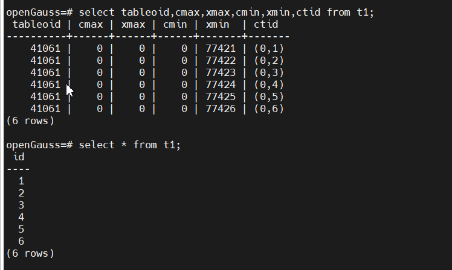

##### 一. 前言

​      openGauss在建表时，系统会自动插入tableoid，cmax，xmax，cmin，xmin，ctid 六个系统隐藏列，在select*的时候也会自动隐藏这6个系统隐藏列，如下所示：



​     本文主要走读代码了解openGauss是如何实现系统隐藏列的功能的。


##### 一.  create table时自动往表中插入系统隐藏列

​         create table时自动往表中插入系统隐藏列的核心代码入口在heap_create_with_catalog函数中，在往pg_attribute元数据表insert完普通的列后接着insert系统隐藏列的信息，代码流程如下所示：

```
heap_create_with_catalog
    AddNewAttributeTuples
        for (i = 0; i < natts; i++) {
            InsertPgAttributeTuple(rel, attr, indstate);  // 往PG_ATTRIBUTE系统表中插入表的普通字段
        }
        if (relkind != RELKIND_VIEW && relkind != RELKIND_COMPOSITE_TYPE && relkind != RELKIND_CONTQUERY) {
            for (i = 0; i < (int)lengthof(SysAtt); i++) {
                InsertPgAttributeTuple(rel, &attStruct, indstate);  往PG_ATTRIBUTE系统表中插入表的隐藏字段，也即xmin，xmax，cmin，cmax等字段，另外，系统隐藏列的AttributeNumber均为在代码中硬编码且均为小于0的负数，这也为区分是某一列是系统隐藏列还是普通列提供了区分的方式
            }
        }
```


##### 二. insert数据时自动往隐藏列insert数据

​      在insert数据的时候，系统的隐藏列的数据也要同时被insert进去，核心代码入口在heap_insert中，insert的场景主要是xmin的值比较重要。

```
heap_insert
    TransactionId xid = GetCurrentTransactionId();
    heaptup = heap_prepare_insert(relation, tup, cid, options);
        HeapTupleHeaderSetCmin(tup->t_data, cid);   // 设置cmin
        HeapTupleSetXmax(tup, 0);  // 设置xmax值，其实insert场景xmax值一直都是0
    RelationPutHeapTuple(relation, buffer, heaptup, xid);
        tuple->t_data->t_choice.t_heap.t_xmin = NormalTransactionIdToShort(pd_xid_base, xid) // 设置xmin，xmin其实就是xid的值，但元组中存储的其实是将xid与xid的差值
        (HeapTupleHeader)item)->t_ctid = tuple->t_self;  // 保存t_ctid
```


##### 三. select *的时候自动忽略隐藏列的数据

​       seelct * 的时候自动屏蔽系统隐藏列是扫描pg_attribute获取表的列信息时自动添加过滤条件attnum > 0实现的，主要的实现入口在relation_open中，代码流程如下所示：

```
relation_open
    RelationIdGetRelation
        RelationBuildDesc
            RelationBuildTupleDesc
	             ScanKeyInit(&skey[1], Anum_pg_attribute_attnum, BTGreaterStrategyNumber, F_INT2GT, Int16GetDatum(0));  // 只扫描attnum大于0的列，因为隐藏列的attnum都小于0但真正的物理表的列大于0，因此扫描表的列信息时自动将系统隐藏列忽略
	             pg_attribute_scan = systable_beginscan(...skey...)
	             while (HeapTupleIsValid(pg_attribute_tuple = systable_getnext(pg_attribute_scan))) {
	                 memcpy_s(&relation->rd_att->attrs[attp->attnum - 1]...attp...)  // 保存列信息到relation中
	             }
```


