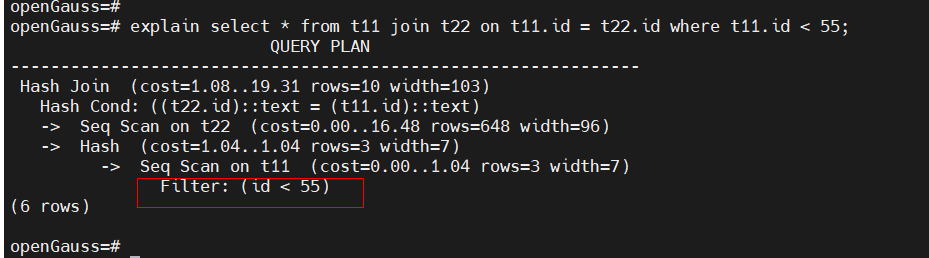

##### 一. 前言

​      谓词下推是每一个SQL引擎必备的功能。本文主要通过走读代码了解openGuass中是如何实现谓词下推能力的。

​      谓词下推即时将过滤条件尽可能往tablescan的节点下推，实现上层算子尽可能少计算的能力，如下所示的谓词id<55就下推到了tablescan节点。




##### 二. 执行计划生成层将谓词信息保存在seqscan node的ps.qual

​     实现谓词下推首先需要再执行计划生成节点将谓词过滤条件保存到tablescan节点，openGuass主要靠如下的步骤实现过滤条件保存到SeqScan的：

1.  openGuass首先会在将Join中涉及的物理表提取出来，然后处理where条件中，将where条件谓词的信息保存到对应relation的baserestrictinfo字段中，此步的操作入口在deconstruct_jointree函数中，代码流程如下所示：

```
deconstruct_jointree
   deconstruct_recurse
       if (IsA(jtnode, FromExpr))
       {
          foreach (l, f->fromlist) {    // 找出from后边的物理表
             sub_joinlist = deconstruct_recurse(...&child_postponed_quals); // 抽取from实体表的eqal条件,保存在child_postponed_quals中
             foreach (l, (List*)f->quals) {  // 把每一个谓词条件和其对应的relation绑定起来
                 distribute_restrictinfo_to_rels
                     rel->baserestrictinfo = lappend(rel->baserestrictinfo, restrictinfo);
             }
          }
       }
```


2. 生成seqscan_plan的时候，如果对应的relation有谓词条件，将谓词条件的信息保存在plan->qual中

```
create_seqscan_plan
   scan_clauses = rel->baserestrictinfo;
   scan_clauses = extract_actual_clauses(scan_clauses, false);
       scan_plan = make_seqscan(tlist, scan_clauses, scan_relid);
           plan->qual = qpqual;
```


3.  在初始化SeqScan Node节点的relation时，再将plan->qual的expr转换成ExprState，保存在node->ps.qual中

```
BeginScanRelation
    reset_scan_qual
        node->ps.qual = ExecInitExprByRecursion(node->ps.plan->qual)  // 把expr转换成ExprState
```


##### 三. 执行层根据seqscan Node 的ps.qual过滤扫描出来的元组

执行层的实现是每扫描扫一个元组，那么使用ps.qual构造出来的谓词条件去比对，满足谓词条件则保留且将元组返回上层，不满足则继续扫描下一个元组，直到满足为止。

```
ExecScan
   slot = ExecScanFetch(node, access_mtd, recheck_mtd);  // 取到表的元组
   econtext->ecxt_scantuple = slot;   // 将元组放置同时保存在econtext->ecxt_scantuple中
   qual = node->ps.qual   //
   ExecQual(qual, econtext)   // 与谓词条件比较，看是否满足
     ExecQualByRecursion
     foreach (l, qual) {
         ExecEvalExpr(clause, econtext, &isNull, NULL);
            ExecEvalOper
               ExecMakeFunctionResultNoSets<false, false>(fcache, econtext, isNull, isDone);
                 fcinfo->arg[i] = ExecEvalExpr(argstate, econtext, &fcinfo->argnull[i], NULL); //将从slot的具体值取出来，作为谓词比较函数(如int4lt)的参数，计算谓词的结果
     }
  // 后续如果谓词命中，则返回此元组，否则就继续找下一个元组
```

