#### 一.  前言

​        openGauss中的core文件是指当用户执行sql触发了openGauss数据库软件漏洞或者openGauss遇到自身不可处理的软硬件问题导致程序崩溃时，操作系统自动保存最后崩溃时刻内存数据的镜像文件。我们通过使用gdb工具回放内存镜像文件获取到导致openGauss数据库崩溃时的外部输入信息和、存中的变量值、程序调用栈等信息来定位数据库崩溃的原因。

​         openGauss能生成core文件的前提有2个：

​         1.  在操作系统中没有禁止core文件的生成。

​         我们可以可以通过ulimit -a 命令查看操作系统中是否禁止了core文件生成。如果ulimit的core file size配置项为0则说明让操作系统在程序崩溃时候生成core文件。我们可以通过ulimit -c unlimited 命令开启让操作系统生成core文件，如下随时:

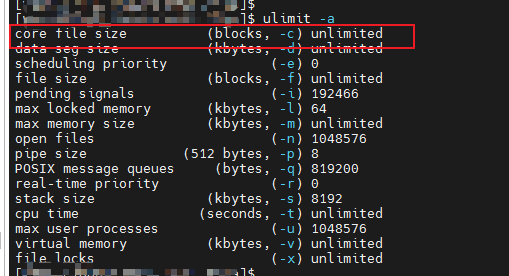


​         2. 启动openGauss进程的用户（比如omm）具备生成core文件路径（在/proc/sys/kernel/core_pattern中配置的路径）的读写权限。

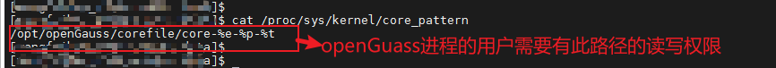


​         本文主要讲述如果通过gdb回放core文件来查找导致openGauss崩溃的sql语句。

​         本文的的所有操作均需要使用openGauss进程的启动用户进行操作（比如omm）。


#### 二.  导入符号表

​       在通过gdb回放core文件之前需要先导入openGauss的符号表，因为openGauss的发行软件包均为release版本的软件包，如果没有导入符号表的话，会导致很多函数名缺失，导致通过gdb回放时候无法看到较为有用的调用栈信息，如下所示的样例就是缺失符号表的回放调用栈，几乎看不到有效信息。

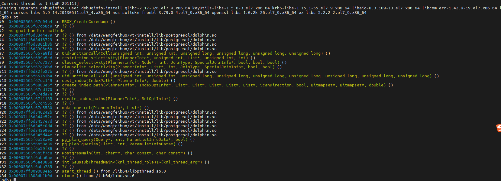

​       因此我们需要在回放core文件之前导入符号表，导入符号表的操作流程如下所示：

​       2.1    在官网（https://opengauss.org/zh/download/）下载对应安装版本的符号表的包：

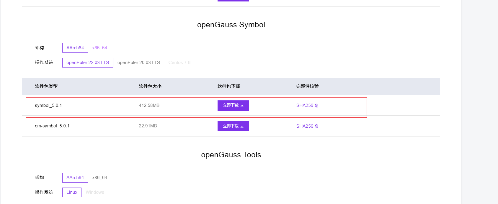


​       2.2 上传到openGauss部署程序所在的服务器上，并进行通过tar zxvf openGauss-xxxx-symbol.tar.gz命令解压，本文以openGauss-5.0.1-CentOS-64bit-symbol.tar.gz符号表上传到/tmp/symbol路径为例说明：

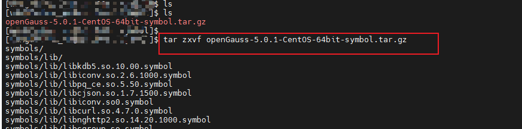


​       2.3  将解压后的符号目录拷贝到openGauss的安装目录所对应的目录

​            解压符号表后一般会有bin/lib 等文件夹，需要分别将里边的内容复制到openGauss安装目录下的同样文件夹路径下，比如bin目录的符号表拷贝到openGauss的bin目录下，lib目录下的符号表拷贝到openGauss的lib目录下。

​            本文以符号表解压后所在的路径为/tmp/symbol/symbols/ 路径， openGauss安装目录所在的路径为/data/test/vt/install/ 路径，则拷贝命令为：

```
cp /tmp/symbol/symbols/bin/* /data/test/vt/install/bin/ -R
cp /tmp/symbol/symbols/lib/* /data/test/vt/install/lib/ -R
```

​            下边为具体的操作过程说明：

​            解压后的符号表路径的文件夹示例：

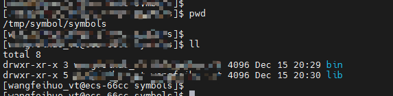


​            openGauss 安装路径的文件夹示例：

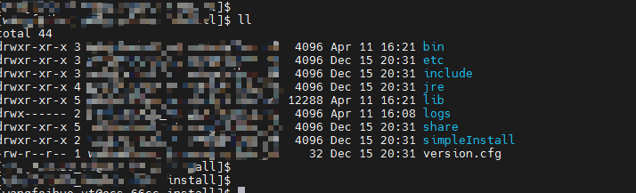


​            将符号表的路径的所有符号文件拷贝到openGauss安装路径下对应的文件夹下：

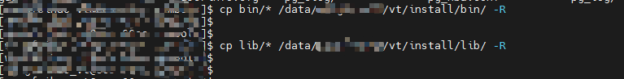


​            拷贝完成之后可以在openGauss的安装目录下看到很多symbol文件，如下所示，则符号表导入完成。

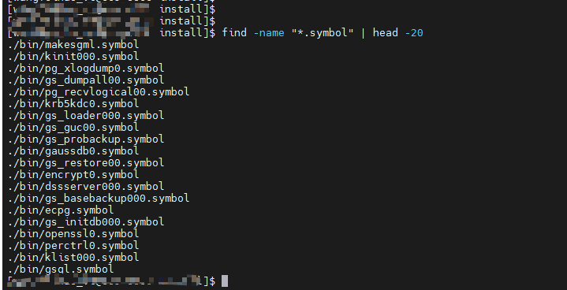


#### 三. gsql使用场景下查找导致core的sql语句

​      将符号表导入完成后，按照如下操作查找导致openGauss core的sql语句。

​      3.1  通过cat /proc/sys/kernel/core_pattern命令查看生成core文件所在的路径并进入。

​           本文以core文件所在的路径为/opt/openGauss/corefile/为例进行说明，进入到core文件的路径后，可以看到此路径下会lz4压缩后的core文件，如下所示：

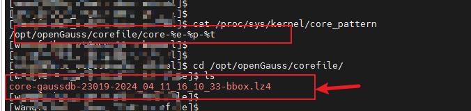

​       

​      3.2   执行  lz4 -d  <lz4文件的文件名>  对core文件进行解压，如下所示：

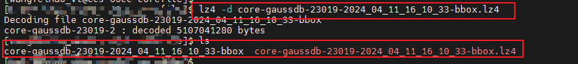


​      3.3  执行 gdb gaussdb <lz4解压后的文件的文件名>   命令回放core镜像，如下所示：

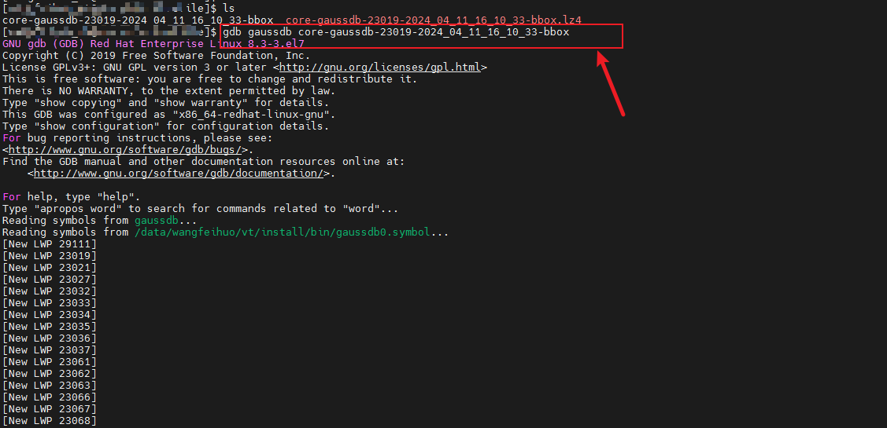

​       

​      3.4   在gdb的界面上执行bt获取调用栈，一般会在exec_simple_query的函数帧中看到导致core的sql语句，如下所示：

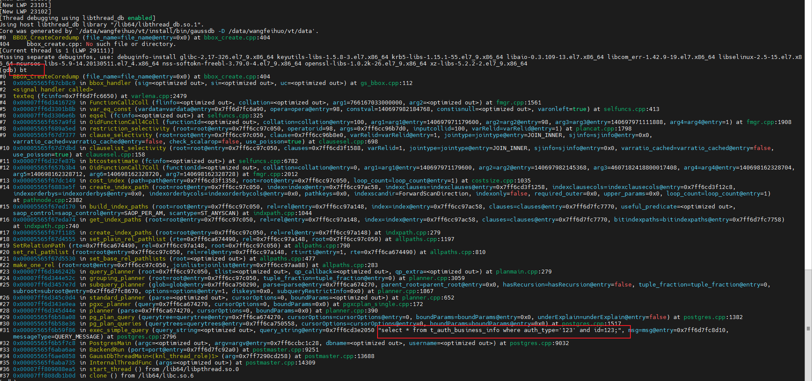


​      3.5    如果需要进一步定位core的原因，可以通过gdb的f 命令切换到对用的函数帧并且通过p命令打印变量，如下所示：

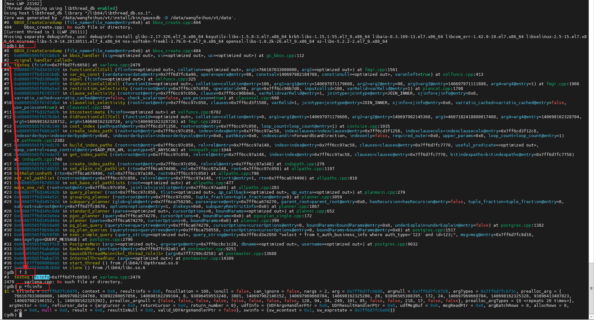


#### 四.   JDBC使用场景下查找导致core的sql语句

​        JDBC使用场景和gsql使用场景查看core文件的原理和步骤是相同的。唯一的区别在于可能JDBC会通过绑定参数的形式将sql提交给openGauss执行，因此在上述的exec_simple_query的函数帧中没法直接看到提交的sql，如下所示：

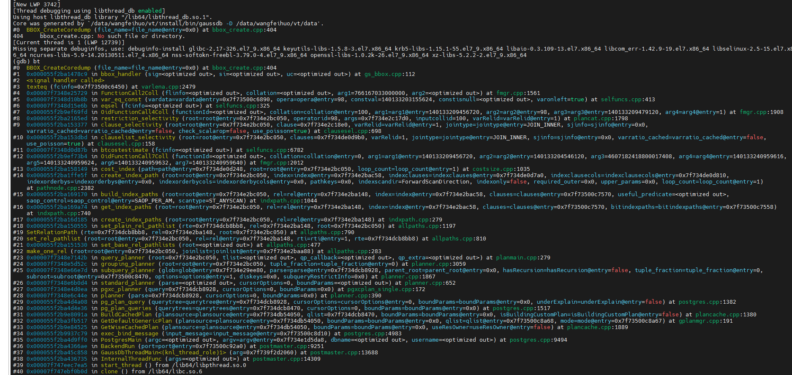


​        在此场景下，在gdb的界面上通过f命令将函数帧切换到GetWiseCachedPlan函数所在的帧，通过打印*plansource 变量就能获取到执行的sql语句，如下所示：

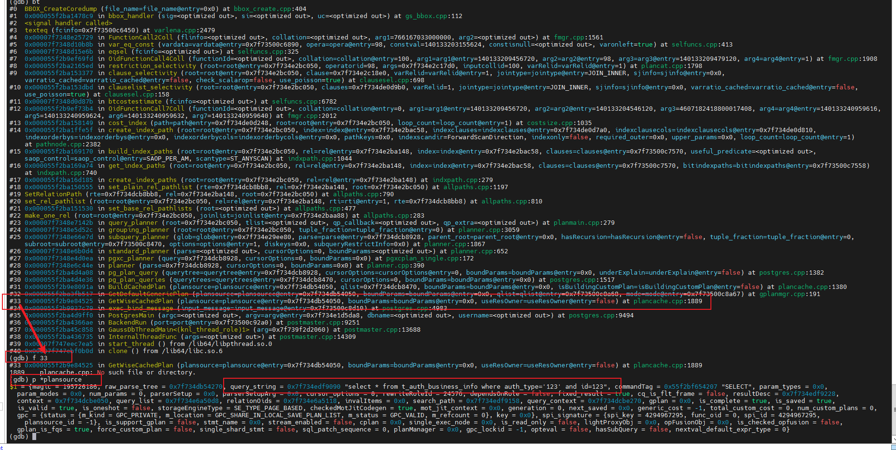

