中国移动磐维数据是基于openGauss定制开发的中国移动自用版OLTP数据库。自去年12月发布以来，受到广泛关注，目前已成功上线百余套。
在产品落地的过程中，我们积累了大量的迁移、适配，以及问题分析诊断的经验。
本文分享我们在用户环境发现的一个数据查询结果异常问题的分析诊断过程。

社区issue：https://gitee.com/opengauss/openGauss-server/issues/I72FHP
## **【1. 问题现象】**
### 用户环境
	- 系统环境：openEuler 20.03_x86
    - 数据库版本：PanWeiDB 1.0.0（基于openGauss v3.0.1）
### 现象描述 
查询表记录数，通过表扫描（Seq Scan）和纯索引扫描（Index Only Scan），查询结果不一致，如下图所示：

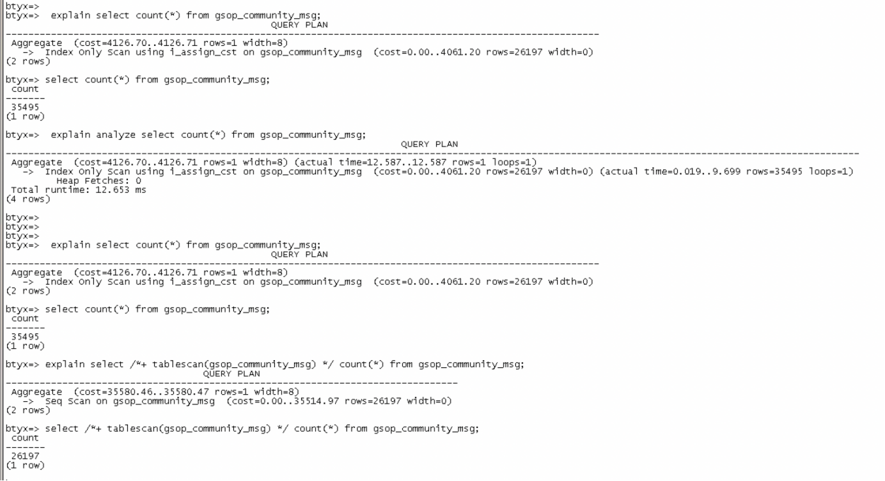
## **【2. 场景分析】**
1. 表上定义有btree索引。
2. 表上有较高并发的写，更新表和索引。
3. 对表进行vacuum freeze后索引数据不一致问题恢复，但有warning报错，如下图所示：

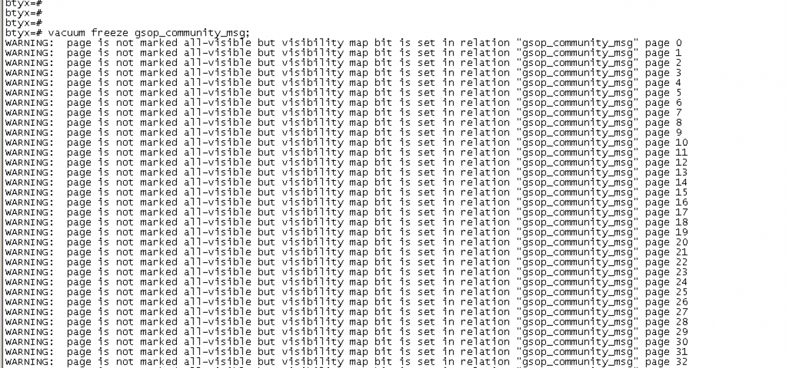
## **【3. 问题复现】**
### 复现思路
1. 采用用户环境相同的数据库配置。
2. 创建表和btree索引，插入测试数据。
3. 并发执行两组写： 
   - 多次更新某一条数据，不涉及索引更新。
   - 多次更新某一条数据，每次都更加索引键值。
### 测试用例
    1. 创建用户、数据库、模式
    create user testusr password '******';
    grant all privileges to testusr;
    \c postgres
    drop database if exists testdb;
    create database testdb;
    \c testdb
    create schema wss_test;
    set search_path to wss_test;
    
    2. 编译
    javac -cp .jar insert.java update_dup.java update_diff.java

    3. 执行insert（建表、索引，插入测试数据）
    java -cp .:postgresql.jar insert

    4. 多次执行update_dup（多次更新某一条数据，不涉及索引更新）
    java -cp .:postgresql.jar update_dup

    5. 查看count(*)执行计划，确保为Index Only Scan
    select count(*) from wss_test.t_m_resource_monitor_test2;
    explain analyze select count(*) from wss_test.t_m_resource_monitor_test2;

    6. 多次执行update_diff和update_dup
    java -cp .:postgresql.jar update_diff（多次更新某一条数据，每次都更加索引键值）
    java -cp .:postgresql.jar update_dup（多次更新某一条数据，不涉及索引更新）
    
    7. 在主从节点查询count(*)，可以看到主从节点查询结果出现差异
    select count(*) from wss_test.t_m_resource_monitor_test2;
    explain analyze select count(*) from wss_test.t_m_resource_monitor_test2;
[insert.java](./files/insert.java)

[update_dup.java](./files/update_dup.java)

[update_diff.java](./files/update_diff.java)
### 复现结果
#### 主节点

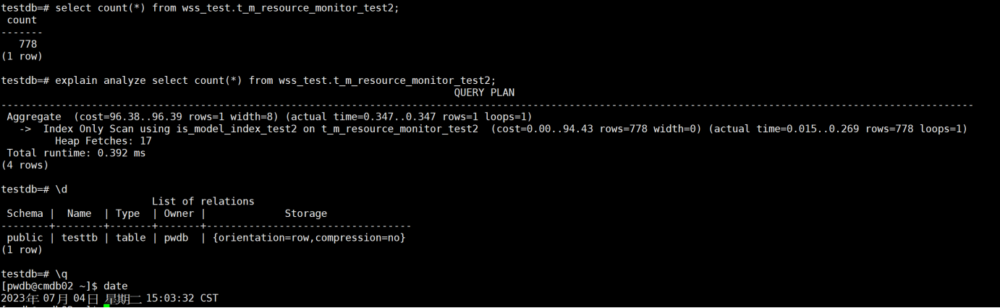
#### 备节点

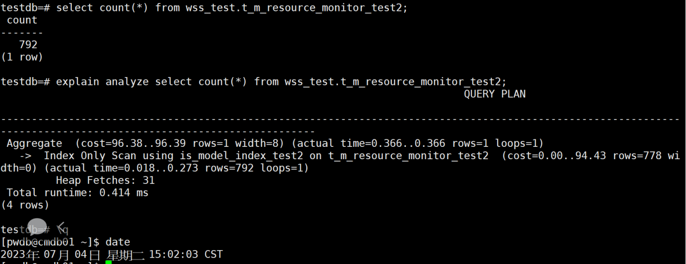
### 复现说明
1. 复现过程中发现，主节点查询结果始终正确，仅备节点查询结果出现不一致。
2. 仅在PanWeiDB 1.0.0（基于opengauss v3.0.1）复现，PanWeiDB 2.0.0（基于opengauss v5.0.0）未复现。
## **【4. 问题诊断】**
由于结果出现偏差的是备节点的Index Only Scan查询，所以排查该查询计划的优化逻辑，
发现Index Only Scan查询使用了数据表的VM（visibility map）文件来判断数据元组的可见性，
即是否应该包含在结果集当中，因此怀疑VM文件的数据页可见性标志位是否准确。
1. 查询数据表和索引的filepath。

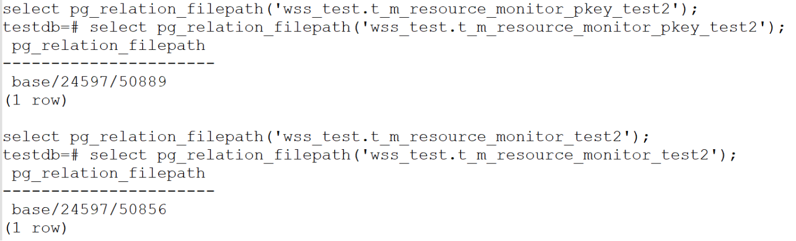
2. 用pagehack工具打印数据表，查看数据页标志位，发现主备节点有PD_ALL_VISIBLE标志的数据页均为42个。

```./pagehack -f /data/pwdb/data/base/24597/50856 -t heap -v```

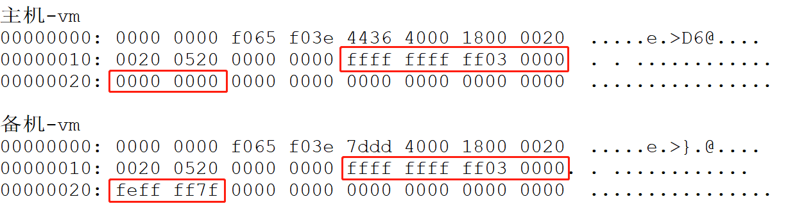
3. 用pagehack工具用十六进制的方式打印VM文件，查看数据页可见性标志位，发现主节点为42个完全可见页，备节点有72个。

## **【5. 代码分析】**
由上述诊断可见，确实是备节点VM文件数据页可见性标志位的问题导致了备节点Index Only Scan查询结果出现偏差，
因此怀疑备节点VM文件的数据页可见性标志位修改（清理）逻辑是否有问题。
1. 相关的VM修改接口如下图所示：

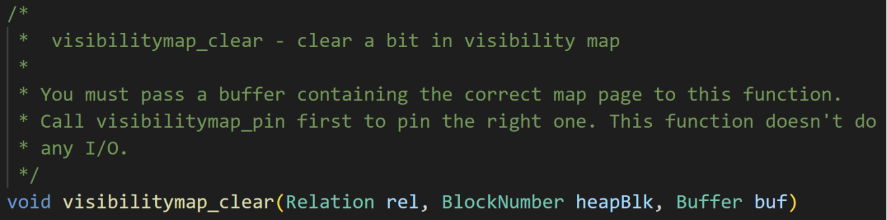

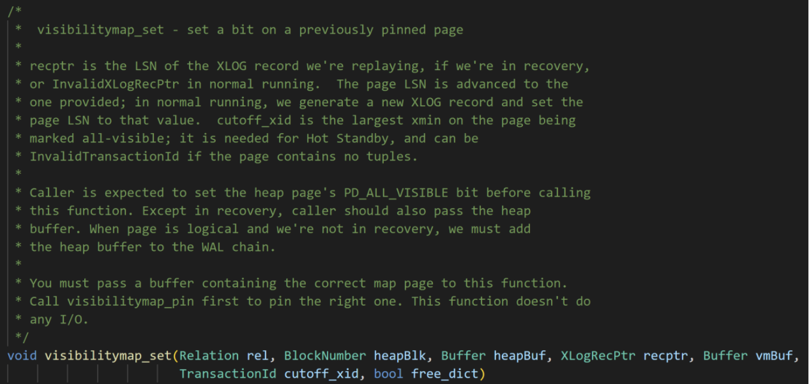
2. 由于复现过程中仅涉及insert、update两类操作，因此主要排查这两类xlog日志回放逻辑，
其中clear清除接口在备节点回放insert、update xlog日志时都会被调用。

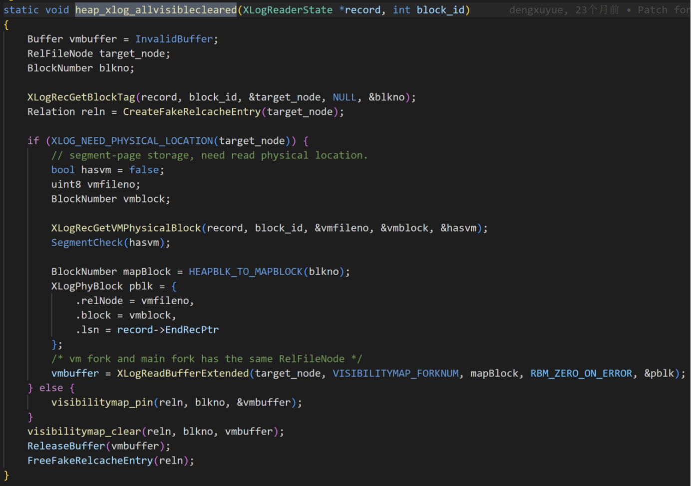
3. 回放update时，会从update xlog日志头位置添加两个偏移量，分别是sizeof(TransactionId)和sizeof(CommitSeqNo)，
然后读取日志的标志位，根据标志位判断是否修改VM文件，清理数据页可见性标志位，如下图所示：

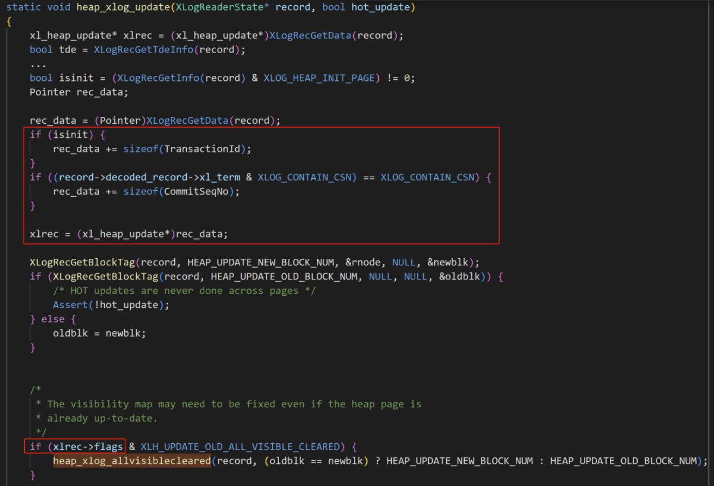
4. 然而在写update xlog日志时，CommitSeqNo字段写入位置是在日志数据的尾部，如下图所示：

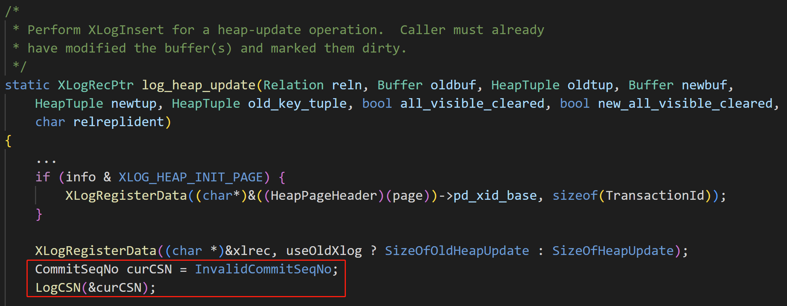

经排查发现，由于PanWeiDB 1.0.0（基于opengauss v3.0.1）在实现并行逻辑解码功能时，
在执行DML操作时会在xlog的末尾追加写入CommitSeqNo（CSN），备节点回放xlog时读取，用于逻辑解码。
但heap_xlog_update接口读取xlog时误认为CSN在xlog的头部，因此添加了该字段的偏移量来获取标志位，
根据标志位判断是否修改VM文件，清理数据页可见性标志位，导致备节点的VM文件错误。
相关逻辑仅在wal_level设置为logical时生效，且若主备发生切换，该问题在主节点也有几率出现，与用户场景相符。
## **【6. 代码修复】**
1. 删除heap_xlog_update接口中添加长度为sizeof(CommitSeqNo)的偏移量的代码。
2. openGauss 3.1.0已修复该问题，但没有bug相关的描述，提交记录如下：
https://gitee.com/opengauss/openGauss-server/commit/b919f404e8d9acff1824d299dccecd9f2c741b43
## **【7. 解决方案】**
1. 该问题只wal_level设置为logical的情况下才会发生，若无需使用逻辑复制功能，可以将wal_level设置为hot_standby并对主备节点执行vacuum。
2. 或者关闭enable_indexonlyscan参数，禁用纯索引扫描，一般情况下实际生产环境中能使用Index Only Scan的情况比较少，可以考虑在用户环境关闭该参数后测试影响。
3. 彻底修复客户环境问题，可以考虑代码修复合入后，打补丁或者大版本升级。
## **【8. 致谢】**
感谢海量数据库内核专家协助分析！