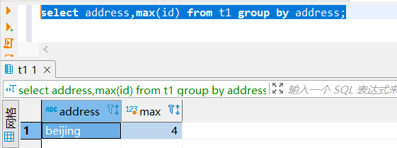
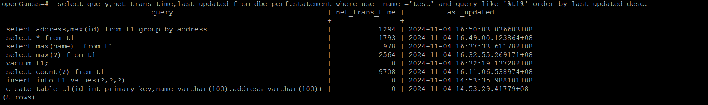
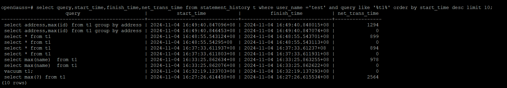

# 带你体验一下openGauss6.0全链路跟踪能力

在openGauss6.0版本中的可维护性中介绍全链路跟踪能力，主要是追踪并记录sql语句从客户端到数据库服务端网络耗时。这个功能主要是为了解决无法监控网络耗时，因为有些时候，当我们执行一个问题sql执行，有时会发现在服务器端执行没有问题，但是在客户端执行比较慢的问题。现在有全链路跟踪能力，就可以快速的知道一个sql的网络耗时，可以快速的定位sql性能是否与网络相关。

## 版本特性描述

可维护性：支持全链路跟踪能力

- 实现追踪并记录jdbc查询接口执行sql的端到端网络耗时，并记录在数据库dbe_perf.statement视图、statement_history表中。

## 支持条件

仅当**openGauss server版本和jdbc版本均大于6.0**时，才支持全链路跟踪能力。目前仅有jdbc版本的驱动。另外虽然该特性涉及与jdbc与数据库的交互能力，但是用户只需要在数据库内核设置enable_record_nettime参数是否开启该功能。

## enable_record_nettime说明

```
参数说明：控制驱动全链路跟踪功能的开关，on为开，off为关。参数打开后将驱动执行的sql网络链路耗时记录在statement_history表中，通过dbe_perf.statement视图，standby_statement_history函数可以查询链路网络耗时net_trans_time，且wdr报告中TimeModel支持查看net_trans_time。当前仅支持6.0.0以上版本的JDBC驱动。
该参数属于USERSET类型参数，请参考表1中对应设置方法进行设置。
取值范围：布尔型
默认值：off
```

## 网络链路耗时查询方式

可以查看dbe_perf.statement视图、statement_history表的net_trans_time字段来查看网络链路的耗时，单位是微妙。

```
select query,net_trans_time,last_updated from dbe_perf.statement;
select query,start_time,finish_time,net_trans_time from statement_history;
```

## 准备测试用例表

在这里我们准备一个简单的测试用例表，来验证简单的增删改查。

```
create table t1(id int primary key,name varchar(100),address varchar(100));
insert into t1 values(1,'wang1','beijing');
insert into t1 values(2,'wang2','beijing');
insert into t1 values(3,'wang3','beijing');
insert into t1 values(4,'wang4','beijing');
```

## 查看enable_record_nettime默认的值

```
openGauss=# show enable_record_nettime;
 enable_record_nettime
-----------------------
 off
(1 row)
```

## 开启全链路跟踪开关

可以使用guc命令来修改enable_record_nettime值为on，开启全链路跟踪功能。另外还需要修改log_min_duration_statement和track_stmt_stat_level参数。

**log_min_duration_statement**表示慢SQL阈值，如果为0则全量收集，时间单位为毫秒；

**track_stmt_stat_level**表示信息捕获的级别，建议设置为track_stmt_stat_level='L0,L0'

```
gs_guc reload -N all -I all  -c 'enable_record_nettime=on';
gs_guc reload -N all -I all  -c 'log_min_duration_statement=0';
gs_guc reload -N all -I all  -c "track_stmt_stat_level='L0,L0'";
```

## 在客户端执行测试SQL语句

```
select address,max(id) from t1 group by address;
```



## 查看dbe_perf.statement视图中的信息

```
openGauss=#  select query,net_trans_time,last_updated from dbe_perf.statement where user_name ='test' and query like '%t1%' order by last_updated desc;
                                   query                                    | net_trans_time |         last_updated
----------------------------------------------------------------------------+----------------+-------------------------------
 select address,max(id) from t1 group by address                            |           1294 | 2024-11-04 16:50:03.036603+08
 select * from t1                                                           |           1793 | 2024-11-04 16:49:00.123864+08
 select max(name)  from t1                                                  |            978 | 2024-11-04 16:37:33.611782+08
 select max(?) from t1                                                      |           2564 | 2024-11-04 16:32:55.269171+08
 vacuum t1;                                                                 |              0 | 2024-11-04 16:32:19.137282+08
 select count(?) from t1                                                    |           9708 | 2024-11-04 16:11:06.538974+08
 insert into t1 values(?,?,?)                                               |              0 | 2024-11-04 14:53:35.988101+08
 create table t1(id int primary key,name varchar(100),address varchar(100)) |              0 | 2024-11-04 14:53:29.41779+08
(8 rows)
```




通过测试结果，可以看出在dbe_perf.statement已经记录刚才执行的sql，并且网络消耗的时间为1294us。

## 查看statement_history表中的记录信息

```
openGauss=# select query,start_time,finish_time,net_trans_time from statement_history t where user_name ='test' and query like '%t1%' order by start_time desc limit 10;
                      query                      |          start_time           |          finish_time          | net_trans_time
-------------------------------------------------+-------------------------------+-------------------------------+----------------
 select address,max(id) from t1 group by address | 2024-11-04 16:49:40.847096+08 | 2024-11-04 16:49:40.848015+08 |           1294
 select address,max(id) from t1 group by address | 2024-11-04 16:49:40.846453+08 | 2024-11-04 16:49:40.847074+08 |              0
 select * from t1                                | 2024-11-04 16:48:55.543124+08 | 2024-11-04 16:48:55.543701+08 |            899
 select * from t1                                | 2024-11-04 16:48:55.54295+08  | 2024-11-04 16:48:55.543113+08 |              0
 select * from t1                                | 2024-11-04 16:37:33.611937+08 | 2024-11-04 16:37:33.61237+08  |            894
 select * from t1                                | 2024-11-04 16:37:33.611803+08 | 2024-11-04 16:37:33.611931+08 |              0
 select max(name)  from t1                       | 2024-11-04 16:33:25.862634+08 | 2024-11-04 16:33:25.863255+08 |            978
 select max(name)  from t1                       | 2024-11-04 16:33:25.862076+08 | 2024-11-04 16:33:25.862622+08 |              0
 vacuum t1;                                      | 2024-11-04 16:32:19.123703+08 | 2024-11-04 16:32:19.137293+08 |              0
 select max(?) from t1                           | 2024-11-04 16:27:26.614458+08 | 2024-11-04 16:27:26.615534+08 |           2564
(10 rows)

```



通过上面的查询可知，在statement_history也已经有执行sql的记录，网络消耗的时间为1294us和dbe_perf.statement的值一致。

## 总结

全链路跟踪能力是对数据库问题定位工具的完善，对于数据库运维的老师来说又是一个好的消息。 在这边文章中我只是带领大家初步了解一下全链路跟踪能力怎么查看，但是详细的内部原理，大家可以参考openGauss官网视频号中对于该功能的详细介绍。

## 参考

【openGauss 6.0.0 LTS版本特性解读(四) | openGauss 全链路跟踪】https://www.bilibili.com/video/BV1gFSRYKErB?vd_source=0741f9621c39156deebce32bbdc2a50c