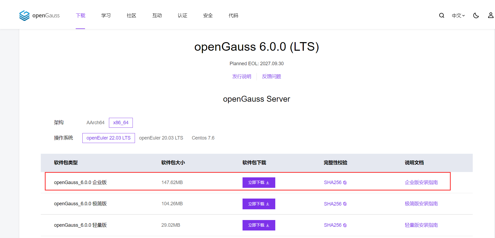

# 前言

> 在当今数字化转型的浪潮中，**数据库**作为信息系统的核心组件，其性能和稳定性直接关系到企业的业务运行效率和数据安全。==`openGauss`==，作为一款**开源**的**关系型数据库管理系统**，凭借其高性能、高可用性和可扩展性，逐渐成为众多企业和开发者的首选。随着`openGauss 6.0.0-LTS`版本的发布，**其带来了更加丰富的功能和更高的性能优化，为企业级应用提供了更加强大的支持**。
>
> 接下来让我们一起走进 `openGauss`的世界，探索其卓越的性能与广泛的应用价值！

# openGauss介绍

> `openGauss`是一款全面友好开放的**企业级开源关系型数据库管理系统**，它深度融合华为在数据库领域的研发经验，提供面向多核架构的极致性能、全链路业务与数据安全、基于AI的调优和高效运维能力，支持标准的SQL规范，具有**高性能、高可用、高安全、易运维、全开放的**特点，并允许任何人**免费使用、修改和分发，采用木兰宽松许可证协议。**
>
> **官网链接：**[https://opengauss.org/](https://opengauss.org/)


# 软件下载

> **可以根据自身业务需求，前往[openGauss官网](https://opengauss.org/zh/)下载对应软件版本，[点击此处](https://opengauss.org/zh/download/)直达`openGauss-6.0.0_LTS`的下载地址**
>
> - **企业版**：高斯数据库企业版提供全面的功能和高级特性，专为高性能、高可靠性和高安全性要求的企业级应用设计。
> - **极简版**：高斯数据库极简版注重轻量级和易用性，为小型项目或测试环境提供基本的数据库服务。
> - **轻量版**：高斯数据库轻量版专为特定操作系统和硬件架构优化，提供高性能和低资源占用的数据库解决方案。



> `openGauss`**官网还提供了更加详细的数据库文档，供我们学习参考**
>
> **官方文档地址：**[https://docs-opengauss.osinfra.cn/zh/](https://docs-opengauss.osinfra.cn/zh/)


# 部署流程

## 环境规划

> `openGauss 6.0.0-LTS`部署指南，从环境准备、安装配置到使用，全面覆盖部署过程中的各个环节。
>
> - **选择合适的操作系统：**`openEuler-22.03_LTS_x86_64`==（推荐）==
> - **选择数据库的版本：**`openGauss-6.0.0_LTS_x86_64 企业版`
> - **选择部署方式：**`虚拟机部署`和`服务器部署`（本篇文章选择**本地虚拟化部署**）
> - **虚拟化软件的选择：**`vmware workstation player/pro`
> - **部署方式：** 单节点虚拟机部署（和服务器安装方式一样，均可参考本篇博文）
>
> **如果在服务器进行部署，可以参考官方软硬件安装环境：**[准备软硬件安装环境](https://docs-opengauss.osinfra.cn/zh/docs/6.0.0/docs/GettingStarted/%E5%87%86%E5%A4%87%E8%BD%AF%E7%A1%AC%E4%BB%B6%E5%AE%89%E8%A3%85%E7%8E%AF%E5%A2%83.html)

|  虚拟化软件   |  主机名   |     主机IP      | 内存 | CPU  | 核心数 | 磁盘 | 网络模式 |
| :-----------: | :-------: | :-------------: | :--: | :--: | :----: | :--: | :------: |
| VMware 16.2.3 | OpenGauss | 192.168.129.166 | 4GB  |  1   |   2    |  80  |   NAT    |

## 初始化环境配置

### 设置主机名

> 设置本地虚拟机主机名

```bash
[root@openGauss ~]# hostnamectl hostname openGauss
[root@openGauss ~]# hostname
openGauss
```

### 添加hosts表

> 添加`hosts`表，在末尾追加**IP地址和主机名**，实现**主机名和IP地址**的**相互解析**

```bash
[root@openGauss ~]# echo '192.168.129.166 openGauss' >> /etc/hosts
[root@openGauss ~]# cat /etc/hosts
127.0.0.1   localhost localhost.localdomain localhost4 localhost4.localdomain4
::1         localhost localhost.localdomain localhost6 localhost6.localdomain6
192.168.129.166 openGauss
```

### 关闭防火墙

> **查看防火墙状态**

```bash
[root@openGauss ~]# systemctl status firewalld
● firewalld.service - firewalld - dynamic firewall daemon
     Loaded: loaded (/usr/lib/systemd/system/firewalld.service; enabled; vendor preset: >
     Active: active (running) since Wed 2024-10-16 12:28:30 CST; 4min 17s ago
       Docs: man:firewalld(1)
   Main PID: 694 (firewalld)
      Tasks: 2 (limit: 21433)
     Memory: 46.0M
     CGroup: /system.slice/firewalld.service
             └─694 /usr/bin/python3 -s /usr/sbin/firewalld --nofork --nopid

Oct 16 12:28:29 openGauss systemd[1]: Starting firewalld - dynamic firewall daemon...
Oct 16 12:28:30 openGauss systemd[1]: Started firewalld - dynamic firewall daemon.
```

> **关闭防火墙和设置禁止开机自启动**

```bash
# 关闭防火墙
[root@openGauss ~]# systemctl stop firewalld

# 禁止开机自启动
[root@openGauss ~]# systemctl disable firewalld
Removed /etc/systemd/system/dbus-org.fedoraproject.FirewallD1.service.
Removed /etc/systemd/system/multi-user.target.wants/firewalld.service.
```

### 关闭SElinux

> 临时关闭`selinux`

```bash
[root@openGauss ~]# setenforce 0
```

> 修改`配置文件`，永久关闭`SELinux`，**重启**之后，即可生效

```bash
[root@openGauss ~]# vi /etc/selinux/config
[root@openGauss ~]# cat /etc/selinux/config
.....
SELINUX=disabled # 将SELINUX修改文disabled
.....

# 重启虚拟机
[root@openGauss ~]# reboot

# 查看状态
[root@openGauss ~]# getenforce 0
DISABLED
```

### 设置字符集

> 在 `/etc/profile`文件中，追加内容，设置**字符集和环境变量**

```bash
# 将以下内容添加至末尾
[root@openGauss ~]# echo 'export LANG=en_US.UTF-8' >> /etc/profile
[root@openGauss ~]# echo 'export packagePath=/opt/software/openGauss' >> /etc/profile
[root@openGauss ~]# echo 'export LD_LIBRARY_PATH=$packagePath/script/gspylib/clib:$LD_LIBRARY_PATH' >> /etc/profile
# 查看文件内容
[root@openGauss ~]# cat /etc/profile
......................
export LANG=en_US.UTF-8
export packagePath=/opt/software/openGauss
export LD_LIBRARY_PATH=$packagePath/script/gspylib/clib:$LD_LIBRARY_PATH
```

> 加载配置文件并查看是否配置成功

```bash
# 加载配置文件
[root@openGauss ~]# source /etc/profile

# 检查字符集
[root@openGauss ~]# env | grep -i lang
LANG=en_US.UTF-8
```

### 配置yum源

> 配置本地`yum源`，并安装必要软件包

```bash
# 创建挂载目录
[root@openGauss yum.repos.d]# mkdir /opt/openEuler

# 挂载镜像
[root@openGauss yum.repos.d]# mount /dev/cdrom /opt/openEuler
mount: /opt/openEuler: WARNING: source write-protected, mounted read-only.

# 查看是否挂载成功
[root@openGauss yum.repos.d]# df -h
Filesystem      Size  Used Avail Use% Mounted on
devtmpfs        1.7G     0  1.7G   0% /dev
tmpfs           1.7G     0  1.7G   0% /dev/shm
tmpfs           677M  9.0M  668M   2% /run
tmpfs           4.0M     0  4.0M   0% /sys/fs/cgroup
/dev/nvme0n1p3   77G  1.8G   71G   3% /
tmpfs           1.7G     0  1.7G   0% /tmp
/dev/nvme0n1p1  259M   83M  158M  35% /boot
/dev/sr0        3.4G  3.4G     0 100% /opt/openEuler

# 编写repo文件
[root@openGauss yum.repos.d]# vi openEuler.repo
[root@openGauss yum.repos.d]# cat openEuler.repo
[openEuler]
name=openEuler
baseurl=file:///opt/openEuler
enabled=1
gpgcheck=0

# 清理缓存
[root@openGauss yum.repos.d]# yum clean all
0 files removed

# 构建缓存
[root@openGauss yum.repos.d]# yum makecache
openEuler                                                       93 MB/s | 3.4 MB     00:00
Last metadata expiration check: 0:00:01 ago on Wed 16 Oct 2024 12:56:38 PM CST.
Metadata cache created.

# 安装必要软件包
[root@openGauss yum.repos.d]# yum install -y bash-completion vim net-tools
[root@openGauss yum.repos.d]# bash
```

### 设置时区和时间

> 安装`ntp客户端`

```bash
[root@openGauss ~]# yum install -y ntp
```

> 启动`服务`并设置`开机自启`

```bash
# 启动ntp服务
[root@openGauss ~]# systemctl start ntpd

# 设置开机自启
[root@openGauss ~]# systemctl enable  ntpd
```

> 设置`时区（Asia/Shanghai）`

```bash
# 设置时区 Asia/Shanghai
[root@openGauss ~]# timedatectl set-timezone Asia/Shanghai
```

> 检查`时区`

```bash
[root@openGauss ~]# timedatectl | grep -i zone
                Time zone: Asia/Shanghai (CST, +0800)
```

> 查看`时区和时间`

```bash
# 启动ntp服务
[root@openGauss ~]# timedatectl set-ntp yes

# 查看时区和时间
[root@openGauss ~]# timedatectl status
               Local time: Wed 2024-10-16 13:10:59 CST
           Universal time: Wed 2024-10-16 05:10:59 UTC
                 RTC time: Wed 2024-10-16 05:10:59
                Time zone: Asia/Shanghai (CST, +0800)
System clock synchronized: no
              NTP service: active
          RTC in local TZ: no
```

> 修改`硬件时钟`

```bash
# 将当前系统时间写入硬件时钟
[root@openGauss ~]# hwclock --systohc

# 查看硬件时钟
[root@openGauss ~]# hwclock
2024-10-16 13:16:23.103308+08:00
```

### 关闭swap交换分区

>  **说明：** 关闭swap交换内存是为了保障数据库的访问性能，避免把数据库的缓冲区内存淘汰到磁盘上。 如果服务器内存比较小，内存过载时，可打开swap交换内存保障正常运行。

```bash
[root@openGauss ~]# swapoff -a
```

### 设置网卡MTU值

> 执行如下命令查询自己的网卡名称

```bash
[root@openGauss ~]# ifconfig
ens160: flags=4163<UP,BROADCAST,RUNNING,MULTICAST>  mtu 1500
        inet 192.168.129.166  netmask 255.255.255.0  broadcast 192.168.129.255
        inet6 fe80::49e5:ccbc:3431:22a3  prefixlen 64  scopeid 0x20<link>
        ether 00:0c:29:41:92:46  txqueuelen 1000  (Ethernet)
        RX packets 3932  bytes 333130 (325.3 KiB)
        RX errors 0  dropped 0  overruns 0  frame 0
        TX packets 3479  bytes 418910 (409.0 KiB)
        TX errors 0  dropped 0 overruns 0  carrier 0  collisions 0

lo: flags=73<UP,LOOPBACK,RUNNING>  mtu 65536
        inet 127.0.0.1  netmask 255.0.0.0
        inet6 ::1  prefixlen 128  scopeid 0x10<host>
        loop  txqueuelen 1000  (Local Loopback)
        RX packets 0  bytes 0 (0.0 B)
        RX errors 0  dropped 0  overruns 0  frame 0
        TX packets 0  bytes 0 (0.0 B)
        TX errors 0  dropped 0 overruns 0  carrier 0  collisions 0
```

> 使用如下命令将各数据库节点的网卡`MTU`值设置为相同大小。==MTU值推荐8192，要求不小于1500==

```bash
# 设置网卡的MTU
[root@openGauss ~]# ifconfig ens160 mtu 8192

# 查看网卡MTU
[root@openGauss ~]# ifconfig -a | grep -i mtu
ens160: flags=4163<UP,BROADCAST,RUNNING,MULTICAST>  mtu 8192
lo: flags=73<UP,LOOPBACK,RUNNING>  mtu 65536
```

### 关闭RemoveIPC

> 修改`/etc/systemd/logind.conf`文件中的“`RemoveIPC`”值为“`no`”。

```bash
[root@openGauss ~]# vim /etc/systemd/logind.conf
[root@openGauss ~]# cat /etc/systemd/logind.conf
..................
#RuntimeDirectoryInodes=400k
#RemoveIPC=no
RemoveIPC=no   # 修改为 no
#InhibitorsMax=8192
#SessionsMax=8192
```

> 修改`/usr/lib/systemd/system/systemd-logind.service`文件中的“`RemoveIPC`”值为“`no`”。

```bash
[root@openGauss ~]# vim /usr/lib/systemd/system/systemd-logind.service
[root@openGauss ~]# cat /usr/lib/systemd/system/systemd-logind.service
.................................
# we keep one fd open per session.
LimitNOFILE=524288
RemoveIPC=no # 如果没有该参数，加载末尾即可
```

> `重新加载`配置参数

```bash
[root@openGauss ~]# systemctl daemon-reload
[root@openGauss ~]# systemctl restart systemd-logind
```

> **检查修改是否生效**

```bash
[root@openGauss ~]# loginctl show-session | grep RemoveIPC
RemoveIPC=no
[root@openGauss ~]# systemctl show systemd-logind | grep RemoveIPC
RemoveIPC=no
```

### 关闭HISTORY记录

> 为避免指令历史记录安全隐患，需关闭各主机的`history`指令。

```bash
[root@openGauss ~]# vim /etc/profile
.....
# 设置HISTSIZE值为0
HISTSIZE=0
.....

# 设置/etc/profile生效
[root@openGauss ~]# source /etc/profile
```

### 设置root用户远程登录

> 在`openGauss`安装时需要`root`帐户远程登录访问权限，数据库需要`root互信`时才**开启远程连接**。

```bash
[root@openGauss ~]# vim /etc/ssh/sshd_config
...........
PermitRootLogin yes   # 修改为yes
...............

# 修改Banner配置，注释掉“Banner”所在的行。
# Banner none
..............

# 重启服务，使配置生效
[root@openGauss ~]# systemctl restart sshd.service
```

### 安装相关软件包

| 所需软件       | 建议版本             |
| :------------- | :------------------- |
| libaio-devel   | 建议版本：0.3.109-13 |
| readline-devel | 建议版本：7.0-13     |
| expect         | --                   |

```bash
[root@openGauss ~]# yum install -y libaio* tar readline-devel expect
```


## 安装openGauss数据库

### 创建用户和用户组

> - `omm` 用户为操作系统用户，也是未来 `openGauss` 数据库**管理员账户**
> - `dbgroup` 是运行 `openGauss` 操作系统用户的**群组名称**

```bash
# 创建用户组
[root@openGauss openGauss]# groupadd dbgroup

# 创建用户并加入到组中
[root@openGauss openGauss]# useradd -g dbgroup omm

# 为用户设置密码
[root@openGauss openGauss]# echo '******' | passwd --stdin omm
Changing password for user omm.
passwd: all authentication tokens updated successfully.

# 查看用户信息
[root@openGauss openGauss]# id omm
uid=1000(omm) gid=1000(dbgroup) groups=1000(dbgroup)
```

### 上传并解压软件

> 创建目录存放软件包

```bash
[root@openGauss ~]# mkdir -p /opt/software/openGauss
```

> 将下载好的软件包上传到`/opt/software/openGauss`目录

```bash
[root@openGauss ~]# ls -l /opt/software/openGauss
total 151168
-rw-r--r--. 1 root root 154793862 Oct 16 13:47 openGauss-All-6.0.0-openEuler22.03-x86_64.tar.gz
```

> 为目录添加权限

```bash
[root@openGauss ~]# chmod 775 -R /opt/software/
[root@openGauss ~]# ls -l /opt/software/openGauss
total 151168
-rwxrwxr-x. 1 root root 154793862 Oct 16 13:47 openGauss-All-6.0.0-openEuler22.03-x86_64.tar.gz
```

> 切换到目录中，进行解压压缩包

```bash
[root@openGauss ~]# cd /opt/software/openGauss/
[root@openGauss openGauss]# tar -zxvf openGauss-All-6.0.0-openEuler22.03-x86_64.tar.gz                                                                                   
openGauss-CM-6.0.0-openEuler22.03-x86_64.tar.gz
openGauss-OM-6.0.0-openEuler22.03-x86_64.tar.gz
openGauss-Server-6.0.0-openEuler22.03-x86_64.tar.bz2
openGauss-CM-6.0.0-openEuler22.03-x86_64.sha256
openGauss-OM-6.0.0-openEuler22.03-x86_64.sha256
openGauss-Server-6.0.0-openEuler22.03-x86_64.sha256
upgrade_sql.tar.gz
upgrade_sql.sha256

# 解压OM软件包
[root@openGauss openGauss]# tar -zxvf openGauss-OM-6.0.0-openEuler22.03-x86_64.tar.gz
[root@openGauss openGauss]# ll
total 297M
drwxr-x---. 19 root root 4.0K Sep 29 19:29 lib
-rwxrwxr-x.  1 root root 148M Oct 16 13:47 openGauss-All-6.0.0-openEuler22.03-x86_64.tar.gz
-rw-r-----.  1 root root    0 Sep 29 19:31 openGauss-CM-6.0.0-openEuler22.03-x86_64.sha256
-rw-r-----.  1 root root  22M Sep 29 19:31 openGauss-CM-6.0.0-openEuler22.03-x86_64.tar.gz
-rw-r-----.  1 root root   65 Sep 29 19:29 openGauss-OM-6.0.0-openEuler22.03-x86_64.sha256
-rw-r-----.  1 root root  23M Sep 29 19:29 openGauss-OM-6.0.0-openEuler22.03-x86_64.tar.gz
-rw-r-----.  1 root root   65 Sep 29 19:31 openGauss-Server-6.0.0-openEuler22.03-x86_64.sha256
-rw-r-----.  1 root root 105M Sep 29 19:31 openGauss-Server-6.0.0-openEuler22.03-x86_64.tar.bz2
drwxr-x---. 11 root root 4.0K Sep 29 19:29 script
-rw-------.  1 root root   65 Sep 29 19:28 upgrade_sql.sha256
-rw-------.  1 root root 552K Sep 29 19:28 upgrade_sql.tar.gz
-rw-r-----.  1 root root   35 Sep 29 19:29 version.cfg
```

### 创建XML文件

```bash
[root@openGauss openGauss]# vim cluster_config.xml
[root@openGauss openGauss]# cat cluster_config.xml
<?xml version="1.0" encoding="UTF-8"?>
<ROOT>
    <!-- openGauss整体信息 -->
    <CLUSTER>
        <!-- 数据库名称 -->
        <PARAM name="clusterName" value="dbCluster" />
        <!-- 数据库节点名称(hostname) -->
        <PARAM name="nodeNames" value="openGauss" />
        <!-- 数据库安装目录-->
        <PARAM name="gaussdbAppPath" value="/opt/huawei/install/app" />
        <!-- 日志目录-->
        <PARAM name="gaussdbLogPath" value="/var/log/omm" />
        <!-- 临时文件目录-->
        <PARAM name="tmpMppdbPath" value="/opt/huawei/tmp" />
        <!-- 数据库工具目录-->
        <PARAM name="gaussdbToolPath" value="/opt/huawei/install/om" />
        <!-- 数据库core文件目录-->
        <PARAM name="corePath" value="/opt/huawei/corefile" />
        <!-- 节点IP，与数据库节点名称列表一一对应 -->
        <!-- 如果用ipv6 替换ipv4地址即可 如：<PARAM name="backIp1s" value="192.168.129.166"/> -->
        <PARAM name="backIp1s" value="192.168.129.166"/> 
    </CLUSTER>
    <!-- 每台服务器上的节点部署信息 -->
    <DEVICELIST>
        <!-- 节点1上的部署信息 -->
        <DEVICE sn="1000001">
            <!-- 节点1的主机名称 -->
            <PARAM name="name" value="openGauss"/>
            <!-- 节点1所在的AZ及AZ优先级 -->
            <PARAM name="azName" value="AZ1"/>
            <PARAM name="azPriority" value="1"/>
            <!-- 节点1的IP，如果服务器只有一个网卡可用，将backIP1和sshIP1配置成同一个IP -->
            <!-- 用ipv6安装部署时 换上ipv6地址即可，后面xml文件示例也是同样操作 -->
            <PARAM name="backIp1" value="192.168.129.166"/>
            <PARAM name="sshIp1" value="192.168.129.166"/>
               
	    <!--dbnode-->
	    <PARAM name="dataNum" value="1"/>
	    <PARAM name="dataPortBase" value="15400"/>
	    <PARAM name="dataNode1" value="/opt/huawei/install/data/dn"/>
        <PARAM name="dataNode1_syncNum" value="0"/>
        </DEVICE>
    </DEVICELIST>
</ROOT>
```

## 执行初始化安装

> 采用**交互模式**执行预安装脚本

```bash
# 进入目录
[root@openGauss openGauss]# cd script/

# 执行初始化安装
[root@openGauss script]# ./gs_preinstall -U omm -G dbgroup -X /opt/software/openGauss/cluster_config.xml
Parsing the configuration file.
Successfully parsed the configuration file.
Installing the tools on the local node.
Successfully installed the tools on the local node.
Setting host ip env
Successfully set host ip env.
Are you sure you want to create the user[omm] (yes/no)? yes  # 输入yes
Preparing SSH service.
Successfully prepared SSH service.
Checking OS software.
Successfully check OS software.
Checking OS version.
Successfully checked OS version.
Checking cpu instructions.
Successfully checked cpu instructions.
Creating cluster's path.
Successfully created cluster's path.
Set and check OS parameter.
Setting OS parameters.
Successfully set OS parameters.
[GAUSS-52400] : Installation environment does not meet the desired result.
Please get more details by "/opt/software/openGauss/script/gs_checkos -i A -h openGauss -X /opt/software/openGauss/cluster_config.xml --detail".
```

## 警告信息处理

>  **查看详细的警告信息**（如果不处理也可以等安装完成之后，在进行处理）

```bash
[root@openGauss script]# /opt/software/openGauss/script/gs_checkos -i A -h openGauss -X /opt/software/openGauss/cluster_config.xml
Checking items:
    A1. [ OS version status ]                                   : Normal
    A2. [ Kernel version status ]                               : Normal
    A3. [ Unicode status ]                                      : Normal
    A4. [ Time zone status ]                                    : Normal
    A5. [ Swap memory status ]                                  : Normal
    A6. [ System control parameters status ]                    : Warning
    A7. [ File system configuration status ]                    : Warning
    A8. [ Disk configuration status ]                           : Normal
    A9. [ Pre-read block size status ]                          : Normal
    A10.[ IO scheduler status ]                                 : Normal
    A11.[ Network card configuration status ]                   : Warning
    A12.[ Time consistency status ]                             : Normal
    A13.[ Firewall service status ]                             : Normal
    A14.[ THP service status ]                                  : Abnormal
Total numbers:14. Abnormal numbers:1. Warning numbers:3.
Do checking operation finished. Result: Abnormal.
```

### A6警告处理

> A6. [ System control parameters status ]                    : Warning

```bash
# 操作系统参数设置
[root@openGauss script]# echo net.ipv4.tcp_retries1 = 5 >>/etc/sysctl.conf
[root@openGauss script]# echo net.ipv4.tcp_syn_retries = 5 >>/etc/sysctl.conf

# 使参数生效
[root@openGauss script]# sysctl -p
kernel.sysrq = 0
net.ipv4.ip_forward = 0
net.ipv4.conf.all.send_redirects = 0
net.ipv4.conf.default.send_redirects = 0
net.ipv4.conf.all.accept_source_route = 0
net.ipv4.conf.default.accept_source_route = 0
net.ipv4.conf.all.accept_redirects = 0
net.ipv4.conf.default.accept_redirects = 0
net.ipv4.conf.all.secure_redirects = 0
net.ipv4.conf.default.secure_redirects = 0
net.ipv4.icmp_echo_ignore_broadcasts = 1
net.ipv4.icmp_ignore_bogus_error_responses = 1
net.ipv4.conf.all.rp_filter = 1
net.ipv4.conf.default.rp_filter = 1
net.ipv4.tcp_syncookies = 1
kernel.dmesg_restrict = 1
net.ipv6.conf.all.accept_redirects = 0
net.ipv6.conf.default.accept_redirects = 0
net.ipv4.tcp_max_tw_buckets = 10000
net.ipv4.tcp_tw_reuse = 1
net.ipv4.tcp_keepalive_time = 30
net.ipv4.tcp_keepalive_intvl = 30
net.ipv4.tcp_retries2 = 12
net.ipv4.ip_local_reserved_ports = 15400-15407
net.core.wmem_max = 21299200
net.core.rmem_max = 21299200
net.core.wmem_default = 21299200
net.core.rmem_default = 21299200
kernel.sem = 250 6400000 1000 25600
net.ipv4.tcp_rmem = 8192 250000 16777216
net.ipv4.tcp_wmem = 8192 250000 16777216
vm.min_free_kbytes = 173081
net.core.netdev_max_backlog = 65535
net.ipv4.tcp_max_syn_backlog = 65535
net.core.somaxconn = 65535
kernel.shmall = 1152921504606846720
kernel.shmmax = 18446744073709551615
net.ipv4.tcp_retries1 = 5
net.ipv4.tcp_syn_retries = 5
```

### A7警告处理

> A7. [ File system configuration status ]                    : Warning

```bash
[root@openGauss script]# ulimit -a
real-time non-blocking time  (microseconds, -R) unlimited
core file size              (blocks, -c) unlimited
data seg size               (kbytes, -d) unlimited
scheduling priority                 (-e) 0
file size                   (blocks, -f) unlimited
pending signals                     (-i) 13396
max locked memory           (kbytes, -l) 64
max memory size             (kbytes, -m) unlimited
open files                          (-n) 1024
pipe size                (512 bytes, -p) 8
POSIX message queues         (bytes, -q) 819200
real-time priority                  (-r) 0
stack size                  (kbytes, -s) 8192
cpu time                   (seconds, -t) unlimited
max user processes                  (-u) 13396
virtual memory              (kbytes, -v) unlimited
file locks                          (-x) unlimited

[root@openGauss script]# echo "* soft nofile 1000000" >>/etc/security/limits.conf
[root@openGauss script]# echo "* hard nofile 1000000" >>/etc/security/limits.conf

# 新开一个窗口进行查看
[root@openGauss ~]# ulimit -a
real-time non-blocking time  (microseconds, -R) unlimited
core file size              (blocks, -c) unlimited
data seg size               (kbytes, -d) unlimited
scheduling priority                 (-e) 0
file size                   (blocks, -f) unlimited
pending signals                     (-i) 13396
max locked memory           (kbytes, -l) 64
max memory size             (kbytes, -m) unlimited
open files                          (-n) 1000000
pipe size                (512 bytes, -p) 8
POSIX message queues         (bytes, -q) 819200
real-time priority                  (-r) 0
stack size                  (kbytes, -s) 8192
cpu time                   (seconds, -t) unlimited
max user processes                  (-u) unlimited
virtual memory              (kbytes, -v) unlimited
file locks                          (-x) unlimited
```

### A11警告处理

> A11.[ Network card configuration status ]                   : Warning

```bash
# 在文本末添加 MTU="8192"
[root@openGauss ~]# cd /etc/sysconfig/network-scripts/
[root@openGauss network-scripts]# vim ifcfg-ens160
[root@openGauss network-scripts]# cat ifcfg-ens160
.........................
PREFIX=24
GATEWAY=192.168.129.254
DNS1=114.114.114.114
MTU="8192"

# 重启网卡即可生效
[root@openGauss ~]# nmcli connection down ens160
[root@openGauss ~]# nmcli connection up ens160
```

## 重新执行初始化安装

> 进入`script`目录，**执行初始化安装**

```bash
[root@openGauss ~]# cd /opt/software/openGauss/script/

[root@openGauss script]# ./gs_preinstall -U omm -G dbgroup -X /opt/software/openGauss/cluster_config.xml
Parsing the configuration file.
Successfully parsed the configuration file.
Installing the tools on the local node.
Successfully installed the tools on the local node.
Setting host ip env
Successfully set host ip env.
Are you sure you want to create the user[omm] (yes/no)? yes
Preparing SSH service.
Successfully prepared SSH service.
Checking OS software.
Successfully check os software.
Checking OS version.
Successfully checked OS version.
Creating cluster's path.
Successfully created cluster's path.
Set and check OS parameter.
Setting OS parameters.
Successfully set OS parameters.
Set and check OS parameter completed.
Preparing CRON service.
Successfully prepared CRON service.
Setting user environmental variables.
Successfully set user environmental variables.
Setting the dynamic link library.
Successfully set the dynamic link library.
Setting Core file
Successfully set core path.
Setting pssh path
Successfully set pssh path.
Setting Cgroup.
Successfully set Cgroup.
Set ARM Optimization.
No need to set ARM Optimization.
Fixing server package owner.
Setting finish flag.
Successfully set finish flag.
Preinstallation succeeded.
```

## 执行安装

> 切换用户，进行数据库的安装，密码自定义

```bash
[root@openGauss openGauss]# chmod 775 -R /opt/software/openGauss/script/
[root@openGauss ~]# su - omm


[omm@openGauss script]$ ./gs_install -X /opt/software/openGauss/cluster_config.xml

Parsing the configuration file.
Successfully checked gs_uninstall on every node.
Check preinstall on every node.
Successfully checked preinstall on every node.
Creating the backup directory.
Successfully created the backup directory.
begin deploy..
Installing the cluster.
begin prepare Install Cluster..
Checking the installation environment on all nodes.
begin install Cluster..
Installing applications on all nodes.
Successfully installed APP.
begin init Instance..
encrypt cipher and rand files for database.
Please enter password for database:        # 自定义数据库密码
Please repeat for database:
begin to create CA cert files
The sslcert will be generated in /opt/gaussdb/app/share/sslcert/om
NO cm_server instance, no need to create CA for CM.
Non-dss_ssl_enable, no need to create CA for DSS
Cluster installation is completed.
Configuring.
Deleting instances from all nodes.
Successfully deleted instances from all nodes.
Checking node configuration on all nodes.
Initializing instances on all nodes.
Updating instance configuration on all nodes.
Check consistence of memCheck and coresCheck on database nodes.
Configuring pg_hba on all nodes.
Configuration is completed.
The cluster status is Normal.
Successfully started cluster.
Successfully installed application.
end deploy..
```

> 查看数据库实例信息

```bash
[omm@openGauss script]$ gs_om -t status --detail
[   Cluster State   ]

cluster_state   : Normal
redistributing  : No
current_az      : AZ_ALL

[  Datanode State   ]

    node     node_ip         port      instance                  state
--------------------------------------------------------------------------------------
1  openGauss 192.168.129.166  15400      6001 /gaussdb/data/db1   P Primary Normal
```

> 通过 `gsql` 连接数据库

```bash
[omm@openGauss script]$ gsql -d postgres -p 15400 -r
gsql ((openGauss 6.0.0 build aee4abd5) compiled at 2024-09-29 19:14:27 commit 0 last mr  )
Non-SSL connection (SSL connection is recommended when requiring high-security)
Type "help" for help.

# 查看数据库
openGauss=# \db
      List of tablespaces
    Name    | Owner | Location
------------+-------+----------
 pg_default | omm   |
 pg_global  | omm   |
(2 rows)

# 退出数据库
openGauss-# \q
```

> 行文至此，我们已经携手成功安装了`openGauss数据库`这一卓越的**数据库管理系统**

# 总结

> `openGauss数据库`是一个**集高性能、高可用性和高安全性**于一身的==数据库解决方案==。`openGauss数据库`以其**分布式架构、智能优化技术和强大的数据安全保障能力**，在大数据和云计算时代中独树一帜，为各行各业提供了**稳定可靠的数据库服务**。期待你在未来的项目中，能够亲身体验到高斯数据库的出色表现！
>
> 如果你在阅读本文的过程中**收获满满**，觉得对你**有所帮助**，不妨**动动手指**，**为我点个赞吧**:grinning:!

