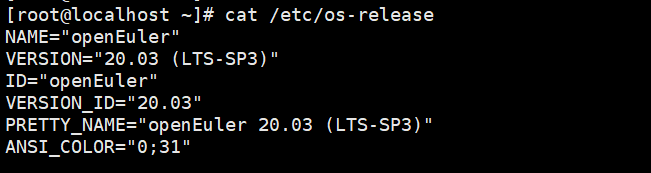
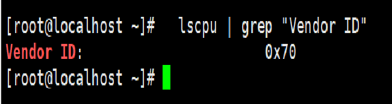
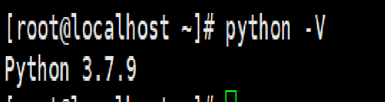
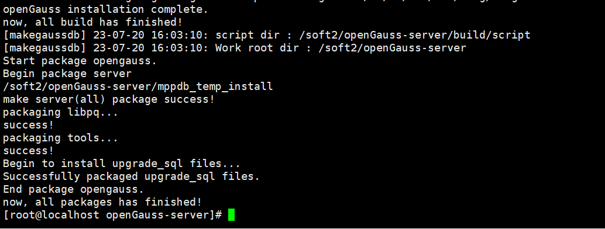
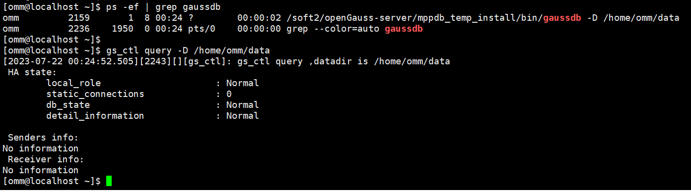
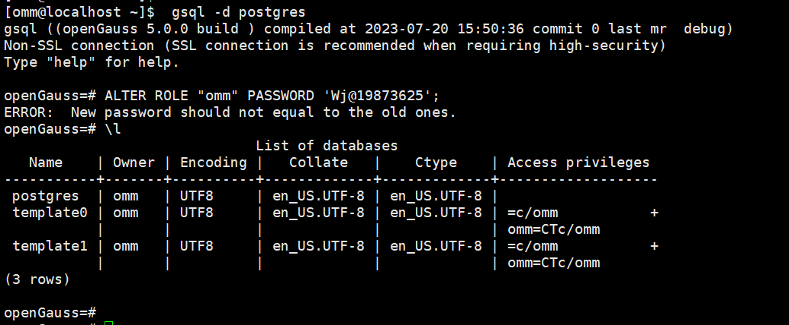

-------------
title: 'openGauss技术文章征集 飞腾平台编译安装openGauss数据库一'
date: '2023-07-20'
category: 'blog'
tags: ['飞腾平台', '编译安装', 'openGauss']
archives: '2023-07'
author: 'wujian0402'
summary: 'openGauss技术文章征集 飞腾平台编译安装openGauss数据库一'
times: '16:30'
------------- -

# 1. 环境检查

## 1.1 检查OS版本

  openGauss支持的操作系统：

  CentOS 7.6（x86_64 架构）
  openEuler-20.03-LTS（aarch64 架构）
  openEuler-20.03-LTS（x86_64架构）
  Kylin-V10（aarch64 架构）
  Asianux 7.6（x86_64架构）
  Asianux 7.5（aarch64 架构）
  FusionOS 22 (aarch64 架构)
  FusionOS 22 (x86 架构)

`cat /etc/os-release`

  

  操作系统为openEuler-20.03-LTS（aarch64 架构）

## 1.2 检查cpu型号

  `lscpu | grep "Vendor ID"`

  

  安装平台Vendor ID:0x70为飞腾CPU

## 1.3. 禁用防火墙和selinux

  禁用防火墙
  `systemctl status firewalld`
  `systemctl stop firewalld`
  `systemctl disable firewalld`
  `systemctl is-enabled firewalld`
  禁用SELINUX
  `/usr/sbin/sestatus -v`
  如果selinux为enable状态，则修改/etc/selinux/config文件：
  SELINUX=disabled
  或使用下面命令：
  `sed -i '/^SELINUX=.*/ s//SELINUX=disabled/' /etc/selinux/config`

  并重启服务器

## 1.4 配置yum源并安装依赖包

  上传操作系统iso到/tmp目录
  配置本地yum源
  `mkdir /mnt/iso`
  `mount -o loop /tmp/openeuler20.03LTS.iso /mnt/iso`
  `cd /etc/yum.repos.d`
  `vi media.repo`
  [InstallMedia]
  name=openeuler20.03LTS
  gpgcheck=0
  enabled=1
  baseurl=file:///mnt/iso
  `yum clean all`
  `yum makecache`
  `yum list`
  `yum -y install libaio-devel flex bison ncurses-devel glibc-devel patch openeuler-lsb readline-devel unzip dos2unix vim git wget lrzsz net-tools bzip2 gcc tree expect zlib* `

## 1.5 安装Python3

  建议安装Python3.6+
  `yum install python3 python3-pip`
  软链接python命令为python3.7
  `ln -s  /usr/bin/python3.7 /usr/bin/python`
  `python -V`

  

## 1.6 设置字符集参数

  `vi /etc/profile`

  export LANG=en_US.UTF-8

## 1.7 设置时区和时间

  [root@localhost ~] timedatectl set-timezone Asia/Shanghai

  [root@localhost ~] timedatectl status

# 2 下载软件包

  `cd /soft2/`
  `git clone https://gitee.com/opengauss/openGauss-server.git openGauss-server -b 5.0.0`
  `wget -c https://opengauss.obs.cn-south-1.myhuaweicloud.com/5.0.0/binarylibs/openGauss-third_party_binarylibs_openEuler_arm.tar.gz`

# 3. 脚本编译安装

## 3.1 openGauss-server编译

  `tar -xvf openGauss-third_party_binarylibs_openEuler_arm.tar.gz`
  `mv openGauss-third_party_binarylibs_openEuler_arm binarylibs`
  `cd openGauss-server/`
  `sh build.sh  -m debug -3rd /soft/binarylibs -pkg`

-m [debug | release | memcheck]表示可选择三种目标版本：
release：代表生成release版本的二进制程序，该版本编译时，配置GCC高级别优化选项，去除内核调试代码，通常用于生产环境或性能测试环境。
debug：代表生成debug版本的二进制程序，该版本编译时，增加内核代码调试功能，通常用于开发自测环境。
memcheck：代表生成memcheck版本的二进制程序，该版本编译时，在debug版本基础上新增ASAN功能，通常用于定位内存问题。

  显示如下内容，表示编译成功。

  

  生成的安装包会存放在./output目录下。
  编译和打包日志为：./build/script/makemppdb_pkg.log。

# 4. 编译后验证

  编译结束后，可按以下方式对编译后的openGauss进行验证:
  ## 4.1 创建用户
  `groupadd dbgrp`
  `useradd omm -g dbgrp`
  `passwd omm`

  ## 4.2 使用omm用户，在~/.bashrc中增加以下环境变量

  `su - omm`
  `vi ~/.bashrc`

  export GAUSSHOME=/soft2/openGauss-server/mppdb_temp_install 
  export LD_LIBRARY_PATH=$GAUSSHOME/lib:$LD_LIBRARY_PATH
  export PATH=$GAUSSHOME/bin:$PATH

  使环境变量生效

  `source .bashrc` 

  ## 4.3 建立数据目录和日志目录

  `su - root`
  `chown -R omm:dbgrp /soft2/openGauss-server`
  `su - omm`
  `mkdir ~/data`
  `mkdir ~/log`

  ## 4.4 数据库初始化

  `su - omm `                                  
  `gs_initdb -D /home/omm/data --nodename=db1 `
  初始化日志如下
  The files belonging to this database system will be owned by user "omm".
  This user must also own the server process.
  The database cluster will be initialized with locale "en_US.UTF-8".
  The default database encoding has accordingly been set to "UTF8".
  The default text search configuration will be set to "english".
  fixing permissions on existing directory /home/omm/data ... ok
  creating subdirectories ... in ordinary occasionok
  creating configuration files ... ok
  selecting default max_connections ... 100
  selecting default shared_buffers ... 1024MB
  Begin init undo subsystem meta.
  [INIT UNDO] Init undo subsystem meta successfully.
  creating template1 database in /home/omm/data/base/1 ... The core dump path is an invalid directory
  2023-07-20 16:10:19.012 [unknown] [unknown] localhost 281468516106256 0[0:0#0]  [BACKEND] WARNING:  macAddr is 64174/3171074048, sysidentifier
   is 4205755650/3221270315, randomNum is 96513835ok
  initializing pg_authid ... ok
  setting password ... ok
  initializing dependencies ... ok
  loading PL/pgSQL server-side language ... ok
  creating system views ... ok
  creating performance views ... ok
  loading system objects' descriptions ... ok
  creating collations ... ok
  creating conversions ... ok
  creating dictionaries ... ok
  setting privileges on built-in objects ... ok
  initialize global configure for bucketmap length ... ok
  creating information schema ... ok
  loading foreign-data wrapper for distfs access ... ok
  loading foreign-data wrapper for log access ... ok
  loading hstore extension ... ok
  loading foreign-data wrapper for MOT access ... ok
  loading security plugin ... ok
  update system tables ... ok
  creating snapshots catalog ... ok
  vacuuming database template1 ... ok
  copying template1 to template0 ... ok
  copying template1 to postgres ... ok
  freezing database template0 ... ok
  freezing database template1 ... ok
  freezing database postgres ... ok
  WARNING: enabling "trust" authentication for local connections
  You can change this by editing pg_hba.conf or using the option -A, or
  --auth-local and --auth-host, the next time you run gs_initdb.
  Success. You can now start the database server of single node using:
      gaussdb -D /home/omm/data --single_node
  or
      gs_ctl start -D /home/omm/data -Z single_node -l logfile

  ## 4.5 启动数据库
  `su - omm`
  `gs_ctl start -D /home/omm/data -Z single_node -l /home/omm/log/opengauss.log`

  启动完毕后可通过 ps -ef | grep gaussdb检查数据库进程情况，或通过 gs_ctl query -D /home/omm/data检查数据库状态，或使用 gsql -d postgres 进入gsql命令行查看数据库的相关信息。

  

  

  

  ## 5. FAQ
  编译安装过程中遇到的问题
  问题一：
  python版本需要3.6+以上版本，操作系统自带的python2.7不符合要求，需要安装python3.7，不然编译脚本错误。

  解决方案：
  yum安装Python3.7
  `yum install python3 python3-pip`
  软链接python命令为python3.7
  `ln -s  /usr/bin/python3.7 /usr/bin/python`

  问题二：
  一键式脚本编译build.sh使用 -m release编译release版本的二进制程序，初始化数据库报错。

  解决方案：
  目前还未解决，绕过方案使用-m debug编译debug版本的二进制程序.可以初始化数据库成功。
  `sh build.sh  -m debug -3rd /soft/binarylibs -pkg`

-m [debug | release | memcheck]表示可选择三种目标版本：
release：代表生成release版本的二进制程序，该版本编译时，配置GCC高级别优化选项，去除内核调试代码，通常用于生产环境或性能测试环境。
debug：代表生成debug版本的二进制程序，该版本编译时，增加内核代码调试功能，通常用于开发自测环境。
memcheck：代表生成memcheck版本的二进制程序，该版本编译时，在debug版本基础上新增ASAN功能，通常用于定位内存问题。

原因：

飞腾CPU缺少LSE指令

官网发布的 openEuler_arm 包，在编译的时候，打开了ARM_LSE指令集做了编译的优化。但是对于一些其他 arm 服务器，不一定支持。
飞腾CPU不支持lse指令集

构建脚本：

build\script\utils\make_compile.sh
# it may be risk to enable 'ARM_LSE' for all ARM CPU, but we bid our CPUs are not elder than ARMv8.1
实测在 鲲鹏 920 和 麒麟 990 的 cpu 芯片下是支持安装的。cpu 可以通过 lscpu 名称查看。

对于其他不自持该指令的系统，需要去掉 -D__ARM_LSE 指令重新编译即可。

在编译脚本中 build\script\utils\make_compile.sh，删除掉所有的 -D__ARM_LSE ， 重新打包数据库。

sh build.sh -m release -3rd /sdb/binarylibs -pkg
# -3rd 是对应三方库二进制的目录

