opengauss主备集群节点的添加与删除

一．环境准备

已搭建opengauss一主两备集群（企业版5.0），环境如下：

主机IP	主机名	节点类型

10.100.10.92	yf1	主节点

10.100.10.93	yf2	备节点

10.100.10.94	yf3	备节点

二．gs_dropnode删除集群备节点
拟删除10.100.10.94节点。
1.前提条件
删除备节点的操作只能在主节点上执行；
执行删除操作前，确保主节点和备节点之间建立好omm（数据库管理用户）用户的互信；
需要使用数据库管理用户执行该命令；
如果数据库是分离环境，则需要先source导入分离的环境变量。
2.注意事项
从主备数据库实例中移除当前仍可连通的备机时，会自动停止目标备机上正在运行的数据库服务，但是不会删除备机上的应用；
如果删除后数据库只剩下一个主机时，会建议重启当前主机，此时建议用户根据当前业务运行环境重启主机；
如果目标备机在执行操作前处于不可连通的状态，需要用户在目标备机恢复后手动停止或删除目标备机的数据库服务；
仅支持使用om方式安装的主备数据库实例中移除备机，不支持使用编译方式安装组建的主备数据库实例；
当移除的备机处于同步模式时，如果执行删除命令的同时主机上存在事务操作，事务提交时会出现短暂卡顿，删除完成后事务处理可继续运行；
当目标备机被移除后，如果不需要目标备机，请在目标备机上使用gs_uninstall --delete-data -L命令单点卸载opengauss,请注意务必添加-L选项；
当目标备机被移除后，如果暂时不确定是否需要目标备机，请删除目标备机的远程ssh文件，避免在目标备机上的误操作。
3.操作步骤
3.1查看当前主备集群状态
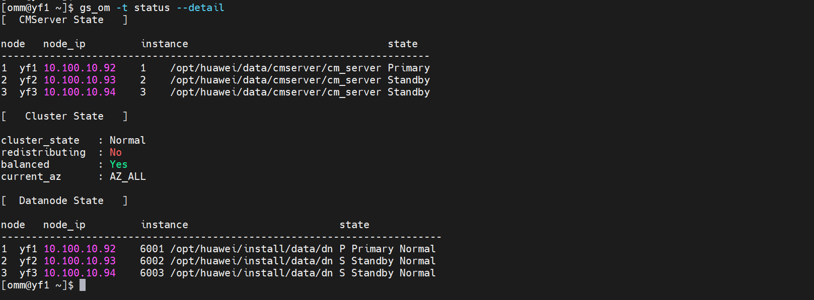
3.2移除备节点10.100.10.94
执行命令：gs_dropnode -U omm -G dbgrp -h 10.100.10.94
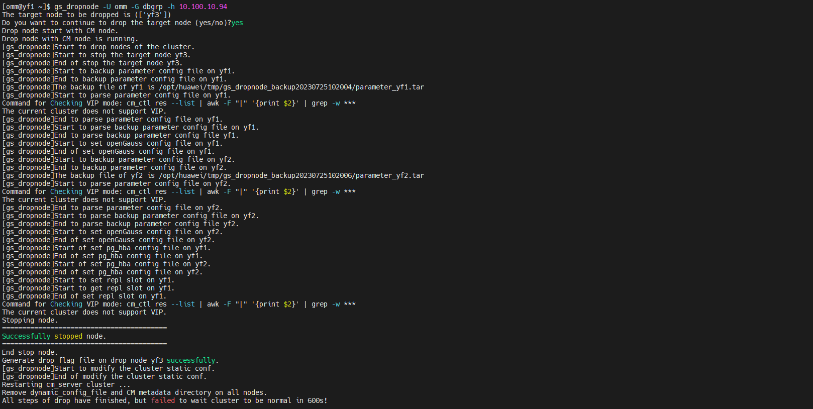
注：从执行结果上可以推断节点已删除，但自动重启集群超时，可能由于网络或其他问题导致，可通过手动重启集群恢复。
3.3查看集群状态
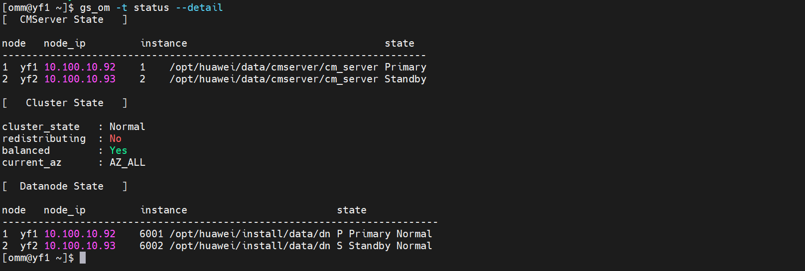
集群状态显示已成功删除节点10.100.10.94。
3.4在已删除节点关闭与原集群的SSH链接，避免后续操作
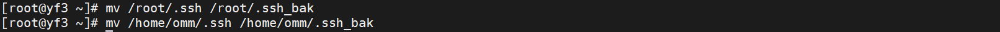
3.5清理删除的备机系统环境数据（必须添加-L参数）
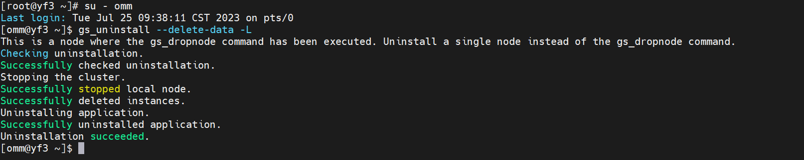
3.6清理删除后的备机系统环境软件及目录（必须添加-L参数）
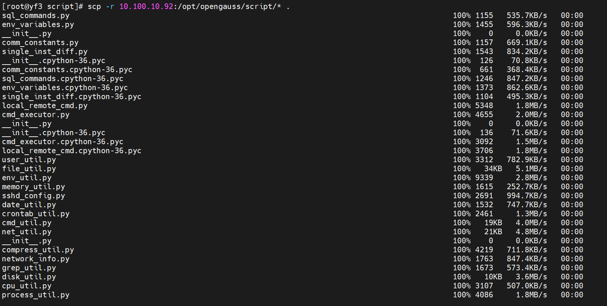
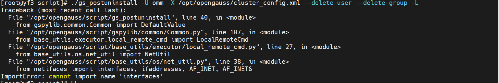
注：清理过程遇到缺失netifaces包，使用pip安装后重新执行命令
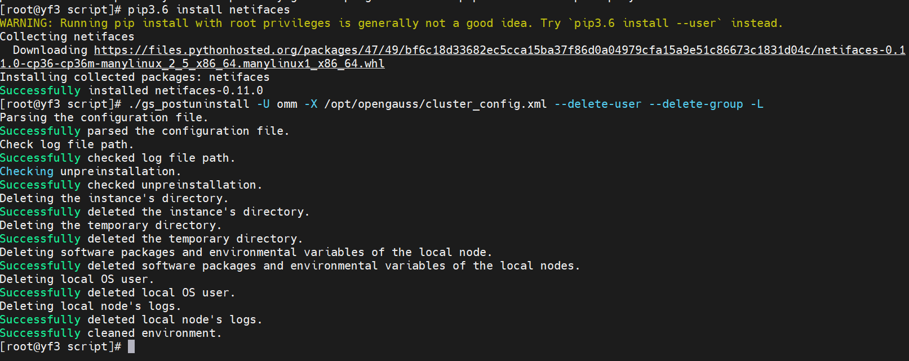
3.7删除残留软件目录
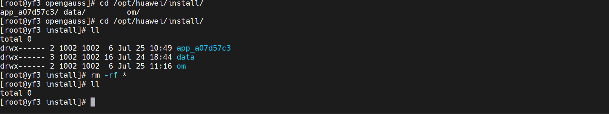
节点删除完成。
三．gs_expansion增加集群备节点
opengauss提供了gs_expansion工具对数据库的备机进行扩容。
1.前提条件
数据库主机上存在opengauss镜像包，解压镜像包后，在script/目录下执行./gs_expansion命令进行扩容；
在新增的扩容备机上创建好与主机上相同的用户与用户组；
已存在的数据库节点和新增的扩容节点之间需要建立好root用户互信和omm用户（数据库管理用户）互信；
配置xml文件，在已安装数据库配置文件的基础上，添加需要扩容的备机信息；
只能使用root用户执行gs_expansion命令；
如果当前数据库是分离环境变量方式安装，则执行扩容命令前需要source导入主机数据库的分离环境变量。
2.注意事项
从单机扩容到主备模式时，需要将单机数据库以primary的方式启动，因此会对数据库进程进行重启操作。单机扩容时请规划好运行中的业务。主备模式扩容时不需要重启数据库。
主备机器安装的数据库需要使用相同的用户和用户组，分离环境路径也需要保持一样；
主备机器安装时xml配置里面的gaussdbAppPath、gaussdbLogPath、gaussdbToolPath、corePath地址需要保持一致；
扩容机器上的数据必须使用om方式安装，使用编译方式启动的数据库不支持与主机扩容。
3.操作步骤
3.1新备机操作：配置用户、用户组、hosts文件（与primary节点相同）
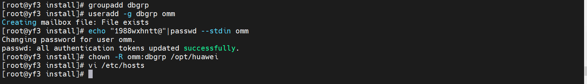
3.2主节点操作：建立新节点与所有节点的SSH互信
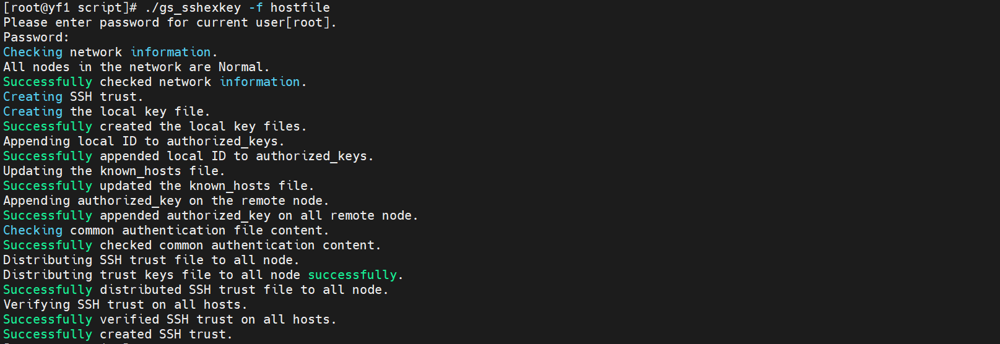
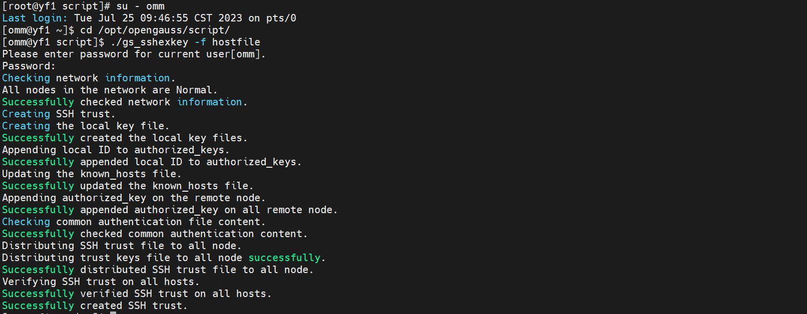
3.3主节点：修改xml文件，添加新节点信息
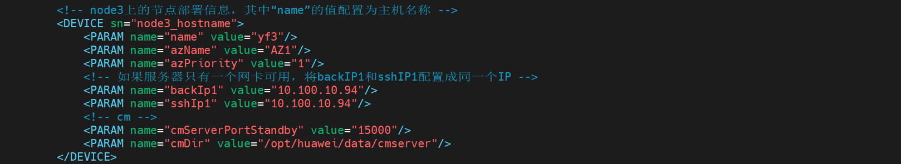
3.4主节点：执行gs_expansion完成扩容操作
./gs_expansion -U omm -G dbgrp -X /opt/opengauss/cluster_config.xml    -h 10.100.10.94
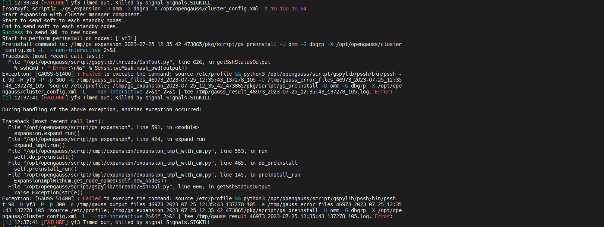
注：结果显示在执行预初始化新节点时超时了，可能由于网络或其他问题导致。重新执行后如下所示：
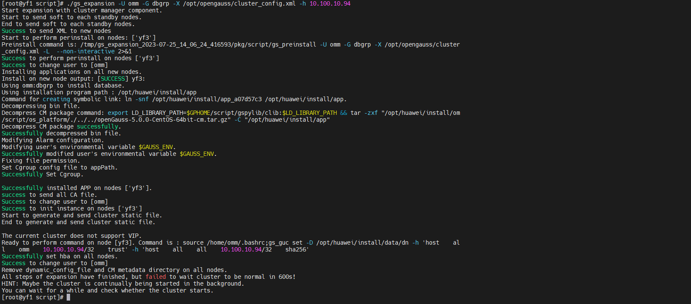
从执行结果上可以推断节点已完成扩容，但自动重启集群超时，可能由于网络或其他问题导致，可通过手动重启集群恢复。
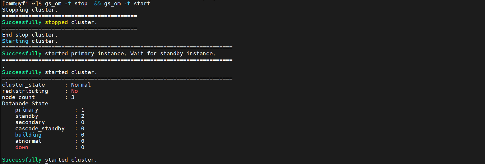
3.5检查扩容后集群状态
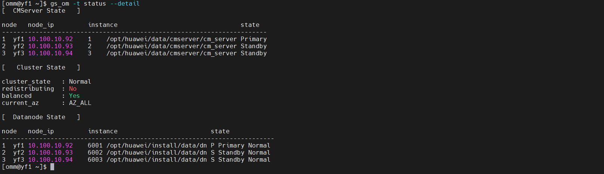
集群状态正常，扩容完成。