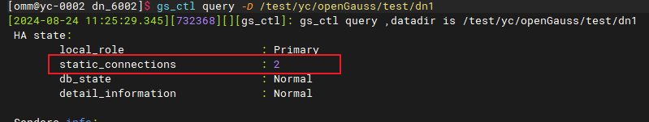
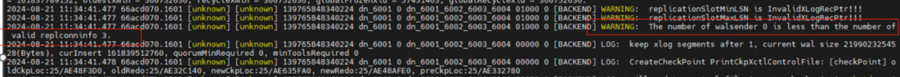
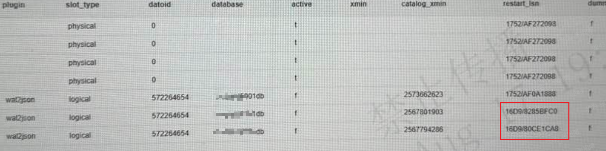

## openGauss的xlog不回收原因和修复方案

介绍几种导致xlog不回收问题的原因。

### 问题现象

数据库的pg_xlog目录大小一直增长，目录下的xlog文件不回收。超过了阈值，存在空间写满的风险。

### 原因分析

通常xlog会保留 wal_keep_segments + checkpoint_segments * 2 + 1 个xlog文件，每个文件16MB。

以wal_keep_segments=1024 和 checkpoint_segments=1024为例，大约会保留：(wal_keep_segments+checkpoint_segments * 2 + 1) * 16MB = (1024 + 1024 * 2 + 1) * 16MB = 48GB, 大约会在50GB左右。如果远远超过了这个大小，那么就是有存在xlog不回收问题。

数据库会1min对日志进行一次清理，pg_log里面关键字(attempting to remove WAL)，如果长时间日志里面清理xlog文件都是同一个，就有异常导致清理受到阻塞。

常见以下几个方面会引起xlog不回收：

#### 1. 备机故障引起主机xlog不回收

开启enable_xlog_prune=on，在配置备机实例宕掉后，主机需要给备机保留xlog。max_size_for_xlog_prune配置最大保留的xlog目录大小。

备机是否有异常，使用 ` gs_ctl query -D [数据目录] ` 来确定，再和下面的备机个数以及状态对比下：



max_size_for_xlog_prune需要设置个合理的值，备机故障时候不会导致xlog无限膨胀。

**案例：** 一个一主2备集群，用户手动把备机去掉，但是postgresql.conf里面的replconninfo还在，xlog目录日志持续写入不回收。



这时候由于replconninfo在，即主机认为有2个备机需要连，但是异常了没连接上，会给备机保留日志。

后面手动注释掉配置文件里面的replconninfo已经下掉的备机配置。

#### 2. 复制槽不推进引起主备节点xlog均不回收

常见于逻辑复制不推进，主机需要为逻辑复制保留xlog数据。出问题首先查询逻辑复制视图：

```
select * from pg_replication_slots ;
```

关注active和restart_lsn这两列。



处理方式：

如果逻辑复制在用，需要应用侧启动正常推进复制槽位点。

确认不再用的删除逻辑复制槽 

```select pg_drop_replication_slot('slot name'); ```

#### 3. 开启xlog日志归档，但是归档目录异常，导致归档所在节点xlog不回收

开启归档archive_mode=on，但是归档路径不存在或者路径权限不正确，pg_xlog下的日志文件无法移动到归档目录下，也会导致xlog目录大小持续增加。

到归档目录下检查下日志拷贝是否正常来确认归档是否有问题。

#### 4. 备机逻辑复制槽残留导致备机xlog不回收

这种不是正常行为，第二点里面 (2)复制槽不推进引起主备节点xlog均不回收

通过删除逻辑复制槽可以清理。 但是如果主机的删掉了，备机上由于某些故障没有删除逻辑复制槽，那会存在主机上xlog正常清理，但是备机上xlog不回收。

此时需要仅删除备机上的逻辑复制槽，需要从物理层面删除。

(1) 停止该备机：(主机是否带CM停止和启动单个实例命令不同)

```
gs_ctl stop -D /ogdata/data/dn1  ## 不带CM

cm_ctl stop -n 5 -D /ogdata/data/dn1  ## 带CM, -n 5为第几个实例。
```

(2) 到数据目录下的 pg_replslot物理删除逻辑复制目录

```
cd /ogdata/data/dn1/pg_replslot
删除对应复制槽： rm -rf  xxxx
```

(3) 拉起该备机

```
gs_ctl start -D /ogdata/data/dn1 -M standby  ## 不带CM

cm_ctl start -n 5 -D /ogdata/data/dn1   ## 带CM
```
