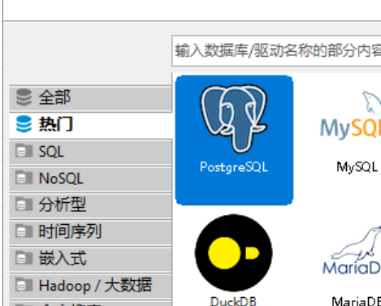
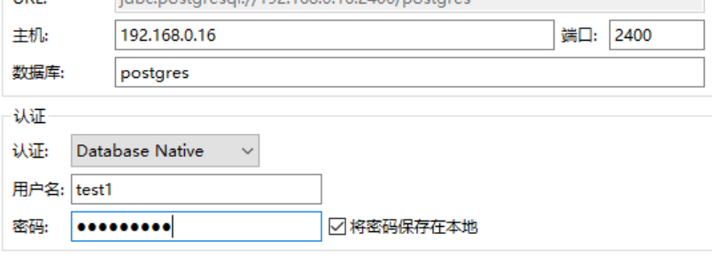
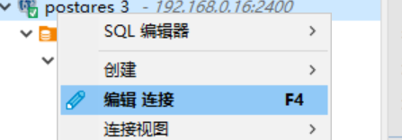
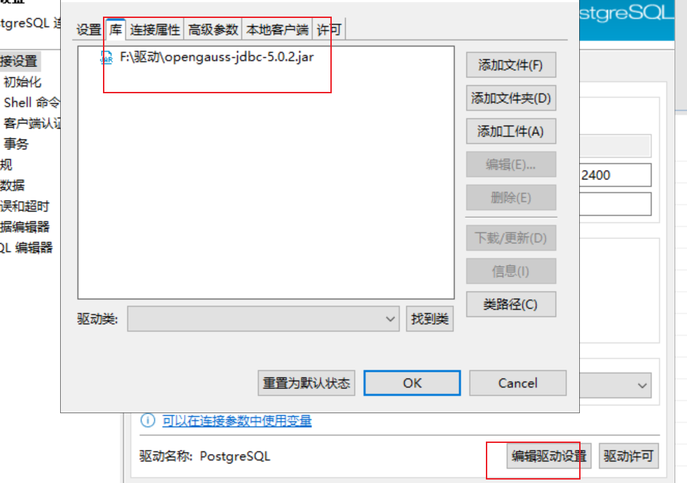
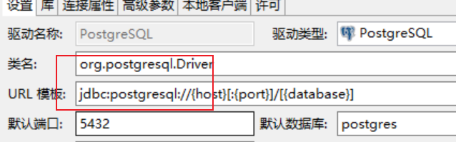

### openGauss连接和认证使用介绍

#### 概述

介绍在安装好了openGauss数据库后，如何配置链接登录和认证。

### 1. 检查监听端口

使用netstat命令检测数据库绑定端口和ip

```
netstat -nap | grep gaussdb
```

如果绑定的ip是只有127.0.0.1，只绑定在了localhost上，那是无法远程链接的。

需要修改配置里面的listen_addresses。

```
gs_guc reload -D /ogdata/data/dn1 -c "listen_addresses='*'"
```

**备注** 其中-D /ogdata/data/dn1是数据目录路径，ps ux | grep gaussdb 从进程可以看到。下同。


### 2. 创建登录用户，赋权、配置白名单

数据库部署的用户(omm)是超级管理用户，该用户只能本地免密登录，无法进行远程链接。

对于应用侧需要远程登录数据库则要新建普通用户。

1. 配置加密方式

   openGauss默认的用户加密认证方式是sha256，还支持md5认证，该认证方式可以跟postgres的协议兼容，即可以使用pg的一些工具、驱动，通过md5认证的用户连接到opengauss。

   参数：password_encryption_type   0：仅md5；   1：md5 + sha256 ；  2：仅sha256

   如果有使用pg驱动的需求，可以先修改数据库的配置，让支持md5.

   ```
   gs_guc reload -D /ogdata/data/dn1 -c "password_encryption_type=1"
   ```

   

2. 创建普通用户

   在修改了password_encryption_type后，创建用户，即为该认证方式的用户。

   ```
   ## 先登录数据库  9000为端口
   gsql -d postgres -p 9000 -r
   
   ## 创建用户
   create user test1 with password 'test@123';
   ```

   **注** 如果是先建了用户，然后修改了password_encryption_type，则需要重置用户密码才能生效。

   ```
   alter user test1 password 'test@1345';
   ```

   

3. 赋予用户权限

   openGauss可以支持很细粒度的权限，如赋予库、表等等。参考https://docs.opengauss.org/zh/docs/latest/docs/SecHarden/%E6%9D%83%E9%99%90%E7%AE%A1%E7%90%86.html

   开发环境简单起见可以赋予所有权限：(生产按照要求配置细粒度权限)

   ```
   grant all privileges to test1;
   ```

   

4. 配置白名单

从远端访问数据库需要配置数据库侧的ip白名单，否则会被拒绝访问。

```
gs_guc reload -D /ogdata/data/dn1 -h 'host all test1 0.0.0.0/0 sha256'
gs_guc reload -D /ogdata/data/dn1 -h 'host all test1 0.0.0.0/0 md5'
```

**-h说明** （https://docs.opengauss.org/zh/docs/latest/docs/DatabaseAdministrationGuide/%E9%85%8D%E7%BD%AE%E5%AE%A2%E6%88%B7%E7%AB%AF%E6%8E%A5%E5%85%A5%E8%AE%A4%E8%AF%81.html）

host 指的主机方式

all -- 指数据库，all表示所有可以访问，也可以配置固定库

test1 -- 该用户。 配置为all表示所有用户可以访问。

0.0.0.0/0 -- 配置远端的ip网段，0.0.0.0/0表示所有ip都可以访问，当然可以配置固定ip，如 192.168.0.100/32

sha256|md5 -- 用户的加密方式。


### 3. 远程登录

上面配置完成后，可以使用gsql工具测试能否远程登录。

```
gsql -d postgres -p 2400 -U test1 -W test@1345 -h 192.168.0.16 -r
```


### 4. dbeaver配置使用

由于opengauss可以兼容pg协议，用户可以使用dbeaver开发工具来连接opengauss

1. 新建数据库连接里面选择postgres

   

2. 配置远端ip、端口、目标数据库、用户、密码进行连接

   

   **说明** 需要说明的是，这里使用了pg的驱动，即需要通过md5认证的用户来连接数据库

3. 如果用户是sha256认证，这里也可以配置opengauss驱动连接

   编辑连接 -- 编辑驱动设置 -- 库 - 添加opengauss官网的jdbc驱动即可。

   

   

4. 设置驱动名称

   opengauss官网提供的jdbc驱动包里面包含了2个jar包。均可以使用区别如下：

   

   opengauss-jdbc-version.jar:  org.opengauss.Driver    jdbc:opengauss://

   postgresql-version.jar:           org.postgresql.Driver  jdbc:postgresql://

   之后测试连接即可。


