# 目录

1、检查openGauss状态

2、检查锁信息

3、统计事件数据

4、对象检查

5、基本信息检查


## 1、检查openGauss状态

<br/>


通过openGauss提供的工具查询数据库和实例状态，确认数据库和实例都处于正常的运行状态，可以对外提供数据服务。


- 检查实例状态

```
gs_check -U omm -i CheckClusterState
```

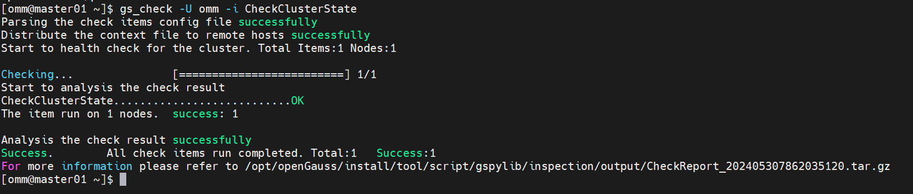


- 检查参数

```
openGauss=# SHOW parameter_name;
```


上述命令中，parameter_name需替换成具体的参数名称。


- 修改参数

```
gs_guc reload  -D /gaussdb/data/dbnode -c "paraname=value"
```

## 2、检查锁信息


锁机制是数据库保证数据一致性的重要手段，检查相关信息可以检查数据库的事务和运行状况。

- 查询数据库中的锁信息

```
openGauss=# SELECT * FROM pg_locks;
```

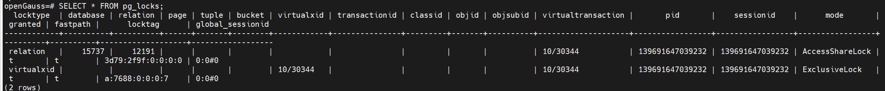


- 查询等待锁的线程状态信息

```
openGauss=# SELECT * FROM pg_thread_wait_status WHERE wait_status = 'acquire lock';
```

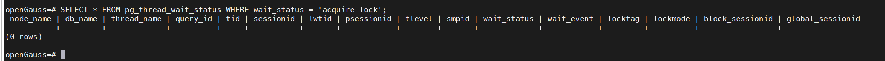


- 结束系统进程

查找正在运行的系统进程，然后使用kill命令结束此进程。


```
ps ux
kill -9 pid
```


## 3、统计事件数据

SQL语句长时间运行会占用大量系统资源，用户可以通过查看事件发生的时间，占用内存大小来了解现在数据库运行状态。


- 查询事件的时间

查询事件的线程启动时间、事务启动时间、SQL启动时间以及状态变更时间。

```
openGauss=# SELECT backend_start,xact_start,query_start,state_change FROM pg_stat_activity;
```

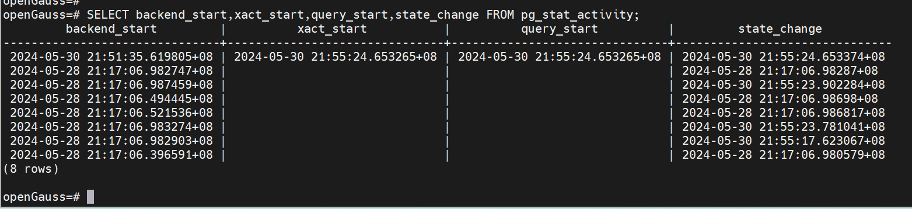


- 查询当前服务器的会话计数信息

```
openGauss=# SELECT count(*) FROM pg_stat_activity;
```

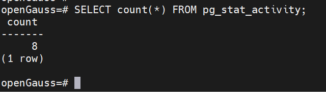


- 查询系统级统计信息

查询当前使用内存最多的会话信息。


```
openGauss=# SELECT * FROM pv_session_memory_detail() ORDER BY usedsize desc limit 10;
```

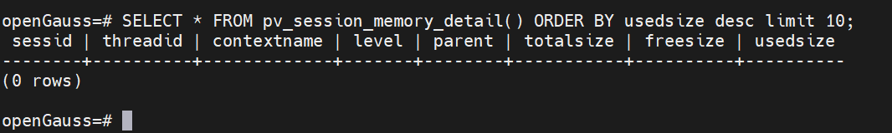


## 4、对象检查

表、索引、分区、约束等是数据库的核心存储对象，其核心信息和对象维护是DBA重要的日常工作。

- 查看表的详细信息

```
openGauss=# \d+ table_name
```

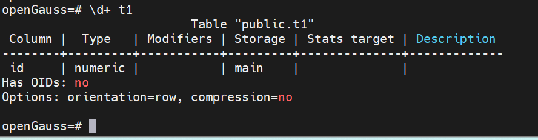


- 查询表统计信息

```
openGauss=# SELECT * FROM pg_statistic;
```

- 查看索引的详细信息

```
openGauss=# \d+ index_name
```

- 查询分区表信息


```
openGauss=# SELECT * FROM pg_partition;
```

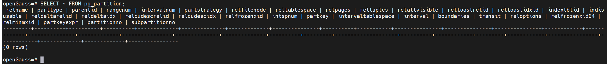


- 收集统计信息

使用ANALYZE语句收集数据库相关的统计信息。

使用VACUUM语句可以回收空间并更新统计信息。

- 查询约束信息

```
openGauss=# SELECT * FROM pg_constraint;
```

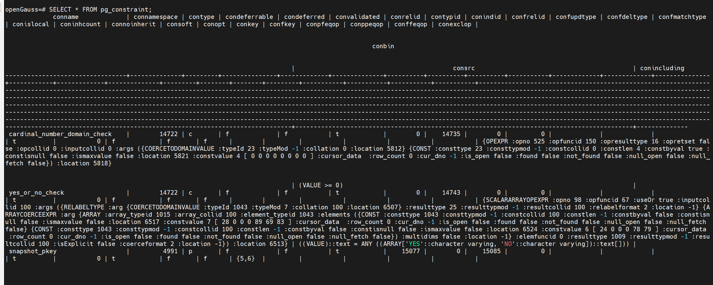


指定列名称，就可以了


## 5、基本信息检查


基本信息包括版本、组件、补丁集等信息，定期检查数据库信息并登记在案是数据库生命周期管理的重要内容之一。


- 版本信息

```
openGauss=# SELECT version();
```


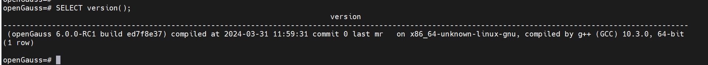


容量检查

```
openGauss=# SELECT pg_table_size('t1');
```


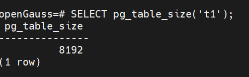


```
openGauss=# SELECT pg_database_size('d1');
```

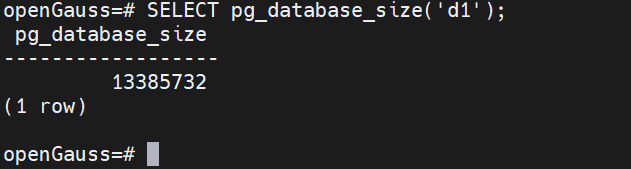


