# 前文


众所周知，openGauss是TP处理数据库，擅长交易、转帐、支付的业务场景，因为它是一个单机的数据库，没有分布式处理能力，大部分人认为它的分析处理能力会很弱。其实openGauss在存储引擎支持列式，支持并行查询，支询分区，支持向量化,所以它的查询处理能力也是不弱的。

# 测试环境

## 配置条件

|CPU|内存|	版本|	数据量|
|---|---|---|---|
|i7	|8G	|openGauss 6	|66681536|
|

## 测试SQL

```
#表结构
CREATE TABLE LINEITEM_C ( 
L_ORDERKEY   INTEGER NOT NULL,
L_PARTKEY	INTEGER NOT NULL, 
L_SUPPKEY	 INTEGER NOT NULL, 
L_LINENUMBER  INTEGER NOT NULL,
L_QUANTITY		DECIMAL(15,2) NOT NULL, 
L_EXTENDEDPRICE DECIMAL(15,2) NOT NULL, 
L_DISCOUNT		 DECIMAL(15,2) NOT NULL, 
L_TAX	 DECIMAL(15,2) NOT NULL, 
L_RETURNFLAG CHAR(1) NOT NULL, 
L_LINESTATUS CHAR(1) NOT NULL, 
L_SHIPDATE	DATE NOT NULL, 
L_COMMITDATE DATE NOT NULL, 
L_RECEIPTDATE DATE NOT NULL, 
L_SHIPINSTRUCT CHAR(25) NOT NULL, 
L_SHIPMODE  CHAR(10) NOT NULL, 
L_COMMENT  VARCHAR(44) NOT NULL
) ;


#执行SQL
EXPLAIN ANALYZE 
SELECT
L_RETURNFLAG, L_LINESTATUS,
SUM(L_QUANTITY) AS SUM_QTY, SUM(L_EXTENDEDPRICE) AS SUM_BASE_PRICE,
SUM(L_EXTENDEDPRICE * (1 - L_DISCOUNT)) AS SUM_DISC_PRICE, SUM(L_EXTENDEDPRICE * (1 - L_DISCOUNT) * (1 + L_TAX)) AS SUM_CHARGE, AVG(L_QUANTITY) AS AVG_QTY,
AVG(L_EXTENDEDPRICE) AS AVG_PRICE, AVG(L_DISCOUNT) AS AVG_DISC, COUNT(*) AS COUNT_ORDER
FROM LINEITEM_COPY
 WHERE
L_SHIPDATE = DATE '1994-01-16' 
GROUP BY
L_RETURNFLAG, L_LINESTATUS;
```

## 测试方法


行式表是慢的，列式表是快的，有分区是好事，没有分区是坏事，openGauss支持往行式 添加向量化技术。根据不同考虑一共有以下测试。

- 行式表带分区
- 向量化行式表加分区
- 行式表没有分区
- 向量化行式表没有分区
- 列式表有分区
- 列式表无分区
- 列式表有分区加上并行查询

## 测试SQL

<br/>

**行式表有分区**

执行时间： 730615.702ms

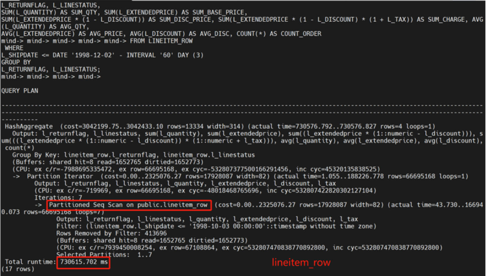


**向量化行式表有分区**

```
set try_vector_engine_strategy=force;
```

执行时间： 119065.411ms

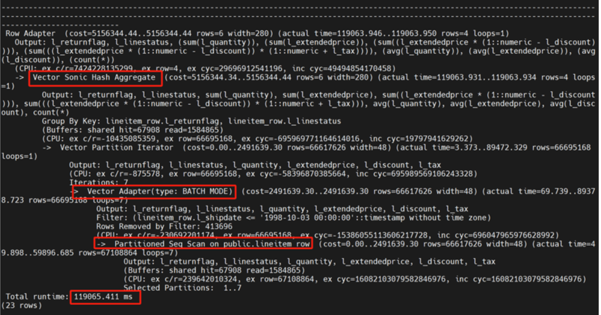

**行式表没有分区**


执行时间： 419898.535ms

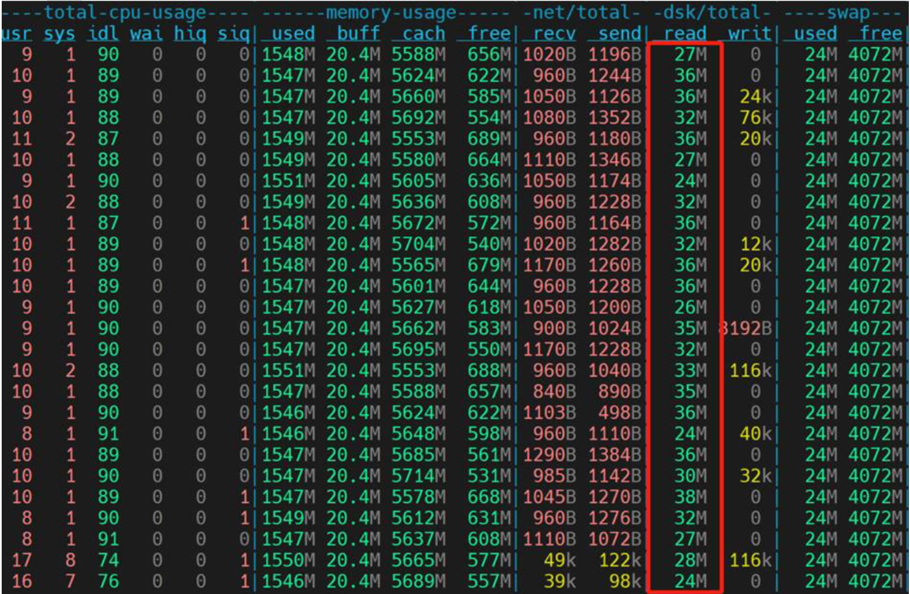

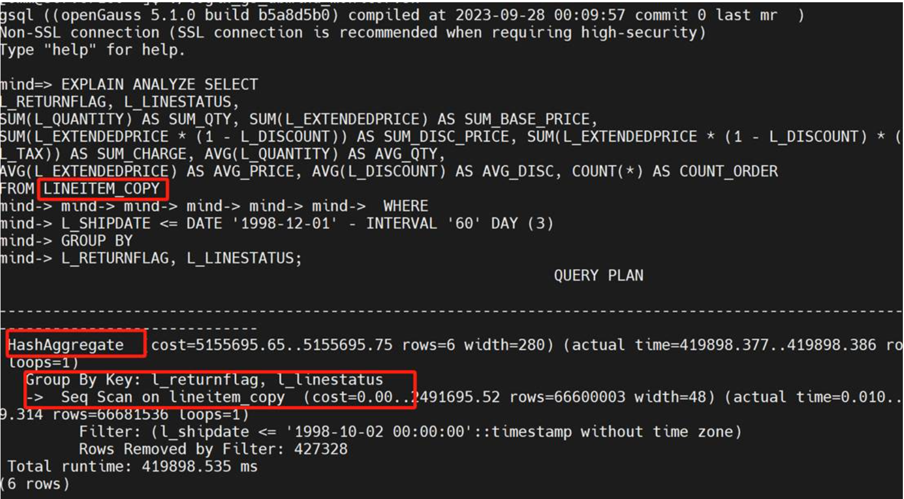


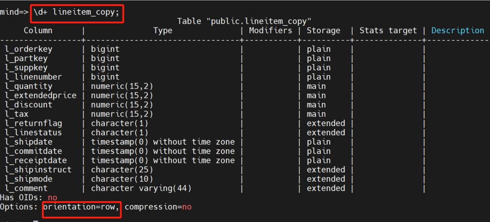


Lineitem_copy行式表，没有分区，没有排序

运行算子有seq scan，显性声明是全盘扫描，一共耗时419898.535ms

**向量化行式表 【无分区】**


执行时间： 85946.78ms

现在加上

```
set try_vector_engine_strategy=force;
show try_vector_engine_strategy;
```

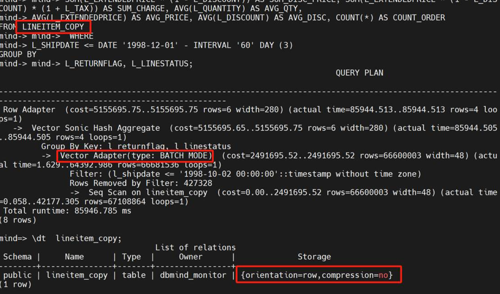

目标行式，基于表SQL查询耗时**85946.78ms**，对比原来的**419898.535ms**，有了很大效率的提升。底层观察对硬盘的利用率也提升了。

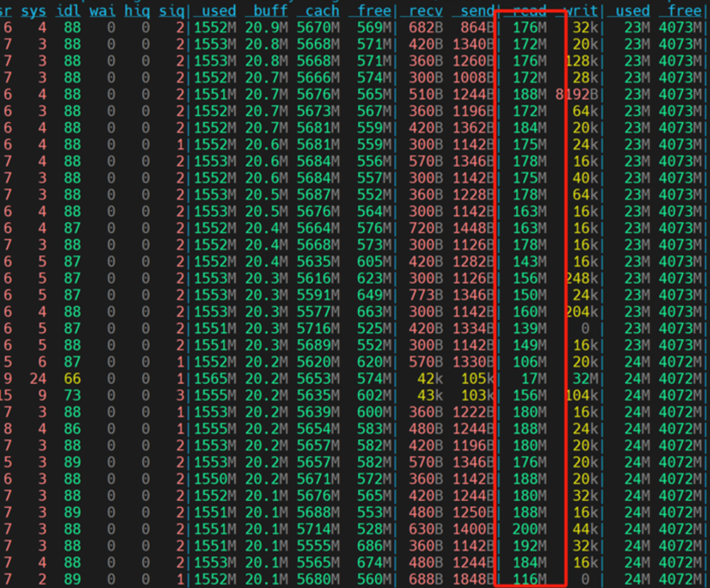

**列式表 【有分区】**

执行时间： 42247.220ms


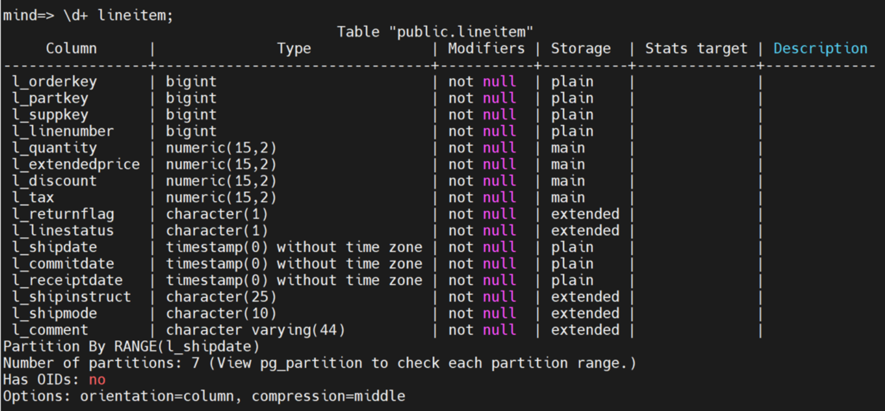

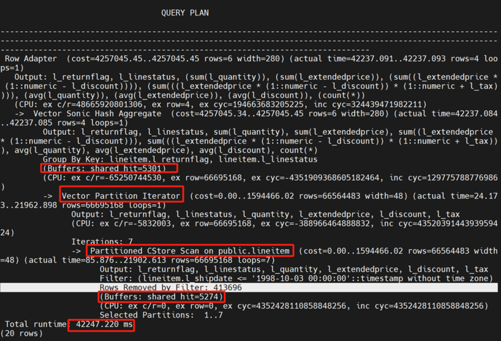


有分区的列式表耗时42247.220ms，相对原来行式表向量化计算SQL查询**85946.78ms**，以及行式表没有分区的**419898.535ms** 性能大为提升


**列式表 【无分区】**


执行时间： 85872.221 ms


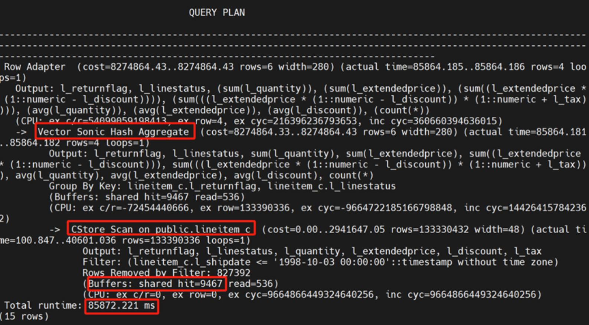


**列式表 【有分区】8个CPU**


执行时间： 12140.229ms

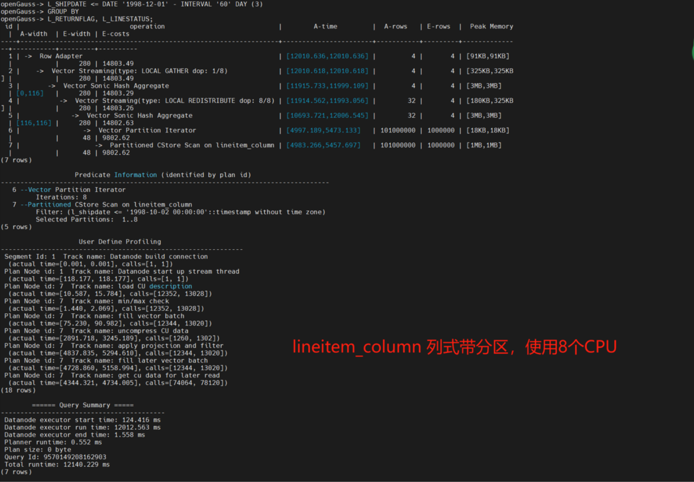


# 总结


|行式表有分区|向量化行式表【有分区】|	行式表没有分区|	向量化行式表 【无分区】|	列式表 【有分区】|	列式表 【无分区】|	列式表 【有分区】8个CPU|
|---|---|---|---|---|---|---|
|730615.702ms|119065.411ms|419898.535|	85946.78ms|	42247.220ms	|85872.221ms|	12140.229 ms|
|

- 行式表有分区 比 行式表没有分区 慢， 重复看了几次，确定优化器在这里根据时间响应，它选择了顺序扫描，顺序扫描要比 分区的要快，这里有可能是分区失效的问题，笔者没有深入。

- 行式表虽然不是列式的组织结构，但是可以调用向量化的技术进行处理，通过CPU的SIMD能力提高处理能力。

- 列式默认就带有向量化处理的能力，带分区的列式比没有分区的列式更友好。

- CPU多核处理+ CPU的SIMD处理+分区+列式 是目前来看是最好的。

- 优化没有终点，上述仅是实例参数的优化，SQL语句改造 以及内存管理参数优化都是 优化的手段。
		