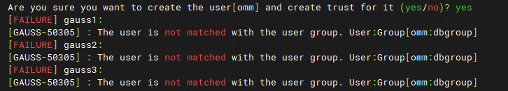
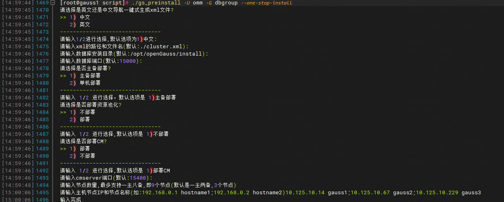
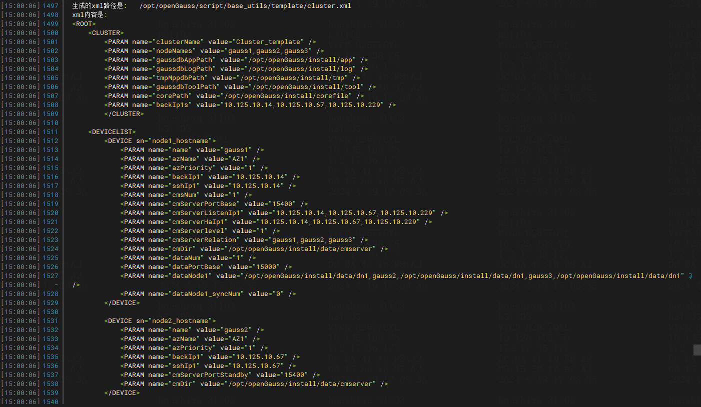
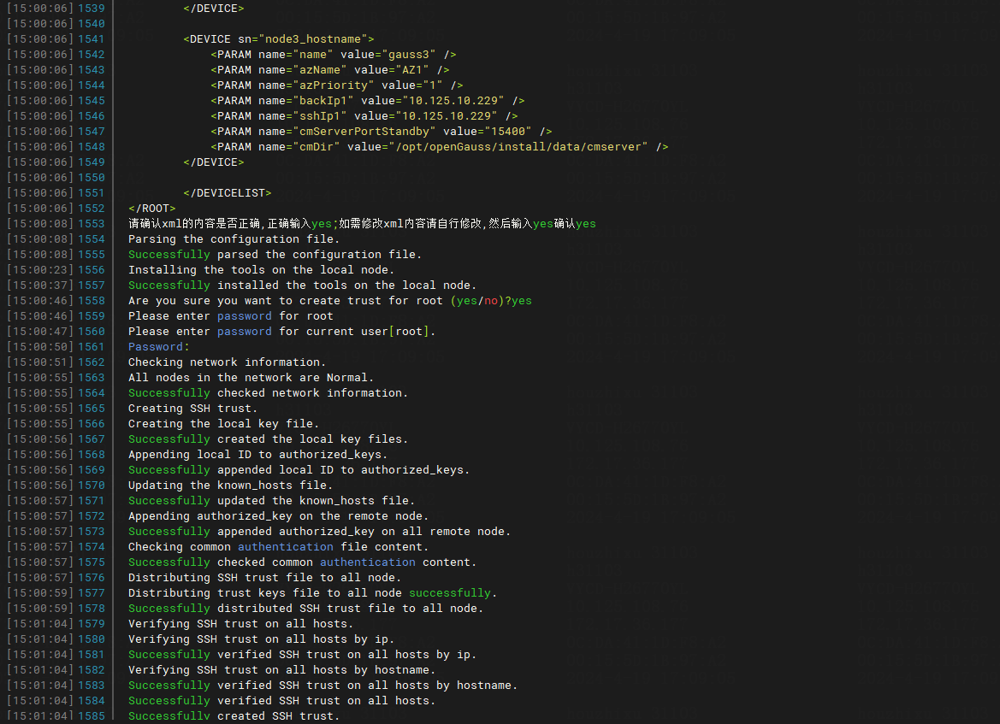
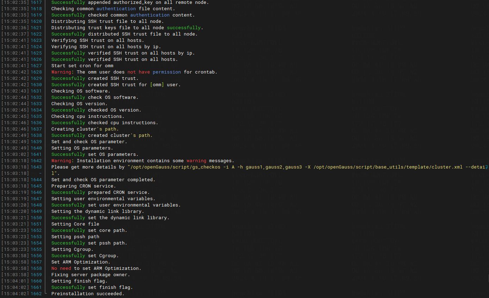
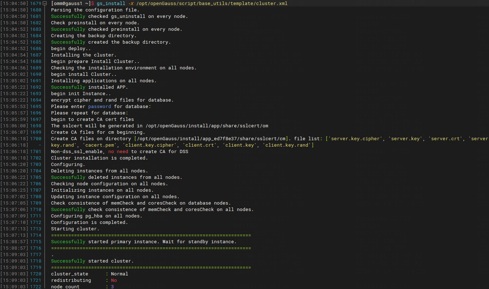
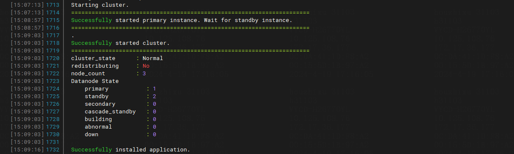
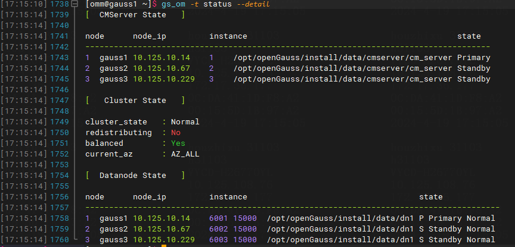

openGauss 6.0.0-RC1是openGauss 2024年3月发布的创新版本，闲来无事翻阅文档，被一条新增特性内吸引了目光：

-  内核工具：支持一站式交互安装

- 用户通过交互界面输入数据库的相关信息，系统自动生成xml配置文件，并自动进行数据库的初始化安装。

我是从去年开始接触国产数据库openGauss，之前一直使用的是成熟的Mysql，Oracle等数据库，对比之下，openGauss的安装方式要比他们麻烦不少，在折腾5.0的时候，预安装（初始化安装）这一步也阻塞了不少时间，看到这个特性，那必须要体验一番。

# 环境准备

先附上官方文档：一站式安装指南；<https://docs-opengauss.osinfra.cn/zh/docs/6.0.0-RC1/docs/InstallationGuide/%E4%B8%80%E7%AB%99%E5%BC%8F%E5%AE%89%E8%A3%85%E6%8C%87%E5%8D%97.html> 可以看到默认的选项是一主两备集群；

因此，先准备三台虚拟机用于测试；

IP信息如下：

```
10.125.10.14
10.125.10.67
10.125.10.229
```

系统操作信息如下：

```
[root@localhost ~]# cat /etc/os-release
NAME="openEuler"
VERSION="22.03 (LTS-SP1)"
ID="openEuler"
VERSION_ID="22.03"
PRETTY_NAME="openEuler 22.03 (LTS-SP1)"
ANSI_COLOR="0;31"
[root@localhost ~]# uname -a
Linux localhost.localdomain 5.10.0-136.12.0.86.oe2203sp1.x86_64 #1 SMP Tue Dec 27 17:50:15 CST 2022 x86_64 x86_64 x86_64 GNU/Linux
```

规格为8C16G；基于之前安装5.0.0版本的经验，将官方文档中准备软硬件安装环境<https://docs-opengauss.osinfra.cn/zh/docs/6.0.0-RC1/docs/InstallationGuide/%E5%87%86%E5%A4%87%E8%BD%AF%E7%A1%AC%E4%BB%B6%E5%AE%89%E8%A3%85%E7%8E%AF%E5%A2%83_%E4%BC%81%E4%B8%9A%E7%89%88.html> 这一步骤整合在一起使用shell脚本一键执行，方便操作；

其中python使用openEuler 22.03 LTS SP1镜像自带版本，版本信息如下：

```
[root@gauss1 rpms]# python3 --version
Python 3.9.9
```

一键脚本主要内容如下（加粗部分是与官方文档存在差异及踩坑的部分）:

- 安装软件依赖;除官方文档内的三个依赖外，经过测试，**expect依赖也是必须；**


```
[root@gauss1 rpms]# ll
总用量 488
-rw-r--r--. 1 root root 247025  4月 18 20:52 expect-5.45.4-7.oe2203sp1.x86_64.rpm
-rw-r--r--. 1 root root  22141  4月 19 10:37 libaio-0.3.113-5.oe2203sp1.x86_64.rpm
-rw-r--r--. 1 root root  10817  4月 19 10:36 libaio-devel-0.3.113-5.oe2203sp1.x86_64.rpm
-rw-r--r--. 1 root root 211561  4月 19 13:52 readline-devel-8.1-2.oe2203sp1.x86_64.rpm
```
- 修改防火墙配置
- 设置主机名(由于使用云平台模板创建的虚拟机,三台虚拟机名称统一为localhost.- localdomain,修改为不同主机名)
- 关闭RemoveIPC
- 创建用户组和用户(必须为omm用户和dbgroup用户组),**之前使用的是安装5.0.0时设置的dbgrp用户组，在测试过程中出现了错误**



- 关闭THP
- 拷贝安装包内的pssh工具到虚拟机内：在前面的多次测试中，总会报错pssh命令不存在的错误，翻阅安装包及后续成功的经验来看，openGauss初始化安装过程中其中一步是设置自身携带的pssh工具路径，但在这之前会尝试直接使用pssh，而pssh并不是镜像必备软件，会报错命令不存在，因此要手动拷贝安装包内此软件到/usr/bin/目录下；其中，安装包内工具路径为openGauss-6.0.0-RC1-openEuler-64bit-om/script/gspylib/pssh/bin/pssh，同级目录下还有pscp和TaskPool.py脚本，为了方便，一起拷贝；拷贝完成后，执行chmod +x pssh pscp TaskPool.py赋予执行权限；
将此脚本依次在三台虚拟机上执行，就完成了环境准备的全部内容；

# 一站式初始化安装

- 在三台虚机内创建/opt/openGauss目录；

```
mkdir -p /opt/openGauss
```

- 将安装包上传到第一台虚拟机(10.125.10.14)root目录下，执行解压命令，将安装包解压到/opt/openGauss目录下；

```
[root@gauss1 ~]# ll |grep openEuler
-rw-r--r--. 1 root root 151532247  4月 18 20:29 openGauss-6.0.0-RC1-openEuler-64bit-all.tar.gz
[root@gauss1 ~]# tar -zxf openGauss-6.0.0-RC1-openEuler-64bit-all.tar.gz -C /opt/openGauss/
```

- 进入/opt/openGauss，解压OM安装包到当前目录；

```
[root@gauss1 ~]# cd /opt/openGauss/
[root@gauss1 ~]# tar -zxf openGauss-6.0.0-RC1-openEuler-64bit-om.tar.gz
```

- 进入script目录，执行初始化安装命令，我并没有使用环境分离，因为去掉环境分离参数(--sep-env-file=ENVFILE)；

```
[root@gauss1 ~]# cd script

[root@gauss1 ~]# ./gs_preinstall -U omm -G dbgroup --one-stop-install
```
- 到这一步根据提示，全部选择默认，跟随提示交互输入即可；








初始化安装成功如下图：



# 执行数据库安装

初始化安装完成后，安装就简单了，切换到omm用户下执行安装命令即可；根据初始化安装过程中的提示，生成的xml路径为：/opt/openGauss/script/base_utils/template/cluster.xml
使用此路径进行安装即可

```
[root@gauss1 ~]# su - omm
[root@gauss1 ~]# gs_install -X /opt/openGauss/script/base_utils/template/cluster.xml
```


安装成功截图如下：



使用gs_om -t status --detail查询数据库状态可以看到数据库正常：



# 注意

实践过程中，饶是我已经有了很多安装5.0.0的经验，但还是耗费了一整体时间才安装成功，因此，感觉还是有几点需要注意，写在这里备忘。

- 请选择是否部署资源池化和请选择是否部署CM的选项，1和2不是相同含义，如果不选择默认，一定要注意；
- 除官方提醒的三个依赖外，还需要安装expect依赖，且三个节点都需要安装；
- 所有的初始化安装和安装命令均需要解压OM安装包后进入script包执行；
- openGauss依赖SSE4_2指令集，使用不同厂商云平台创建虚机安装的时候一定要注意如何设置，使虚拟机支持此指令集；
- pssh提前拷贝(这是不是BUG)