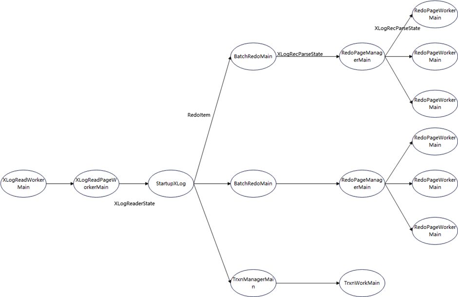
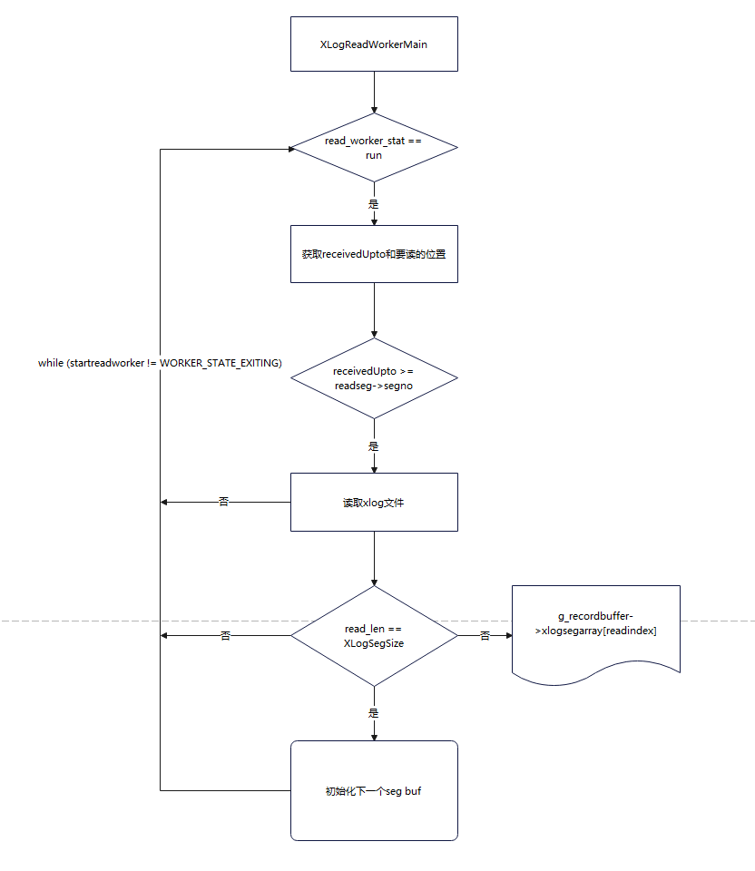
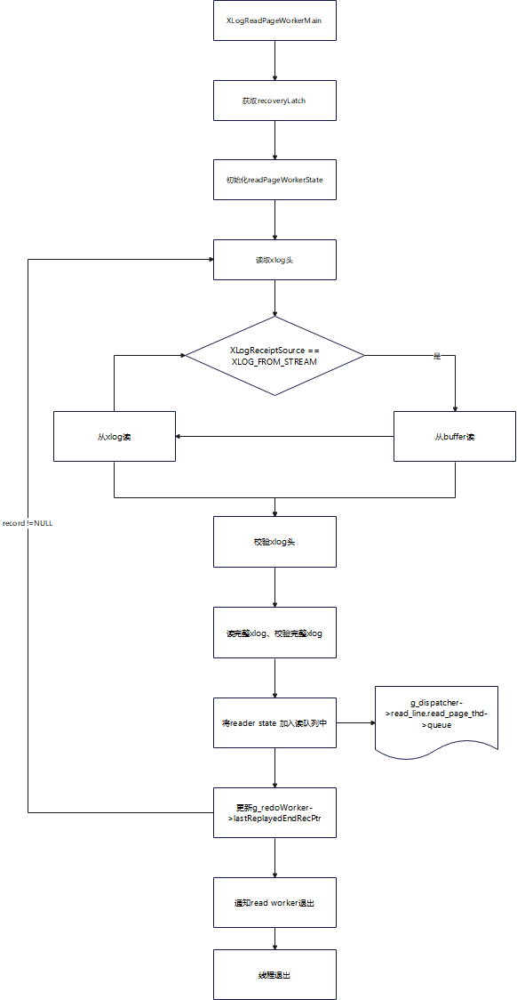
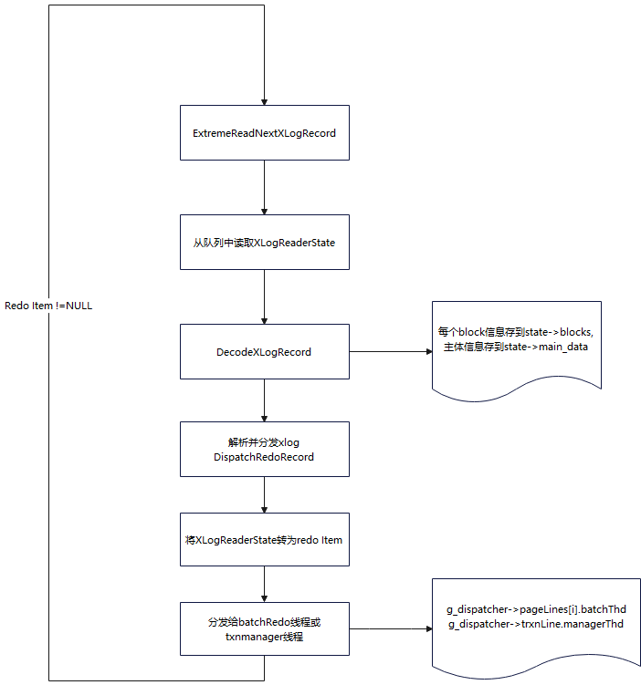
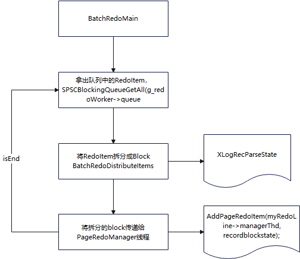
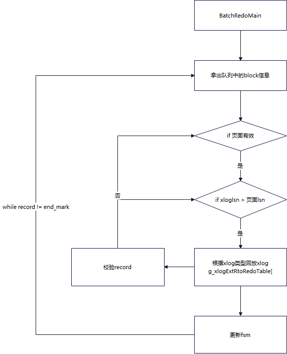

# 极致RTO简单介绍

极致RTO是openGauss在并行回放的基础上，实现的一个加速回放功能。其主要原理是将record粒度的日志拆分成block粒度的日志进行回放，通过增加流水线和redoworker线程的数量，并且利用相关hash算法，保证同一张表的日志由同一流水线回放，以此提高回放速度和回放并发度。

# 极致RTO相关参数

recovery_parse_workers > 1 或 recovery_redo_workers > 1，即为开启极致TO.


**recovery_parse_workers**

参数说明： 是极致RTO特性中ParseRedoRecord线程的数量。

该参数属于POSTMASTER类型参数，请参考表1中对应设置方法进行设置。

取值范围：整型，1~16

仅在开启极致RTO情况下可以设置recovery_parse_workers为>1。需要配合recovery_redo_workers使用。若同时开启recovery_parse_workers和recovery_max_workers，以开启极致RTO的recovery_parse_workers为准，并行回放特性失效。因极致RTO不支持主备从模式，仅在参数replication_type设置成1时可以设置recovery_parse_workers为>1。另外，极致RTO也不支持列存，在已经使用列存表或者即将使用列存表的系统中，请关闭极致RTO。极致RTO不再自带流控，流控统一由recovery_time_target参数来控制。

默认值： 1

**recovery_redo_workers**

参数说明： 是极致RTO特性中每个ParseRedoRecord线程对应的PageRedoWorker数量。

该参数属于POSTMASTER类型参数，请参考表1中对应设置方法进行设置。

取值范围：整型，1~8

需要配合recovery_parse_workers使用。在配合recovery_parse_workers使用时，只有recovery_parse_workers大于1，recovery_redo_workers参数才生效。

默认值： 1


# 极致RTO回放线程类型


REDO_BATCH 负责record粒度的日志拆分成block粒度，并分发给redo manager线程

REDO_PAGE_MNG, 负责向redo worker线程分发xlog

REDO_PAGE_WORKER, 负责回放

REDO_TRXN_MNG, 负责向trxn worker分发xlog

REDO_TRXN_WORKER, 负责回放事务日志

REDO_READ_WORKER, 流复制场景，用于从磁盘读xlog

REDO_READ_PAGE_WORKER, 负责从磁盘读取xlog或从xlog缓冲区读取xlog，并校验完整性

REDO_READ_MNG, 负责控制读xlog线程

REDO_SEG_WORKER, 按需回放新增线程，

REDO_HTAB_MNG, 按需回放新增线程，

REDO_CTRL_WORKER, 按需回放新增线程，

Startup线程：负责将日志分发给对应的流水线


# 极致RTO流水线示意图


极致RTO后台有多个流水线，由recovery_parse_workers 参数控制，通过特定的hash算法，可以保证同一个表的日志一定会路由到特定的流水线回放，以保证日志回放时有序




# 各线程功能简述

## REDO_READ_WORKER

主函数：XLogReadWorkerMain

流复制场景，用于从磁盘读xlog，该线程会把xlog从磁盘读取到g_recordbuffer->xlogsegarray[readindex]，read buffer中。

### **代码流程**

XLogReadWorkerMain->XLogReadWorkRun->XLogReadFromWriteBuffer




## REDO_READ_PAGE_WORKER

XLogReadPageWorkerMain，循环读取xlog，将读到的xlog record，解析为XLogReaderState，并置入g_dispatcher->readLine.readPageThd->queue传递给startup线程

流复制场景（传统主备），
failover阶段，IsRecoveryDone == false，从磁盘读xlog。

备机normal状态，IsRecoveryDone == true，用于从g_recordbuffer->xlogsegarray[readindex]缓冲区读取日志，传递给Startup线程。

资源池化场景，XLogReadPageWorkerMain同时负责读取xlog和解析xlog传递给startup线程。

### **代码流程**

<br/>


**xlog读取主流程**


XLogReadPageWorkerMain->XLogParallelReadNextRecord->ParallelReadRecord->ParallelReadPageInternal->ParallelXLogPageRead


**读xlog的场景分类**

流复制场景（传统主备）：ParallelXLogReadWorkBufRead->XLogPageReadForExtRto
资源池化，从DSS读xlog文件：SSXLogPageRead
非池化，通过文件系统读xlog文件：ParallelXLogPageReadFile


**XLogReadPageWorkerMain循环流程**

读xlog：XLogParallelReadNextRecord

生成下一个readerState: NewReaderState

更新读取最新xlog的起止点:

```
g_redoWorker->lastReplayedReadRecPtr = xlogreader->ReadRecPtr;
g_redoWorker->lastReplayedEndRecPtr = xlogreader->EndRecPtr;
```


更新g_GlobalLsnForwarder：SendLsnFowarder

把读到的xlog（XLogReaderState）存入队列：PutRecordToReadQueue





## StartupXLOG

<br/>

### **代码流程**


循环执行以下流程直到XLogReaderState == NULL

**从队列中读取下一条xlog：ReadNextXLogRecord->ReadNextRecordFromQueue->SPSCBlockingQueueTake(g_dispatcher->readLine.readPageThd->queue)**

- 读取获取到record后解析xlog，从XLogReaderState解析到XLogRecord，DecodeXLogRecord

- 如果读到g_redoEndMark.record，则退出循环

- 如果读取到g_GlobalLsnForwarder.record或g_cleanupMark.record，调用StartupSendFowarder，向所有batchRedo线程和txnmanager线程分发该日志

**将xlog解析成RedoItem ，并分发给下一级流水线线程**

- DispatchRedoRecord->ExtremeDispatchRedoRecordToFile->g_dispatchTable[rmid].rm_dispatch(record, expectedTLIs, recordXTime);

- 根据XLogReaderState 偏移获取RedoItem : RedoItem *item = GetRedoItemPtr(record);

- 根据xlog的类型（rmid），选择对应的分发方法：g_dispatchTable[rmid].rm_dispatch(record, expectedTLIs, recordXTime);

   - 普通日志通常分发给batchRedo线程（g_dispatcher->pageLines[i].batchThd）。其中，同一个表的日志一般发给某个特定流水线，会通过rnode计算流水线Id：GetSlotId
   - 事务日志分发给txnmanager线程。（g_dispatcher->trxnLine.managerThd），对应函数：DispatchXactRecord
   
   - ddl相关日志create、truncate，

## 分发策略：

极致RTO通过函数向下级流水线分发ExtremeDispatchRedoRecordToFile

具体分发方法会根据xlog类型rmid选择对应的分发算法g_dispatchTable[rmid].rm_dispatch(record, expectedTLIs, recordXTime);

在选择流水线时，为了尽量避免回放时的页面交换问题，极致RTO根据relfilenode计算hash值，该hash值用于选择哪一条流水线向下分发日志。对应函数：GetWorkerIds。





## BatchRedoMain


循环把record级别的xlog（RedoItem）解析成Block级别的xlog(XLogRecParseState)，并传递给PageRedoManager线程进行回放。


- 从流水线中循环读取区出xlog：BatchRedoMain->SPSCBlockingQueueGetAll(g_redoWorker->queue, &eleArry, &eleNum)

- 把record级别的xlog（RedoItem）解析成Block级别的xlog(XLogRecParseState)： BatchRedoDistributeItems->BatchRedoParseItemAndDispatch->XLogParseToBlockForExtermeRTO->g_xlogParseBlockTable[rmid].xlog_parseblock(record, blocknum)

- 把 Block级别的xlog分发给下一级流水线：AddPageRedoItem(myRedoLine->managerThd, recordblockstate);





## RedoPageManagerMain

把XLogRecParseState根据rnode等信息，分发给RedoPageWorker线程，

- RedoPageManagerMain->PageManagerRedoDistributeItems->PageManagerRedoParseState->根据日志类型选择解析方式

- AddPageRedoItem(myRedoLine->redoThd[work_id], record_block_state);





## RedoPageWorkerMain


回放上一层流水线下发的日志。不同xlog类型执行函数不同

RedoPageWorkerMain->XLogBlockRedoForExtremeRTO->g_xlogExtRtoRedoTable[block_valid].xlog_redoextrto(blockhead, blockrecbody, bufferinfo);

## 一些关键变量

<br/>

### **特殊xlog标记**


RedoItem g_redoEndMark = { false, false, NULL, 0, NULL, 0 };

RedoItem g_terminateMark = { false, false, NULL, 0, NULL, 0 };

RedoItem g_GlobalLsnForwarder;

RedoItem g_cleanupMark;

RedoItem g_closefdMark;

RedoItem g_cleanInvalidPageMark;


## 不同类型XLOG的处理函数

<br/>

### **极致RTOxlog分发函数**

src\gausskernel\storage\access\transam\extreme_rto\dispatcher.cpp

static const RmgrDispatchData g_dispatchTable[RM_MAX_ID + 1]

### **极致RTO batchRedo线程解析函数**

src\gausskernel\storage\access\redo\redo_xlogutils.cpp

static const XLogParseBlock g_xlogParseBlockTable[RM_MAX_ID + 1] = {

### **极致RTO 回放函数**

src\gausskernel\storage\access\redo\redo_xlogutils.cpp


```
static const XLogBlockRedoExtreRto g_xlogExtRtoRedoTable[BLOCK_DATA_CSNLOG_TYPE + 1] = {
    { XLogBlockDataCommonRedo, BLOCK_DATA_MAIN_DATA_TYPE }, { XLogBlockVmCommonRedo, BLOCK_DATA_VM_TYPE },
    { XLogBlockUndoCommonRedo, BLOCK_DATA_UNDO_TYPE },
    { XLogBlockFsmCommonRedo, BLOCK_DATA_FSM_TYPE },        { XLogBlockDdlCommonRedo, BLOCK_DATA_DDL_TYPE },
    { XLogBlockBcmCommonRedo, BLOCK_DATA_BCM_TYPE },        { XLogBlockNewCuCommonRedo, BLOCK_DATA_NEWCU_TYPE },
    { XLogBlockClogCommonRedo, BLOCK_DATA_CLOG_TYPE },      { XLogBlockCsnLogCommonRedo, BLOCK_DATA_CSNLOG_TYPE },
};
```


