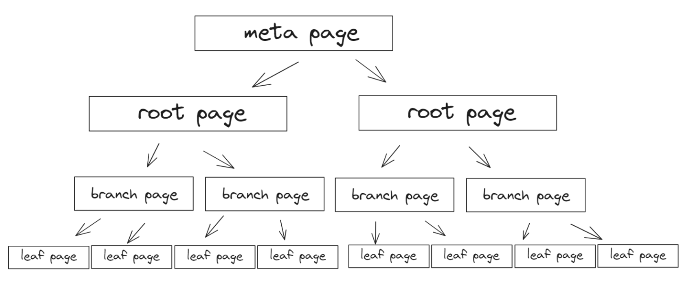
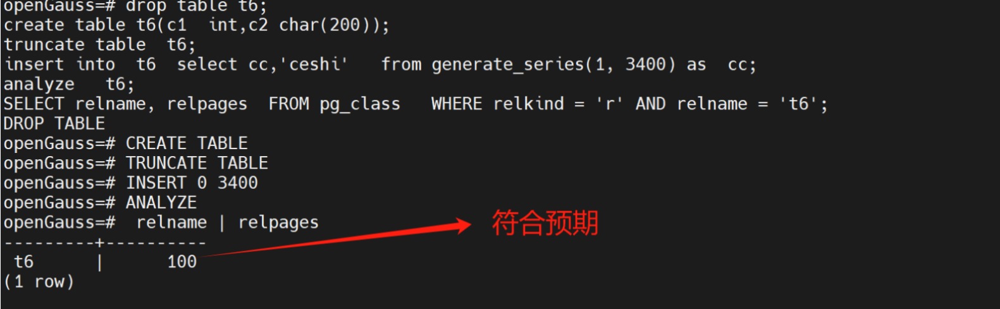
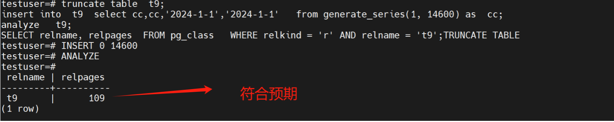
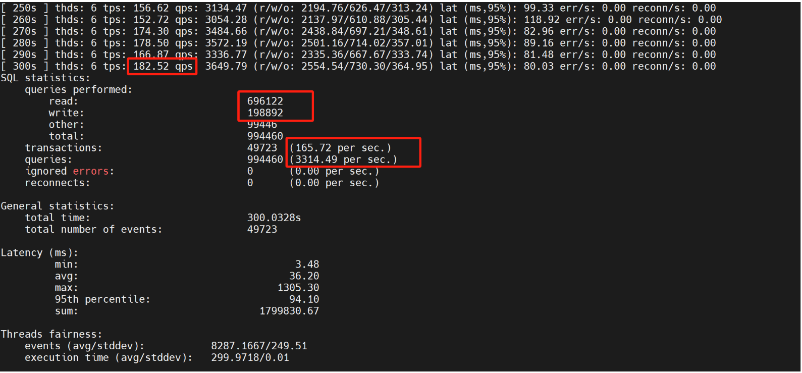
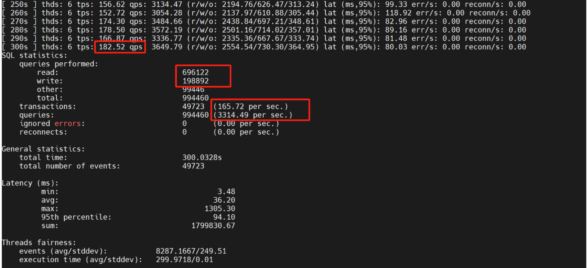

# openGauss的page

openGauss的行存储模型与页面组织结构与PG有点类似，笔者看了华为出品的《openGauss数据库核心技术》和《数据库原理及应用》，总感觉细节差那么一点，有些资料找不到，所以从PG的原来去了解openGauss的。

PG是堆表存储结构，第一层是meta page，第二层root page，第三层branch ，第四层是leaf。初始化的表空间默会有meta page和root page，关于管理、索引相关的信息保存在meta page里面，实际生成的第一条数据则保存在root page，随着数据的慢慢扩大，root page不能装下，就生成指针指向相关的page，继着生成相关的branch page以及leaf page。假设数据一直在增大，数据会持续在branch page和leaf page上面追加。meta、root、branch、leaf四者之间的结构关系区别MySQL innodb的有序组织，只管往leaf叠加，从这个理论逻辑上来说，PG的写速度应该比MySQL快。



Postgresql提供```create extension pageinspect```可以查看 roo page、branch page、leaf page层次的变化。


```
1. create extension pageinspect

2、查看meta块

select * from bt_metap('tab1_pkey');

3、查看root page的stats

select * from bt_page_stats('tab1_pkey',1);

4、查看root(leaf)页里面的内容：

select * from bt_page_items('tab1_pkey',1);

5、根据ctid来访问表：

select * from tab1 where ctid='(0,1)';

```

openGauss目前 暂不支持 **pageinspect** 类似的工具，没有方便的工具查看行组与页的关系。我们想知道openGauss的一个page可以装多少条数据，需要一些土办法，例如通过page的变化计算出一个page可以装 多少数据。

```
#新建表
openGauss=# create table t2(id int);
CREATE TABLE


#插入数据
openGauss=# insert into t2 values(1);
INSERT 0 1

#查询表对应的页数，当前只有一个
openGauss=# SELECT relname, relpages  FROM pg_class   WHERE relkind = 'r' AND relname = 't2';
 relname | relpages
---------+----------
 t2      |        1
(1 rows)

#继续插入数据，通过反复插入数据，计算超过多少数据的增加

truncate table  t2;
insert into  t2  select *  from generate_series(1, 插入数据数量);
analyze   t2;
SELECT relname, relpages  FROM pg_class   WHERE relkind = 'r' AND relname = 't2';


#记录page的变化,总结基于简单一个4字节的整型，约插入226个数据就会生成新的page,一个page可以装226个数据

insert into  t2  select *  from generate_series(1,225);
1PAGE

insert into  t2  select *  from generate_series(1,226);
2PAGE


insert into  t2  select *  from generate_series(1,453);
3PAGE


insert into  t2  select *  from generate_series(1,679);
4PAGE


insert into  t2  select *  from generate_series(1,905);
5PAGE

insert into  t2  select *  from generate_series(1,1131);
6PAGE


insert into  t2  select *  from generate_series(1,1357);
7page

#如果我把建表改成 create table t3(c0 int,c1 int,c2 int,c3 int ,c4 bigint);  继续上面的测试，入226个数据变成157个左右就会生成一个page,一个page可以装157个数据

insert into  t3  select *  from generate_series(1,156);
1 PAGE


insert into  t3  select *  from generate_series(1,157);
2 PAGE

insert into  t3  select *  from generate_series(1,313);
3 PAGE


insert into  t3  select *  from generate_series(1,490);
4 PAGE

#为什么226个数据就会生成新的page,现在变成156就会生成一个page,这个与建表的数据类型有关，t2表有一个4字节的int，而t3则是 int+int+int+int+bigint,4*4+8=24字节,因为t3的数据单元大，自然page容纳的数量少。
```

一个PAGE可以装多少条数据？根据 上面落定的事实，已知条件数据类型字节数，已知事实数据数量，已知一个PAGE是8KB，可以计算出其它 **数据**是多少？下面是其它**数据**的计算公式，以X代入。


```
(20+X ) * 15  =  8192
(4+X) *  226  = 8192
计算得出 这个X约等于32个字节，其它数据等于32个字节
```

什么是**其它数据**,postgresql的页结构分为5部分，有PageHeaderData、ItemIdData、Free space、Items、Special space。**其它数据**就是 PageHeaderData、ItemIdData、tems、Special space, Free space就是数据类型的总和。


| Item       | Description                 |
| ---------- | ---------------------- |
| PageHeaderData | 24 bytes long. Contains general information about the page, including free space pointers.      |
| ItemIdData   | Array of item identifiers pointing to the actual items. Each entry is an (offset,length) pair. 4 bytes per item.             |
| Free space  | The unallocated space. New item identifiers are allocated from the start of this area, new items from the end. |
|Items|The actual items themselves.|
|Special space|Index access method specific data. Different methods store different data. Empty in ordinary tables.|
|

从postgresql官方提供的资料来看， postgresql的页结构PageHeaderData是24字节，加上ItemIdData的4字节，整体来看，postgresql的接近openGauss。

好吧，那么就认定openGauss的**其它数据**的容量32字节。

<br/>

# 验证


下面进入正式实战

```
# 建一个表，里面有整型和字符型，预计导入的数据会占用多少个page

create table t6(c1  int,c2 char(200));

#根据算式，已知int是4字，char(200)是200字节，加上其它数据是 32字节，那么8192除以236等于34.71,一个page等于34.71,  我们导入3400条数据里面约有100个page,马上动手验证
```



```
create table t9(c1  int,c2  bigint,c3 date,c4 timestamp);
# 按照数据类型，int是4，bigint是8,date是4,timestamp是8
#   4+8+4+8+32=56,8192除以56等于146.2857142857143
# 那么插入14600，看看是不是100个page
truncate table  t9;
insert into  t9  select cc,cc,'2024-1-1','2024-1-1'   from generate_series(1, 14600) as  cc;
analyze   t9;
SELECT relname, relpages  FROM pg_class   WHERE relkind = 'r' AND relname = 't9';
```



页与行组的对应关系探测到此为止，可以看到数据类型对页的分配影响很大，同时数据类型使用不好，会造成表膨胀，影响到执行性能。我们做一个小测试。

准备1000万数据

```
sysbench /usr/share/sysbench/oltp_read_write.lua   --db-driver=pgsql --pgsql-host=xxxxxx  --pgsql-port=5432   --pgsql-user=xxxx --pgsql-password='xxxxx3'   --pgsql-db=testuser --tables=1 --table-size=10000000   --threads=6 --time=300  --report-interval=10  prepare
```


执行oltp_read_write结果

\typoraimg\20240425-66f1a1eb-f4a6-4268-80dd-7e2e0ac07a65.png)

现在对sbtest1的表结构里面的类型进行改写


```
ALTER TABLE sbtest1  ALTER COLUMN id  TYPE bigint;
ALTER TABLE sbtest1  ALTER COLUMN k  TYPE bigint;
ALTER TABLE sbtest1  ALTER COLUMN c  TYPE char(1200);
ALTER TABLE sbtest1  ALTER COLUMN pad  TYPE char(600);
```

重新oltp_read_write结果



查看表膨胀

```
testuser=# select CURRENT_CATALOG AS datname,schemaname,relname,n_live_tup,n_dead_tup,round((n_dead_tup::numeric/(case
testuser(# (n_dead_tup+n_live_tup) when 0 then 1 else (n_dead_tup+n_live_tup) end ) *100),2) as dead_rate
testuser-# from pg_stat_user_tables
where (n_live_tup + n_dead_tup) > 10000
order by 5 desc limit 100;testuser-# testuser-#
 datname  | schemaname | relname | n_live_tup | n_dead_tup | dead_rate
----------+------------+---------+------------+------------+-----------
 testuser | public     | sbtest1 |   10000027 |     599548 |      5.66
 testuser | public     | t9      |      14600 |          0 |      0.00
(2 rows)

```

立即运行VACUUM清理数据库表中的过时数据,释放存储空间,并更新表的统计信息

```
testuser=# VACUUM FULL  sbtest1;
VACUUM


testuser=# select CURRENT_CATALOG AS datname,schemaname,relname,n_live_tup,n_dead_tup,round((n_dead_tup::numeric/(case
(n_dead_tup+n_live_tup) when 0 then 1 else (n_dead_tup+n_live_tup) end ) *100),2) as dead_rate
from pg_stat_user_tables
where (n_live_tup + n_dead_tup) > 10000
order by 5 desc limit 100;testuser(# testuser-# testuser-# testuser-#
 datname  | schemaname | relname | n_live_tup | n_dead_tup | dead_rate
----------+------------+---------+------------+------------+-----------
 testuser | public     | sbtest1 |   10000057 |       1167 |       .01
 testuser | public     | t9      |      14600 |          0 |      0.00
(2 rows)

```

再跑一遍依然慢，同样的数据，但是数据长度占用更多的page



openGauss的ustore和 astore，两个引擎的性能特点不同，其实也和页有关系。ustore实现UNDO页面对数据进行预读，保留自身的页面不变，从而实现MVCC，而astore只要把自身的页面按照时间生成多个时间版本的数据，去实现MVCC.


这个意味着astore的page随着删除、修改，page会越来越多。而ustore的page的修改也不会太多的变化。我们建立一个1000万的ustore和一个1000万的astore，基于它们的基础对数据进行修改，看看page的变化。
版本使用 python3.6

```

testuser=# SELECT relname, relpages  FROM pg_class   WHERE relkind = 'r' AND relname = 'sbtest_astore';
    relname    | relpages
---------------+----------
 sbtest_astore |   270271
(1 row)

testuser=# analyze  sbtest_astore;
ANALYZE
testuser=# SELECT relname, relpages  FROM pg_class   WHERE relkind = 'r' AND relname = 'sbtest_astore';
    relname    | relpages
---------------+----------
 sbtest_astore |   368521
(1 row)

testuser=# update  sbtest_astore  set k=k+1;

UPDATE 10000000


testuser=# analyze  sbtest_astore;
ANALYZE
testuser=# SELECT relname, relpages  FROM pg_class   WHERE relkind = 'r' AND relname = 'sbtest_astore';
    relname    | relpages
---------------+----------
 sbtest_astore |   638791
(1 row)

#上面我们可以看到astore下面的page会越来越多，而下面的ustore则是一成不变


testuser=# SELECT relname, relpages  FROM pg_class   WHERE relkind = 'r' AND relname = 'sbtest_ustore';
    relname    | relpages
---------------+----------
 sbtest_ustore |   256411
(1 row)

testuser=# update  sbtest_ustore set k = k+1;
UPDATE 10000000
testuser=# analyze  sbtest_ustore;
ANALYZE
testuser=# SELECT relname, relpages  FROM pg_class   WHERE relkind = 'r' AND relname = 'sbtest_ustore';
    relname    | relpages
---------------+----------
 sbtest_ustore |   256411
(1 row)

testuser=# update  sbtest_ustore set k = k+1;
UPDATE 10000000
testuser=# analyze  sbtest_ustore;
ANALYZE
testuser=# SELECT relname, relpages  FROM pg_class   WHERE relkind = 'r' AND relname = 'sbtest_ustore';
    relname    | relpages
---------------+----------
 sbtest_ustore |   256411
(1 row)
```

# 最后

围绕openGauss出版的书藉以及openGauss开放社区，笔者想找到更多一些关于page、行组的资料，甚少！相对成熟的postgresql，postgresql能够提供很多方便成熟的插件扩展给DBA，DBA通过这些插件很方便 就完成对整个集群的监测洞悉。相反openGauss却需要通过数据字典查询，对openGauss来说，这是openGauss进步的空间！