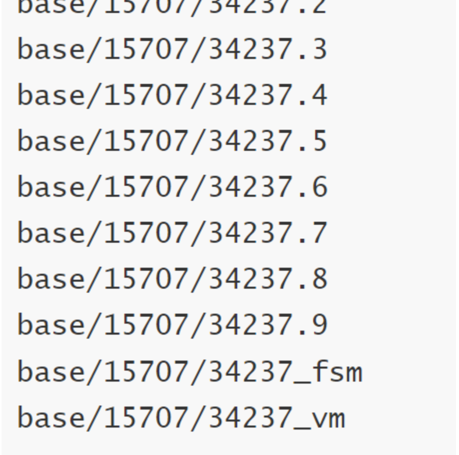

# 故障背景

一次例行巡游中，突然发现生产环境硬盘使用量接近高峰值，仔细检查文件系统和操作系统，没有突加的文件，反是数据库增加了好多空间。再看关键生产库，发现表没有明显的增加，检查wal文件， 也没有生成 大量的文件， 看似指标一切正常。

文件系统正常正常，操作系统正常，最后发现是数据库的问题。数据库的空间膨胀了很多，一下冒泡出来的。


# 故障分析

初步判断是增删查改过多，导致产生无效的数据太大，占用了大量的时间，因为是**开发使用的测试生产库**，快刀斩乱麻，执行常规命令搞一下


```
metadatabase=# vacuum analyze;
VACUUM
metadatabase=# vacuum  freeze;
VACUUM
```

然而这个没有什么用，定位到具体的问题，原来是某个表很大，足足占了32G的空间

```
[root@xxxx]# du -sh base/*
13M     base/1
13M     base/15702
32G     base/15707
14M     base/33539
240K    base/pgsql_tmp

#  openGauss每生成文件到1.1G,以此单位为一个段，再生成第二个文件，依此类推
[root@xxxx]# du -sh base/15707/*  | grep G
1.1G    base/15707/34237
1.1G    base/15707/34237.1
1.1G    base/15707/34237.10
1.1G    base/15707/34237.11
1.1G    base/15707/34237.12
1.1G    base/15707/34237.13
1.1G    base/15707/34237.14
1.1G    base/15707/34237.2
1.1G    base/15707/34237.3
1.1G    base/15707/34237.4
1.1G    base/15707/34237.5
1.1G    base/15707/34237.6
1.1G    base/15707/34237.7
1.1G    base/15707/34237.8
1.1G    base/15707/34237.9
4.0K    base/15707/PG_VERSION
```


```
# 不知道这个大表是什么，回到控制台发现一切正常，视图上找不到15707对应的表，只有两个表存在， 32G大表上哪里去了? 
openGauss=#  \dt+
List of relations
 Schema |     Name      | Type  | Owner |  Size   |                       Storage                        | Description
--------+---------------+-------+-------+---------+------------------------------------------------------+-------------
 public | sbtest_ustore | table | omm   | 0 bytes | {orientation=row,storage_type=astore,compression=no} |
 public | test1         | table | omm   | 40 kB   | {orientation=row,compression=no}                     |
(2 rows)

```

查看之前历史活动记录，隐含一个长SQL，这个SQL生成了一个大表


```
insert into XXXXX(c0,c1,c2,c3) select     s.a,('2024-X-XX XX:XX:38.000000'::timesta
mp) +concat(s.a/1000,'s')::INTERVAL, random(),md5(random()::text)   FROM generate_series(1, 100000000)  AS s(a); 
```

这个SQL生成了大表，再经历一些XXX原因，在视图上逐渐的看不见

<br/>


# 故障解决


与开发同事沟通交流，他们在测试过程中，制造了一些数据， 没有想到这个数据造成了这么大的伤害，自己也试了他们的生成数据语句，通过常规的pg_terminate_backend和pg_cancel_backend尝试把违规SQL删除。


```
#违规SQL
SELECT pg_cancel_backend(140513676097280);
#违规SQL
SELECT pg_terminate_backend(140513676097280);

#发现generate insert的时候，无法杀掉线程，而且无法进行drop table XXX;

#通过外围的方式 KILL 线程把openGauss重启
```


再次强调，这是一个生产测试库， 于是我使用暴力手段[root@xxxxdn]# rm -rf base/15707/34237*，那个大文件相关进行删除，整个天空都清静了。

删除物理文件如下，其中FSM文件是件空闲空间映射的作用，VM文件则是加快 VACUUM 清理的速度和降低对系统I/O性能的影响，两个都应用于vacuum快速清理的作用，其它的都隶属于表对应的具体物理数据文件。




# 亡羊补牢


## 对接研发

- 培训，对开发同事进行培训 ，包括SQL编写的规范和注意事项,以及generate函数的正常使用

- 制度， 一切因为造数开始，数据库组与开发组达成协议，以后开发同事不允许未经DBA同意，不能随意造数

- 流程，准备引入SQL审核系统， 接入研发提交的SQL请求，以后这样可以把不符合规则的SQL都挡在外面


## 对应系统

虽然是测试系统，但是每天12点还是需要做一个物理备份，每天做3次快照备份，以备不患


## 对应数据库厂商


遇到无法解决且非常玄幻的问题找厂 商，截图、日志 、描写问题提交到openGauss社区


