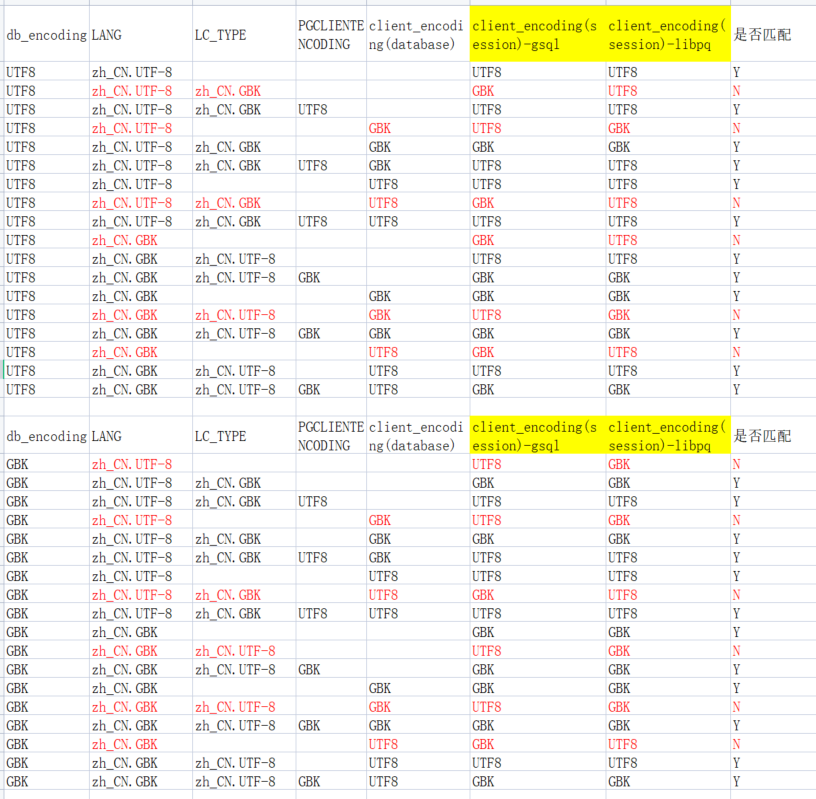
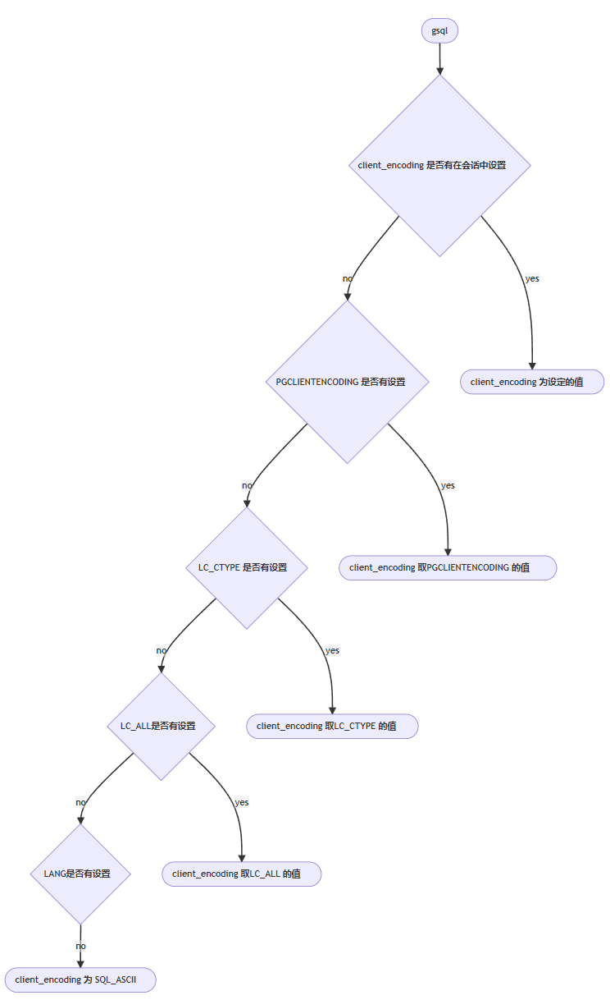
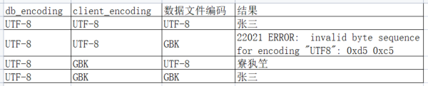

+++

title = "【openGauss】把应用开发中的设置客户端字符编码往细了说" 

date = "2023-02-07" 

tags = ["openGauss"] 

archives = "2023-02" 

author = "DarkAthena" 

summary = "【openGauss】把应用开发中的设置客户端字符编码往细了说"

img = "/zh/post/DarkAthena/title/img31.png" 

times = "10:20"

+++

## 前言

早前写过两篇有关Oracle字符集的文章
[【ORACLE】谈一谈Oracle数据库使用的字符集,不仅仅是乱码](https://www.darkathena.top/archives/about-oracle-charset)
[【ORACLE】谈一谈NVARCHAR2、NCHAR、NCLOB等数据类型和国家字符集](https://www.darkathena.top/archives/about-nvarchar2-and-national-charset)
基本说明了 ”**数据字符编码**“、”**客户端字符编码**“、”**数据库字符编码**“三者的关系，这些关系，对于openGauss/MogDB/postgresql其实是一样的，即”**数据字符编码**“和”**客户端字符编码**“应保持一致，且对应的字符集为”**数据库字符集**“的”**子集**“。但是实际应用开发中，”**客户端字符编码**“在没有进行主动设定时，往往会受各种因素干扰，比如各种环境变量和数据库参数。本文就针对各种客户端，通过文档加实验来对客户端字符编码应该如何设置来做个分析说明（注：本文的测试环境操作系统为centos7.9）

## 设置客户端字符编码的各种方式

在openGauss中，可以通过很多方式来设置客户端字符集，但实际上最终影响的都是在数据库连接中的 **client_encoding**，该值可以通过执行 **show client_encoding;** 来进行查看。

### 操作系统环境变量

1. LANG

```
export LANG=zh_CN.UTF-8
```

1. LC_CTYPE

```
export LC_CTYPE=zh_CN.UTF-8
```

1. PGCLIENTENCODING

```
export PGCLIENTENCODING=UTF-8
```

### 数据库级参数

1. alter databse dbname set client_encoding=‘UTF-8’;
   (注意：alter system set client_encoding=‘UTF-8’; 无法执行)

### 数据库会话中的参数(会话级)

1. set client_encoding=‘UTF-8’;
2. set client_encoding to ‘UTF-8’;
3. set names ‘UTF-8’;
4. alter session set client_encoding = ‘UTF8’;

### gsql元命令(会话级)

1. \encoding UTF-8

### 驱动连接参数

1. libpq

```
conninfo = "dbname=postgres port=26100 host='192.168.56.117' client_encoding='UTF-8' application_name=test connect_timeout=5 sslmode=disable user='xxx' password='xxx' ";
```

1. jdbc

```
urlString = "jdbc:opengauss://192.168.56.117:26100/postgres?batchMode=off&allowEncodingChanges=true&characterEncoding=GBK";
```

1. psycopg2

```
conn = psycopg2.connect(database="postgres", user="xxx", password="xxx", host="192.168.56.117", port="26100",client_encoding="GBK")
```

### postgresql.conf

```
client_encoding= 'UTF8'
```

(注：由于设置postgresql.conf的方式在我测试的各种情况下均未产生影响，为节省篇幅，下文不再列出这种方式)

## 各客户端中取值的优先级和默认值

由于可以设置的方式太多,那么必然会出现各个设置互相冲突时，以哪个为准的问题。
首先明确一点，当前会话执行的客户端字符编码，一定是可以通过
**show client_encoding;** 这个命令查看的，也就是说，无论怎么设置，最终都是为了影响会话里的 **client_encoding** 参数。接着，我们可以进行各种组合尝试，来确认这个参数的默认值及获取来源


根据以上测试结果，可以得到如下几个结论
对于gsql

1. 不论数据库字符编码为何值，其client_encoding会从PGCLIENTENCODING获取
2. 当PGCLIENTENCODING没有设置时，会从环境变量LC_CTYPE获取
3. 当LC_CTYPE没有设置时，会从环境变量LC_ALL获取
4. 当LC_ALL没有设置时，会从环境变量LANG获取
5. 当LANG没有设置时（unset LANG），默认为sql_ascii


对于libpq

1. 不论LANG为何值，其client_encoding会从PGCLIENTENCODING获取
2. 当PGCLIENTENCODING没有设置时，会从database的client_encoding获取(select * from pg_catalog.pg_db_role_setting )
3. 当database的client_encoding没有设置时，默认为数据库建库时的字符编码（select getdatabaseencoding();）



简单来说，就是**libpq**不认LANG、LC_CTYPE，**gsql**不认alter database和数据库字符编码。在不修改应用程序代码时，想指定客户端字符编码，最佳方式为设置PGCLIENTENCODING，因为这样才能保证两者的表现一致。

以上同样的测试，我用**psycopg2**和**jdbc**也测了一遍，和**libpq**的表现是完全一致的，也就是说，设定PGCLIENTENCODING对各种程序开发是最通用的设定客户端字符集编码的方案。（单一程序处理多种字符编码的情况本文暂不考虑）

## 其他

附上我用libpq测试[之前文章中的用例](https://www.darkathena.top/archives/about-oracle-charset)结果，可以发现能插入的结果和ORACLE表现是完全一致的，有区别的是，ORACLE中字符编码错了可能也能插入，而MogDB/openGauss/postgresql中则会报错，这个点是好是坏，也只能见仁见智，区分场景了。但我个人偏向于应尽量避免让错误的数据进入数据库


本文结论为参考了各种官方文档，加上自己的测试得到的结果，如有不对，请联系我指出。

## 参考链接

https://docs.mogdb.io/zh/mogdb/v3.0/character-set-support
https://docs.mogdb.io/zh/mogdb/v3.0/1-gsql
http://postgres.cn/docs/13/libpq-connect.html

- **本文作者：** [DarkAthena](https://www.darkathena.top/)
- **本文链接：** https://www.darkathena.top/archives/about-opengauss-client-encoding
- **版权声明：** 本博客所有文章除特别声明外，均采用[CC BY-NC-SA 3.0](https://creativecommons.org/licenses/by-nc-sa/3.0/) 许可协议。转载请注明出处！
