+++

title = "opengauss 5.0 CM新特性之只读检测能力增强" 

date = "2023-05-30" 

tags = ["opengauss"] 

archives = "2023-05" 

author = "云和恩墨-戚钰" 

summary = "opengauss 5.0 CM新特性之只读检测能力增强"

img = "/zh/post/enmo/title/img.png" 

times = "10:20"

+++

本文出处：[https://www.modb.pro/db/631091](https://www.modb.pro/db/631091)

# 一、 功能说明

只读状态从数据库获取，保证准确性； 
只读仲裁只仲裁当前超过阈值的实例，其他节点不受影响； 
主机只读保护后自动主备切换，选可用备机升主保证集群能正常提供工作。

# 二、 相关参数设置

1. 设置数据库只读模式的磁盘占用阈值为95%

```
$cm_ctl set --param --server -k datastorage_threshold_value_check=95
```

2. reload server参数

```
$ cm_ctl reload --param --server
```

3. 查看参数是否生效

```
$cm_ctl list --param --server|grep datastorage_threshold_value_check
```

# 三、 对比测试

## （1）3.0.0版本测试

初始集群状态（A为主）

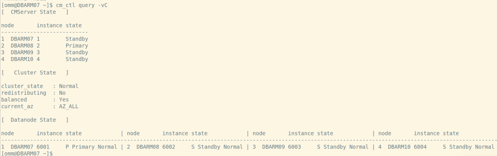

使用混沌工具模拟数据目录占用95%

```
./blade create disk fill --path /gaussdata --percent 95 --retain-handle
```

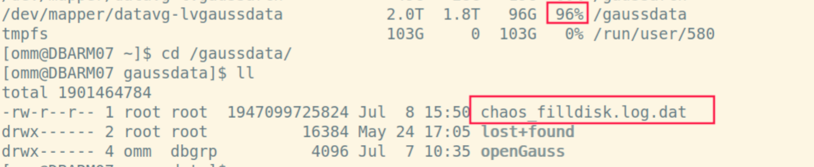

CMS主发送命令开启只读模式

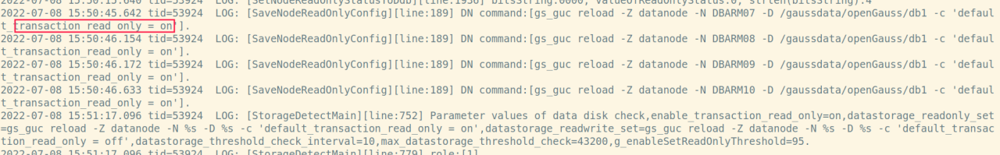

查看集群状态，各实例为read only状态

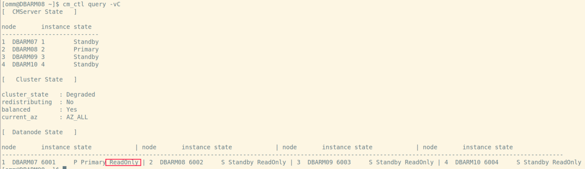

销毁混沌实验后，CMS发送命令，关闭只读模式

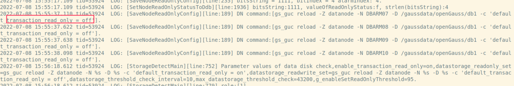

集群状态正常

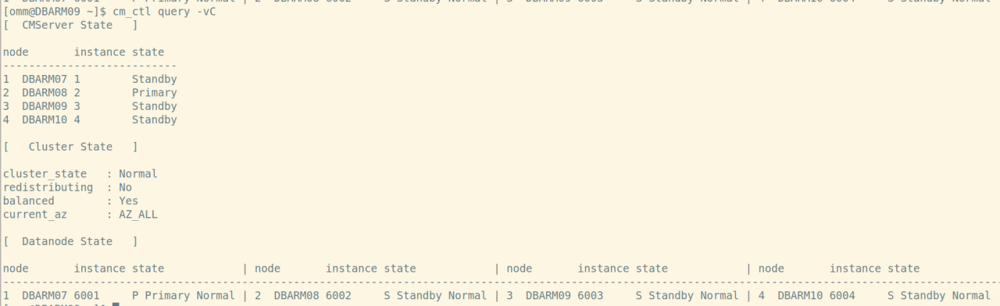

## （2） 5.0.0版本测试

### ① 主库数据目录超阈值

初始集群状态

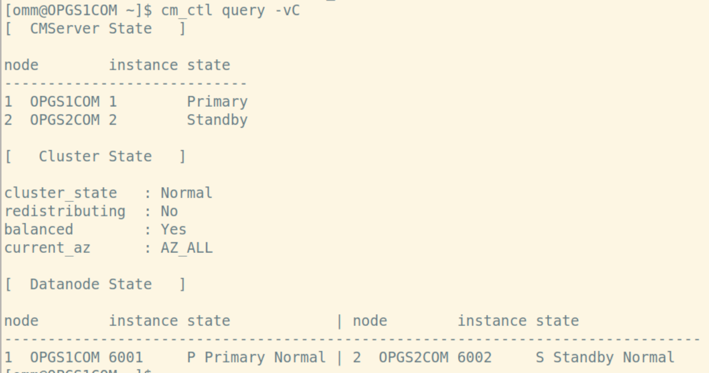

模拟主节点数据目录占96%

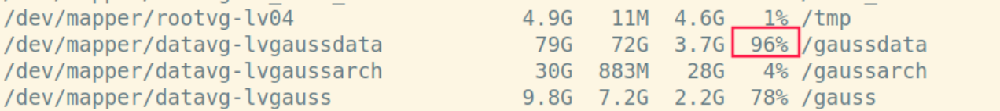

主备切换，且新备库为只读

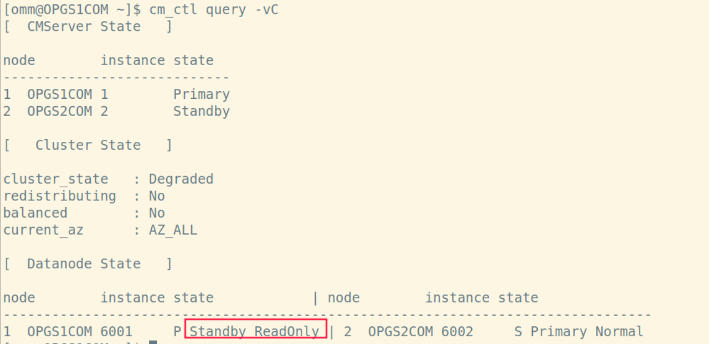

cm_server key_event日志显示主备switchover

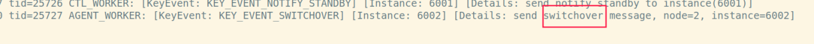

cm_agent–current.log日志显示开启只读模式

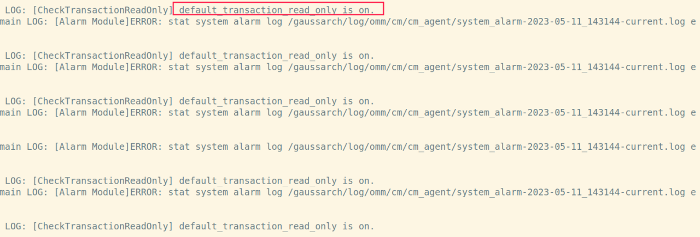

### ② 备节点数据目录超阈值

初始集群状态

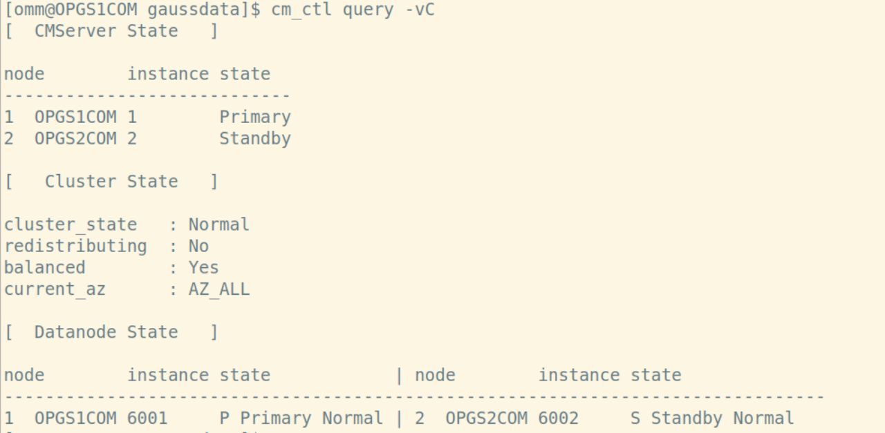

模拟备节点数据目录95%

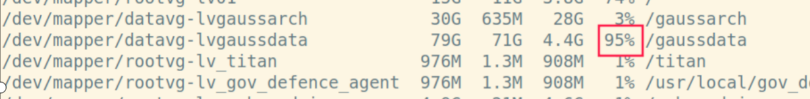

备库变为只读

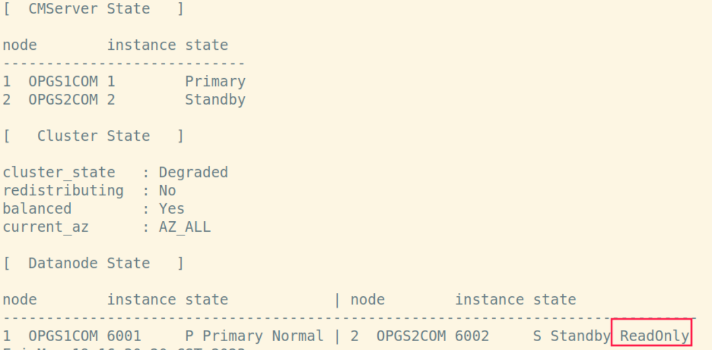
