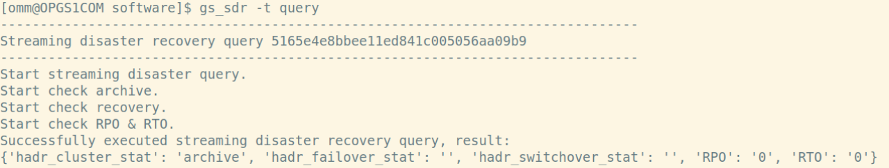
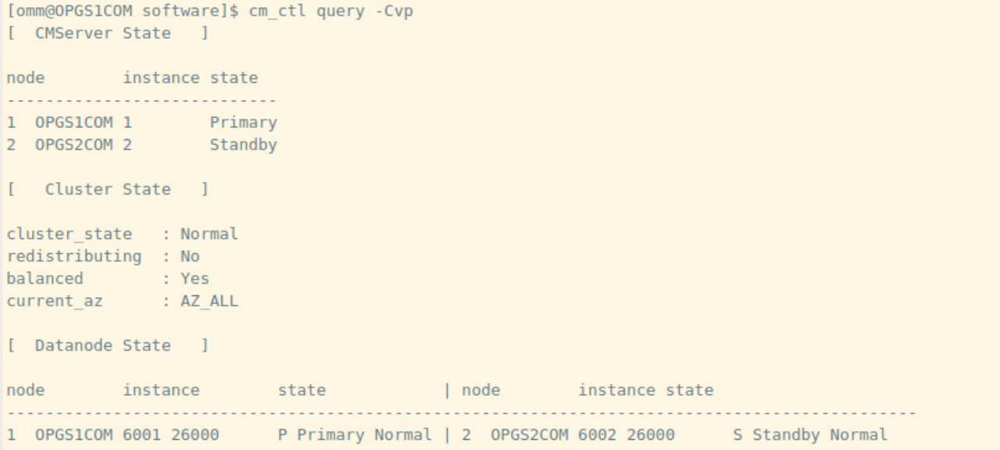
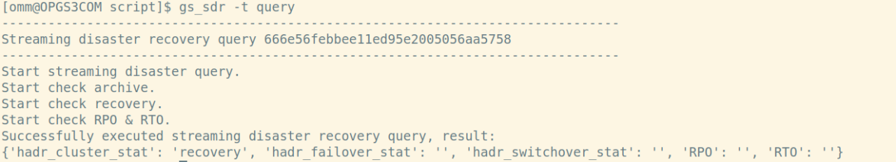
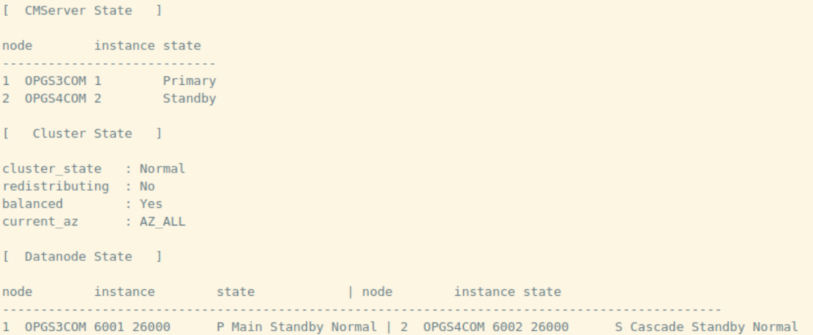

+++

title = "opengauss双region流式容灾搭建" 

date = "2023-05-30" 

tags = ["openGauss"] 

archives = "2023-05" 

author = "云和恩墨-戚钰" 

summary = "opengauss双region流式容灾搭建"

img = "/zh/post/enmo/title/img.png" 

times = "10:20"
+++

本文出处：[https://www.modb.pro/db/626197](https://www.modb.pro/db/626197)

# 一、主备双集群部署

架构：主集群：一主一备；灾备集群：一主一备

**1. 安装集群1**

主节点：192.168.0.141
备节点：192.168.0.145

xml文件参考：

```
<?xml version="1.0" encoding="utf-8"?>
<ROOT>
 <CLUSTER>
  <PARAM name="clusterName" value="openGauss" />  
   <PARAM name="nodeNames" value="OPGS1COM,OPGS2COM" />
   <PARAM name="backIp1s" value="192.168.0.141,192.168.0.145"/>
   <PARAM name="gaussdbAppPath" value="/gauss/openGauss/app" />
   <PARAM name="gaussdbLogPath" value="/gaussarch/log" />
   <PARAM name="tmpMppdbPath" value="/gauss/openGauss/tmp" />
   <PARAM name="gaussdbToolPath" value="/gauss/openGauss/om" />
   <PARAM name="corePath" value="/gaussarch/corefile"/>
   <PARAM name="clusterType" value="single-inst"/>
 </CLUSTER>
<DEVICELIST>
   <DEVICE sn="1000001">
     <PARAM name="name" value="OPGS1COM"/>
     <PARAM name="azName" value="AZ1"/>
     <PARAM name="azPriority" value="1"/>
     <PARAM name="backIp1" value="192.168.0.141"/>
     <PARAM name="sshIp1" value="192.168.0.141"/>
     <!--CM节点部署信息--> 
     <PARAM name="cmsNum" value="1"/> 
     <PARAM name="cmServerPortBase" value="15000"/> 
     <PARAM name="cmServerPortStandby" value="16000"/> 
     <PARAM name="cmServerListenIp1" value="192.168.0.141,192.168.0.145"/> 
     <PARAM name="cmServerHaIp1" value="192.168.0.141,192.168.0.145"/> 
     <PARAM name="cmServerlevel" value="1"/> 
     <PARAM name="cmServerRelation" value="OPGS1COM,OPGS2COM "/> 
     <PARAM name="cmDir" value="/gauss/openGauss/cm"/>
     <!--dn-->
     <PARAM name="dataNum" value="1"/>
     <PARAM name="dataPortBase" value="26000"/>
     <PARAM name="dataNode1" value="/gaussdata/openGauss/db1,OPGS2COM,/gaussdata/openGauss/db1"/>
     <PARAM name="dataNode1_syncNum" value="1"/>
     <PARAM name="localStreamIpmap1" value="(192.168.0.141, 192.168.0.141),(192.168.0.145, 192.168.0.145)"/>
     <PARAM name="remoteStreamIpmap1" value="(192.168.0.142, 192.168.0.142),(192.168.0.143, 192.168.0.143)"/>
     <PARAM name="remotedataPortBase" value="26000"/>
    </DEVICE>
    <DEVICE sn="1000002">
     <PARAM name="name" value="OPGS2COM"/>
     <PARAM name="azName" value="AZ1"/>
     <PARAM name="azPriority" value="1"/>
     <PARAM name="backIp1" value="192.168.0.145"/>
     <PARAM name="sshIp1" value="192.168.0.145"/>
     <!--CM--> 
     <PARAM name="cmDir" value="/gauss/openGauss/cm"/>
    </DEVICE>
 </DEVICELIST>
</ROOT>
```

**2. 安装集群2**

主节点：192.168.0.142
备节点：192.168.0.143

xml文件参考：

```
<?xml version="1.0" encoding="utf-8"?>
<ROOT>
 <CLUSTER>
  <PARAM name="clusterName" value="openGauss" />  
   <PARAM name="nodeNames" value="OPGS3COM,OPGS4COM" />
   <PARAM name="backIp1s" value="192.168.0.142,192.168.0.143"/>
   <PARAM name="gaussdbAppPath" value="/gauss/openGauss/app" />
   <PARAM name="gaussdbLogPath" value="/gaussarch/log" />
   <PARAM name="tmpMppdbPath" value="/gauss/openGauss/tmp" />
   <PARAM name="gaussdbToolPath" value="/gauss/openGauss/om" />
   <PARAM name="corePath" value="/gaussarch/corefile"/>
   <PARAM name="clusterType" value="single-inst"/>
 </CLUSTER>
<DEVICELIST>
   <DEVICE sn="1000001">
     <PARAM name="name" value="OPGS3COM"/>
     <PARAM name="azName" value="AZ1"/>
     <PARAM name="azPriority" value="1"/>
     <PARAM name="backIp1" value="192.168.0.142"/>
     <PARAM name="sshIp1" value="192.168.0.142"/>
     <!--CM节点部署信息--> 
     <PARAM name="cmsNum" value="1"/> 
     <PARAM name="cmServerPortBase" value="17000"/> 
     <PARAM name="cmServerPortStandby" value="18000"/> 
     <PARAM name="cmServerListenIp1" value="192.168.0.142,192.168.0.143"/> 
     <PARAM name="cmServerHaIp1" value="192.168.0.142,192.168.0.143"/> 
     <PARAM name="cmServerlevel" value="1"/> 
     <PARAM name="cmServerRelation" value="OPGS3COM,OPGS4COM "/> 
     <PARAM name="cmDir" value="/gauss/openGauss/cm"/>
     <!--dn-->
     <PARAM name="dataNum" value="1"/>
     <PARAM name="dataPortBase" value="26000"/>
     <PARAM name="dataNode1" value="/gaussdata/openGauss/db1,OPGS4COM,/gaussdata/openGauss/db1"/>
     <PARAM name="dataNode1_syncNum" value="1"/>
     <PARAM name="localStreamIpmap1" value="(192.168.0.142, 192.168.0.142),(192.168.0.143, 192.168.0.143)"/>
     <PARAM name="remoteStreamIpmap1" value="(192.168.0.141, 192.168.0.141),(192.168.0.145, 192.168.0.145)"/>
     <PARAM name="remotedataPortBase" value="26000"/>
    </DEVICE>
    <DEVICE sn="1000002">
     <PARAM name="name" value="OPGS4COM"/>
     <PARAM name="azName" value="AZ1"/>
     <PARAM name="azPriority" value="1"/>
     <PARAM name="backIp1" value="192.168.0.143"/>
     <PARAM name="sshIp1" value="192.168.0.143"/>
     <!--CM--> 
     <PARAM name="cmDir" value="/gauss/openGauss/cm"/>
    </DEVICE>
 </DEVICELIST>
</ROOT>
```

**3. 在主集群创建容灾用户**

```
gsql -d postgres -p PORT -c "create user DR_USERNAME with replication password 'DR_PASSWORD';"
```

**4. 将集群1启动为主集群**

```
gs_sdr -t start -m primary -X XMLFILE [-U DR_USERNAME [-W DR_PASSWORD]] [--time-out=SECS]
```

**5. 将集群2启动为备集群**

```
gs_sdr -t start -m disaster_standby -U USER -W PASSWORD -X XMLFILE [-U DR_USERNAME [-W DR_PASSWORD]] [--time-out=SECS]
```

**6. 查询**

```
gs_sdr -t query
```

主集群：





备集群：





以上：

-U容灾用户名，-W容灾用户密码，为可选参数，如果未携带需要在搭建过程中交互输入；

–time-out超时时间，为可选参数，默认为1200秒。

# 二、搭建容灾关系前后参数对比

**1. 方案**

搭建前后将流复制相关参数导入文件，使用diff对比

**2. 步骤**

```
gsql -p 26000 -d postgres -c "select name,reset_val from pg_settings where category ='Write-Ahead Log / Settings'">settings1.log
gsql -p 26000 -d postgres -c "select name,reset_val from pg_settings where category ='Write-Ahead Log / Checkpoints'" >>settings1.log
gsql -p 26000 -d postgres -c "select name,reset_val from pg_settings where category ='Replication / Sending Servers'" >>settings1.log
gsql -p 26000 -d postgres -c "select name,reset_val from pg_settings where category ='Resource usage / Recovery'" >>settings1.log
gsql -p 26000 -d postgres -c "select name,reset_val from pg_settings where category ='Replication / Master Server'" >>settings1.log
gsql -p 26000 -d postgres -c "select name,reset_val from pg_settings where category ='Replication / Standby Servers'" >>settings1.log
```

1. 对比结果

前

```
<  replconninfo1| localhost=192.168.0.141 localport=26001 localheartbeatport=26005 localservice=26004 remotehost=192.168.0.145 remoteport=26001 remoteheartbeatport=26005 remoteservice=26004
<  replconninfo2| 
<  replconninfo3|
```

后

```
>  replconninfo1| localhost=192.168.0.141 localport=26001 localheartbeatport=26005 localservice=26004 remotehost=192.168.0.145 remoteport=26001 remoteheartbeatport=26005 remoteservice=26004 iscascade=true iscrossregion=false
>  replconninfo2| localhost=192.168.0.141 localport=26001 localheartbeatport=26005 localservice=26004 remotehost=192.168.0.142 remoteport=26001 remoteheartbeatport=26005 remoteservice=26004 iscascade=false iscrossregion=true
>  replconninfo3| localhost=192.168.0.141 localport=26001 localheartbeatport=26005 localservice=26004 remotehost=192.168.0.143 remoteport=26001 remoteheartbeatport=26005 remoteservice=26004 iscascade=false iscrossregion=true
```

前

```
<  wal_keep_segments               | 16
```

后

```
>  wal_keep_segments               | 128
```

注：主集群搭建后wal_keep_segments=128,备集群搭建后wal_keep_segments=16

前

```
<  most_available_sync       | off
```

后

```
>  most_available_sync       | on
```

后（新增）

opgs1com/opgs2com

```
stream_cluster_run_mode = 'cluster_primary'
```

opgs3com/opgs4com

```
stream_cluster_run_mode = 'cluster_standby'
```
