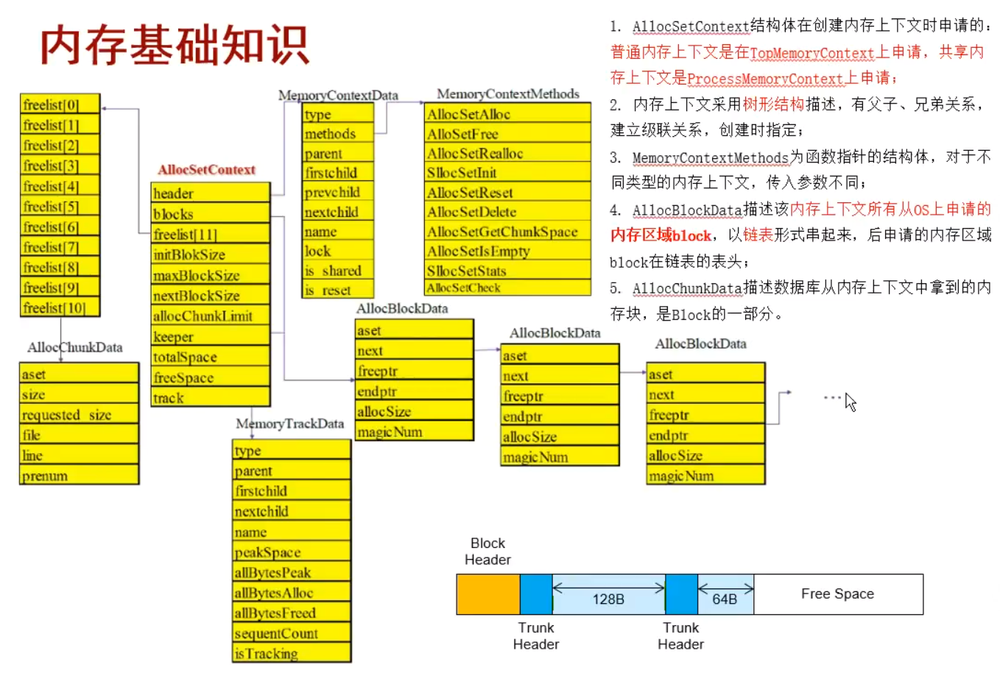

+++
title = "openGauss 内存问题经验分享"
date = "2023-06-13"
tags = ["memory"]
archives = "2023-06-13"
author = "gentle_hu"
summary = "openGauss 内存问题经验分享"
img = "/zh/post/huzhengchao/title/img1.png"
times = "9:30"
+++

# openGauss 内存问题经验分享

[TOC]

# openGauss 内存相关功能

## 内存上下文
pg、openGauss通过内存上下文功能，来进行内存的管理，控制着内存的申请、释放、作用范围、生命周期等。
主要的思想是为不同的逻辑单元预申请专属的内存池，实现内存与逻辑单元的生命周期互相绑定，逻辑结束，内存释放的功能。在此之上又可以开发出更多的内存使用监控等功能。

内存上下文的主要概念有：chunk、block、freelist等。



**block**：直接在操作系统申请而来的内存大块，多个块之间串联成双链表。
**chunk**：在block中划分出来的内存小块，其大小共11个固定档次。结构可分为四部分，头、体、尾、无用空间。其中头内存放了所处的内存上下文、chunk大小等信息；体则是供我们使用的空间；尾部存储了一些校验单元，release下没有这部分；无用空间则是我们申请之外的空间，由于chunk大小时11档固定的，例如我们申请42字节时，会返回一个64字节档位的chunk，因此后面会有一部分无用空间。
**freelist**：共11个队列，每个队列都是chunk组成的双链表，一个队列中的chunk大小都是一样的。palloc、pfree都在这里取或还内存。

可以见得，chunk是供我们使用申请使用的结构，其物理位置存在于block上，逻辑上则通过freelist进行管理。

相关知识，网上很多，pg、og基本通用。
## 内置视图
常用的四个如下：

- gs_total_memory_detail
- gs_shared_memory_detail
- gs_session_memory_detail
- gs_thread_memory_context

另外还有很多各种功能的内存函数、视图等，如dbe_perf中打包了很多相关的函数等，都可以使用。

### gs_total_memory_detail

内存使用概览，能看到数据库整体内存使用概览。
```
-- SQL
select * from pg_total_memory_detail;

-- 结果
 nodename |       memorytype        | memorymbytes
----------+-------------------------+--------------  
 dn_6001  | max_process_memory      |        15360       // GUC参数设置的进程可使用内存大小
 dn_6001  | process_used_memory     |         1701       // 进程实际使用的内存大小，同操作系统res
 dn_6001  | max_dynamic_memory      |         9087       // MemoryContext能够使用的内存大小
 dn_6001  | dynamic_used_memory     |          573       // MemoryContext实际使用的内存大小
 dn_6001  | dynamic_peak_memory     |          605       // MemoryContext使用的内存峰值
 dn_6001  | dynamic_used_shrctx     |          197       // SharedMemoryContext能够使用的内存大小
 dn_6001  | dynamic_peak_shrctx     |          198       // SharedMemoryContext实际使用的内存大小
 dn_6001  | max_backend_memory      |          660       // SharedMemoryContext使用的内存峰值
 dn_6001  | backend_used_memory     |            1       // 
 dn_6001  | max_shared_memory       |         4588       // shared_buffers + 元数据
 dn_6001  | shared_used_memory      |         1138       // 进程使用的共享内存大小
 dn_6001  | max_cstore_memory       |         1024       // cstore_buffers
 dn_6001  | cstore_used_memory      |            0       // 
 dn_6001  | max_sctpcomm_memory     |            0       // 
 dn_6001  | sctpcomm_used_memory    |            0       // 
 dn_6001  | sctpcomm_peak_memory    |            0       // 
 dn_6001  | other_used_memory       |            0       // process_used_memory - dynamic_used_memory - shared_used_memory - cstore_used_memory
 dn_6001  | gpu_max_dynamic_memory  |            0       // 
 dn_6001  | gpu_dynamic_used_memory |            0       // 
 dn_6001  | gpu_dynamic_peak_memory |            0       // 
 dn_6001  | pooler_conn_memory      |            0       // 
 dn_6001  | pooler_freeconn_memory  |            0       // 
 dn_6001  | storage_compress_memory |            0       // 
 dn_6001  | udf_reserved_memory     |            0       // 
(24 rows)

```

更多关于这个函数的细节可以看代码内的函数 `pv_total_memory_detail`。


### gs_shared_memory_detail
线程间共享使用的内存上下文的使用详情。
```
-- Structure
View "pg_catalog.gs_shared_memory_detail"
   Column    |   Type   | Modifiers
-------------+----------+-----------
 contextname | text     |
 level       | smallint |
 parent      | text     |
 totalsize   | bigint   |
 freesize    | bigint   |
 usedsize    | bigint   |


-- Common query statements
select contextname,
       sum(totalsize)/1024/1024 as totalMB,
       sum(freesize)/1024/1024 as freeMB,
       count(*)
from gs_shared_memory_detail
group by contextname
order by totalMB desc
limit 10;

       contextname       |       totalmb       |         freemb         | count
-------------------------+---------------------+------------------------+-------
 AshContext              | 63.3320922851562500 |  .00772094726562500000 |     1
 IncreCheckPointContext  | 56.0079498291015625 |  .00373840332031250000 |     1
 CBBTopMemoryContext     | 32.9555587768554688 |  .05073547363281250000 |     1
 GlobalAuditMemory       | 16.0081176757812500 |  .00769042968750000000 |     1
 StorageTopMemoryContext |  8.4420776367187500 |  .00376892089843750000 |     1
 Undo                    |  8.1331329345703125 |  .00529479980468750000 |     1
 DoubleWriteContext      |  6.5549163818359375 |  .02331542968750000000 |     1
 GPRC_Bucket_Context     |  3.0000000000000000 |     1.5546875000000000 |   128
 PercentileContext       |  2.2889022827148438 | 0.00000000000000000000 |     1
 WalContext              |  2.0079040527343750 |  .00605773925781250000 |     1
(10 rows)

```


### gs_session_memory_detail
会话内存上下文使用情况。
```
-- Structure
View "pg_catalog.gs_session_memory_detail"
   Column    |   Type   | Modifiers
-------------+----------+-----------
 sessid      | text     |
 sesstype    | text     |
 contextname | text     |
 level       | smallint |
 parent      | text     |
 totalsize   | bigint   |
 freesize    | bigint   |
 usedsize    | bigint   |


-- Common query statements
select sessid, contextname, 
       sum(totalsize)/1024/1024 as totalMB,
       sum(freesize)/1024/1024 as freeMB,
       count(*) 
from gs_session_memory_detail 
group by sessid, contextname     
order by totalMB desc
limit 10;

           sessid           |           contextname           |      totalmb       |        freemb         | count
----------------------------+---------------------------------+--------------------+-----------------------+-------
 0.281458567938064          | gs_signal                       | 8.0535583496093750 | .56803894042968750000 |     1
 1686034543.281456633543904 | CommunicationTopMemoryContext   | 8.0308532714843750 | .02333068847656250000 |     1
 1686034543.281456633543904 | Wal Sender                      | 8.0235671997070313 | .01771545410156250000 |     1
 1686034505.281456666115296 | Undo Recycler                   | 8.0234985351562500 | .02326965332031250000 |     1
 1686034505.281457327111392 | ThreadTopMemoryContext          | 4.8179702758789063 | .12986755371093750000 |     1
 1686559119.281456335420640 | PLpgSQL function cache          | 1.9799880981445313 | .00257873535156250000 |     1
 1686034505.281456791157984 | LocalSysCacheShareMemoryContext | 1.7834472656250000 | .14038085937500000000 |     1
 1686559119.281456335420640 | LocalSysCacheShareMemoryContext | 1.7834472656250000 | .14099121093750000000 |     1
 1686042536.281456497163488 | LocalSysCacheShareMemoryContext | 1.7834472656250000 | .14189147949218750000 |     1
 1686034505.281456914627808 | LocalSysCacheShareMemoryContext | 1.7834472656250000 | .14161682128906250000 |     1
(10 rows)


-- 高并发时可考虑不用sessid做group by。

```

### gs_thread_memory_context

线程内存上下文使用情况。
```
-- Structure
 View "pg_catalog.gs_thread_memory_context"
   Column    |   Type   | Modifiers
-------------+----------+-----------
 threadid    | text     |
 tid         | bigint   |
 thrdtype    | text     |
 contextname | text     |
 level       | smallint |
 parent      | text     |
 totalsize   | bigint   |
 freesize    | bigint   |
 usedsize    | bigint   |


-- Common query statements
 select threadid, contextname,
       sum(totalsize)/1024/1024 as totalMB,
       sum(freesize)/1024/1024 as freeMB,
       count(*)
from gs_thread_memory_context
group by threadid, contextname
order by totalMB desc
limit 10;
          threadid          |           contextname           |      totalmb       |        freemb         | count
----------------------------+---------------------------------+--------------------+-----------------------+-------
 0.281458567938064          | gs_signal                       | 8.0535583496093750 | .56803894042968750000 |     1
 1686034543.281456633543904 | CommunicationTopMemoryContext   | 8.0308532714843750 | .02333068847656250000 |     1
 1686034543.281456633543904 | Wal Sender                      | 8.0235671997070313 | .01771545410156250000 |     1
 1686034505.281456666115296 | Undo Recycler                   | 8.0234985351562500 | .02326965332031250000 |     1
 1686034505.281457327111392 | ThreadTopMemoryContext          | 4.8179702758789063 | .12886047363281250000 |     1
 1686559119.281456335420640 | PLpgSQL function cache          | 1.9799880981445313 | .00257873535156250000 |     1
 1686559119.281456335420640 | LocalSysCacheShareMemoryContext | 1.7834472656250000 | .14085388183593750000 |     1
 1686042536.281456497163488 | LocalSysCacheShareMemoryContext | 1.7834472656250000 | .14189147949218750000 |     1
 1686034505.281456914627808 | LocalSysCacheShareMemoryContext | 1.7834472656250000 | .14161682128906250000 |     1
 1686034505.281457067195616 | LocalSysCacheShareMemoryContext | 1.7834472656250000 | .14205932617187500000 |     1
(10 rows)


-- 高并发时可考虑不用threadid做group by。
```

## 内存追踪功能
openGauss提供一个内存追踪的功能，可以追踪当前正在使用的内存上下文的申请位置，能够比较方便的用来定位内存泄漏的问题。其主要有下面两个函数组成。

- **DBE_PERF.track_memory_context(cxtname text)**: 开关。入参为需要追踪的上下文名称。
- **DBE_PERF.track_memory_context_derail()**: 查看正在追踪的上下文的细节。

**具体步骤**：
1、根据内存视图中查到比较大的，可能存在内存泄漏的context，开启内存追踪，并重新执行相关作业。
```
openGauss=# select * from DBE_PERF.track_memory_context('Portal hash');
 track_memory_context
----------------------
 t
(1 row)

```

2、查看上下文的申请信息。能看到是在哪个文件的哪一行申请了多少长度。

```
openGauss=# select * from DBE_PERF.track_memory_context_detail();
 context_name |     file     | line | size
--------------+--------------+------+------
 Portal hash  | dynahash.cpp |  141 | 6500
(1 row)

```

3、关闭内存追踪功能。
```
openGauss=# select track_memory_context(' ');
 track_memory_context
----------------------
 t
(1 row)

```


## memcheck版本

memcheck 是编译 openGauss 时，基于debug版本的configure命令添加一个 `--enable-memory-check` 参数，如：
```
./configure --gcc-version=7.3.0 CC=g++ CFLAGS='-O0' --prefix=$GAUSSHOME --3rd=$BINARYLIBS --enable-debug --enable-cassert --enable-thread-safety --with-readline --without-zlib --enable-memory-check
```
那么编译出来的就是 memcheck 版本，相对于debug版，其内使用了ASAN的功能。

使用时需要设置ASAN环境变量：
```
export ASAN_OPTIONS=detect_leaks=1:halt_on_error=0:alloc_dealloc_mismatch=0:log_path=~/memchk/memcheck
```

之后启动数据库，进行用例复现


根据报错信息得到原因，常见的memcheck报错有：
- **direct leak**。内存申请后未释放，报告会给出申请内存的地方，需要分析未释放是否合理
- **heap-use-after-free**。内存释放后继续被使用。报告会给出内存释放后又被使用的堆栈、释放内存的堆栈、分配内存的堆栈。
- **heap-buffer-overflow**。堆内存访问越界。如申请了10个字节的char数数组，通过下标直接访问第10个元素a[10]。报告会给出分配内存的堆栈、访问越界时的堆栈。
- **stack-buffer-overflow**。栈内存访问越界。
- **global-buffer-overflow**：全局内存访问越界。
- **double-free**：重复释放同一块内存。报告会给出两次释放内存的堆栈、分配内存的堆栈。
根据堆栈走读代码，结合可复现的用例，单步gdb调试，方便随时打印相关变量的地址等信息，更容易分析定位


由于 memcheck 版本的fastcheck会增加用例的耗时，目前门禁没有集成 memcheck，对于openGauss-server仓和Plugin仓，要求是需求合入做checkin时，需要提供memcheck版本的fastcheck生成的报告


## jmealloc采集工具
1、在 debug 版本下，设置环境变量： 
`export MALLOC_CONF=prof:true,prof_final:false,prof_gdump:true,lg_prof_sample:20`
其中最后的 20 表示每 2^20B（1MB）产生一个 heap 文件，该值可以调，但是调大以后，虽然 heap 文件会减少，但也会丢失一些内存申请信息。

2、source 环境变量后，启动数据库。

3、使用 jeprof 处理 heap 文件，生成 pdf。
jeprof 在开源第三方二进制目录下，binarylibs/${platForm}/jemalloc/debug/bin 下可以获取，此外使用该二进制需要安装 graphviz，可以通过 `yum install graphviz` 安装。
生成 pdf 的命令： 
全量：`jeprof –show_bytes –pdf gaussdb \*.heap > out.pdf`
增量：`jeprof –pdf gaussdb –base=start.heap end.heap > out.pdf`


# 一些内存问题的思路or方法：
## 预留端口
数据库内存不足时，正常端口连接会失败，此时可以采用+1端口进行连接

## memcheck
几乎啥都能做的东西，基本能解决所有可复现的内存问题。
## 内存膨胀
根据内置的内存视图、内存函数、内存跟踪功能，基本能解决所有可复现的内存泄露问题了。

当然还有一种场景，在某些循环迭代的逻辑中，持续性申请上下文，等待逻辑退出结束后，再进行上下文的释放。这个逻辑不会造成内存泄漏，但会导致内存使用峰值变高，差不多也算泄露了。因此在这种场景下，不建议过于依赖上下文，申请到的内存不用了及时释放，或者按时清理、重置相关的内存上下文。


## 是否正确使用上下文
- 内存上下文大体可以分为共享和非共享两种，在创建的时候根据参数指定。如果创建了非共享上下文，但却用在了共享的场景，则有可能出现各种内存问题。
- 不仅是创建的内存上下文，还有一些hash表等结构，是否使用了共享的版本，但实际非共享。
- 创建内存上下文或时，会指定所挂的parent，若此时创建了共享内存上下文，但挂在了非共享的内存上下文上面，则很容易出问题。
- 除非大的设计上的需求，否则不允许创建内存上下文时指定parent为NULL，创建不被管控的上下文。不然极易出现泄露的各种问题。

通常内存上下文使用不正确这种情况错了基本也就core了，可以根据core堆栈，查看所在变量，梳理代码，基本能知道其所在内存上下文是什么，进而检查有没有用错。

## 特征：a5a5a5a5
在内存上下文中申请的chunk较大，超过allocChunkLimit时，pfree时会直接释放还给操作系统。因此当发现 p 出来的内容里很多指针都是`a5a5a5a5a5`、`烫烫烫烫烫`之类的填充标记时候，可以考虑是访问已释放内存、访问未初始化内存。

## 特征：megic码（debug）
debug下，每个palloc的内存，在申请长度之后都会额外带有一个字节的maigc码，内容固定为`0x7E`，还有一个magic结构存储了一些冗余信息。
当pfree的时候，会assert这两个东西是否被修改。

## 强行分析内存与内存上下文
一般需要强心分析内存上下文的都是一些内存访问出错的问题，根据内存上下文的结构，分析出问题的chunk块，甚至强行梳理整个上下文的chunk、block等，寻找线索。

很笨，很麻烦，能否找到有用的信息也难以保证，属于没有办法中的办法。

可以查看与梳理的信息：

1、问题内存所在的上下文是什么类型的，共享、不共享等，可以通过梳理代码来得到。

2、向前查看一个Chunk头的长度，根据chunk头的内容，找到所处的内存上下文，进一步分析内存上下文的内容。

- 若chunk头没乱，则表示是当前变量的使用出了问题，需要自己排查和梳理。
- 若chunk头是乱的，大概率可以怀疑是同block上物理位置在自己之前的那一个chunk写越界踩踏了自己的内存。当然也不排除是某些指针指飞了，踩到了自己，只不过概率可能稍小一些。 如何找到上一个chunk呢？
   - 十一个档，暴力尝试前向chunk的长度，向前偏移指针，找到上一个chunk的头。
   - 十一个档，暴力尝试当前chunk的长度，向后偏移指针，找到下一个chunk的头，进而找到memory context，进行下一步分析。
   - 梳理代码，找到同一个上下文的其他还健在的变量，查看它的chunkheader，找到memory context进行下一步分析。
	- 分析memory context也是无奈之举，通过查看block的地址范围，找到chunk所在的block，之后可以列出此block中的chunk，找到前一个完整的chunk。
	- 根据梳理代码，大海捞针这个内存上下文所属的代码逻辑中，可能用到的数据结构，这个出问题的trunk的内容，如尝试尝试字符串、NodeTag等，或者本地搭建环境作为对照。
	当然即使找到了前一个chunk，也不一定有用，因为也说不定已经被释放了，甚至重新被别人申请了。


参考：
https://www.opengauss.org/zh/blogs/zhengwen2/openGauss%E5%86%85%E5%AD%98%E7%AE%A1%E7%90%86%E5%88%9D%E6%8E%A2.html
https://blog.csdn.net/GaussDB/article/details/130897299
