+++
title = "使用clion远程调试openGauss"
date = "2024-08-01"
tags = ["远程调试"]
archives = "202408"
author = "justbk"
summary = "利用clion远程调试功能，实现openGauss进程可视化调试，提升代码效率."
img="/zh/post/justbk/title/perfermance_openGauss_logo.png"
times = "12:30"

+++

# 使用clion远程调试openGauss

## 一、前言

openGauss数据库默认在linux系的操作系统上编译和运行，要想可视化调试运行，要么换linux系的桌面系统、要么在命令行使用gdb进行调试。而我习惯使用windows办公，所以非常想通过clion远程调试功能来实现在windows上的openGauss开发与调试。对比gdb，可以在调试的时候直接查看或者跳转函数/变量定义，提升代码效率。

## 二、环境准备

本次利用clion的cmake和deployment功能实现远程调试，相关配置及规划如下：

1.可以正常编译openGauss的linux服务器一台(openEuler 20.03 LTS(aarch64))，已安装相关的依赖，参考openGauss源码编译:[链接](https://gitee.com/opengauss/openGauss-server#%E7%BC%96%E8%AF%91),磁盘空间充足。

2.windows机器一台，已安装clion（版本:2024.1.4），可以通过ssh远程到linux服务器。(clion 2020版本无法关联代码，请避雷)

## 三、下载openGauss编译用源代码

### 1. windows端

a.下载代码前勿必先执行`git config --global core.autocrlf false` ,禁止crlf的自动转换。

**注意**:这个配置默认是true，请使用空目录下载。

b.下载openGauss-server源代码`git clone https://gitee.com/opengauss/openGauss-server.git`

本次假定代码下载到`E:\code\gitee\openGauss-server`目录

### 2. linux端

可以通过clion配置Deployment功能自动上传，不过为了方便代码修改追踪，仍然建议直接使用git下载代码。

另外三方库也需要下载,本次使用7.3版本，本次假定路径:`/home/zhoubin/work/binarylibs`

本次假定代码下载到`/home/zhoubin/work/remote_debug/code`

## 四、配置Linux端的cmake编译环境

直接在linux下的~/.bashrc文件下补充以下配置:

```shell
MY_HOME=/home/zhoubin/work
export DEBUG_TYPE=debug
export ARCH=aarch64
export GCC_VERSION=7.3.0

export THIRD_BIN_PATH=$MY_HOME/binarylibs
export JAVA_HOME=$THIRD_BIN_PATH/openjdk8/${ARCH}/jdk/
export PATH=$PATH:${JAVA_HOME}/bin
export APPEND_FLAGS="-g3 -w -fPIC"
export GCCFOLDER=$THIRD_BIN_PATH/buildtools/gcc7.3
export CC=$GCCFOLDER/gcc/bin/gcc
export CXX=$GCCFOLDER/gcc/bin/g++
export LD_LIBRARY_PATH=$GCCFOLDER/gcc/lib64:$GCCFOLDER/isl/lib:$GCCFOLDER/mpc/lib/:$GCCFOLDER/mpfr/lib/:$GCCFOLDER/gmp/lib/:$LD_LIBRARY_PATH
export LD_LIBRARY_PATH=$THIRD_BIN_PATH/dependency/kerberos/comm/lib:$LD_LIBRARY_PATH
export LD_LIBRARY_PATH=$THIRD_BIN_PATH/dependency/libcgroup/comm/lib:$LD_LIBRARY_PATH
export LD_LIBRARY_PATH=$THIRD_BIN_PATH/dependency/openssl/comm/lib:$LD_LIBRARY_PATH
export LD_LIBRARY_PATH=$THIRD_BIN_PATH/dependency/libcurl/comm/lib:$LD_LIBRARY_PATH
export PATH=$GCCFOLDER/gcc/bin:$PATH
export PREFIX_HOME=${MY_HOME}/remote_debug/code/dest
export GAUSSHOME=$PREFIX_HOME
export PATH=$GAUSSHOME/bin:$PATH
export LD_LIBRARY_PATH=$GAUSSHOME/lib:$LD_LIBRARY_PATH
```

重新`source ~/.bashrc`后，验证是否可以通过cmake编译:

```shell
cd /home/zhoubin/work/remote_debug/code
mkdir cmake_build
cd cmake_build
cmake .. -DENABLE_MULTIPLE_NODES=OFF -DENABLE_THREAD_SAFETY=ON -DENABLE_MOT=ON && make -sj20 && make install -sj
```

正常编译的结尾日志如下:

```shell
-- Created symlink: libatomic.so -> libatomic.so.1.2.0
-- Created symlink: libatomic.so.1 -> libatomic.so.1.2.0
-- Up-to-date: /home/zhoubin/work/remote_debug/code/dest/lib/libsecurec.so
-- Up-to-date: /home/zhoubin/work/remote_debug/code/dest/lib/libgcc_s.so.1
-- Up-to-date: /home/zhoubin/work/remote_debug/code/dest/lib/libgomp.so
-- Up-to-date: /home/zhoubin/work/remote_debug/code/dest/lib/libgomp.so.1
-- Up-to-date: /home/zhoubin/work/remote_debug/code/dest/lib/libgomp.so.1.0.0
-- Up-to-date: /home/zhoubin/work/remote_debug/code/dest/lib/libxgboost.so
-- Up-to-date: /home/zhoubin/work/remote_debug/code/dest/lib/libpljava.so
-- Up-to-date: /home/zhoubin/work/remote_debug/code/dest/lib/postgresql/java/pljava.jar
-- Up-to-date: /home/zhoubin/work/remote_debug/code/dest/share/postgresql/tmp/udstools.py
-- Up-to-date: /home/zhoubin/work/remote_debug/code/dest/./lib
-- Up-to-date: /home/zhoubin/work/remote_debug/code/dest/./lib/libmasstree.so
-- Up-to-date: /home/zhoubin/work/remote_debug/code/dest/lib
-- Installing: /home/zhoubin/work/remote_debug/code/dest/lib/libatomic.so
-- Installing: /home/zhoubin/work/remote_debug/code/dest/lib/libatomic.so.1
-- Installing: /home/zhoubin/work/remote_debug/code/dest/lib/libatomic.so.1.2.0
-- Up-to-date: /home/zhoubin/work/remote_debug/code/dest/lib/libgcc_s.so.1
-- Up-to-date: /home/zhoubin/work/remote_debug/code/dest/lib
-- Up-to-date: /home/zhoubin/work/remote_debug/code/dest/lib/libgomp.so.1
-- Up-to-date: /home/zhoubin/work/remote_debug/code/dest/lib/libgomp.so.1.0.0
-- Up-to-date: /home/zhoubin/work/remote_debug/code/dest/lib/libgomp.so
-- Created symlink: libcgroup.so.1 -> libcgroup.so
-- Up-to-date: /home/zhoubin/work/remote_debug/code/dest/share/postgresql/extension/roach_api_stub.control
-- Up-to-date: /home/zhoubin/work/remote_debug/code/dest/share/postgresql/extension/roach_api_stub--1.0.sql
-- Up-to-date: /home/zhoubin/work/remote_debug/code/dest/lib/postgresql/proc_srclib
-- Up-to-date: /home/zhoubin/work/remote_debug/code/dest/lib/postgresql/pg_plugin
-- Up-to-date: /home/zhoubin/work/remote_debug/code/dest/lib/libsimsearch
```

为了更好的支持多线程调试，应该安装debuginfo相关安装包:

```shell
yum install glibc-debuginfo-2.28-36.oe1.aarch64 -y
dnf debuginfo-install libxcrypt-4.4.8-4.oe1.aarch64 xz-libs-5.2.5-1.oe1.aarch64 -y
dnf debuginfo-install glibc-2.28-63.oe1.aarch64 -y
```

## 五 Clion配置

### 1.配置远程服务

进入clion菜单File->Settings->Tools->SSH Configurations,添加一个linux的远程连接，下面的几个服务都会用到。

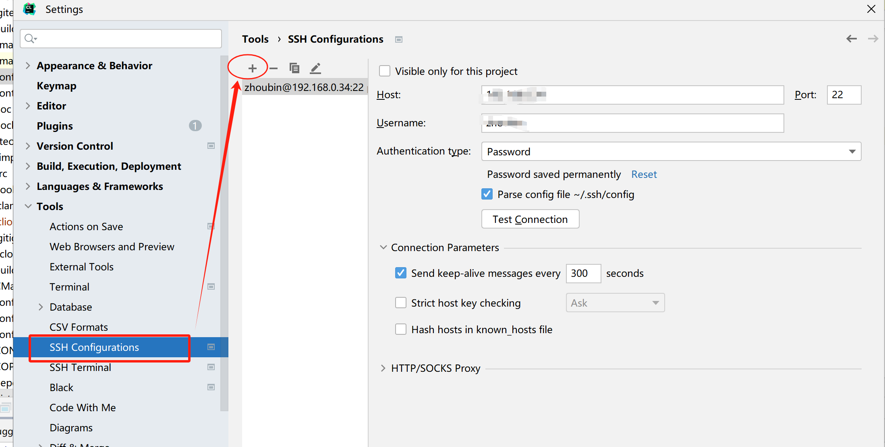


### 2.配置Deployment

Deployment用于同步windows和linux之间的文件(含代码),进入clion菜单File->Settings->Build,Execution,Deployment，配置如下:

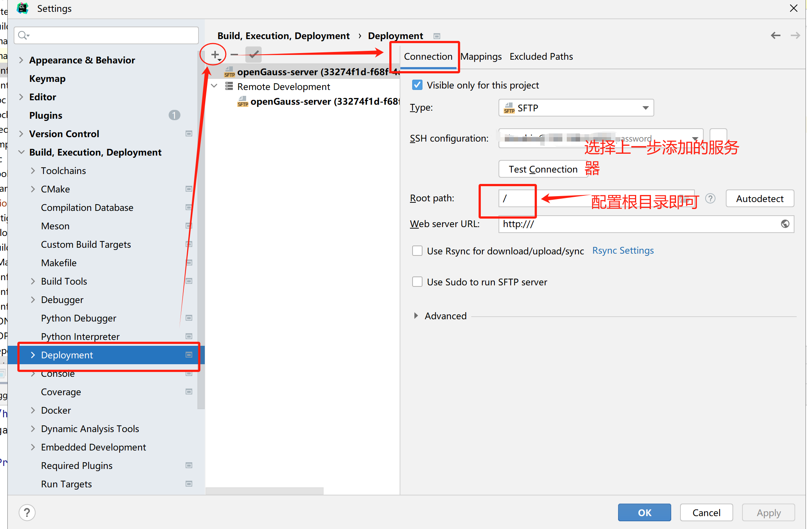

这个页面的Mappings需要配置windows和linux的映射， Excluded Paths配置不需要同步的文件目录。

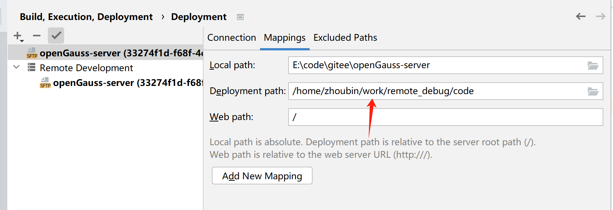


### 3.配置Toolchains

Toolchain主要是配置远程编译工具链，通过File->Settings->Build,Execution,Deployment->Toolchains,配置如下：

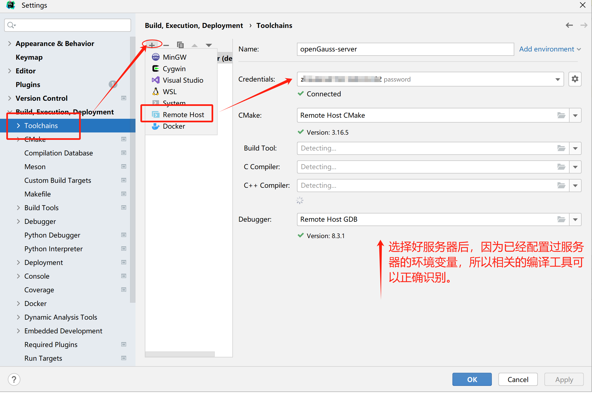

**注意**：gdb版本要高于gcc版本，本次gdb版本为8.3.1,gcc使用社区的7.3.0。

### 4.配置cmake

cmake用于远程配置工程并自动编译，进入File->Settings->Build,Execution,Deployment->CMake,配置如下:

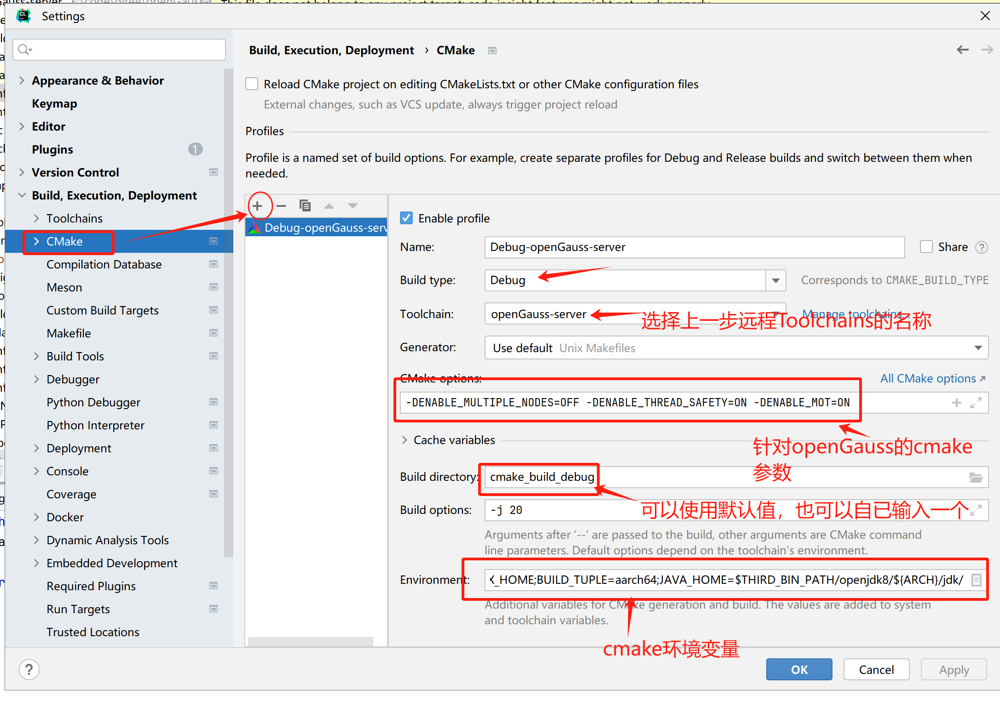

针对openGauss的CMake参数：

```shell
-DENABLE_MULTIPLE_NODES=OFF -DENABLE_THREAD_SAFETY=ON -DENABLE_MOT=ON
```

针对openGauss的CMake环境变量,相关路径在3.2有说明，实际配置时相对替换掉就行：

```shell
DEBUG_TYPE=debug;ARCH=aarch64;GCC_VERSION=7.3.0;THIRD_BIN_PATH=/home/zhoubin/work/binarylibs;PATH=/home/zhoubin/work/binarylibs/buildtools/gcc7.3/gcc/bin:$PATH;APPEND_FLAGS="-g3 -w -fPIC";GCCFOLDER=/home/zhoubin/work/binarylibs/buildtools/gcc7.3;CC=/home/zhoubin/work/binarylibs/buildtools/gcc7.3/gcc/bin/gcc;CXX=/home/zhoubin/work/binarylibs/buildtools/gcc7.3/gcc/bin/g++;LD_LIBRARY_PATH=$THIRD_BIN_PATH/dependency/libcurl/comm/lib:$LD_LIBRARY_PATH;PREFIX_HOME=/home/zhoubin/work/remote_debug/code/dest;GAUSSHOME=$PREFIX_HOME;BUILD_TUPLE=aarch64;JAVA_HOME=$THIRD_BIN_PATH/openjdk8/${ARCH}/jdk/
```

### 5.cmake project load

以上配置完成后，底部的CMake页签会自动进行向linux服务器Deployment工程代码，并进行远程CMake编译：

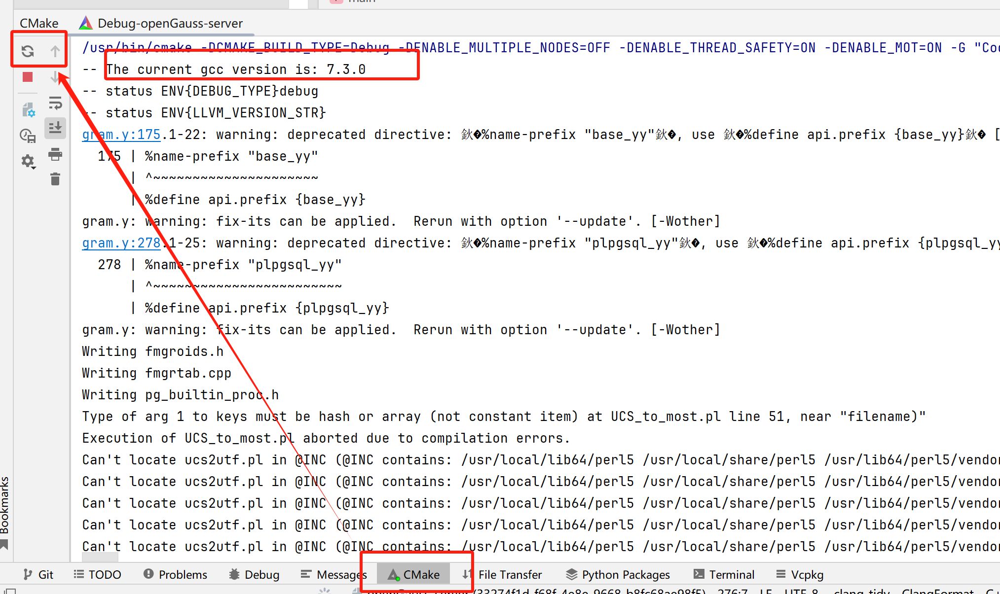

如果没有自动触发，可以手动在页签上进行刷新，等编译完成，详情日志如下:

```shell
-- /home/zhoubin/work/remote_debug/code/home/zhoubin/work/remote_debug/code/cmake_build_debug/home/zhoubin/work/remote_debug/code/dest
-- Configuring done
-- Generating done
-- Build files have been written to: /home/zhoubin/work/remote_debug/code/cmake_build_debug
```

### 6.install

CMake远程编译无问题后，最后一步是通过菜单Build->install完成openGauss远程安装，接下来就可以进行可视化调试了：

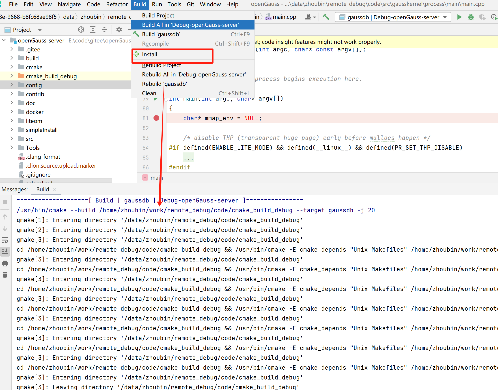

等待install完成后(编译完成日志与linux下直接cmake编译一致)，可以看到右边的调试栏里所有的openGauss的程序已经进入可运行状态，这样就可以选择任意组件进行调试了。

## 六 调试pg_config

### 1. 选择pg_config

在可调试窗口选择pg_config,本次简单执行`pg_config --help`验证代码是否可以正常断点和执行。

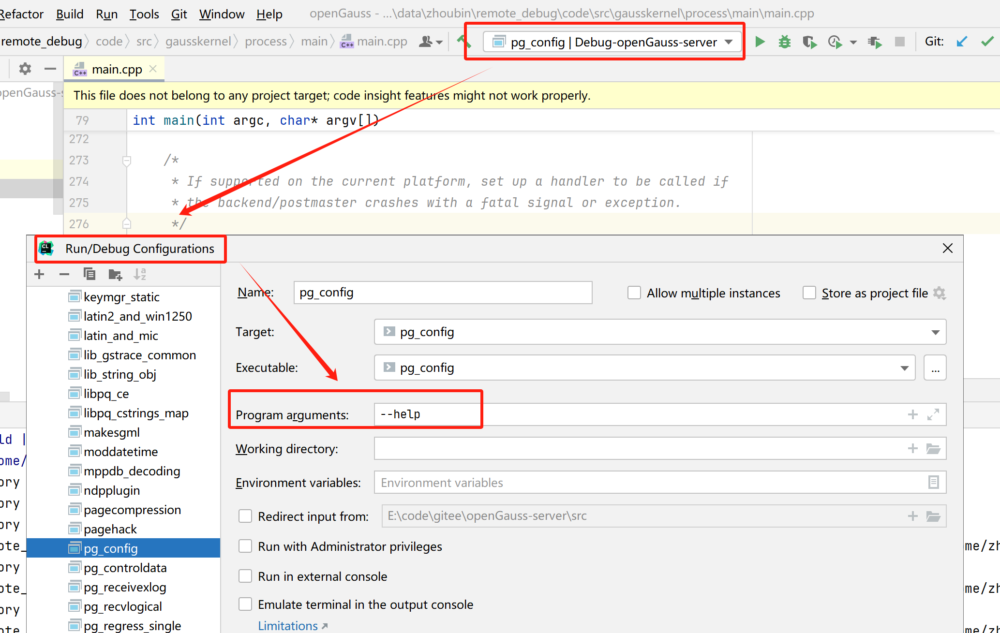

启动前断点打在`src\bin\pg_config\pg_config.cpp`的main函数第一行，启动调试，可以看到正确进入到断点，堆栈和变量窗口已经可视化：

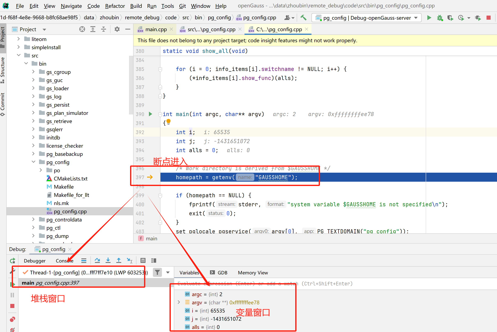

在断点后的单步/步入/步出/全速执行均可正常执行，现在远程调试功能已经ready。

## 七 调试gaussdb

这一步就是最关键的gaussdb进程的调试了，在进入调试前应该先在本次关联的服务器上先初始化好数据库，再通过参数正确的启动数据库。

### 1.初始化数据库

本步骤需要到linux服务器上执行，选择数据库目录为/home/zhoubin/work/tmp/1,执行下面的命令即可初始化一个数据库：

```shell
mkdir -p /home/zhoubin/work/tmp/1
gs_initdb -D /home/zhoubin/work/tmp/1 --nodename=test -w Test@123
```

初始化完成后会提示使用`gaussdb -D /home/zhoubin/work/tmp/1 --single_node`命令启动数据库，这几个参数即为下一步的入参。

**提示**：默认的端口5432容易被抢占，建议修改新的端口：

```shell
gs_guc set -D /home/zhoubin/work/tmp/1 -c "port=6123"
```


### 2.启动gaussdb调试

先选择gaussdb目标，并配置执行参数：

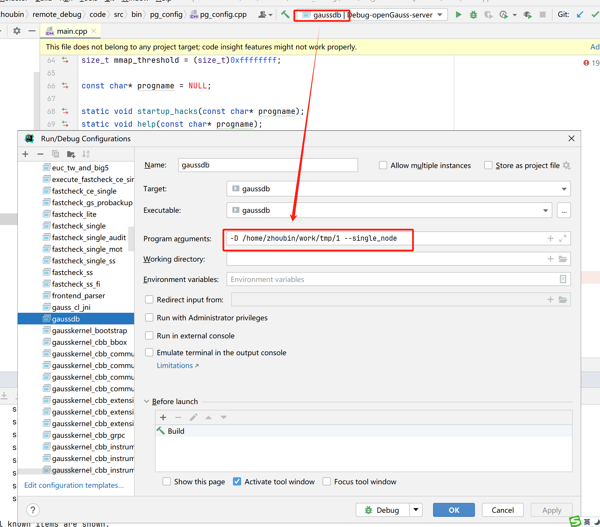

**注意**：如果确定本次并没有修改代码，可以将`Before launch`中的Build步骤删除，不然每次启动调试都要重新构建，非常耗时间！


下一步断点打在`src\gausskernel\process\main\main.cpp`的main函数第一行，打完断点即可启动调试:

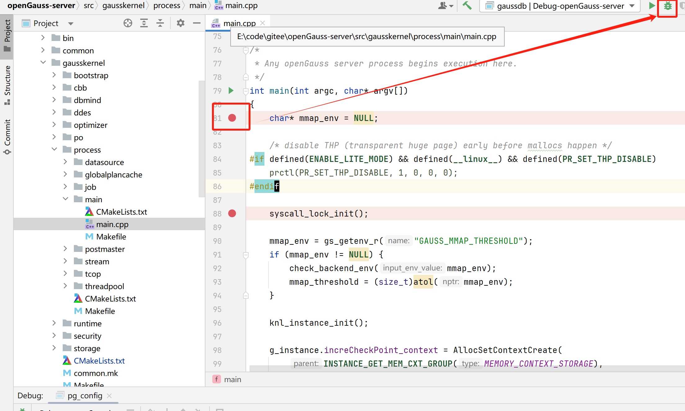

可以看到断点进入了，并且常用的上下文变量`g_instance\t_thrd\u_sess`（手工添加的)都可视化了：

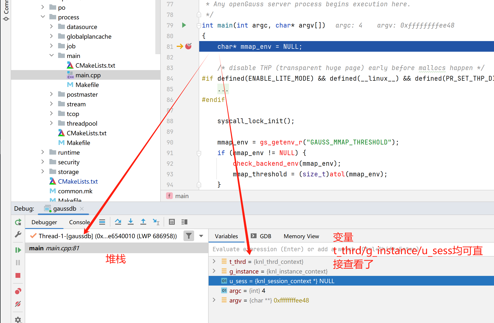

下一步全速执行时，突然断在了__poll函数，这是因为自定义的SIGUSR2信号被触发了，可以在gdb窗口执行`handle SIGUSR2 nostop noprint` 使进程继续执行：

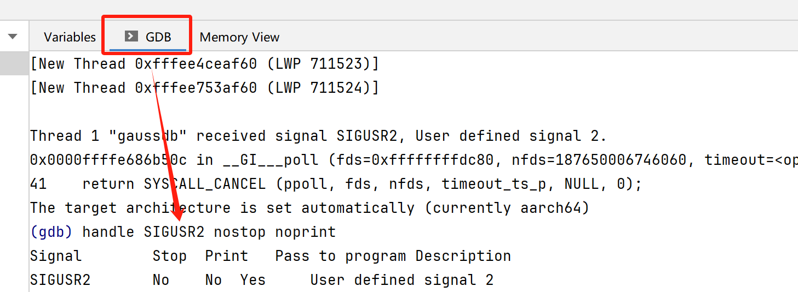

现在就可以在可视化界面任意打断点、调试验证了。一起来参与openGauss内核代码贡献吧！！！

## 八 FAQ

本次搭建环境出了各种各样的错误，还是将遇到的问题做个记录。

## 1. 第五步cmake project load的CMake窗口提示"Cannot reslove path"

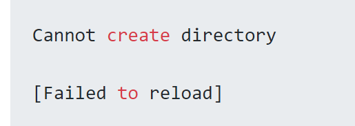

**原因**: Clion版本bug,[链接](https://youtrack.jetbrains.com/issue/CPP-14487), Deployment的`root path`和Mappings配置已经失效。

**解决方法**: 替换Clion新版本或者重启Clion后删除旧的Deployment，重新配置一次(建议换新版本，别在这折腾了)。

### 2.cmake各种莫名其妙的报错

**解决方法**:在CMake配置界面，增加`--trace`参数，然后查看cmake日志分析。

### 3.调试时提示"warning: Unable to find libthread_db matching inferior's thread library, thread debugging will not be available"

**解决方法**：编辑`~/.gdbinit`文件，添加下面内容：

```shell
set auto-load safe-path /
add-auto-load-safe-path /lib64/libthread_db-1.0.so
```

