+++

title = "openGauss基于4路鲲鹏服务器的性能调优"

date = "2023-10-17"

tags = ["性能调优", "TPCC", "openGauss"]

archives = "2023-10"

author = "laishenghao"

summary = "openGauss基于4路鲲鹏服务器的性能调优"

img = "/zh/post/laishenghao/title/opengauss.png"

times = "19:00"

+++

# 1、概述
本文主要描述了在4路鲲鹏服务器上，通过软硬件协同优化配置达到openGauss数据库的极致性能的方法。

主要包括软硬件要求、BIOS配置、网卡配置、磁盘配置、服务器参数设置、数据库参数配置、绑核以及TPCC模型脚本优化等内容。

## 1.1 硬件规格
- **服务器：** TaiShan 200(Model 2480)
- **CPU：** Kunpeng-920 ARM aarch64(4 Sockets * 64 Cores)
- **内存：** 1TB
- **网卡：** 万兆网卡Hi1822 Family(4*25GE)，时延 < 0.1ms
- **磁盘：** NVME * 4，Model Number：HWE56P433T2M005N（V5 NVME卡）、HWE36P43016M000N（V3 NVME卡），其中V5 NVME卡 1MB顺序写带宽达到2600MB以上

## 1.2 软件规格
- **操作系统：** openEuler 20.03 (LTS)
- **数据库软件：** openGauss 5.0.0 或其他更高Release版
- **压测软件：** BenchmarkSQL-5.0

# 2、服务器优化配置
## 2.1 BIOS配置
登录服务器管理系统，进入BIOS，进行以下配置，保存后重启：

| 配置项                        | 推荐值   | 菜单路径                                                     | 说明                                                         |
| ----------------------------- | -------- | ------------------------------------------------------------ | ------------------------------------------------------------ |
| Support Smmu                  | Disabled | Advanced > MISC Config > Support Smmu                        | System Memory Management Unit                                |
| CPU Prefetching Configuration | Disabled | Advanced > MISC Config > CPU Prefetching Configuration       | CPU预取，推荐关闭                                            |
| Die Interleaving              | Disabled | Advanced > Memory Config > Die Interleaving                  | 控制是否使用DIE交织，推荐关闭                                |
| Max Payload Size              | 512B     | Advanced > PCIe Config > CPU X PCIe - Port X > Max Payload Size | 每次传输数据的最大单位，值越大带宽利用率越高。<br>其中X为具体的CPU编号 |


## 2.2 磁盘配置

本次调优中，需要用到4个 NVME 存储卡。分别用于存放 datanode 本身、xlog、2个比较大的表空间。其中用于存放 xlog 的为V5的NVME存储卡，容量3TB以上，其余为V3的NVME存储卡，容量1TB以上。

在4p单机环境下，CPU更多，并发更大，单位时间内产生的数据量更大，IO很容易成为制约性能的瓶颈，所以在条件允许的情况下，应尽量使用V5的存储卡，V5的存储卡优先用于存放xlog文件。

```shell
df -h | grep nvme
```

 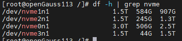

### 2.2.1 格式化文件系统

查看 nvme 的文件系统类型，确认块大小是否为8KB（bsize=8192）。

```shell
# 如查看挂载在 /data4 路径下硬盘信息
xfs_info /data4
```

 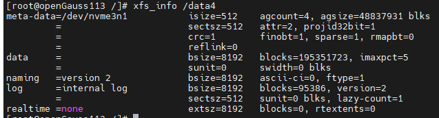

如果不是，则将其格式化为8KB（**格式化前注意数据备份**）。

```shell
umount /data4
mkfs.xfs -b size=8192 /dev/nvme3n1 -f
mount /dev/nvme3n1 /data4
```

操作完成后再次用 xfs_info 确认是否执行成功。

### 2.2.2 配置磁盘IO队列调度机制

```shell
echo none > /sys/block/nvme0n1/queue/scheduler
echo none > /sys/block/nvme1n1/queue/scheduler
echo none > /sys/block/nvme2n1/queue/scheduler
echo none > /sys/block/nvme3n1/queue/scheduler
```

## 2.3 网络配置

进入[华为官网]( https://support.huawei.com/enterprise/zh/intelligent-accelerator-components/in500-solution-pid-23507369/software) ，选择对应的版本及补丁号，如 [IN500 solution 5.1.0.SPC401](https://support.huawei.com/enterprise/zh/intelligent-accelerator-components/in500-solution-pid-23507369/software/250968786) ，下载 [IN500_solution_5.1.0.SPC401.zip](https://support.huawei.com/enterprise/zh/software/250968786-ESW2000173161)

安装hinicadm工具。

以管理员身份执行以下命令：

```shell
mkdir IN500_solution_5.1.0
export IN500_HOME=$(pwd)/IN500_solution_5.1.0
unzip IN500_solution_5.1.0.SPC401.zip -d IN500_solution_5.1.0
cd $IN500_HOME/tools/linux_arm/nic/
rpm -ivh hinicadm-2.4.1.0-1.aarch64.rpm
```

 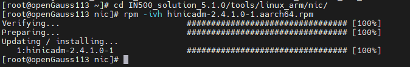

通过 ifconfig 命令查看使用的网络接口卡。

```shell
ifconfig
```

根据配置的ip确认网络接口卡名：enp71s0

 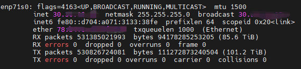

查看Hi1822设备信息：

```shell
hinicadm info
```

 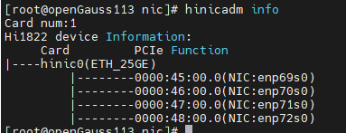

可以看到小网口 enp71s0 对应的物理网卡设备名为 hinic0。

设置环境参数，以方便后续使用：

```shell
export CARD_NAME=enp71s0
export HARD_DEV=hinic0
```

### 2.3.1 更换网卡固件

1. 查看固件版本。

   ```shell
   ethtool -i $CARD_NAME
   ```

    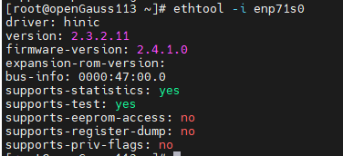

**firmware-version 为 2.4.1.0，则无需修改。否则如果是2.5.0.0，建议更换为2.4.1.0。**

2. 更换固件步骤：

* （2）更换固件。

  ```shell
  # 命令格式为：
  hinicadm updatefw -i <物理网卡设备名> -f <固件文件路径>
  # 例如：
  hinicadm updatefw -i $HARD_DEV -f $IN500_HOME/firmware/update_bin/cfg_data_nic_prd_1h_4x25G/Hi1822_nic_prd_1h_4x25G.bin
  ```

* （3）重启服务器，确认firmware-version 是否为 2.4.1.0。

### 2.3.2 设置中断队列

* （1）查看当前网卡的中断队列配置

  IN500_solution_5.1.0支持设置最大中断数为16或64，在4P单机调优场景下，我们需要将中断数配置为24，所以需要将最大中断数配置为64。

  通过以下命令查看当前的配置：

  ```shell
  ethtool -l $CARD_NAME
  ```

   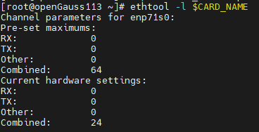

上图中第一个Combined值为网卡支持的最大中断数，第二个Combined值为当前网卡配置的中断数24。

若配置已正确，则无需执行下列步骤，否则执行下列步骤进行修改。

* （2）修改最大配置

  ```shell
  # 命令格式：
  $IN500_HOME/tools/linux_arm/nic/config/hinicconfig <物理网卡设备名> -f <多中断队列配置文件>
  # 例如：
  cd $IN500_HOME/tools/linux_arm/nic/config/
  ./hinicconfig $HARD_DEV -f ./std_sh_4x25ge_dpdk_cfg_template0.ini # 64中断，本文场景下执行此命令
  # ./hinicconfig $HARD_DEV -f ./std_sh_4x25ge_dpdk_cfg_template0.ini # 16中断
  ```

  

* （3）修改当前配置

  ```shell
  ethtool -L $CARD_NAME combined 24
  ```

* （4）再次执行步骤（1）进行配置确认。

### 2.3.3 网络中断绑核

在4路鲲鹏服务器中，共有8个NUMA节点、256核。将每个节点的最后3个核，共24个核用作网络中断，会有比较好的优化效果。

使用以下命令查看CPU与node情况：

```shell
numactl -H
```

 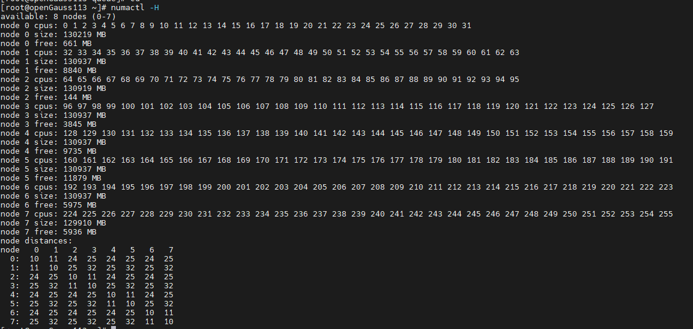

中断绑核脚本如下：

```shell
export CARD_NAME=enp71s0

irq_list=`cat /proc/interrupts | grep $CARD_NAME | awk {'print $1'} | tr -d ":"`
irq_array_net=($irq_list)

cpu_array_irq=(29 30 31 61 62 63 93 94 95 125 126 127 157 158 159 189 190 191 221 222 223 253 254 255)

for (( i=0;i<24;i++ ))
do
        echo "${cpu_array_irq[$i]}" > /proc/irq/${irq_array_net[$i]}/smp_affinity_list
done

for j in ${irq_array_net[@]}
do
        cat /proc/irq/$j/smp_affinity_list
done

```

将CARD_NAME改为实际值，保存为sh脚本bind_irq.sh 并执行完成中断绑定。

```shell
sh bind_irq.sh
```

### 2.3.4 修改网卡参数

```shell
ifconfig $CARD_NAME mtu 1500
# 配置读写缓冲区
ethtool -G $CARD_NAME rx 1024 tx 1024
# 将网络分片offloading到网卡上
ethtool –K $CARD_NAME tso on
ethtool –K $CARD_NAME lro on
ethtool –K $CARD_NAME gro on
ethtool –K $CARD_NAME gso on
```

## 2.4 其他操作系统配置

* 关闭不必要的服务

  ```shell
  service sysmonitor stop
  service irqbalance stop
  service rsyslog stop
  service firewalld stop
  ```

* 关闭透明大页

  ```shell
  echo 'never' > /sys/kernel/mm/transparent_hugepage/defrag
  echo 'never' > /sys/kernel/mm/transparent_hugepage/enabled
  ```

* 取消CPU平衡

  ```shell
  echo 0 > /proc/sys/kernel/numa_balancing
  ```

* 调整内存脏页回收策略

  ```shell
  echo 3000 > /proc/sys/vm/dirty_expire_centisecs
  echo 500 > /proc/sys/vm/dirty_writeback_centisecs
  echo 60 > /proc/sys/vm/dirty_ratio
  echo 5 > /proc/sys/vm/dirty_background_ratio
  ```
  

# 3、openGauss数据库配置

## 3.1 数据库安装与环境变量配置

（1）切换到数据库运行用户下（非root用户）。

（2）创建文件：

```shell
vim ~/env.txt
```

配置如下环境变量（env.txt）：

```shell
export GAUSSHOME=/home/my_user/package  # openGauss 的安装目录
export LD_LIBRARY_PATH=$GAUSSHOME/lib
export PATH=$GAUSSHOME/bin:$PATH
export DATA_NODE=/xxx/data	# 数据库节点路径
export XLOG=xxx/pg_xlog # 存放xlog的路径
export TABLESPACE2=xxx/tablespace2 # 表空间路径2
export TABLESPACE3=xxx/tablespace3 # 表空间路径3
export DATA_BACK=xxx/data_back # 数据备份路径
```

执行命令使环境变量生效

```shell
source ~/env.txt
```

**注意：**

* DATA_NODE、XLOG、TABLESPACE2、TABLESPACE3 分别放到4个不同的 nvme 盘。
* XLOG建议放到最好的 nvme 盘。
* 以上路径不要同时存放其他数据，避免后续恢复数据时被删除。

（3）安装数据库

从 [openGauss官网](https://opengauss.org/zh/download/) 下载安装包，按官网文档进行安装到 $GAUSSHOME 路径。

安装好后，初始化数据库节点到 $DATA_NODE 路径下。

## 3.1 修改pg_hpa.conf

在文件末尾增加以下内容，

```properties
host tpcc1000 tpcc_bot xxx.xxx.xxx.xxx/32 sha256
```

其中，

* tpcc1000 为后面创建的数据库名。
* tpcc_bot 为后面创建的数据库用户名。
* xxx.xxx.xxx.xxx 改为benchmark压测服务器的IP。

## 3.2 修改postgersql.conf

本节列举openGauss的主要GUC参数配置。主要注意事项如下：

* 在极限性能场景下，关闭用于调试等的无关功能。

* 打开 synchronous_commit、fsync参数保障数据安全落盘。

* 开启线程池，使用绑核配置。绑核编号中除去用于网络中断的核以及用于处理xlog的核。

  enable_thread_pool = on
  thread_pool_attr = '696,8,(cpubind:1-28,32-60,64-92,96-124,128-156,160-188,192-220,224-252)'

* xlog落盘压力较大，相关线程单独绑核。

* xlog生成速率非常大，调整回收相关参数加快回收速率。

* 打开autovacuum。

* listen_addresses、port需要根据实际情况进行修改。

* wal_file_init_num 在生成数据阶段使用30，在跑TPCC阶段改为60000。

参考配置如下，参数具体含义可以在[openGauss官网](https://opengauss.org)查阅：

```properties
max_connections = 4096
allow_concurrent_tuple_update = true
audit_enabled = off
cstore_buffers =16MB
enable_alarm = off
enable_codegen = false
enable_data_replicate = off
full_page_writes  = off
max_files_per_process = 100000
max_prepared_transactions = 2048
use_workload_manager = off
wal_buffers = 1GB
work_mem = 1MB
transaction_isolation = 'read committed'
default_transaction_isolation = 'read committed'
synchronous_commit = on
fsync  = on
maintenance_work_mem = 2GB
autovacuum = on
autovacuum_mode = vacuum
autovacuum_vacuum_cost_delay =10
update_lockwait_timeout =20min
enable_mergejoin = off
enable_nestloop = off
enable_hashjoin = off
enable_bitmapscan = on
enable_material = off
wal_log_hints = off
log_duration = off
checkpoint_timeout = 15min
autovacuum_vacuum_scale_factor = 0.1
autovacuum_analyze_scale_factor = 0.02
enable_save_datachanged_timestamp =FALSE
log_timezone = 'PRC'
timezone = 'PRC'
lc_messages = 'C'
lc_monetary = 'C'
lc_numeric = 'C'
lc_time = 'C'
enable_double_write = on
enable_incremental_checkpoint = on
enable_opfusion = on
numa_distribute_mode = 'all'
track_activities = off
enable_instr_track_wait = off
enable_instr_rt_percentile = off
track_sql_count = off
enable_instr_cpu_timer = off
plog_merge_age = 0
session_timeout = 0
enable_instance_metric_persistent = off
enable_logical_io_statistics = off
enable_user_metric_persistent =off
enable_xlog_prune = off
enable_resource_track = off
enable_thread_pool = on
thread_pool_attr = '696,8,(cpubind:1-28,32-60,64-92,96-124,128-156,160-188,192-220,224-252)'
enable_partition_opfusion=on	
dirty_page_percent_max = 0.1
candidate_buf_percent_target = 0.7
checkpoint_segments =10240
advance_xlog_file_num = 100
autovacuum_max_workers = 20
autovacuum_naptime = 5s
bgwriter_flush_after = 256kB
data_replicate_buffer_size = 16MB
enable_stmt_track = off
remote_read_mode=non_authentication
wal_level = archive
hot_standby = off
hot_standby_feedback = off
client_min_messages = ERROR
log_min_messages = FATAL
enable_asp = off
enable_bbox_dump = off
enable_ffic_log = off
wal_keep_segments = 1025
wal_writer_delay = 100
local_syscache_threshold = 40MB
sql_beta_feature = 'partition_opfusion'
pagewriter_thread_num = 2
max_redo_log_size=400GB
walwriter_cpu_bind = 0
undo_zone_count=0
gs_clean_timeout =0
pagewriter_sleep = 30
incremental_checkpoint_timeout=5min
xloginsert_locks=8
walwriter_sleep_threshold = 50000
log_hostname = off
vacuum_cost_limit = 10000
instr_unique_sql_count=0
track_counts = on
bgwriter_flush_after = 32
enable_seqscan = off
enable_beta_opfusion=on
enable_global_syscache=off
enable_ustore = off
enable_cachedplan_mgr=off
shared_buffers = 450GB
enable_page_lsn_check = off
max_io_capacity = 4GB
light_comm = on
enable_indexscan_optimization = on
time_record_level = 1
listen_addresses = '?'
port = ?
bgwriter_delay = 1s
checkpoint_segments=10000
# 在生成数据阶段使用30，在跑TPCC阶段改为60000
wal_file_init_num = 30
# wal_file_init_num = 60000
```


## 3.3 创建压测数据库

（1）用绑核方式启动

-C参数指定绑核列表，参数与openGauss的线程池绑定参数一致。

```shell
numactl -C 1-28,32-60,64-92,96-124,128-156,160-188,192-220,224-252 gs_ctl start -D $datadir  -Z single_node
```

（2）创建数据库

登录数据库，创建用于压测的用户及数据库。

注意与前面在pg_hba.conf配置的参数保持一致。

```sql
create user tpcc_bot with sysadmin identified by 'my_password@123';
create database tpcc1000 encoding='UTF-8' owner=tpcc_bot;
```

完成后退出登录。

# 4、Benchmark配置

## 4.1 Benchmark 运行环境

用于运行Benchmark压测的服务器不需要很高的配置，只要保证不会成为瓶颈点即可。

本文所使用的客户端服务器配置为2Taishan 200服务器，CPU为Kunpeng-920 ARM aarch64（2socket*64core），内存765GB。

系统配置部分可以参考第二节《服务器优化配置》进行配置，其中中断配置推荐为：最大中断数设置为64，使用中断数设置为48。

Benchmark-sql-5.0软件的安装可以参考 [此文](https://opengauss.org/zh/blogs/optimize/opengauss-tpcc.html) ，本文不再赘述。

## 4.2 修改数据生成脚本

安装好Benchmark-sql-5.0后，进入运行路径 benchmarksql-5.0/run。

* （1）修改 sql.common/tableCreates.sql，组要修改如下：

  * 增加2个表空间，bmsql_customer分配到 example2，bmsql_stock分配到 example3。

  * 删除无用序列 bmsql_hist_id_seq。

  * 修改表创建语句，给主要的表增加 FACTOR属性。
  * 增加分区设置。

  具体如下：

  ```sql
  CREATE TABLESPACE example2 relative location 'tablespace2';
  CREATE TABLESPACE example3 relative location 'tablespace3';
  
  create table bmsql_config (
    cfg_name    varchar(30),
    cfg_value   varchar(50)
  );
  
  create table bmsql_warehouse (
    w_id        integer   not null,
    w_ytd       decimal(20,2),
    w_tax       decimal(4,4),
    w_name      varchar(10),
    w_street_1  varchar(20),
    w_street_2  varchar(20),
    w_city      varchar(20),
    w_state     char(2),
    w_zip       char(9)
  ) WITH (FILLFACTOR=80);
  
  create table bmsql_district (
    d_w_id       integer       not null,
    d_id         integer       not null,
    d_ytd        decimal(20,2),
    d_tax        decimal(4,4),
    d_next_o_id  integer,
    d_name       varchar(10),
    d_street_1   varchar(20),
    d_street_2   varchar(20),
    d_city       varchar(20),
    d_state      char(2),
    d_zip        char(9)
   ) WITH (FILLFACTOR=80);
  
  create table bmsql_customer (
    c_w_id         integer        not null,
    c_d_id         integer        not null,
    c_id           integer        not null,
    c_discount     decimal(4,4),
    c_credit       char(2),
    c_last         varchar(16),
    c_first        varchar(16),
    c_credit_lim   decimal(12,2),
    c_balance      decimal(12,2),
    c_ytd_payment  decimal(12,2),
    c_payment_cnt  integer,
    c_delivery_cnt integer,
    c_street_1     varchar(20),
    c_street_2     varchar(20),
    c_city         varchar(20),
    c_state        char(2),
    c_zip          char(9),
    c_phone        char(16),
    c_since        timestamp,
    c_middle       char(2),
    c_data         varchar(500)
  ) WITH (FILLFACTOR=80) tablespace example2;
  
  -- create sequence bmsql_hist_id_seq;
  
  create table bmsql_history (
    hist_id  integer,
    h_c_id   integer,
    h_c_d_id integer,
    h_c_w_id integer,
    h_d_id   integer,
    h_w_id   integer,
    h_date   timestamp,
    h_amount decimal(6,2),
    h_data   varchar(24)
  ) WITH (FILLFACTOR=80);
  
  create table bmsql_new_order (
    no_w_id  integer   not null,
    no_d_id  integer   not null,
    no_o_id  integer   not null
  ) WITH (FILLFACTOR=80);
  
  create table bmsql_oorder (
    o_w_id       integer      not null,
    o_d_id       integer      not null,
    o_id         integer      not null,
    o_c_id       integer,
    o_carrier_id integer,
    o_ol_cnt     integer,
    o_all_local  integer,
    o_entry_d    timestamp
  ) WITH (FILLFACTOR=80);
  
  create table bmsql_order_line (
    ol_w_id         integer   not null,
    ol_d_id         integer   not null,
    ol_o_id         integer   not null,
    ol_number       integer   not null,
    ol_i_id         integer   not null,
    ol_delivery_d   timestamp,
    ol_amount       decimal(6,2),
    ol_supply_w_id  integer,
    ol_quantity     integer,
    ol_dist_info    char(24)
  ) WITH (FILLFACTOR=80) tablespace example2
  partition by RANGE(ol_w_id)
  (
    partition bmsql_order_line_p1 values less than (126),
    partition bmsql_order_line_p2 values less than (251),
    partition bmsql_order_line_p3 values less than (376),
    partition bmsql_order_line_p4 values less than (501),
    partition bmsql_order_line_p5 values less than (626),
    partition bmsql_order_line_p6 values less than (751),
    partition bmsql_order_line_p7 values less than (876),
    partition bmsql_order_line_p8 values less than (1001)
  );
  
  
  create table bmsql_item (
    i_id     integer      not null,
    i_name   varchar(24),
    i_price  decimal(5,2),
    i_data   varchar(50),
    i_im_id  integer
  );
  
  create table bmsql_stock (
    s_w_id       integer       not null,
    s_i_id       integer       not null,
    s_quantity   integer,
    s_ytd        integer,
    s_order_cnt  integer,
    s_remote_cnt integer,
    s_data       varchar(50),
    s_dist_01    char(24),
    s_dist_02    char(24),
    s_dist_03    char(24),
    s_dist_04    char(24),
    s_dist_05    char(24),
    s_dist_06    char(24),
    s_dist_07    char(24),
    s_dist_08    char(24),
    s_dist_09    char(24),
    s_dist_10    char(24)
  ) WITH (FILLFACTOR=80) tablespace example3
  partition by RANGE(s_w_id)
  (
    partition bmsql_stock_p1 values less than (126),
    partition bmsql_stock_p2 values less than (251),
    partition bmsql_stock_p3 values less than (376),
    partition bmsql_stock_p4 values less than (501),
    partition bmsql_stock_p5 values less than (626),
    partition bmsql_stock_p6 values less than (751),
    partition bmsql_stock_p7 values less than (876),
    partition bmsql_stock_p8 values less than (1001)
  );
  
  ```


* （2）修改 sql.common/indexCreates.sql，改为如下：

  ```sql
  alter table bmsql_warehouse add constraint bmsql_warehouse_pkey
    primary key (w_id);
  
  alter table bmsql_district add constraint bmsql_district_pkey
    primary key (d_w_id, d_id);
  
  alter table bmsql_customer add constraint bmsql_customer_pkey
    primary key (c_w_id, c_d_id, c_id);
  
  create index bmsql_customer_idx1
    on  bmsql_customer (c_w_id, c_d_id, c_last, c_first);
  
  alter table bmsql_oorder add constraint bmsql_oorder_pkey
    primary key (o_w_id, o_d_id, o_id);
  
  create index bmsql_oorder_idx1
    on  bmsql_oorder (o_w_id, o_d_id, o_c_id);
  
  alter table bmsql_new_order add constraint bmsql_new_order_pkey
    primary key (no_w_id, no_d_id, no_o_id) using index tablespace example2;
  
  alter table bmsql_order_line add constraint bmsql_order_line_pkey
    primary key (ol_w_id, ol_d_id, ol_o_id, ol_number);
  
  alter table bmsql_stock add constraint bmsql_stock_pkey
    primary key (s_w_id, s_i_id);
  
  alter table bmsql_item add constraint bmsql_item_pkey
    primary key (i_id);
  ```

  

* （3）修改数据生成脚本 runDatabaseBuild.sh，具体如下：

  ```shell
  #!/bin/sh
  Cwd=`cd $(dirname $0);pwd`
  if [ $# -lt 1 ] ; then
      echo "usage: $(basename $0) PROPS [OPT VAL [...]]" >&2
      exit 2
  fi
  
  PROPS="$1"
  shift
  if [ ! -f "${PROPS}" ] ; then
      echo "${PROPS}: no such file or directory" >&2
      exit 1
  fi
  DB="$(grep '^db=' $PROPS | sed -e 's/^db=//')"
  
  BEFORE_LOAD="tableCreates_4p"
  #AFTER_LOAD="indexCreates foreignKeys extraHistID buildFinish"
  AFTER_LOAD="indexCreates buildFinish"
  
  for step in ${BEFORE_LOAD} ; do
      $Cwd/runSQL.sh "${PROPS}" $step
  done
  
  $Cwd/runLoader.sh "${PROPS}" $*
  
  for step in ${AFTER_LOAD} ; do
      $Cwd/runSQL.sh "${PROPS}" $step
  done
  ```

## 4.3  运行参数配置

  进入路径 benchmarksql-5.0/run，复制一份配置文件并修改props_4p_5min.og，作为预热5分钟时使用。

  ```shell
  cp props.pg props_4p_5min.og
  vim props_4p_5min.og
  ```

  props_4p_5min.og：将ip、port、my_db_user_name、my_db_user_name改为实际值。

  ```properties
  db=postgres
  driver=org.postgresql.Driver
  conn=jdbc:postgresql://ip:port/tpcc1000?prepareThreshold=1&batchMode=on&fetchsize=10&loggerLevel=OFF
  user=my_db_user_name
  password=****** 
  
  warehouses=1000
  loadWorkers=80
  
  terminals=812
  //To run specified transactions per terminal- runMins must equal zero
  runTxnsPerTerminal=0
  //To run for specified minutes- runTxnsPerTerminal must equal zero
  runMins=5
  //Number of total transactions per minute
  limitTxnsPerMin=0
  
  //Set to true to run in 4.x compatible mode. Set to false to use the
  //entire configured database evenly.
  terminalWarehouseFixed=false
  
  //The following five values must add up to 100
  //The default percentages of 45, 43, 4, 4 & 4 match the TPC-C spec
  newOrderWeight=45
  paymentWeight=43
  orderStatusWeight=4
  deliveryWeight=4
  stockLevelWeight=4
  
  ```

  修改完成后保存，再复制一份为 props_4p_60min.og，并将 runMins 的值改为60，作为跑1小时TPCC使用。

  ```shell
  cp props_4p_5min.og props_4p_60min.og
  vim props_4p_60min.og
  ```

  ```properties
  db=postgres
  driver=org.postgresql.Driver
  conn=jdbc:postgresql://ip:port/tpcc1000?prepareThreshold=1&batchMode=on&fetchsize=10&loggerLevel=OFF
  user=my_db_user_name
  password=****** 
  
  warehouses=1000
  loadWorkers=80
  
  terminals=812
  //To run specified transactions per terminal- runMins must equal zero
  runTxnsPerTerminal=0
  //To run for specified minutes- runTxnsPerTerminal must equal zero
  runMins=60
  //Number of total transactions per minute
  limitTxnsPerMin=0
  
  //Set to true to run in 4.x compatible mode. Set to false to use the
  //entire configured database evenly.
  terminalWarehouseFixed=false
  
  //The following five values must add up to 100
  //The default percentages of 45, 43, 4, 4 & 4 match the TPC-C spec
  newOrderWeight=45
  paymentWeight=43
  orderStatusWeight=4
  deliveryWeight=4
  stockLevelWeight=4
  
  ```

# 5、压测

## 5.1 数据生成

进入benchmark的run目录下，执行以下命令生成数据：

```shell
numactl -C 0-19,32-51,64-83,96-115 ./runDatabaseBuild.sh props_4p_5min.og
```

任务结束后，待数据全部落盘，stop数据库。

将postgresql.conf 的 wal_file_init_num 参数改为 60000。

```shell
echo "wal_file_init_num = 60000" >> $DATA_NODE/postgresql.conf
```

## 5.2 数据备份

```shell
cp -r $DATA_NODE $DATA_BACK
```

## 5.3 数据分盘

```shell
mv $DATA_NODE/pg_xlog $XLOG
mv $DATA_NODE/pg_location/tablespace2 $TABLESPACE2
mv $DATA_NODE/pg_location/tablespace3 $TABLESPACE3

ln -svf $XLOG $DATA_NODE/pg_xlog
ln -svf $TABLESPACE2 $DATA_NODE/pg_location/tablespace2
ln -svf $TABLESPACE3 $DATA_NODE/pg_location/tablespace3
```

## 5.4  以preferred方式绑核启动

（1）查看xlog盘对应的NUMA节点

例如 xlog 对应nvme0，则使用如下命令查看：

```shell
cat /sys/class/nvme/nvme0/device/numa_node
```

 

如上图所示，结果为0，说明xlog盘对应的NUMA节点为0节点。

（2）绑核启动

通过以下命令启动openGauss数据库。

```shell
numactl -C 1-28,32-60,64-92,96-124,128-156,160-188,192-220,224-252 --preferred=0 gs_ctl start -D $datadir  -Z single_node
```

其中，

* -C参数为绑核参数，参数与openGauss的线程池绑定列表一致。
* -p或--preferred参数为设置内存分配优先分配到 node 0 节点。

数据库启动成功后，通过以下命令查看numa的节点内存分配，将可以看到，node 0 剩余的内存是比其他节点要少的，说明preferred参数配置生效，否则没有生效，可能会导致在不同的测试次数中大幅波动。

 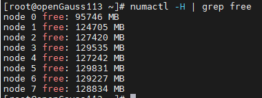

## 5.5 预热

在压测端执行以下命令进行5分钟预热：

```shell
numactl -C 0-19,32-51,64-83,96-115 ./runBenchmark.sh props_4p_5min.og
```

通过htop命令查看CPU情况，前面几分钟如下则正常，后面几分钟由于在初始化xlog文件，会下降到60%左右，属于正常现象。

 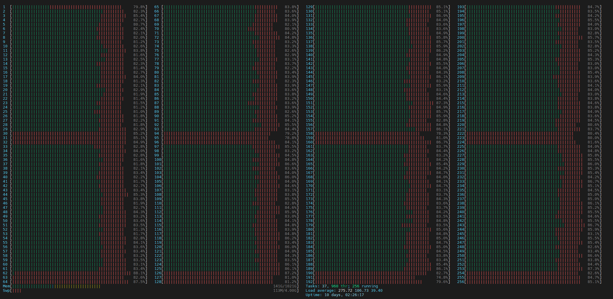

预热5分钟 TPCC约为185万。

 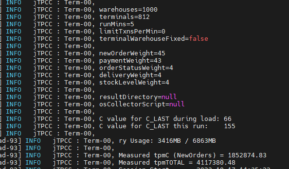

## 5.6正式压测

预热5分钟结束再过10分钟，执行以下命令正式压测，最终TPCC达到230万以上。

```shell
numactl -C 0-19,32-51,64-83,96-115 ./runBenchmark.sh props_4p_60min.og
```

 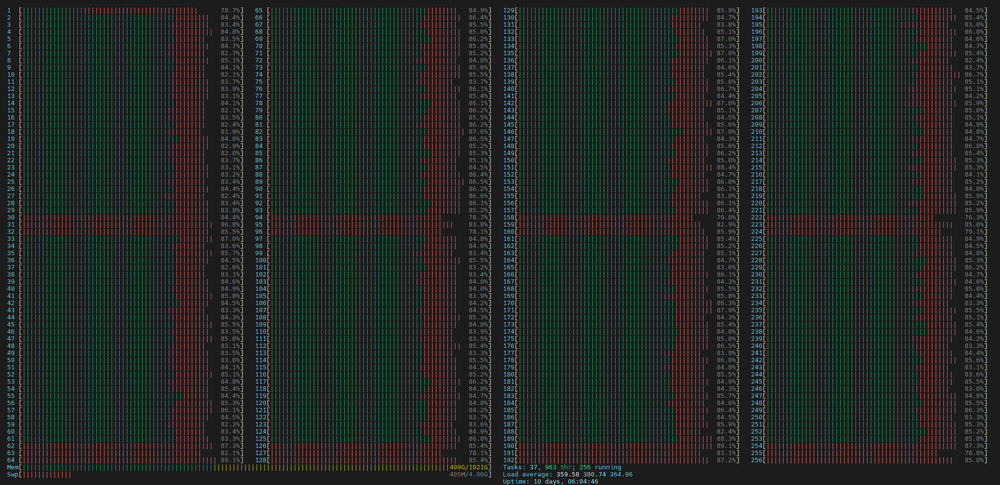

 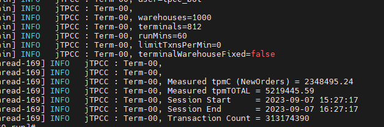

